# 【数字系统与计算机架构P2 6.004 2017】麻省理工学院—中英字幕 p12 12.2.6 Worked Examples： Procedures and Stacks -BV19m41127Kj_p12-

In order to understand how procedures are implemented on the beta。

 we will take a look at a mystery function and its translation into Beta assembly code。

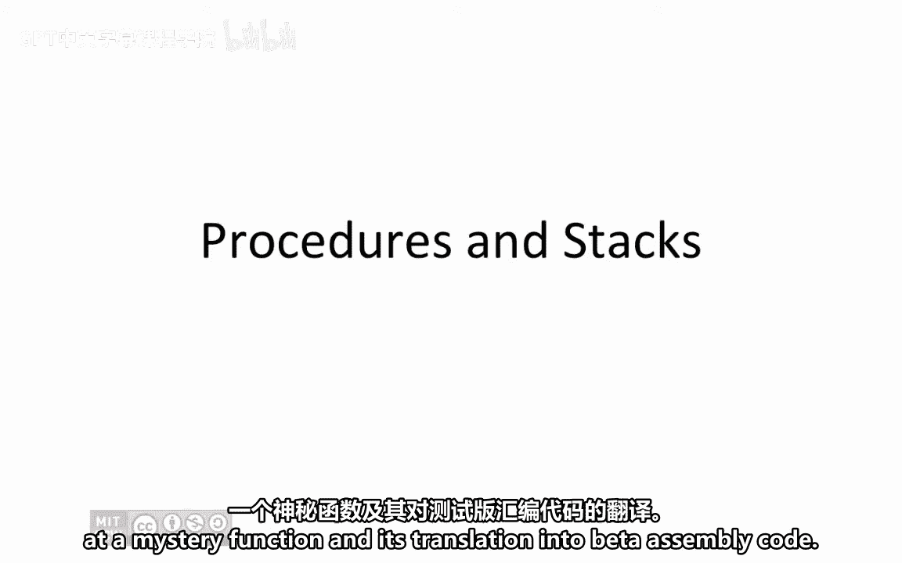

The mystery function is shown here。 The function F takes an argument X as an input。

 It then performs a logical and operation on the input X and the constant 5 to produce the variable a。

After that， it checks if the input x is equal to 0 and if so， returns the value 0。 Otherwise。

 it returns an unknown value， which we need to determine。

We are provided with the translation of the C code into beta assembly， as shown here。

 we take a closer look at the various parts of this code to understand how this function。

 as well as procedures in general work on the beta。

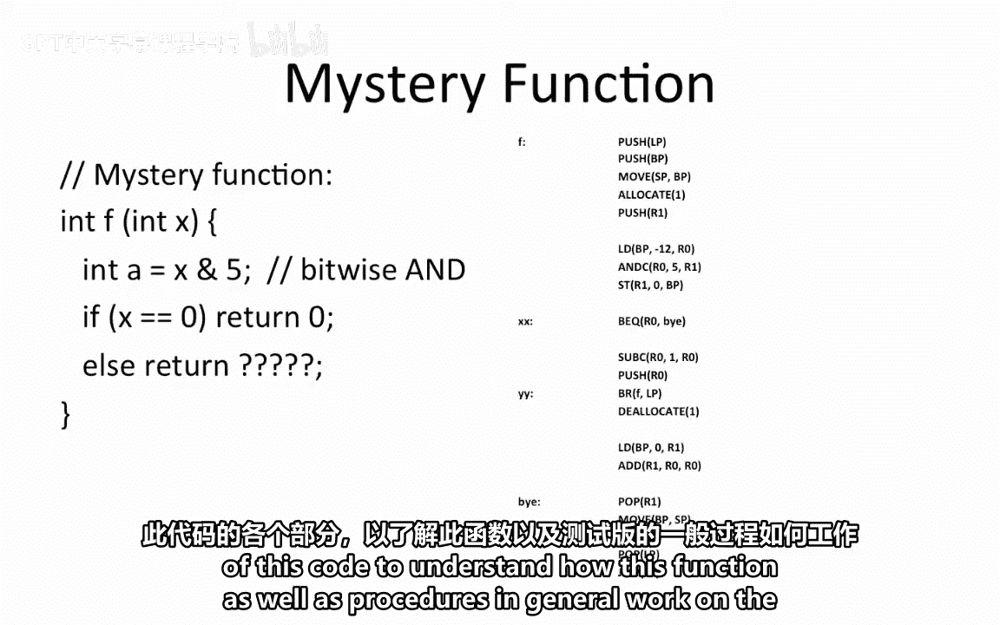

The code that calls the procedure is responsible for pushing any arguments onto the stack。

 This is shown in pink in the code， and on the stack。If there are multiple arguments。

 then they are pushed in reverse order so that the first argument is always in the same location relative to the BP or base pointer register。

 which we will see in a moment。The BR instruction branches to label F after storing the return address。

 which is B into the LP or linkage pointer register。In yellow。

 we see the entry sequence for the procedure， the structure of this entry sequence is identical for all procedures。

The first thing it does is push LP， which pushes the LP register onto the stack immediately after the arguments that were pushed onto the stack by the caller。

Next， it pushes the BP onto the stack in order to save the most recent value of the BP register before updating it。

Now， a move of S P to BP is performed。 SP is a stack pointer。

 which always points to the next empty location on the stack。

At the time that the smooth operation is executed， the SP points to the location immediately following the saved BPP。

This move instruction makes the BPP point to the same location that the SP is currently pointing to。

Which is the location that is immediately following the saved BP。

Note that once the BPP register is set up， one can always find the first argument at location BP 12。

Or in other words， three words before the current BP register。If there was a second argument。

 it could be found in location B P-16 and so on。Next。

 we allocate space on the stack for any local variables。

 This procedure allocates space for one local variable。 Finally。

 we push all registers that are going to be modified by our procedure onto the stack。

 Doing this makes it possible to recover the register's original values once the procedure completes execution。

 In this example， register R1 is saved onto the stack。😊，Once the entry sequence is complete。

 the BPP register still points to the location immediately following the saved BPP。The SP， however。

 now points to the location immediately following the saved R1 Reg。

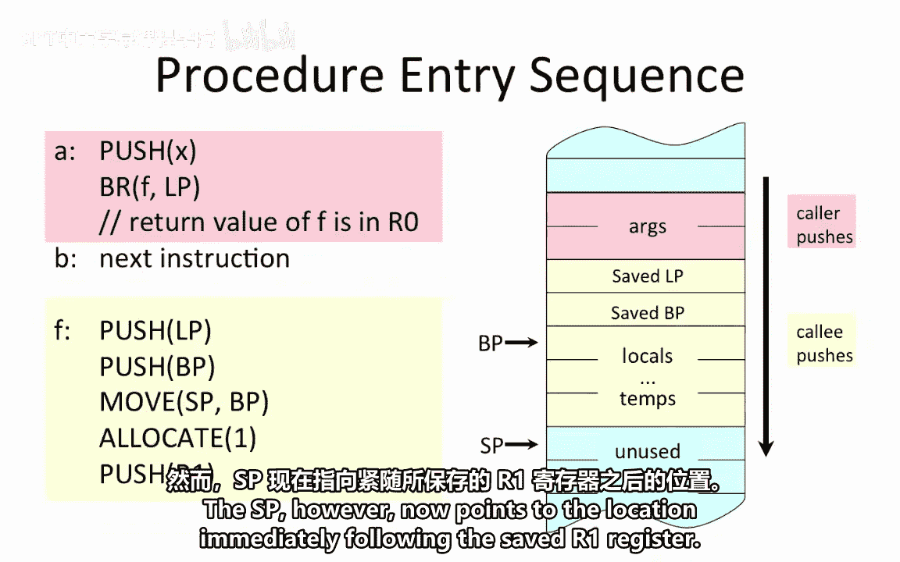

So for this procedure， after executing the entry sequence， the stack has been modified as shown here。

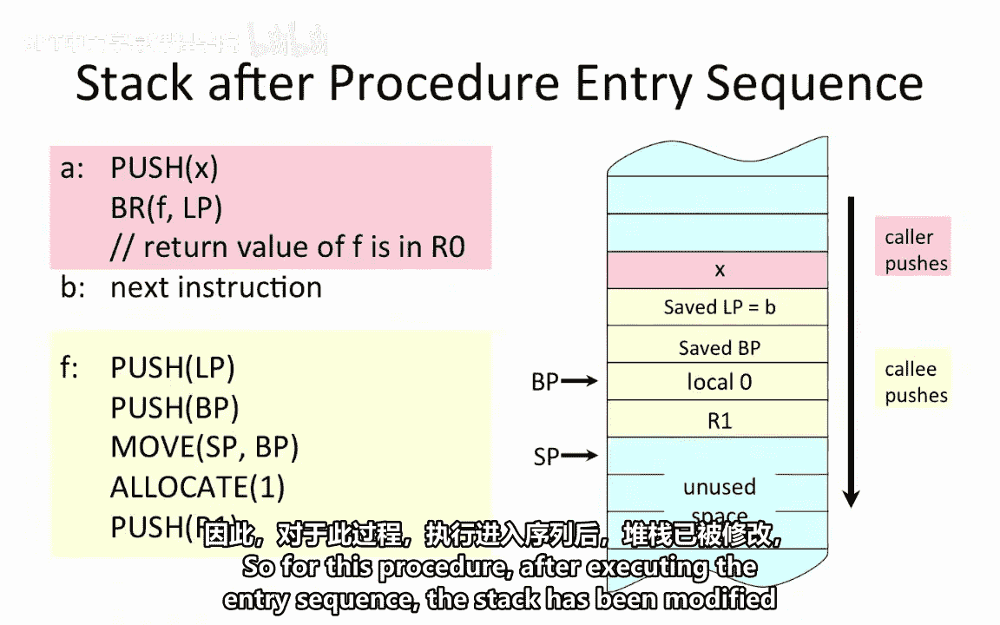

The procedure return or exit sequence for all beta procedures follows the same structure。

It is assumed that the return value for the procedure has already been placed into register R0。Next。

 all registers that were used in the procedure body are restored to their original values。

 This is followed by deallocating all of the local variables from the stack。

 We then restore the B P followed by the LP register。 Finally， we jump to LP。

 which contains the return address of our procedure。 In this case， LP contains the address B。

 which is the address of the next instruction that should be executed。

 following the execution of the F procedure。Taking a closer look at the details for our example。

 we see that we begin our exit sequence with P R1 in order to restore the original value of register R1。

 Note that this also frees up the location on the stack that was used to store the value of R 1。Next。

 we get rid of the local variables we stored on the stack。

 This is achieved using the moveve BP to S instruction。

 which makes the stack pointer point to the same location as the base pointer。

 thus specifying that all the locations following the updated stack pointer are now considered unused。

Next， we restore the B P register。 Restororing the Bp register is particularly important for nested procedure calls。

 If we did not restore the Bp register， then upon return to the calling procedure。

 the calling procedure would no longer have a correct base pointer。

 so it would not be able to rely on the fact that its first argument is located at location Bp-12。

 for example。Finally， we restore the LP register and jump to the location of the Red LP register。

 This is the return address。 So by jumping to LP， we return from our procedure call and are now ready to execute the next instruction at label B。

 Now， let's get back to our original procedure and its translation to beta assembly。

 We will now try to understand what this mystery function is actually doing by examining the remaining sections of our assembly code highlighted here。

😊。

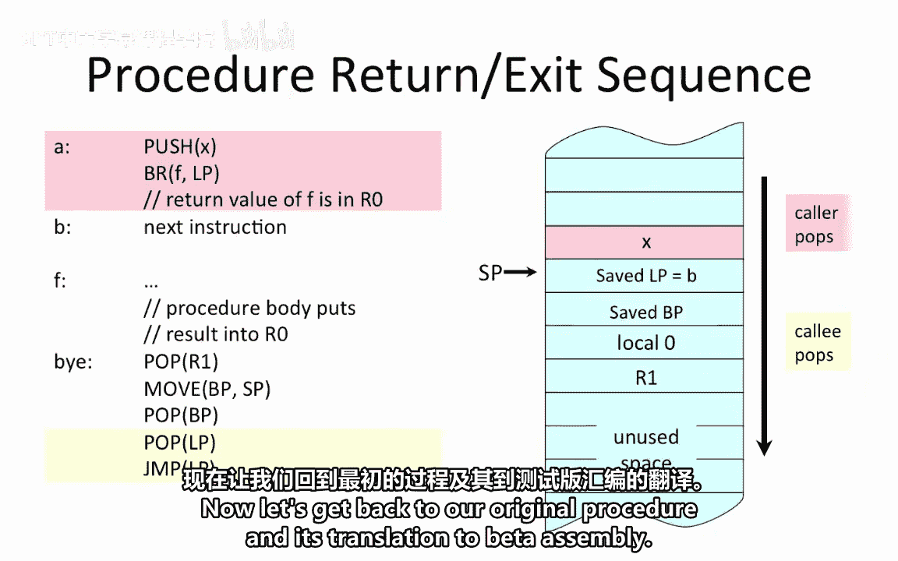

Let's zoom into the highlighted code。

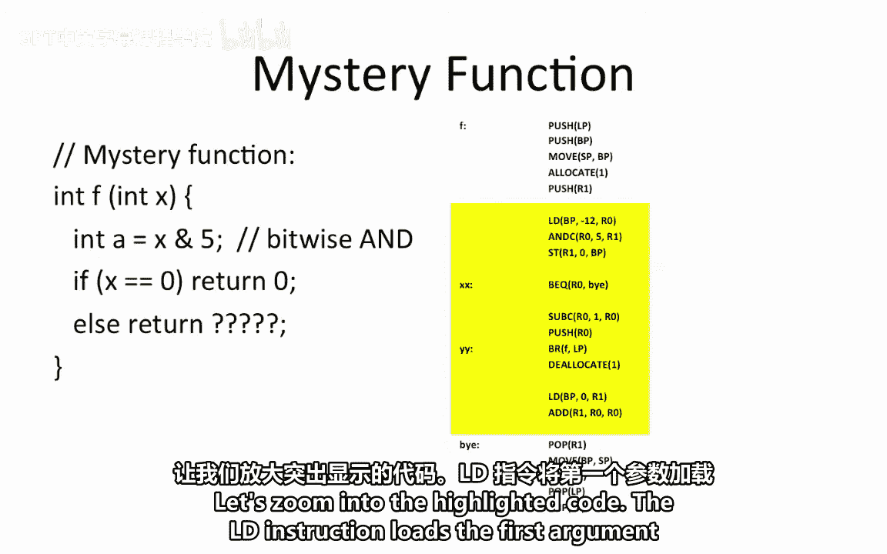

The LD instruction loads the first argument into register R0。

 recall that the first argument can always be found at location Bp-12， or in other words。

 three words before the current Bp register。 This means that the value X is loaded into R 0。Next。

 we perform a binary and operation between R0 and the constant 5 and store the result of that operation into register R1。

Note that it's okay to overwrite R1 because the entry sequence already saved a copy of the original R1 onto the stack。

Also note that overr r0 is considered fine because we ultimately expect the result to be returned in r0。

 so there is no expectation of maintaining the original value of R0。

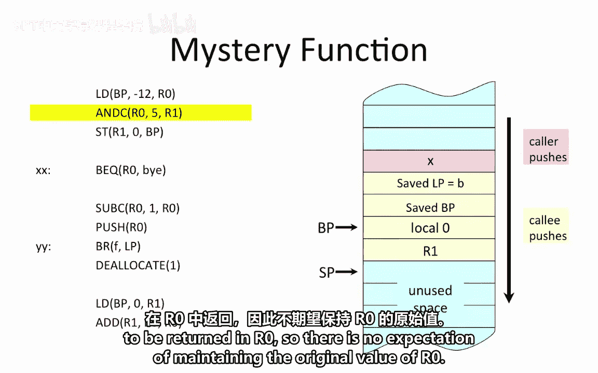

Looking back at the C code of our function， we see that the bitwise and of X and 5 is stored into a local variable named A。

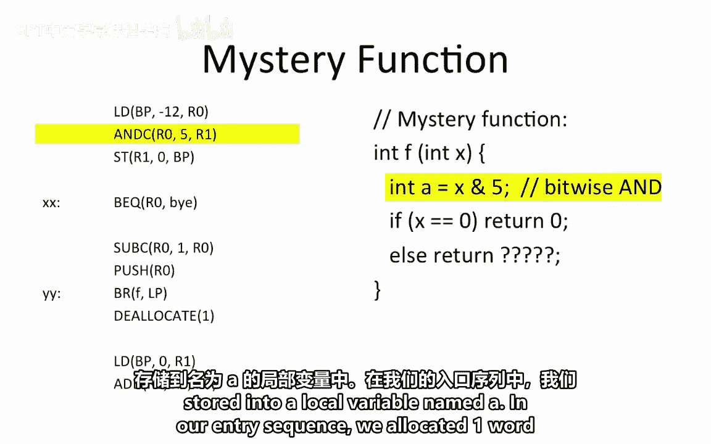

In our entry sequence， we allocated one word on the stack for our local variables。

 That is where we want to store this intermediate result。

 The address of this location is equal to the contents of the B P register。

Since the destination of a store operation is determined by adding the contents of the last register in the instruction to the constant。

 the destination of this store operation is the value of Bp plus 0。 So as expected。

 variable A is stored at the location pointed to by the BP register。

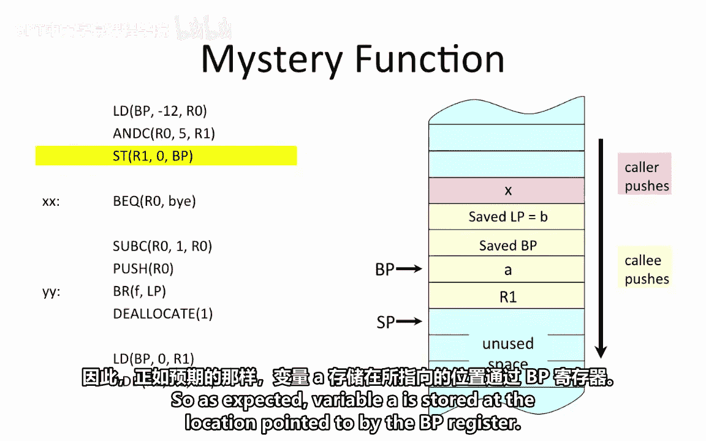

Now we check if x equals 0， and if so， we want to return the value 0。

 This is achieved in beta assembly by checking if r0 is equal to 0。

 since r 0 was loaded with a value of x by the load operation。The B。

 E Q operation checks whether or not this condition holds， and if so， it branches to label by。

 which is our exit sequence。 In that situation， we just saw that our 0 equals 0。

 So our 0 already contains the correct return value， and we are ready to execute our return sequence。

😊。

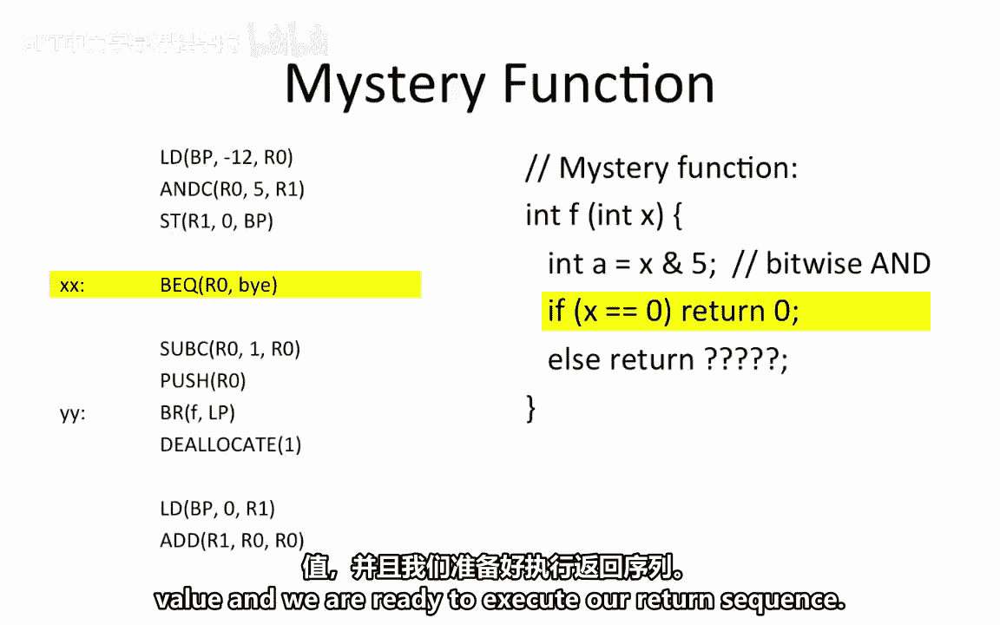

If x is not equal to0， then we perform the instructions after label Xx by figuring out what these instructions do。

 we can identify the value of our mystery function labeled multiple question marks。

We begin by decrementing r 0 by 1。 This means that R 0 will be updated to hold x -1。

We then push this value onto the stack and make a recursive call to Pro F。 In other words。

 we call F again with a new argument which is equal to x minus1。So far。

 we know that our mystery function will contain the term F of x minus-1。

We also see that LP gets updated with a new return address， which is YY+ 4。

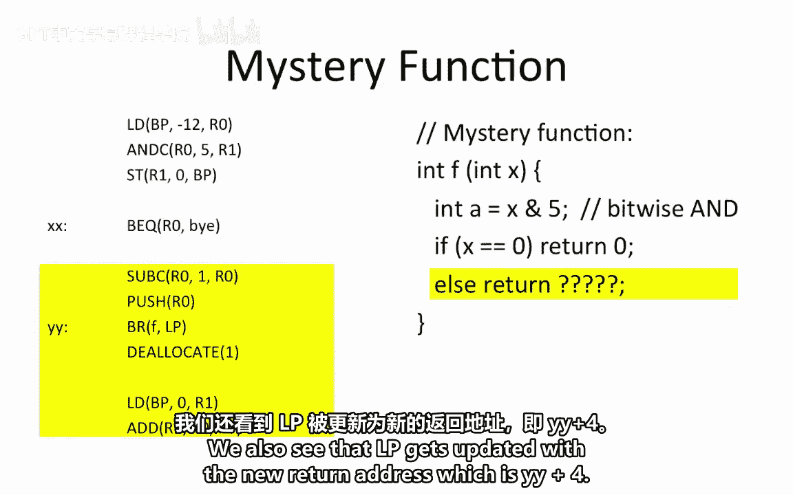

So just before our recursive call to F with a new argument x minus1， our stack looks like this。

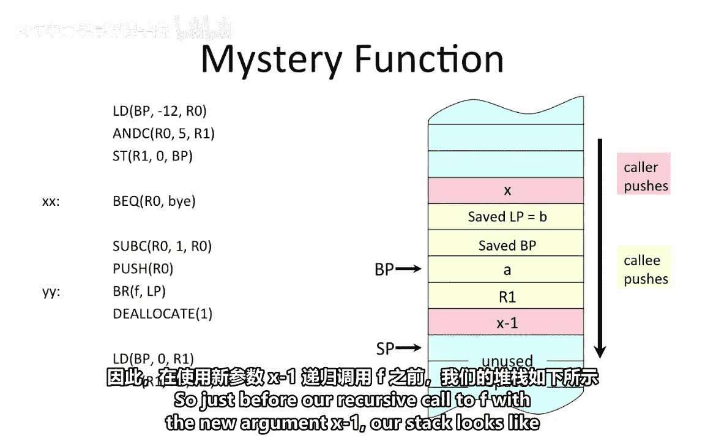

After the procedure entry sequence is executed in the first recursive call。

 our stack looks like this。 Note that this time， the save LP is yy plus 4 because that is our return address for the recursive procedure call。

The previous BP points to where the BP was pointing to in the original call to F。

Another term for this group of stack elements is an activation record。 In this example。

 each activation record consists of five elements。 These are the argument to F， the saved LP。

 the saved B P， the local variable， and the saved R1。Each time that F is called recursively。

 another activation record will be added to the stack。

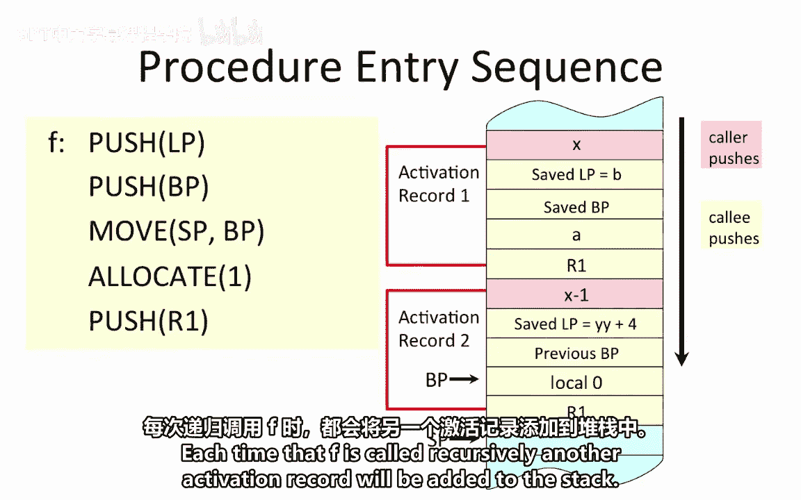

When we finally return from all these recursive calls。

 we are back to a stack that looks like this with a single activation record left on the stack。

 plus the first argument with which the recursive call was made。

The DloK1 instruction then removes this argument from the stack。

So the stack pointer is now pointing to the location where we previously pushed the argument x minus1。

R0 holds the return value from the recursive call to f， which is the value of f of x minus1。

Now we execute a load into register R1 of the address that is the contents of register Bp plus 0。

 This value is a。 We then add our1 to our0 to produce our final result in our 0。

Our0 is now equal to a plus f of x minus1， so we have discovered that our mystery function is a plus f of x minus1。

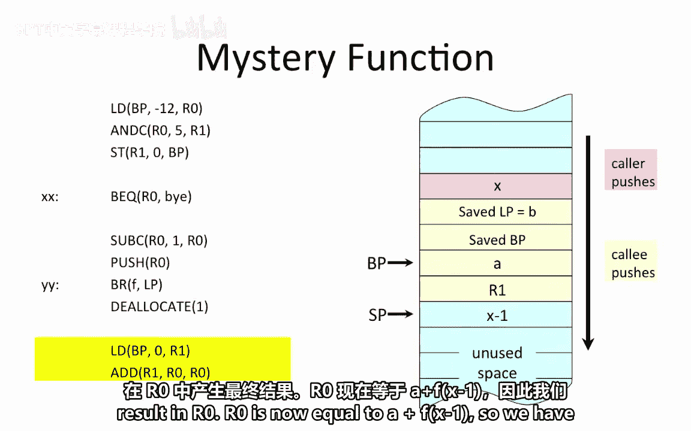

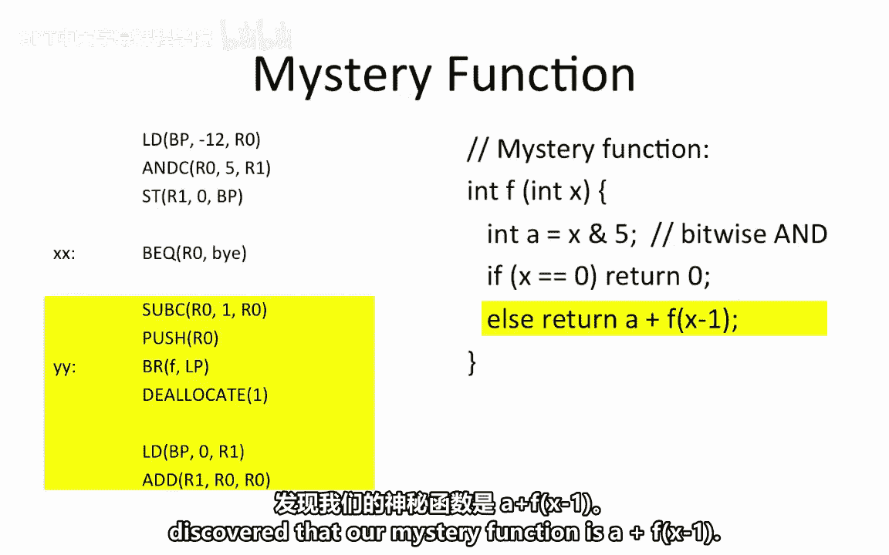

Before we continue with analyzing a stack trace from this problem。

 let's answer a few simpler questions。 The first question is whether or not variable a from the statement A equals x and 5 is stored on the stack。

 And if so， where is it stored relative to the B P register。Earlier。

 we saw that our assembly program allocates spaces for one local variable on the stack。

 At then stores are one， which holds the results of performing a binary and C between x and the constant 5 into the location pointed to by the B。

 P register， as shown here。😊，Next， we want to translate the instruction at labelbel YY into its binary representation。

The instruction that label YY is branch F comma LP。

This instruction is actually a macro that translates to a B E Q R 31 F LP。

Note that because r 31 always equals0， this branch is always taken。

The format of the binary representation for this instruction is a 6 bit op code。

 followed by a5 bit R C identifier， followed by another 5 bits which specify R A and then followed by a 16 B literal。

 The op code for B， E Q is 0，1，1，1，0，0。R C equals LP， which is register R28。

 The 5 bit encoding of 28 is 11100。R A is R 31， whose encoding is 1，1，1，1，1。

Now we need to determine the value of the literal in this instruction。

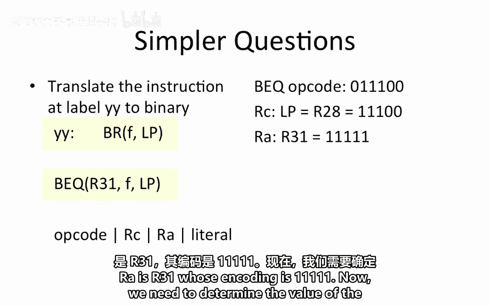

The literal in a branch instruction stores the offset measured in words from the instruction immediately following the branch to the destination address。

Looking at our assembly code for this function， we see that we want to count the number of words from the Dlocate one instruction back to label F。

 recall that the push and pop macros are actually each made up of two instructions。

 So each of those counts as two words。 counting back and accounting for the two instructions per push and pop。

 We see that we have to go back 16 instructions。 So our literal is -16 expressed as a 16 bit binary number。

Positive 16 is。A bunch of zeros followed by 1，0，0，0，0。 So -16 is 1，1，1，1，1，1，1，1，1，1，1，1，0，0，0，0。Now。

 suppose that the function F is called from an external main program。

 and the machine is halted when a recursive call to F is about to execute the BQ instruction tagged XX。

The BPP register of the halted machine contains 0x174。

 and the hex contents of a region of memory are shown here。

The values on the left of the stack are the addresses of each location on the stack。

We first want to determine the current value of the S or stack pointer register。

We were told that the machine is halted when a recursive call to F is about to execute the BQ instruction tagged XX。

And that the BPP register was 0x174 at that point。We see that after the BP was updated to be equal to the S in the move operation。

 two additional entries were made on the stack。 The first was an allocate instruction。

 which allocated space for one local variable， thus making the S point to location 0 x178。

And then push R 1， which saves a copy of R1 on the stack。

 thus moving the stack pointer register one further location down to 0 x17 c。

We now want to answer some questions about the stack trace itself to help us better understand its structure。

We first want to determine the value of local variable A in the current stack frame。

We know that A is stored at location Vp plus 0。So a is the variable stored at address 0 x174。

 and that value is 5 from here， we can label all the entries in the stack trace as follows。

We saw earlier that each activation record consists of five words。 The argument X。

 followed by the saved LP， the saved VP， the local variable and the saved register R1。

We can apply this structure to label our stack trace。Now that our stack traces fully labeled。

 we can take a closer look at the details of implementing procedures on the beta。

We begin by looking at the multiple LP values that were stored on the stack。

Note that the first one at address 0 x144 has a value of 0 x5 c。

Whereas the following two have a value of 0 xa4。This occurs because the L P value stored at address 0 x 14。

4 is the return address from the main procedure that originally called Pro F。

 whereas the following two LP values are the return addresses from recursive calls to F made from within the F function itself。

Using this information， you can now answer the question。

 what is the address of the branch instruction that made the original call to F from the external main program？

Recall that the value stored in the LP register is actually the return address。

 which is the address of the instruction immediately following the branch instruction。

So if the original LP value was 0x5c， that means that the address of the branch instruction was 0x58。

We can also answer the question， what is the value of the PC when the program is halted。

 We know that the program was halted just before executing the instruction at label X X。

 We also know that the instruction at label Y Y makes a recursive call to F。

 We know that the LP value from the recursive calls is 0 x A4。

This means that the address of the Dlocate1 instruction is 0xa4。

Counting backwards by4 bytes and accounting for the fact that a push operation consists of two instructions。

 we see that label Xx equals 0 x90。And that is the value of the PC when the program is halted。

As our last question， we want to consider the following。

Suppose that you're told that you could delete four instructions from your program without affecting the behavior of the program。

The four instructions to be removed are a load， a store， and allocate and a move instruction。

Removing these instructions would make our programs shorter and faster。

So our goal is to determine whether or not this is possible without affecting the behavior of the program。

Let's first consider removing the allocate instruction。If this instruction is removed。

 that means that we will not be saving space on the stack for local variable A。However。

 if we take a closer look at the three lines of code highlighted in yellow。

 we see that the actual value of a is first computed in R1 before storing it in local variable A。

Since our1 is going to be saved on the stack during each recursive call。

 we could get away without saving a on the stack because we can find its value in the stored R1 of the next activation record。

 as shown in the highlighted pairs of A and R 1 on this stack。😊。

This means that we could safely remove the allocate instruction。As a result。

 this also means that we don't need the store operation that stores A on the stack or the load operation that reloads A into register R1。

Finally， because there are no longer any local variables stored on the stack。

 then the instruction moves BP to SP， which is normally used to delocate all local variables。

 can be skipped because after popping R1， the BP and SP registers will already point to the same location。

So in conclusion， the four operations can be removed from the program without changing the behavior of the code。

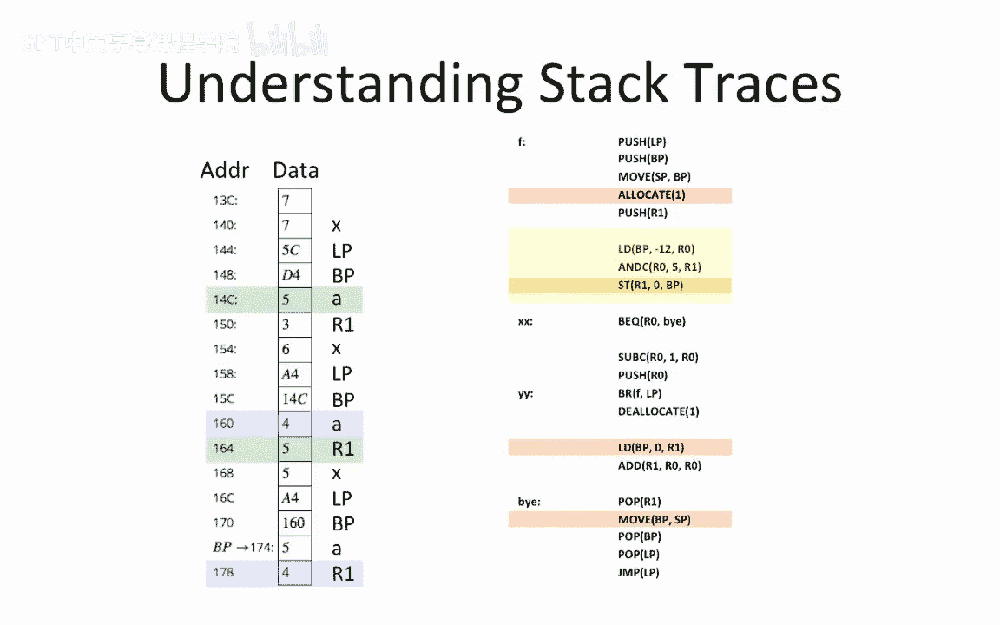