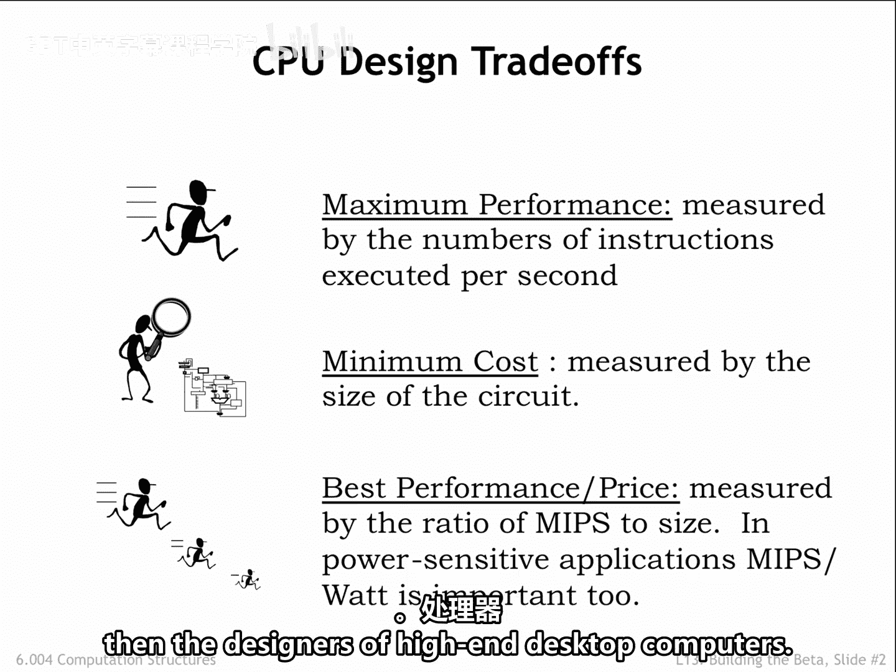
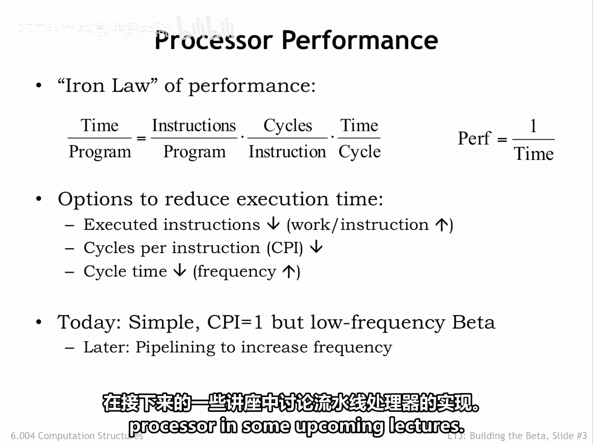
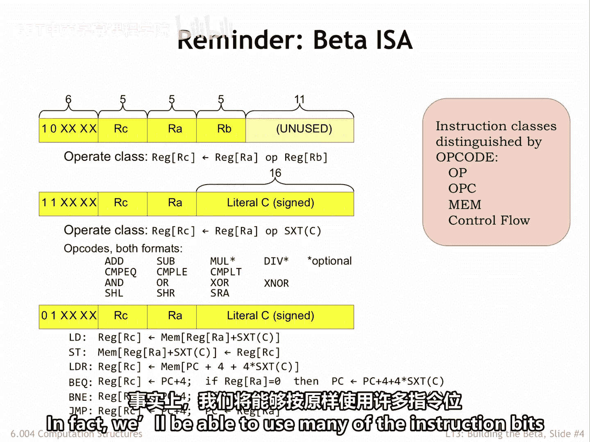
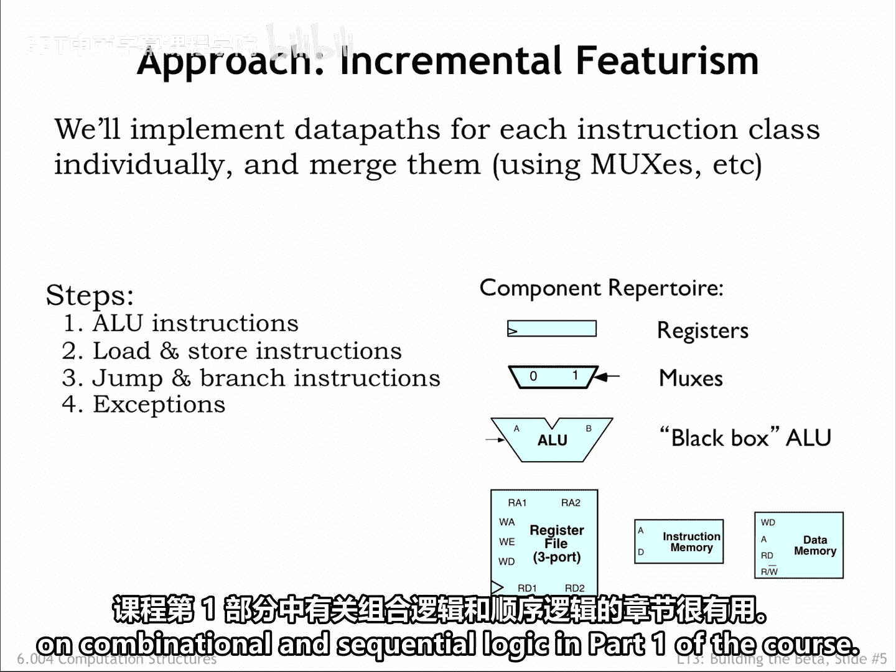
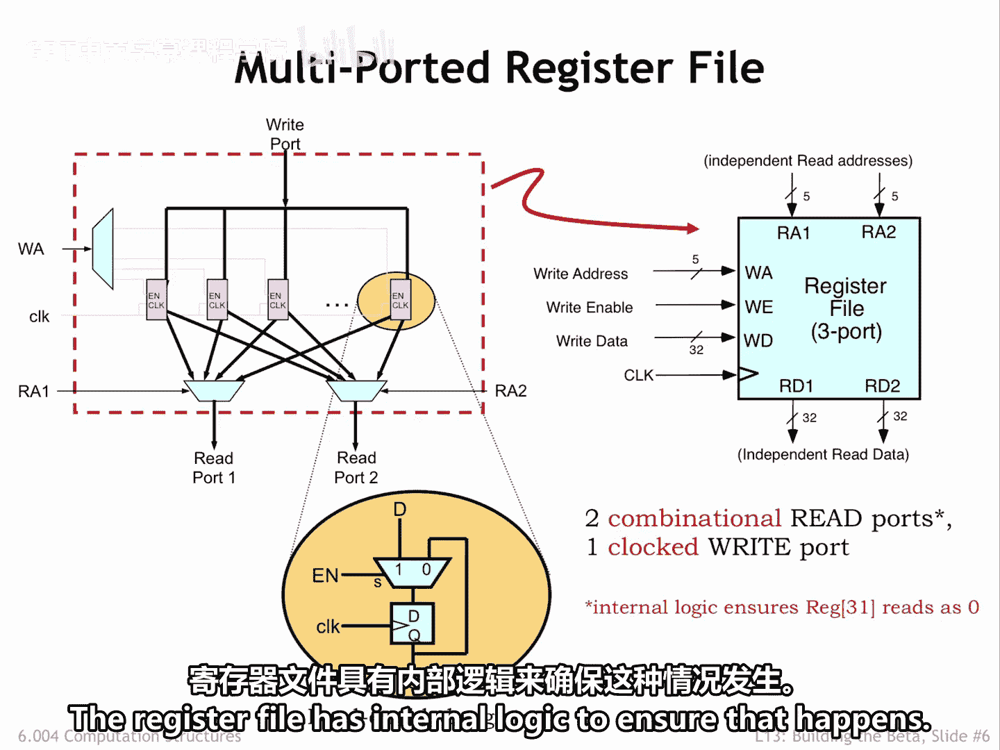
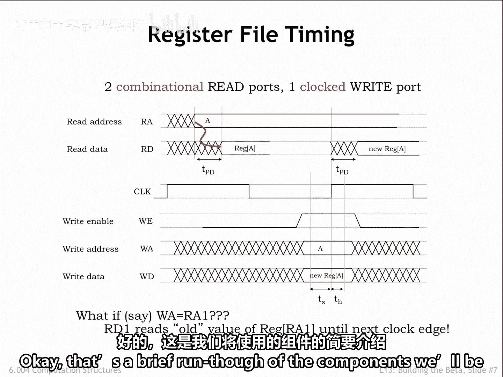

# 【数字系统与计算机架构P2 6.004 2017】麻省理工学院—中英字幕 p13 13.2.1 Building Blocks -BV19m41127Kj_p13-

Today we're going to describe the data path and control logic needed to execute beta instructions。

In an upcoming lab assignment we'll ask you to build a working implementation using our standard cell library。

 When you're done， you'll have designed and debugged a 32 B reduced instruction set computer。

 Not bad。Before tackling a design task， it's useful to understand the goals for the design。

 functionality， of course， In our case， the correct execution of instructions from the beta instructions set architecture。

But there are other goals we should think about。An obvious goal is to maximize performance as measured by the number of instructions executed per second。

This issly expressed in MIps， an acronym for millions of instructions per second。

 When the Intel 880 was introduced in 1974， it executed instructions at 0。

29 mips or 290000 instructions per second， as measured by the Dr stone benchmark。

Modern multi corere processors are rated between 10，000 and 100，000 MIps。

Another goal might be to minimize the manufacturing cost。

 which an integrated circuit manufacturing is proportional to the size of the circuit。

Or we might want to have the best performance for a given price。In our increasingly mobile world。

 the best performance per watt might be an important goal。

One of the interesting challenges in computer engineering is deciding exactly how to balance performance against cost and power efficiency Clearly the designers of the Apple Watch have a different set of design goals than the designers of high end desktop computers。

The performance of a processor is inversely proportional to the length of time it takes to run a program。

The shorter the execution time， the higher the performance。

The execution time is determined by three factors。 First， the number of instructions in the program。

Second， the number of clock cycles our sequential circuit requires to execute a particular instruction。

Complex instructions， for example， adding two values from a main memory may make a program shorter。

But may also require many clock cycles to perform the necessary memory and data path operations。

Third， the amount of time needed for each clock cycle。

 as determined by the propagation delay of the digital logic in our data path。

So to increase the performance， we could reduce the number of instructions to be executed or we can try to minimize the number of clock cycles needed on the average to execute our instructions。

There's obviously a bit of a trade off between these first two options。

 more computation per instruction usually means it will take more time to execute the instruction。

Or we can try to keep our logic simple， minimizing its propagation delay in the hopes of having a short clock period。

Today， we'll focus on an implementation for the beta instructions set architectureit that executes one instruction every clock cycle。

The combinational paths in our circuit will be fairly long， but as we learned in part1 of the course。

 this gives us the opportunity to use pipe lighting to increase our implementation's throughput。

We'll talk about the implementation of a pipeline processor in some upcoming lectures。

Here's a quick refresher on the beta ISA， the beta has 32。

 32 bit registers that hold values for use by the data path。The first class of LU instructions。

 which have 10 as the top2 bits of the Opcode field， perform an operation on two Reg opera， R and RB。

 sting the result back into a specified destination register RC。

There's a  six bit op code field to specify the operation and three5 bit register fields to specify the registers to use as source and destination。

The second class of AOU instructions， which have one one in the top two bits of the Op code perform the same set of operations。

Where the second opera is a constant in the range of-32，768 to plus 32，7，67。

The operations include arithmetic operations， comparisons， Boolean operations and shifts。

In assembly language， we use a C suffix added to the mnemonic shown here to indicate that the second opera rant is a constant。

The second instruction format is also used by the instructions that access memory and change the normally sequential execution order。

 The use of just two instruction formats will make it very easy to build the logic responsible for translating the encoded instructions into the signals needed to control the operation of the data path。

In fact， we'll be able to use many of the instruction bits as is。

We'll build our data path incrementally， starting with the logic needed to perform the AU instructions。

 then add additional logic to execute the memory and branch instructions。 Finally。

 we'll need to add logic to handle what happens when an exception occurs and execution has to be suspended because the current instruction cannot be executed correctly。

Well be using the digital logic gates we learned about in part one of the course。In particular。

 we'll need multib registers to hold state information from one instruction to the next。

Recall that these memory elements load new values at the rising edge of the clock signal。

 then store that value until the next rising clock edge。

We'll use a lot of multiplexs in our design to select between alternative values in the data path。

The actual computations will be performed by the arithmetic and logic unit that we designed at the end of part1。

It has logic to perform the arithmetic comparison， Boolean and shift operations listed on the previous slide。

It takes in two 32 bit opera and produces a 32 bit result。And finally。

 we'll use several different memory components to implement register storage in the data path。

And also for main memory where instructions and data are stored。

You might find it useful to review the chapters on combinational and sequential logic in part one of the course。

The beta ISA specifies 32，32 B registers as part of the data path。

These are showing us the magenta rectangles in the diagram below。

These are implemented as load enabled Regs， which have an EN signal that controls when the register is loaded with a new value。

If EN is1， the register will be loaded from the D input at the next R clock edge。If EN is 0。

 the register is reloaded with its current value and hence its value is unchanged。

It might seem easier to add enabling logic to the clock signal， but this is almost never a good idea。

 since any glitches in that logic might generate false edges that would cause the register to load a new value at the wrong time。

 Always remember the mantra。 No gated clocks。There are multipleors shown underneath the registers that let us select a value from any of the 32 registers。

Since we need two opera rants for the data path logic， there are two such multiplexs。

Their select inputs， RA1 and RA2 function as addresses determining which register values will be selected as opera。

And finally， there's a decoder that determines which of the 32 registered load enables will be one based on the5 bit WA input。

For convenience， we'll package all this functionality into a single component called a register file。

The register file has two read ports， which given a5 bit address input to deliver the selected Reg value on the read data ports。

The two read ports operate independently， they can read from different registers。

 or if the addresses are the same， read from the same register。

The signals on the left of the register file include a 5 bit value W A that selects a register to be written with the specified 32 B right data W D。

 If the right na signal W E is one at the rising edge of the clock signal。

 the selected register will be loaded with the supplied right data。Note that in the Beta ISA。

 reading from Register address 31 should always produce a zero value。

 The register file has internal logic to ensure that happens。

Here's a timing diagram that shows the register file in operation。To read a value from the Reg file。

 supply a stable address input RA on one of the read ports。After the Reg's files propagation delay。

 the value of the selected register will appear on the corresponding read data port， R D。

Not surprisingly， the register file right operation is very similar to writing an ordinary D register。

 The right addressed W A， write data， W D， and write and able。

 W E signals must all be valid and stable for some specified setup up time before the rising edge of the clock。

And must remain stable and valid for the specified hold time after the rising clockhe。

If those time constraints are met， the Reg file will reliably update the value of the selected register。

When a register value is written at the rising clock edge。

If that value is selected by a read address， the new data will appear after the propagation delay on the corresponding data port。

In other words， the read data value changes if either the read address changes or the value of the selected register changes。

Can we read and write the same register in a single clock cycle？Yes。

 if the read address becomes valid at the beginning of the clock cycle。

 the old value of the register will appear on the data port for the rest of the cycle。

Then the right occurs at the end of the cycle and the new register value will be available in the next clock cycle。

Okay， that's a brief run through of the components we'll be using， let's get started on the design。

