# 数字系统与计算机架构：P2：6.2.3 加载与存储指令 🧠

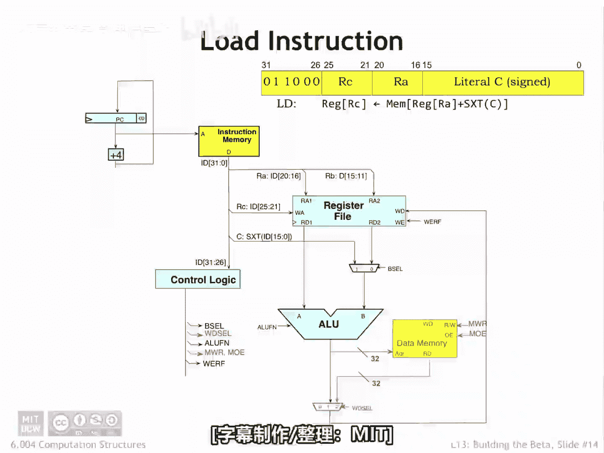

在本节课中，我们将要学习计算机架构中两种访问主内存的关键指令：加载（Load）和存储（Store）。我们将详细探讨它们如何在数据通路中执行，包括地址计算、数据流动以及相关的控制信号设置。

---

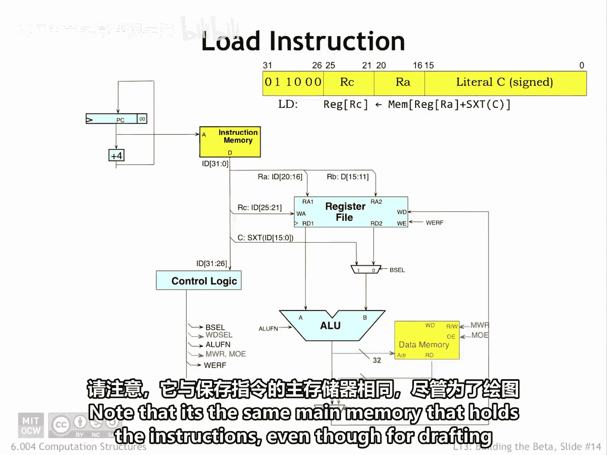

## 主内存访问概述

加载和存储指令用于访问主内存。需要注意的是，指令和数据存储在同一个主内存中，尽管在数据通路图中，为了方便绘制，我们将其表示为两个独立的方框。

在我们展示的形式中，主内存有三个端口：两个读端口（用于取指令和读取加载数据）和一个写端口（供存储指令用于将数据写入主内存）。

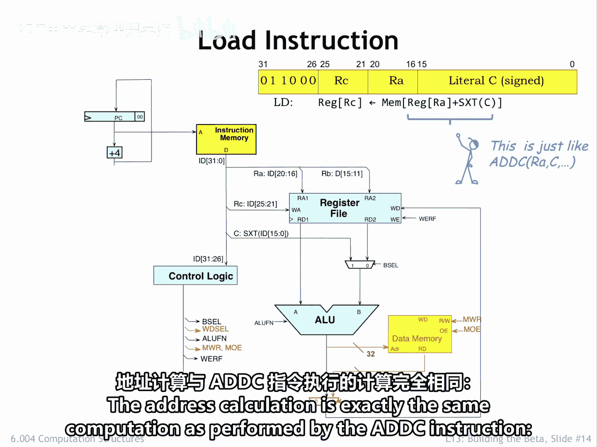

## 地址计算

地址计算与加法指令（Add C）执行的计算完全相同。RA寄存器的内容会与指令低16位进行符号扩展后的16位字面量相加。

因此，我们将直接复用现有的数据通路硬件来计算地址。

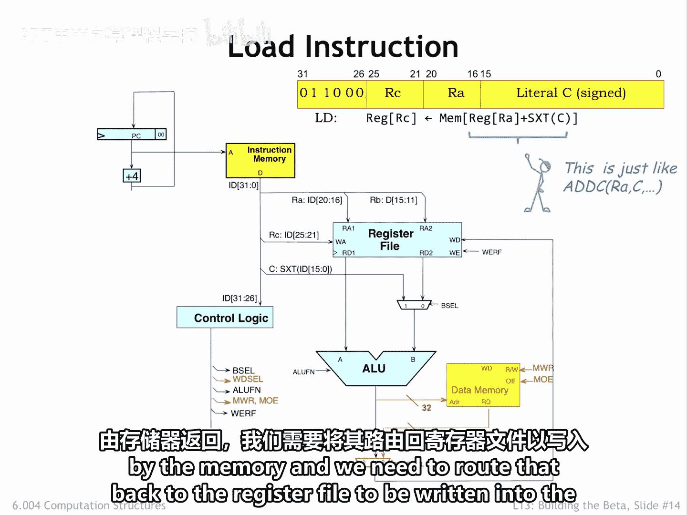

## 加载指令的执行流程

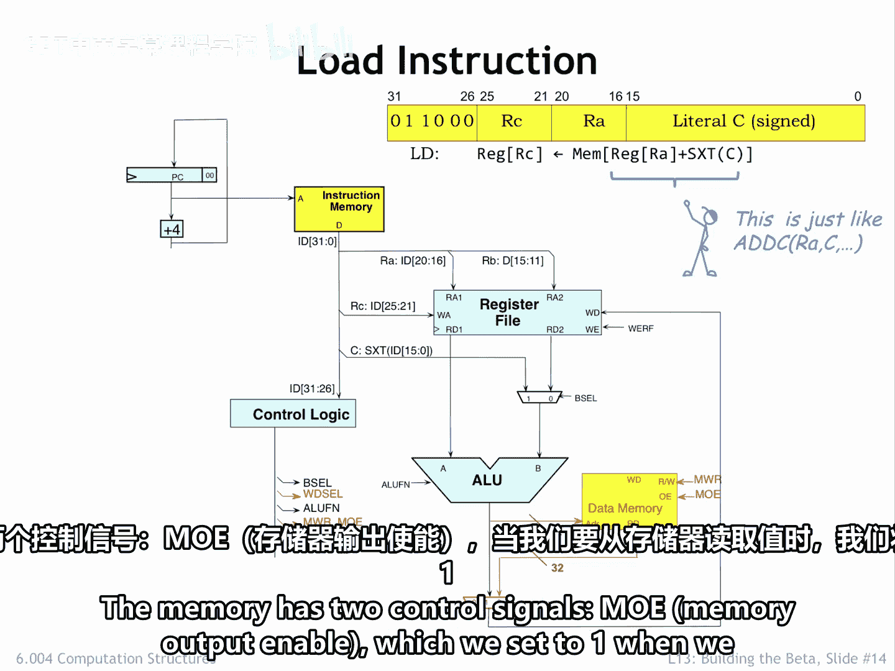

对于加载指令，算术逻辑单元（ALU）的输出被路由到主内存，作为我们希望访问的内存位置的地址。

经过内存的传播延迟后，该地址位置的内容由内存返回，我们需要将该值路由回寄存器文件，以便写入RC寄存器。

以下是加载指令执行过程中的关键步骤：

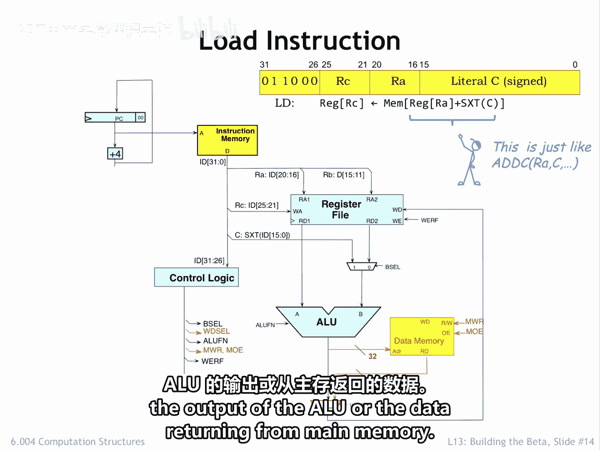

1.  **选择操作数**：ALU的操作数选择方式与ADC指令相同。
2.  **执行加法**：ALU被请求执行加法操作。
3.  **提供地址**：ALU的结果连接到主内存的地址端口。
4.  **设置读操作**：主内存的控制信号被设置为读操作。
5.  **路由返回数据**：WD_sel控制信号被设置为2，以将返回的数据路由到寄存器文件。

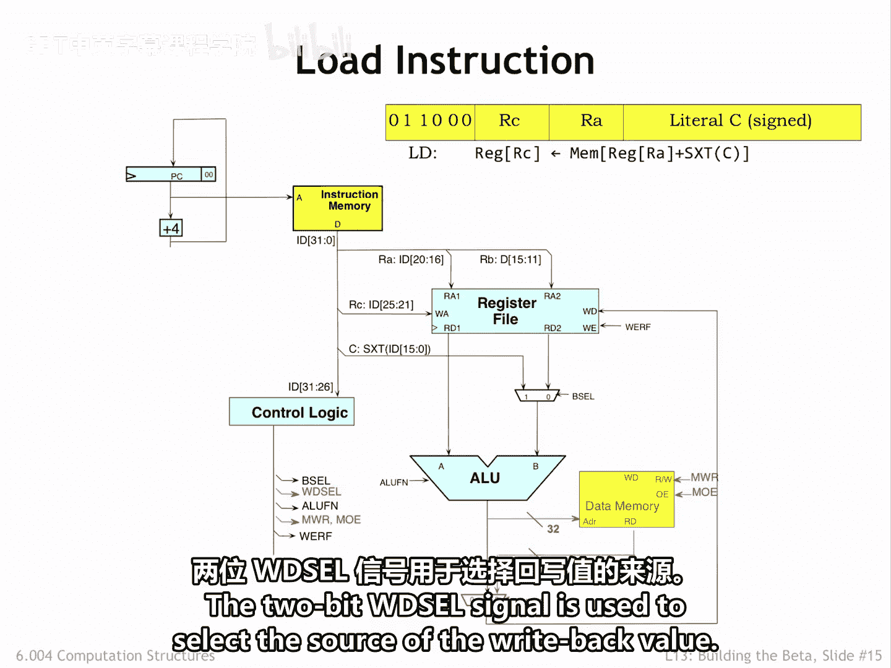

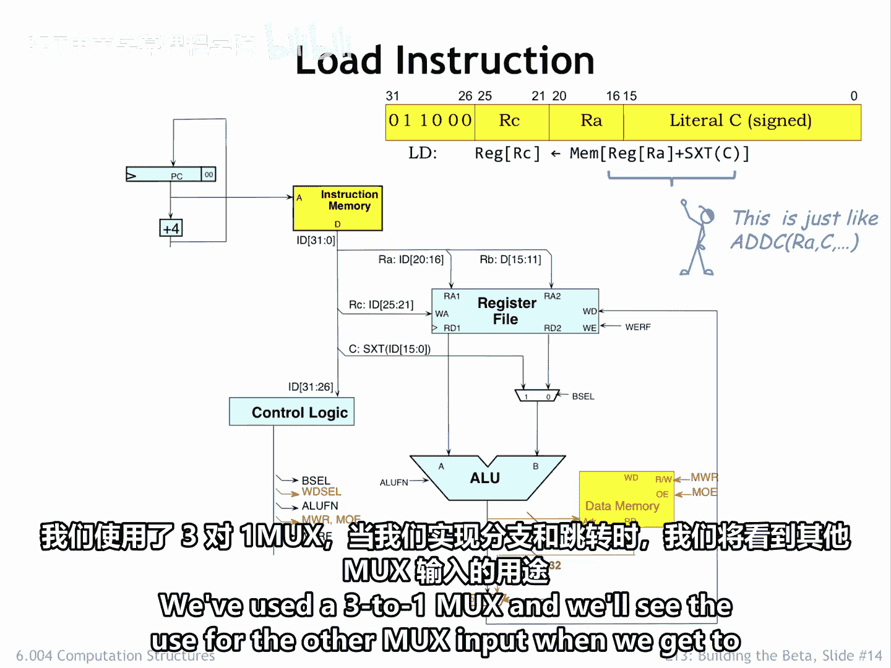

## 内存控制信号

主内存有两个控制信号：
*   **MOE（内存输出使能）**：当我们想从内存读取一个值时，将其设置为1。
*   **MWE（内存写使能）**：当我们希望主内存将写数据（WD）端口上的值存储到寻址的内存位置时，将其设置为1。

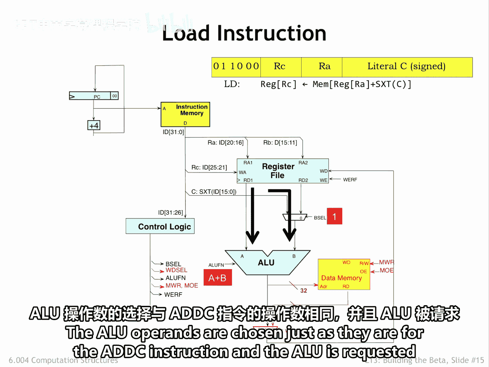

## 写回数据的选择

我们需要添加一个多路复用器（MUX）来选择写回寄存器文件的值：是来自逻辑单元（LU）的输出，还是从主内存返回的数据。

我们使用了一个3选1的多路复用器，当我们实现分支和跳转指令时，会看到另一个MUX输入的用途。

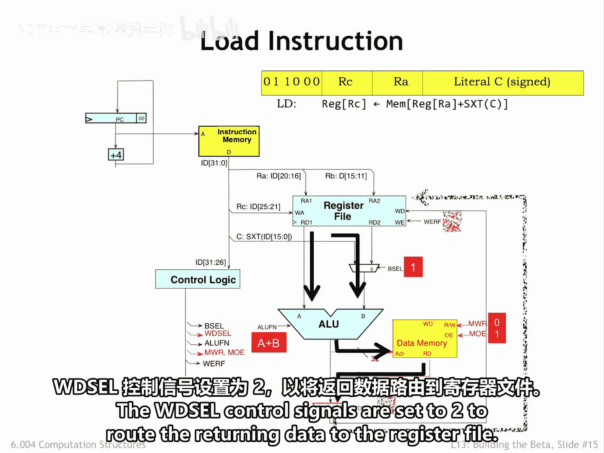

2位的WD_sel信号用于选择写回值的来源。

## 存储指令的执行流程

存储指令的执行与加载指令非常相似，但多了一个额外的复杂性。

要写入内存的值来自RC寄存器，但RC指令字段并未连接到寄存器文件的读地址。幸运的是，存储指令并未使用RB寄存器地址，因为第二个ALU操作数来自字面量字段。

因此，我们将使用一个MUX，使得RC字段可以被选为寄存器文件第二个读端口的地址。
*   当RA2_sel控制信号为0时，选择RB字段作为地址。
*   当RA2_sel为1时，选择RC字段作为地址。

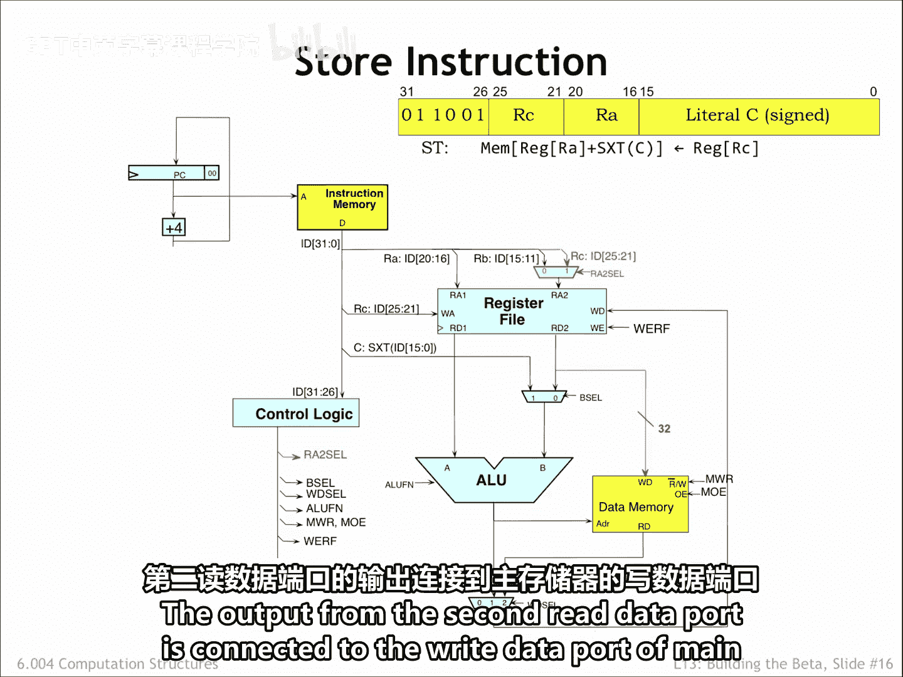

第二个读数据端口的输出连接到主内存的写数据端口。

存储指令是唯一不向寄存器文件写入结果的指令。因此，在执行存储指令时，W_en控制信号将为0。

以下是存储指令执行过程中的数据流动：

1.  **选择操作数**：操作数的选择方式与加载指令相同。
2.  **执行地址计算**：ALU执行地址计算，结果作为地址发送给主内存。
3.  **提供写数据**：同时，RC字段被选为寄存器文件第二个读端口的地址，来自RC寄存器的值成为主内存的写数据。
4.  **触发写入**：通过将MWE控制信号设置为1，主内存将在周期结束时将WD数据写入选定的内存位置。

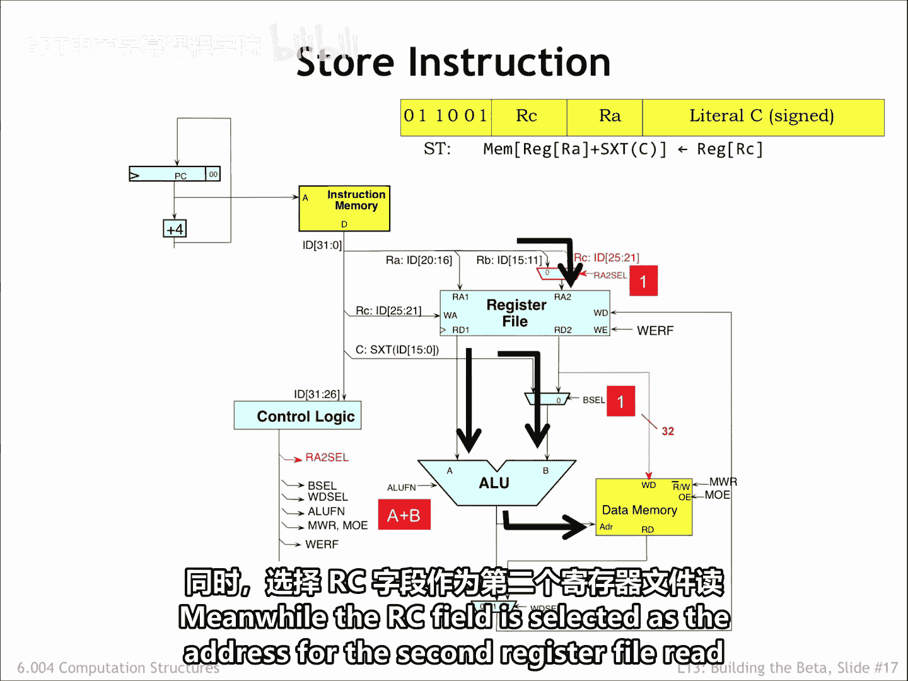

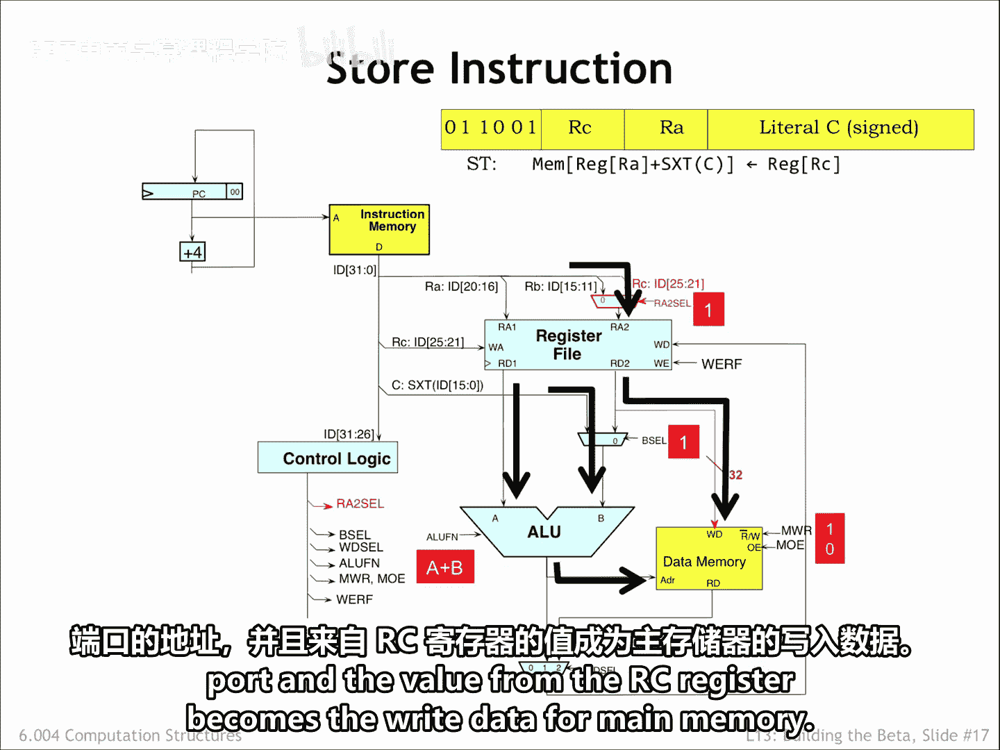

## 控制信号的“无关”项

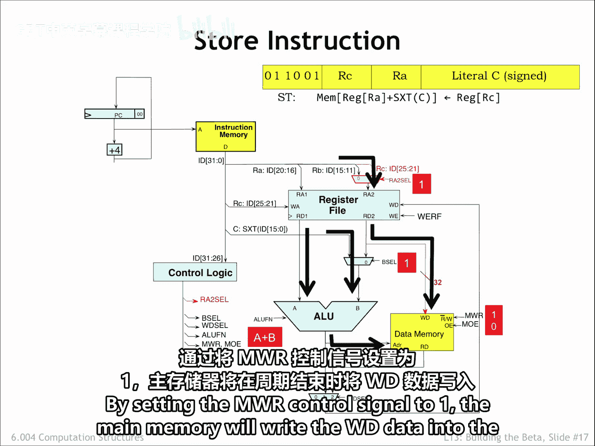

在执行存储指令时，W_en控制信号被设置为0，因为我们不会向寄存器文件写入值。既然我们不写入寄存器文件，我们就不关心WD_sel信号的值。

当然，逻辑电路仍需为WD_sel提供一个值。“无关”标注告诉逻辑设计师，她可以提供任何最方便的值。这在用卡诺图优化控制逻辑时特别有用，该值可以选择为0或1，以哪种能最好地简化逻辑方程为准则。

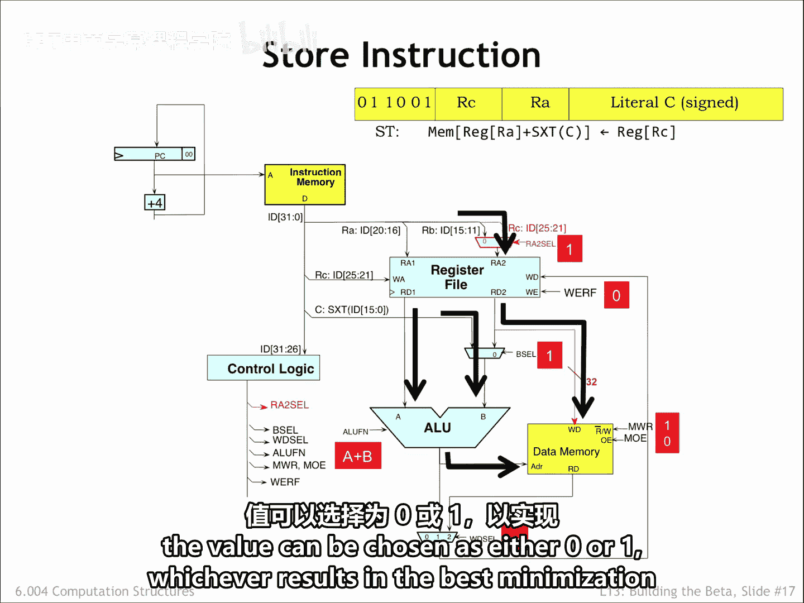

---

## 总结

本节课中，我们一起学习了加载（Load）和存储（Store）指令的执行机制。我们了解到：
*   它们共享相同的地址计算硬件。
*   加载指令从内存读取数据并写回寄存器文件，涉及`MOE`信号和`WD_sel`信号的选择。
*   存储指令将寄存器数据写入内存，需要额外的多路复用器来选择RC寄存器作为数据源，并激活`MWE`信号，同时它不写回寄存器文件（`W_en=0`）。
*   控制逻辑中存在“无关”项，为逻辑优化提供了空间。

理解这些数据通路细节是掌握CPU如何与内存交互的关键一步。