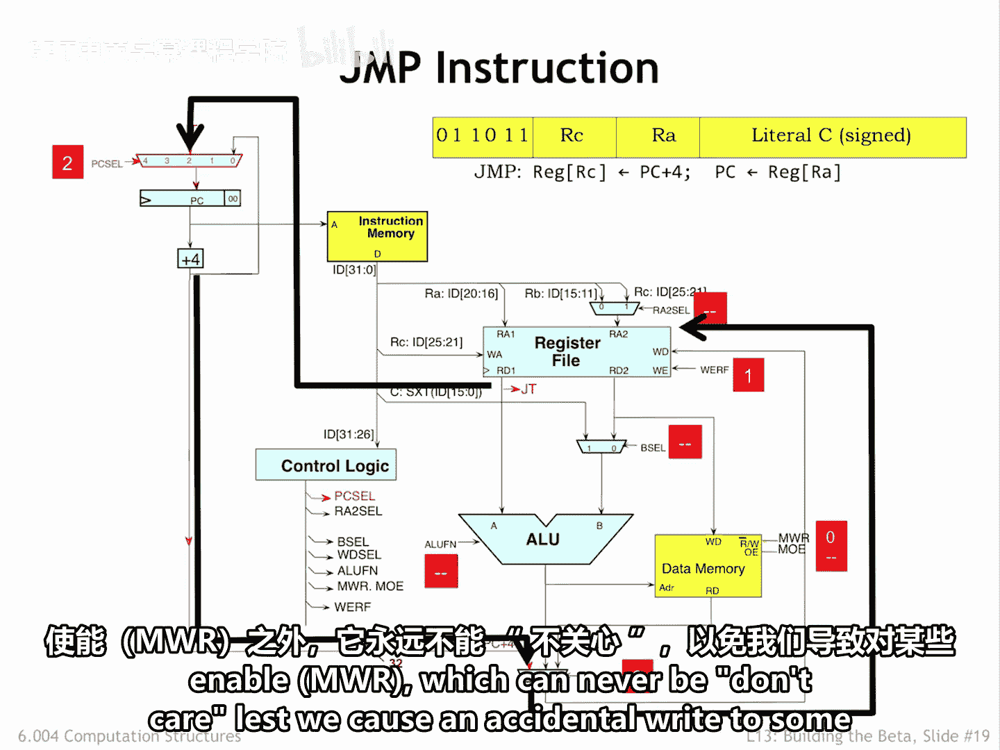
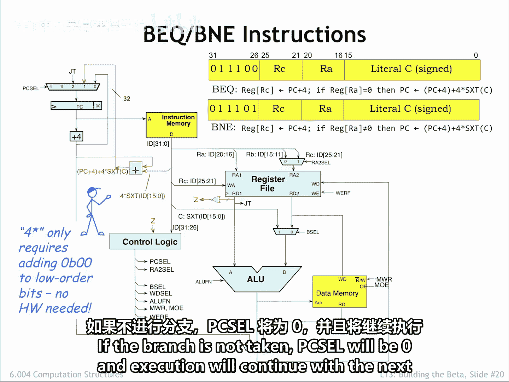
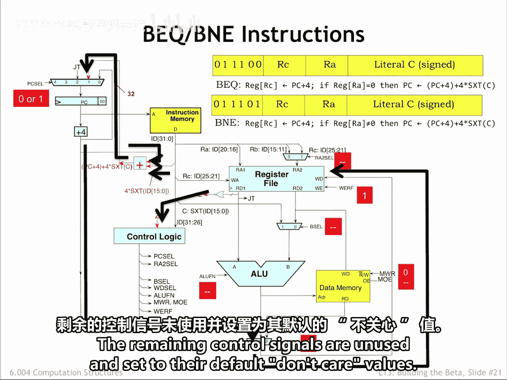
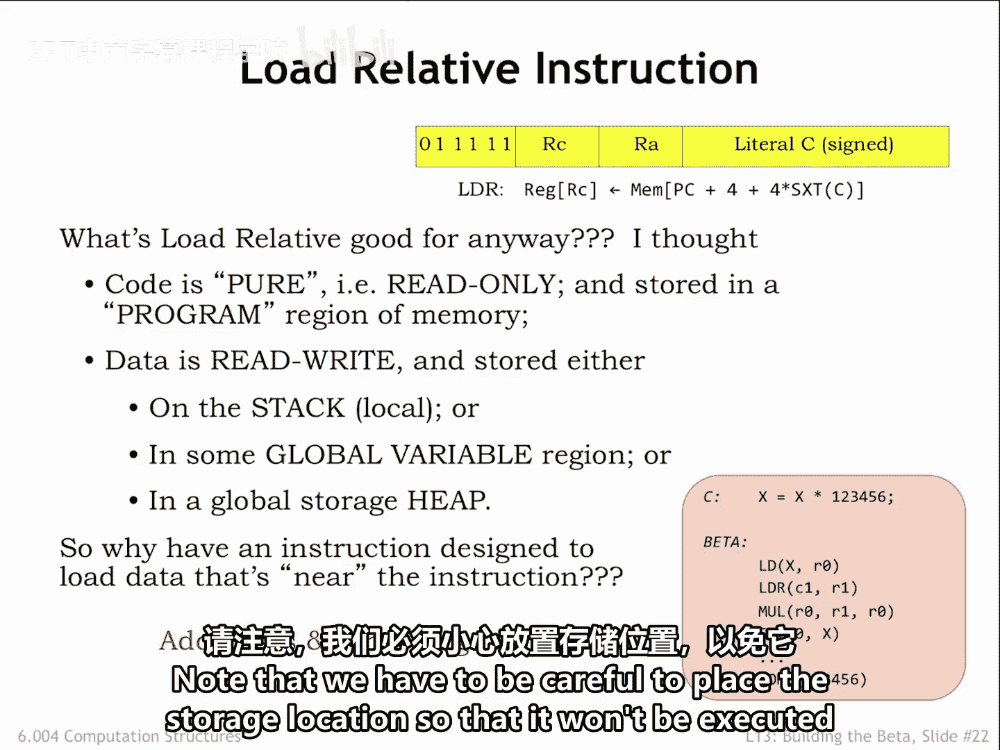
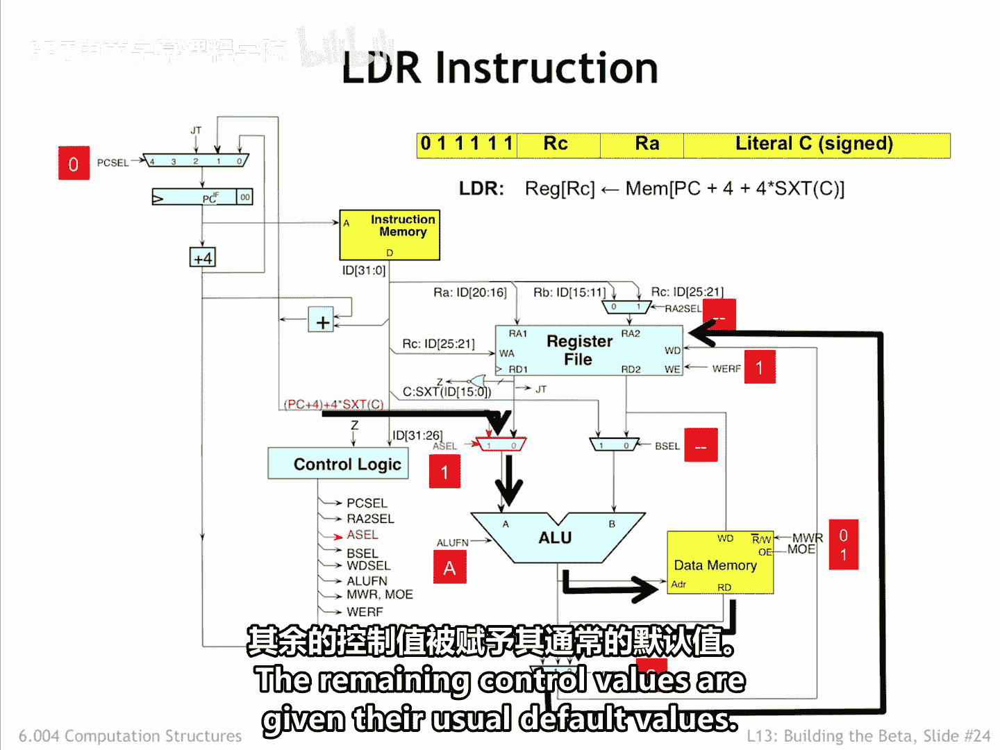

# 数字系统与计算机架构：P2：6.4 跳转与分支指令 🚀

在本节课中，我们将学习如何通过跳转和分支指令改变程序的执行顺序。这些指令通过修改程序计数器（PC）的值，使处理器能够执行循环、条件判断和函数调用等复杂操作。

---

## 程序计数器与顺序执行

到目前为止，我们介绍的所有指令都是顺序执行的。下一条指令的地址来自当前指令地址之后的位置，这由 **PC+4** 逻辑实现。

**公式：**
```
下一条指令地址 = 当前PC值 + 4
```

---

## 跳转指令



跳转指令通过改变程序计数器（PC）的值来打破顺序执行。它从RA寄存器中取出一个值，并将其设置为下一个PC值。

在数据通路的左上角，**PC单元多路选择器** 允许控制逻辑选择下一个PC值的来源。
*   当 **PC_Sel** 信号为 **0** 时，选择递增后的PC值（PC+4）。
*   当 **PC_Sel** 信号为 **2** 时，选择RA寄存器的值。

跳转指令还需要将下一条指令的地址（即PC+4值）保存到RC寄存器中。这是通过将 **WD_Sel** 信号设置为 **0**，从而选择PC+4值作为写入寄存器文件的数据来实现的。

以下是跳转指令的数据通路工作流程：
1.  PC+4加法器的输出被路由到寄存器文件。
2.  **WE** 信号被设置为 **1**，以允许在周期结束时将该值写入RC寄存器。
3.  同时，从寄存器文件输出的RA寄存器值连接到PC单元多路选择器的“2”号输入。
4.  设置 **PC_Sel** 为 **2**，将选择RA寄存器中的值作为PC的下一个值。
5.  其余控制信号为“无关”状态，但内存写使能信号 **MemW** 除外，它必须保持为 **0**，以防止意外写入内存。


---

## 分支指令

上一节我们介绍了无条件跳转，本节中我们来看看条件分支。分支指令需要一个额外的加法器来计算目标地址，方法是将指令字面量字段中的缩放偏移量加到当前的PC+4值上。



**公式：**
```
分支目标地址 = (PC + 4) + (符号扩展(指令[15:0]) << 2)
```
*   偏移量乘以4（左移2位）是为了将指令中存储的**字偏移**转换为PC所需的**字节偏移**。
*   符号扩展通过复制指令第15位的值来实现。

偏移加法器的输出成为PC单元多路选择器的“1”号输入。如果分支条件成立，它将成为PC的下一个值。

我们还需要逻辑来判断是否应该进行分支。连接到寄存器文件第一个读数据端口的32位“或非”门用于测试RA寄存器的值。如果RA寄存器的所有位都为0，则输出 **Z** 为1，否则为0。

控制逻辑使用 **Z** 值来确定 **PC_Sel** 的正确值：
*   如果 **Z** 指示分支成立，**PC_Sel** 将为 **1**，偏移加法器的输出成为PC的下一个值。
*   如果分支不成立，**PC_Sel** 将为 **0**，执行将在PC+4处的下一条指令继续。



以下是分支指令的数据通路工作流程：
1.  与跳转指令类似，PC+4值被路由到寄存器文件，以便在周期结束时写入RC寄存器。
2.  同时，根据RA寄存器的值计算 **Z** 信号。
3.  分支偏移加法器计算分支目标地址。
4.  偏移加法器的输出被路由到PC单元多路选择器。
5.  控制逻辑根据 **Z** 值计算出的3位 **PC_Sel** 控制信号，决定下一个PC值是分支目标还是PC+4。
6.  其余未使用的控制信号设置为默认的“无关”值。


---

## 相对加载指令

我们最后要介绍的一条指令是 **LDR**（相对加载）指令。LDR的行为类似于普通的加载指令，不同之处在于内存地址取自分支偏移加法器。

为什么从LDR指令附近的位置加载值会有用？通常，这样的地址指的是相邻的指令，那么我们为什么要把指令的二进制编码作为数据加载到寄存器中呢？



LDR的用例是访问那些必须存储在内存中的**大常量**，因为它们太大，无法放入指令的16位字面量字段。

在所示的例子中，编译后的代码需要加载常量 `123456`。因此，它使用一条LDR指令，该指令引用一个已用所需值初始化的附近位置 `C1`。由于这个只读常量是程序的一部分，将其与程序的指令存储在一起（通常在过程代码之后）是合理的。但需要注意，必须小心放置存储位置，以免其被当作指令执行。


为了将偏移加法器的输出路由到主内存地址端口，我们添加了 **A_Sel** 多路选择器。这样，当 **A_Sel** 等于 **0** 时，可以选择RA寄存器值作为ALU的第一个操作数；当 **A_Sel** 等于 **1** 时，可以选择偏移加法器的输出。

对于LDR指令，**A_Sel** 将被设置为 **1**，然后要求ALU执行布尔运算 **A**（即输出等于第一个操作数值的函数）。这个值随后出现在ALU输出端，并连接到主内存地址端口。执行的其余部分与普通加载指令完全相同。

这里有一个优化问题：为什么不直接将多路选择器放在通往主内存地址端口的线上，完全绕过ALU？答案与计算内存地址所需的时间有关。如果我们将多路选择器移到那里，加载和存储地址的数据通路将需要经过两个多路选择器（B_Sel 和 A_Sel），这会稍微延迟地址的到达。虽然看似影响不大，但额外的时间必须加到时钟周期中，从而略微减慢每条指令的速度。当执行数十亿条指令时，每条指令上增加的一点时间会严重影响处理器的整体性能。通过将 **A_Sel** 多路选择器放在我们设计的位置，其传播延迟与 **B_Sel** 多路选择器重叠，因此它提供的增强功能没有性能代价。

以下是LDR指令的数据通路工作流程：
1.  偏移加法器的输出通过 **A_Sel** 多路选择器路由到ALU。
2.  ALU执行布尔运算 **A**，结果成为主内存的地址。
3.  返回的数据通过 **WD_Sel** 多路选择器路由，以便在周期结束时写入RC寄存器。
4.  其余控制值被赋予其通常的默认值。



---

## 总结

本节课中我们一起学习了三种改变程序执行流的指令：
1.  **跳转指令**：无条件地将RA寄存器中的值加载到PC中，用于实现函数调用和返回。
2.  **分支指令**：根据条件（RA寄存器是否为0）决定是跳转到目标地址还是继续顺序执行，用于实现条件判断和循环。
3.  **相对加载指令**：从PC相对地址加载数据，主要用于将存储在代码段附近的大常量加载到寄存器中。


这些指令通过巧妙地复用分支偏移加法器和控制逻辑，扩展了Beta处理器的功能，使其能够支持更复杂的编程结构。