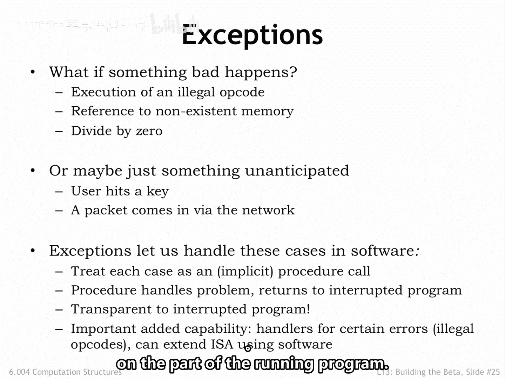
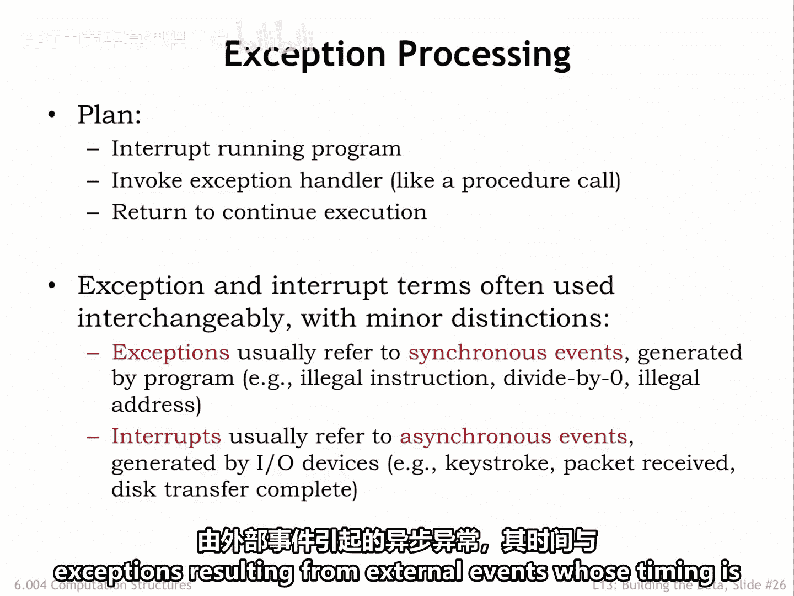
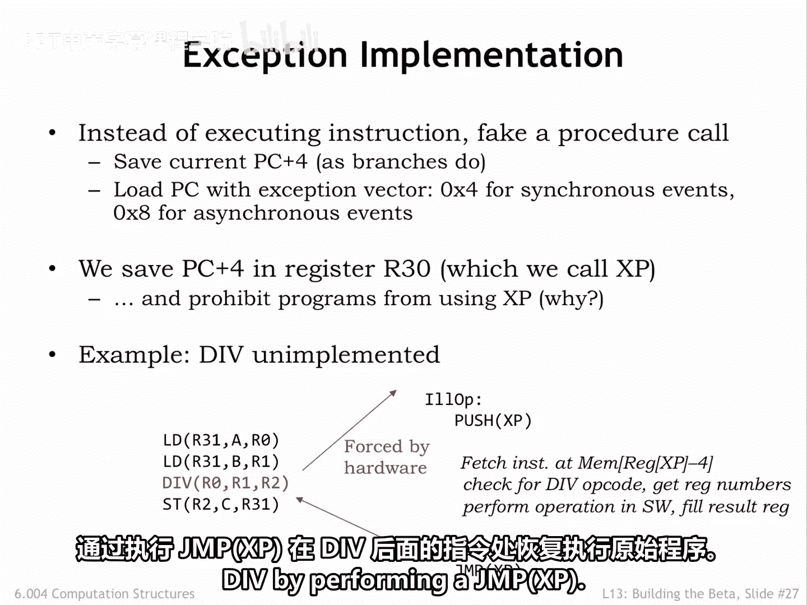
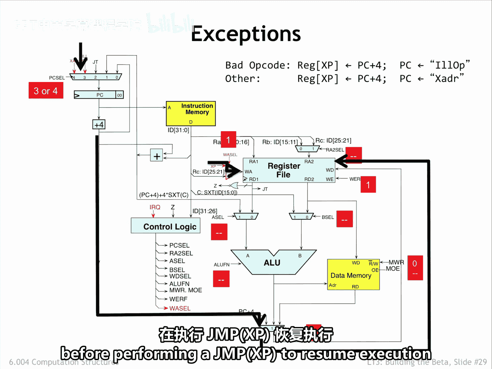

# 数字系统与计算机架构：P2：异常处理机制 🚨

在本节课中，我们将学习计算机硬件如何处理程序执行过程中出现的意外情况，即“异常”。我们将探讨异常的类型、硬件实现机制以及它们如何帮助程序与操作系统进行交互。

---

## 异常与中断概述

上一节我们介绍了指令的正常执行流程。本节中我们来看看当指令无法正常执行时，硬件应如何处理。

例如，如果编程错误导致尝试将某段数据作为指令执行，并且操作码字段不对应任何有效的Beta指令，就会发生所谓的“非法操作”（ILO）。或者，访问的地址可能超出了实际主内存的大小。又或者，某个操作数的值不可接受，例如除法指令的除数B为0。

在现代计算机中，普遍接受的策略是停止当前运行程序的执行，并将控制权转移给特定的错误处理代码。错误处理程序可能会将程序状态保存到磁盘以供后续调试。对于未实现但合法的操作码，它也可能通过软件模拟缺失的指令，然后恢复执行，就像该指令已在硬件中实现一样。

此外，还需要处理与输入/输出相关的外部事件。在这种情况下，我们希望中断当前程序的执行，运行一些代码来处理外部事件，然后恢复执行，就像中断从未发生过一样。

为了处理这些情况，我们将添加硬件，将异常视为对特殊处理代码的“伪造”过程调用。这样安排可以保存被中断程序的PC+4值，以便处理程序在需要时能够恢复执行。

这是一个非常强大的功能，因为它允许我们将控制权转移给软件，以处理我们有限的硬件能力之外的几乎所有情况。正如我们将在课程第三部分看到的，异常硬件将是我们连接运行中的程序与操作系统的关键，并允许操作系统处理外部事件，而运行中的程序对此毫无察觉。

---

## 同步异常与异步中断

我们的计划是中断正在运行的程序，其行为就像当前指令实际上是对处理程序代码的一次过程调用。当处理程序执行完毕时，如果合适，它可以使用正常的过程返回序列来恢复用户程序的执行。

我们将使用术语 **异常** 来指代由执行当前程序引起的异常。这类异常是**同步**的，因为它们是由执行特定指令触发的。换句话说，如果程序使用相同的数据重新运行，相同的异常会再次发生。

我们将使用术语 **中断** 来指代由外部事件引起的**异步**异常，其发生时机与当前运行的程序无关。

---

## 硬件实现方案

两种类型异常的实现方式是相同的。当检测到异常时，Beta硬件的行为将如同当前指令是一次跳转：对于同步异常跳转到地址4，对于异步中断则跳转到地址8。可以假定这些地址中的指令会跳转到相应处理程序的入口点。

我们将被中断程序的PC+4值保存到R30，这是一个专用于此目的的寄存器。我们称该寄存器为**XP（异常指针）**，以提醒我们自己它的用途。由于中断尤其可能在程序执行过程中的任何时刻发生，从而随时覆盖XP的内容，因此用户程序不能使用XP寄存器来保存值，因为这些值可能在任何时刻消失。

以下是该方案的工作原理。假设我们的硬件没有实现除法指令，因此它被视为非法操作码。异常硬件会强制进行一次到地址4的过程调用，然后跳转到此处所示的IO处理程序。除法指令的PC+4值已保存在XP寄存器中，因此处理程序可以获取非法指令，并在可能的情况下，通过软件模拟其操作。当处理程序完成后，它可以通过执行 `JMP(XP)` 来恢复原始程序在除法指令之后继续执行。

---

## 数据通路的修改

为了处理异常，我们只需要对数据通路进行一些简单的修改。

我们添加了一个由 `WA_SEL` 信号控制的多路选择器，用于为寄存器文件选择正确的写回地址。当 `WA_SEL` 为1时，写回将发生在XP寄存器，即寄存器30。当 `WA_SEL` 为0时，写回将正常进行，即写入当前指令RC字段指定的寄存器。

PC单元多路选择器的剩余两个输入被设置为异常处理程序的固定地址，在我们的例子中，4用于非法操作，8用于中断。

以下是异常发生时的控制流。被中断指令的PC+4值通过 `WD_SEL0` 路径被写入XP寄存器。同时，控制逻辑选择3或4作为 `PC_SEL` 的值，以选择将启动异常处理的适当的下一条指令。其余的控制信号被强制设置为“无关”值，因为我们不再关心完成在本周期开始时已从内存取出的指令的执行。

请注意，被中断的指令**并未被执行**。因此，如果异常处理程序希望执行被中断的指令，它必须在执行 `JMP(XP)` 以恢复被中断程序的执行之前，从XP寄存器中的值减去4。

---

## 总结

本节课中，我们一起学习了计算机架构中的异常处理机制。我们了解了同步异常（如非法操作）和异步中断（如外部I/O事件）的区别。核心实现方案是通过硬件将控制权强制转移到固定的处理程序地址（如地址4或8），并将返回地址（PC+4）保存到专用的XP寄存器（R30）中。这只需要在数据通路中添加一个多路选择器来控制写回地址，并扩展PC选择逻辑即可实现。这种机制是连接用户程序与操作系统、实现强大系统功能的基础。