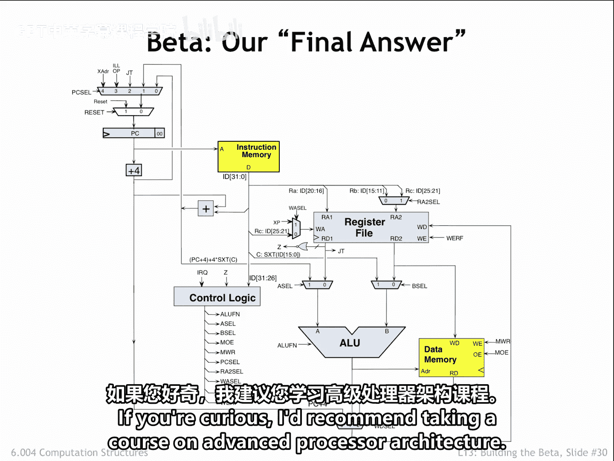
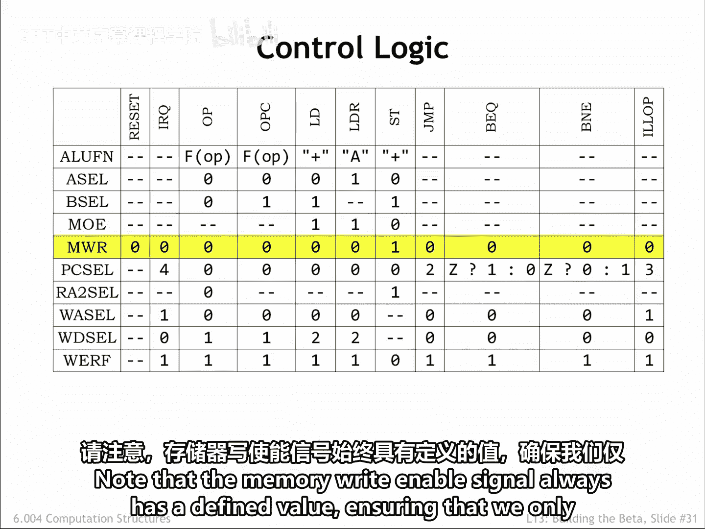
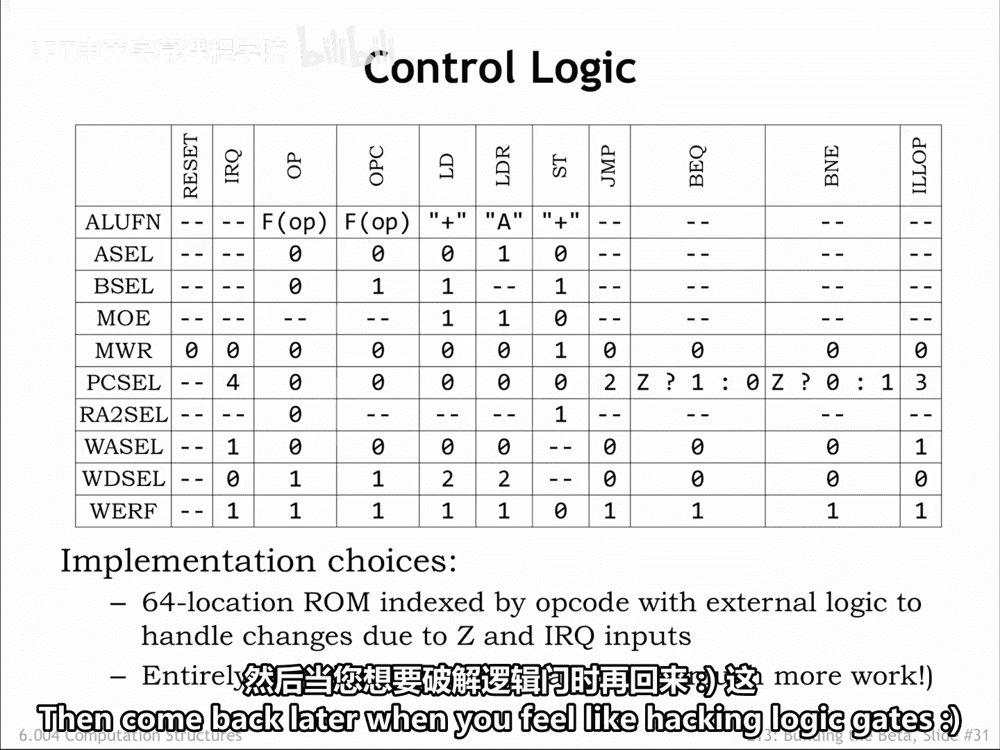

# 【数字系统与计算机架构P2 6.004 2017】麻省理工学院—中英字幕 p18 13.2.6 Summary -BV19m41127Kj_p18-

Okay， we're done。Here is the final data path for executing instructions and headley exceptions。

 Please take a moment to remind yourself of what each data path component does。 In other words。

 why it was added to the data path。Similarly， you should understand how the control signals affect the operation of the data path。

At least to my eye， this seems like a very modest amount of hardware to achieve all this functionality。

It's so modest， in fact that we'll ask you to actually complete the logic design for the beta in an upcoming lab assignment。

How does our design compare to the processor you're using to view this course online？

Modern processors have many additional complexities to increase performance， pipeline execution。

 the ability to execute more than one instruction per cycle。

F see your memory systems to reduce average memory access time， etc。

We'll cover some of these enhancements in upcoming lectures。The bottom line。

The beta hardware might occupy1 or two squaremm on a modern integrated circuit。

While a modern intel processor occupies 300 to 600 squaremmters。Clearly。

 all that extra circuitry is there for a reason。If you're curious。

 I'd recommend taking a course on advanced processor architecture。

Here we've gathered up all the control signal settings for each class of instructions。

 including the settings needed for exceptions and during reset。

Wherever possible we specify don't care for control signals whose value does not affect the actions of the data path needed for a particular instruction。

Note that the memory right enable signal always has a defined value。

 ensuring that we only write to the memory during store instructions。

Similarly， the right enable for the register file is well defined。

 except during reset when presumably we're restarting the processor and don't care about preserving any register values。

As mentioned previously， a read only memory indexed by the six bit op code field is the easiest way to generate the appropriate control signals for the current instruction。

The Z and IRQ input to the control logic will affect the control signals。

 and this can be accomplished with a small amount of logic to process the RAM outputs。

One can always have fun with carno maps to generate a minimal implementation using ordinary logic gates。

 The result will be much smaller， both in terms of size and propagation delay。

 but requires a lot more design work。My recommendation。

 start with a wrongm implementation and get everything else working。

 then come back later when you feel like hacking logic gates。

So that's what it takes to design the hardware for a simple 32ic computer。Of course。

 we made the job easy for ourselves by choosing a simple binary enco for our instructions。

 and limiting the hardware functionality to efficiently executing the most common operations。

Less common and more complex functionality can be left to software。

The exception mechanism gave us a powerful tool for transferring control to software when the hardware couldn't handle the task。

Have fun completing the hardware design of your beta。

Thousands of Mt students have been enjoyed that yes moment when their design works for the first time。

For their efforts， we reward them with the beta inside sticker you see here。

 which you can see on laptops as you walk around the instit。

Good luck。