# 【数字系统与计算机架构P2 6.004 2017】麻省理工学院—中英字幕 p20 13.2.7 Worked Examples： Beta Control Signals -BV19m41127Kj_p20-

In order to better understand the role of each of the beta control signals we will work through an example problem that provides us with a partially filled control table for five different instructions two of these instructions are existing beta instructions that we must infer from the provided control signals The other three are three new instructions that we are adding to our beta by modifying the necessary control signals to produce the desired behavior of each of the operations。

 the first instruction that we want to add to our beta is an LDX instruction which is a load that is double indexed what this means is that in order to produce the effective address of the load。

 instead of adding the contents of a register to a constant as is done in the load instructions。

 we add the contents of two different registers。

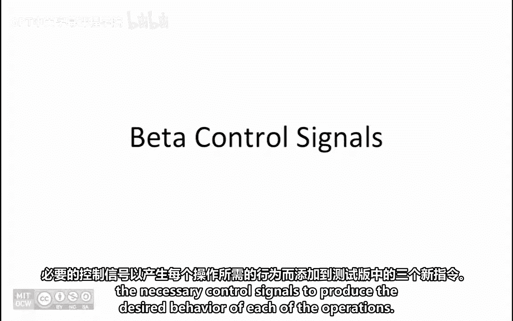

So the address for this load operation is the result of adding together the contents of registers R and RB。

 the contents of the memory location pointed to by this effective address are loaded into register RC。

Finally， the PC is incremented by4 to point to the next instruction。

The second instruction that we want to add to our beta is a moveve ZC instruction。

 which is a moveve constant if zero instruction， the way this instruction works is that if the contents of register RA equals zero。

 then the sign extended version of the literal constant will be loaded into register RC。

This is followed by incrementing the PC to point to the next instruction。

The third instruction that we want to add to our beta is a STR instruction which is a store relative instruction for this instruction。

 the effective address is computed by sign extending the constant C。

 multiplying it by4 and adding it to PC+4。The contents of Reg RC are then stored at the memory location pointed to by the effective address that was just computed。

As a final step， the PC is incremented by4 to point to the next instruction。

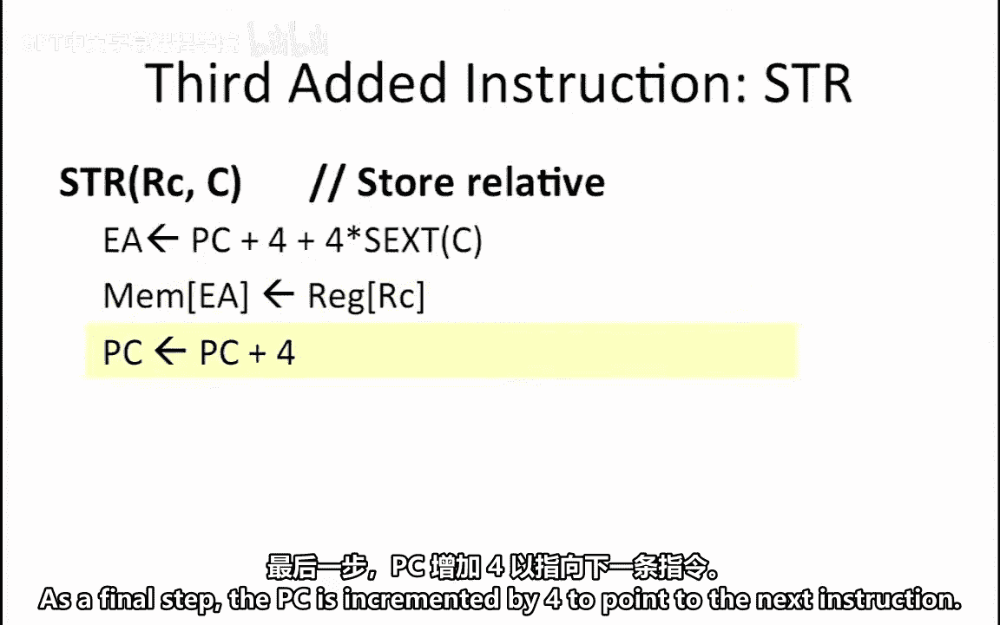

We are given the partially filled control roms shown here。

 it is our job to fill in all the yellow boxes labeled with a question mark。

Let's begin by looking at the top row of this table。

 the value that stands out as a bit different in this row is the PC cell value which is equal to 2 for most instructions PC cell equals zero for branch instructions it equals 1 and for jump instructions it equals 2 this means that the instruction described in this row must be a jump instructions。

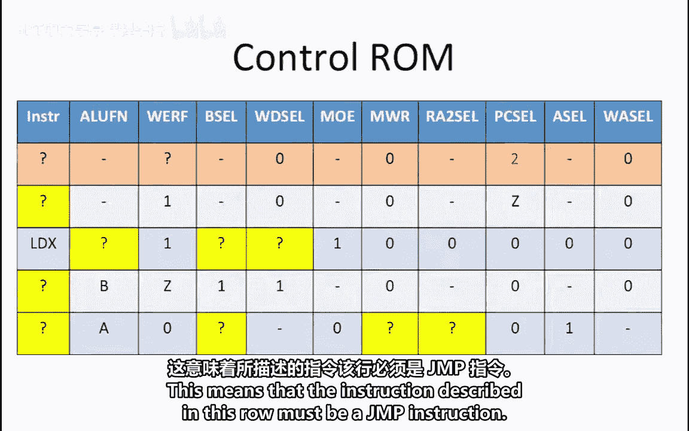

Zooming in on the PC cell control logic from the beta diagram。

 we see that normally PC cell equals zero to go to the next instruction。

PC cell equals1 in order to perform a branch operation and PC cell equals 2 in order to perform a jump operation where the target of the jump is specified by JT or the jump target。

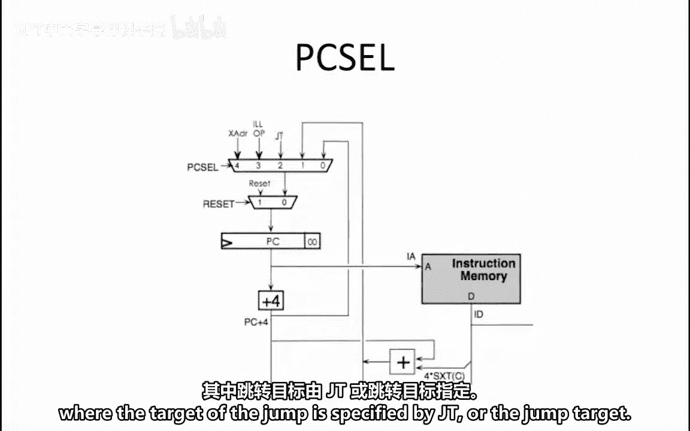

This means that the instruction described in this row must be a jump instruction。

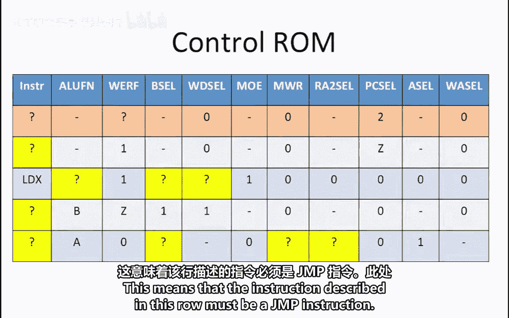

The behavior of a jump instruction is shown here。The effective address is calculated by taking the contents of RA and clearing the bottom two bits so that the value becomes word aligned。

The address of the next instruction， which is PC+4 is stored in Reg RC in case we need to return to the next instruction in the program。

The PC is then updated with a new effective address in order to actually continue execution at the destination of the jump instruction。

This data flow diagram highlights the required data flow through the beta in order to properly implement the jump instruction。

Note that no redd lines pass through the ALU or memory because the ALU and memory are not used for this instruction。

The control signals that must be set in order to follow this path in the beta are as follows。

WD cell or right data select must be set to0 in order to pass the value of PC+ 4 through the WD cell muX。

WorF or Wite Enable register file must be set to one in order to enable writingrit to the register file。

WA cell or right address select must be set to0 in order to write to the RC register and not to the XP register。

A cell， B cell and ALUFN are all DO cares for the jump instruction In addition， MOE。

 which stands for memoryory output EnL is also a don't care because this instruction does not use the memory data。

The one control signal related to the memory that we do need to worry about is the MWR or memorymory right read signal。

 which must be set to zero so that no value will be written to memory。

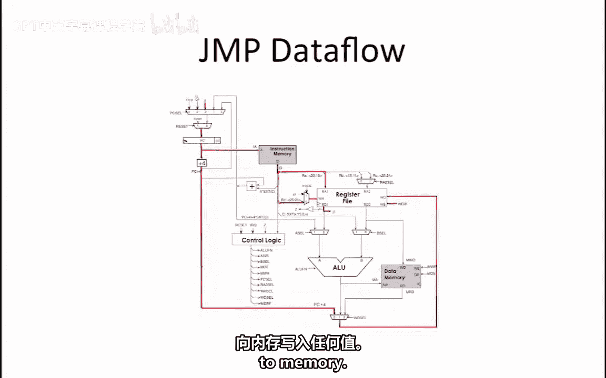

Going back to our control rom and filling in the value of Wf。

 we see that the control signals for the jump instruction correspond to the data flow diagram of the beta that we just looked at。

😊。

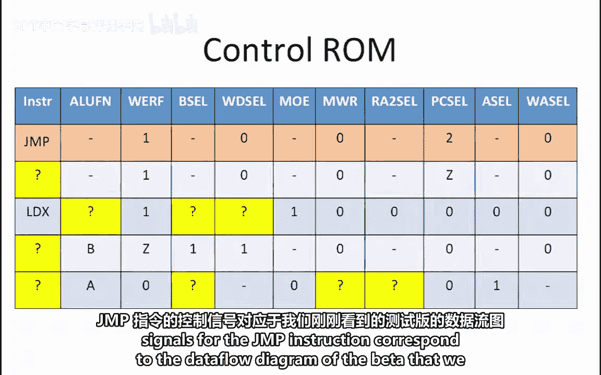

Moving on to row2 of our control rom， we see that now we have PC cell equal to z in this row。

This suggests that the instruction corresponding to this row is some kind of a branch instruction。

Of our two branch instructions， the one that branches when z equals 1 is BEQ this means that this row corresponds to a BQ operation。

The rest of the control signals for the BQ operation look just like the ones for the jump because here too。

 the ALU and memory are not used， so the only ALU and memory related signal that must be set is MWR so we don't write to memory。

Furthermore， like the Ju instruction， the branch instructions also store the return address in Reg RC。

 so the behavior of the control signals related to the register file are all the same。

We now take a look at the third row of the control room。In this row。

 we are actually told that the corresponding instruction is the newly added LDX instruction。

So it is our job to determine how to set the missing control signals in order to get the desired behavior for this operation。

😊。

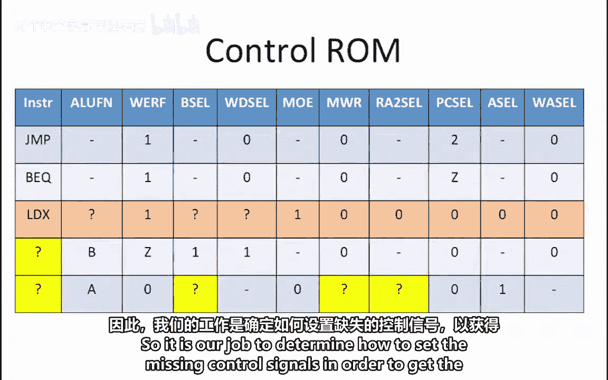

Recall that the expected behavior of this instruction is that the contents of Reg RA and RB will be added together in order to produce the effective address of the load；

 this means that we need to perform an add as our ALUFN we also need A cell and B cell equal to0 in order to pass the values of register's RA and RB to the ALU。

The complete data flow through the register file， ALU and memory is shown here in order to read Register RB rather than RC。

 RA2 cell must be set to zero。As we just mentioned。

 A cell and B cell are set to zero and ALUFN is set to add。

The result of adding registers RA and RB is used as the address of the load。

 this is called MA or memory address in the beta diagram。In order to enable reading from memory。

 we set MW R to 0 and M O E to1。 This sets the readrite functionality to read and enables an output to be read from the read port of the memory On the beta diagram。

 the read data is labeled MD or memory read data。 The data that is read from memory is then passed along to the register file by setting W D cell equal to 2。

In order to write this result to register RC， Wf equals 1 and WAL equals 0。

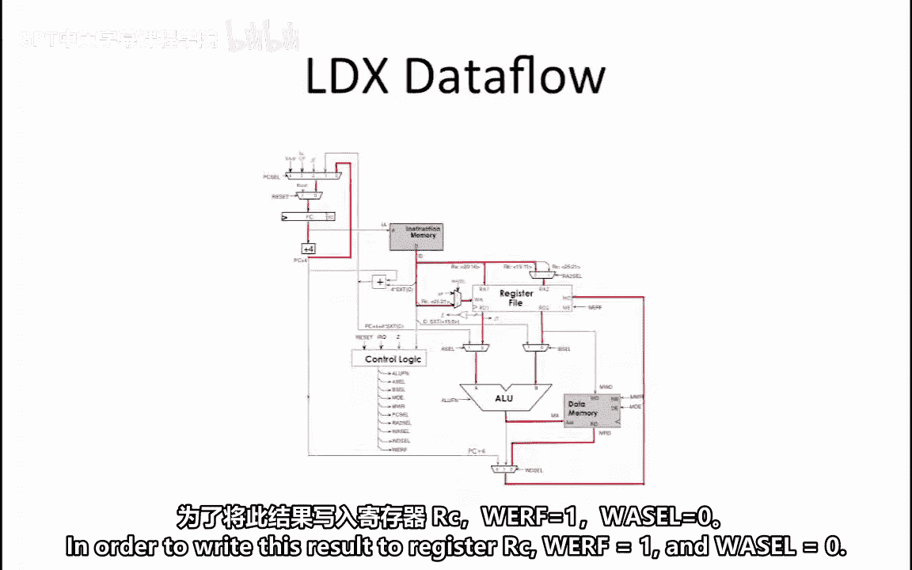

So the completed control realm for the LDX operation is shown here。

We now move on to the fourth instruction here We see that A L UFN just passes opera and B through the register file。

 We also see that Wf is dependent on the value of Z。

This means that the instruction that corresponds to this row is move Z C。

 which moves a constant into register R C if the contents of register R equals 0。

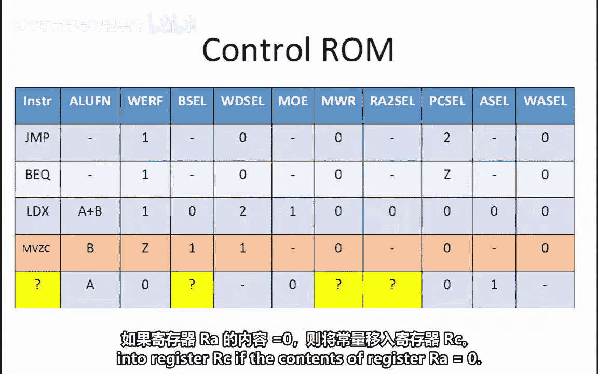

The way this instruction works is that B cell equals1 in order to pass the constant through as the B opera。

 and ALUFN equals B to pass that constant through the ALU。

WD cell equals 1 so that the output of the ALU is fed back as the right value for the register file。

Because W D cell equals 1 and not2， we know that the data coming out of the memory will be ignored。

 so MOE can be a don't care。 Of course， MWR still must be set to0 in order to ensure that we don't write any random values into our memory。

R2 cell is also a don't care because we don't care whether register RB or register RC are passed through as the second read argument of the register file RD2 The reason we don't care is because the B cell equal to 1 will ignore the RD2 value and pass through the constant that comes directly from the instruction after sign extending it。

AL is also a don't care because the ALU will ignore the A input when ALUFN equals B。

WA cell must be0 so that the result of the operation is written into register RC。Finally。

 PC cell equals0 to load PC+ 4 into the PC register so that the next instruction will get fetched after this one。

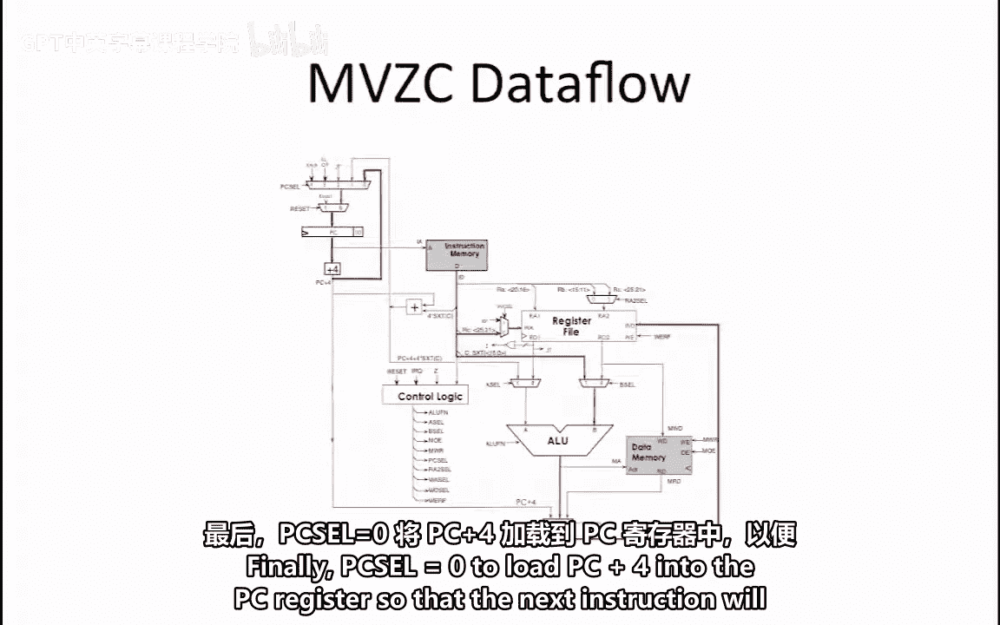

We are now in the last row of our control real。 We know that this row must correspond to our third added instruction。

 which is SDR or store relative。

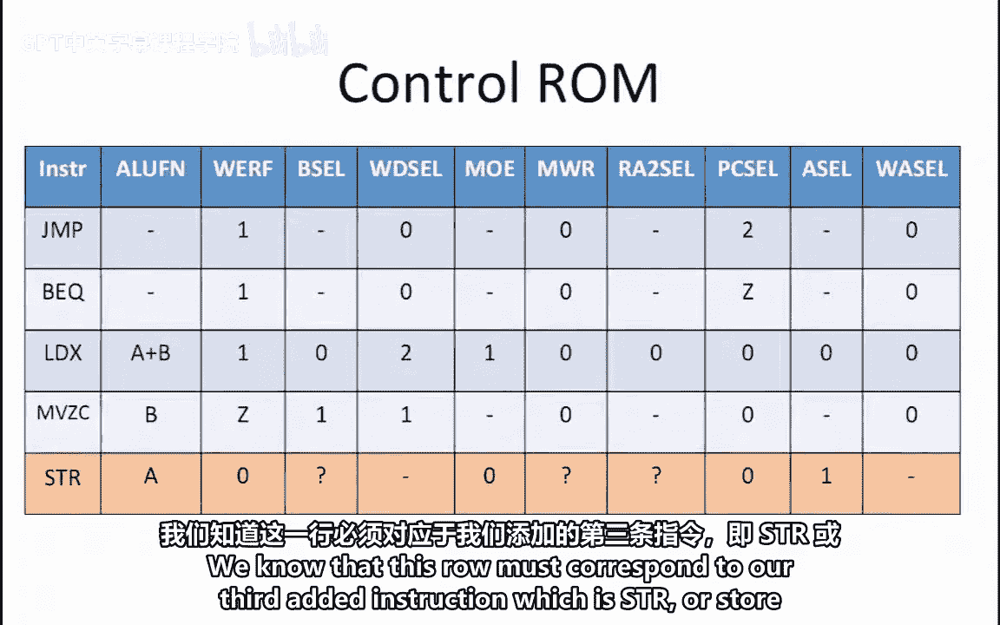

Recall that this instruction writes the contents of register R C into memory at the address that is computed by the effective address line。

 The effective address for this instruction is PC plus 4 plus 4 times the sign extended constant。

The extra adder just under the instruction memory is used to calculate PC+ 4 plus 4 times the sign extended constant。

This value is then fed to the ALU via the A operaand by setting a cell equal to 1。

Setting ALUFN equal to A passes this value as the output of the ALU in order to be used as the memory address。

😊，This is the address that the store will write to in memory。

The value that will be written to this address in memory is the contents of register RC。

Register RRC is fed through the Reg file by setting RA2 cell equal to 1。

This makes RD2 have the contents of Reg RC。This value then becomes the MWD or memoryory right data。

 which is the data that will be stored in the memory address that was produced by the ALU。

In order to enable writing to the memory， MWR must be set to one。Since Wf equals0。

 nothing can be written to the register file； this means that the value of MA cell and MD cell are don't cares since the register file won't be affected regardless of their values。

Finally， the PC is incremented by4 to fetch the next instruction。

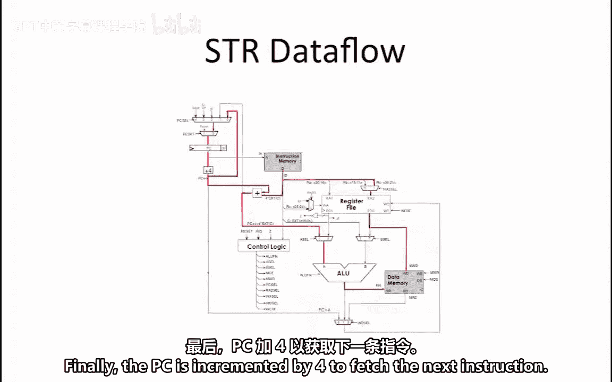

So our completed control Ro for the SDR operation is shown here。

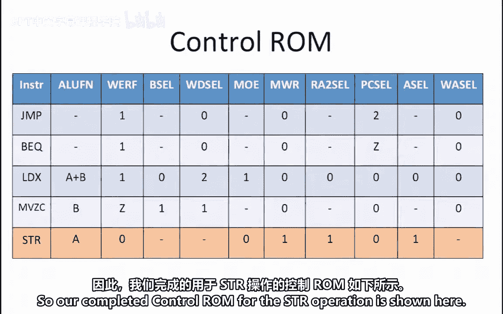