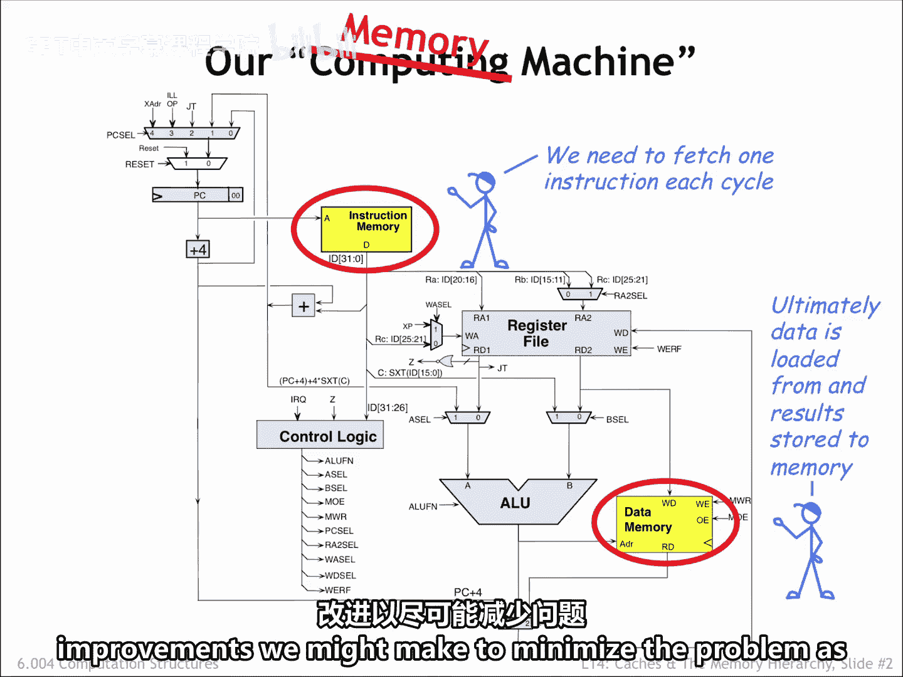
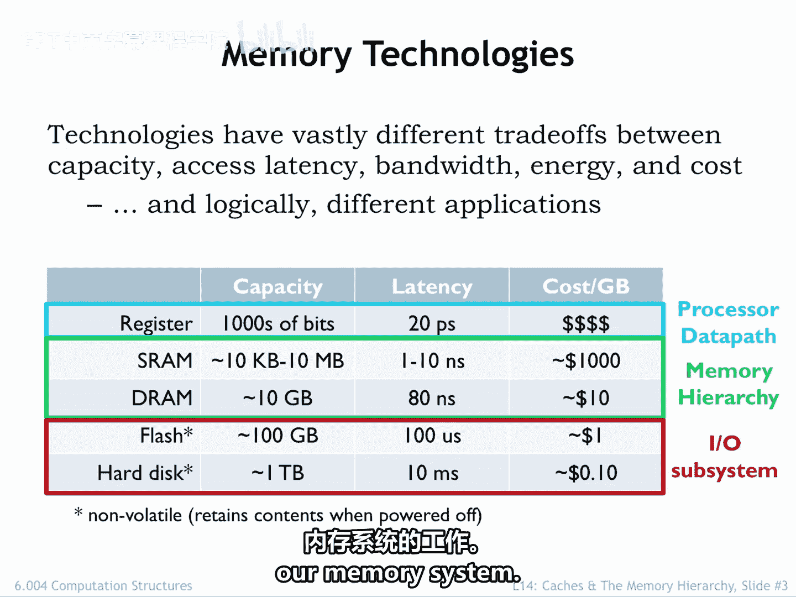

# 【数字系统与计算机架构P2 6.004 2017】麻省理工学院—中英字幕 p21 14.2.1 Memory Technologies -BV19m41127Kj_p21-

In the last lecture， we completed the design of the beta， our reduced instruction set computer。

The simple organization of the Beta ISA meant that there was a lot of commonality in the circuitry needed to implement the instructions。

The final design has a few main building blocks with mu steering logic to select input values as appropriate。

If we were to count mossfes and think about propagation delays。

 we'd quickly determine that our three port main memory， shown here as the two yellow components。

 was the most costly component， both in terms of space and percentage of the cycle time required by the memory accesses。

So in many ways， we really have a memory machine instead of a computing machine。

The execution of every instruction starts by fetching the instruction from main memory。

And ultimately， all the data processed by the CPU is loaded from or stored to main memory。

A very few frequently used variable values can be kept in the CPU's Reg file。

But most interesting programs manipulate much more data than can be accommodated by the storage available as part of the CPU data path。

In fact， their performance of most modern computers is limited by the bandwidth。 In other words。

 bytes per second of the connection between the CPU and main memory， the so called memory bottleneck。

The goal of this lecture is to understand the nature of the bottleneck and to see if there are architectural improvements we might make to minimize the problem as much as possible。

We have a number of memory technologies at our disposal， varying widely in their capacity， latency。

 bandwidth， energy efficiency， and their cost。Not surprisingly。

 we find that each is useful for different applications in our overall system architecture。

Our registers are built from sequential logic and provide very low latency access of 20 picoseds or so。

 to at most a few thousands of bits of data。Static and dynamic memories。

 which we'll discuss further in the coming slides， offer large capacities at the cost of longer access latencies。

Static random access MeRAs are designed to provide low latencies a few nanoseconds of most to many thousands of locations。

Already， we see that more locations means longer access latencies。

 This is a fundamental size versus performance trade off of our current memory architectures。

The trade off comes about because increasing the number of bits will increase the area needed for the memory circuitry。

 which will in turn lead to longer signal lines and slower circuit performance due to increased capacitive loads。

Dynamic random access memories， DRAs， are optimized for capacity and low cost。

 sacrificing excess latency。As we'll see in this lecture。

 we'll use both S Rams and D Rams to build a hybrid memory hierarchy that provides low average latency and high capacity。

 an attempt to get the best of both worlds。Notice that the word average has snuck into the performance claims。

This means that we'll be relying on statistical properties of memory accesses to achieve our goals of low latency and high capacity。

In the worst case， we'll still be stuck with the capacity limitations of S Rams and the long latencies of D Rams。

 but will work hard to ensure that the worst case occurs infrequently。

Flash memory and hard disk drives provide non volatile storage。

Nonval means that the memory contents are preserved even when the power is turned off。

Harard disks are at the bottom of the memory hierarchy。

 providing massive amounts of long term storage for very little cost。

Flash memories with 100 fold improvement in access latency are often used in concert with hard disk drives in the same way that S Rams are used in concert with D Rams。

 in other words， to provide a hybrid system for non volatile storage that has improved latency and high capacity。

Let's learn a bit more about each of these four memory technologies。

 then we'll return to the job of building our memory system。

