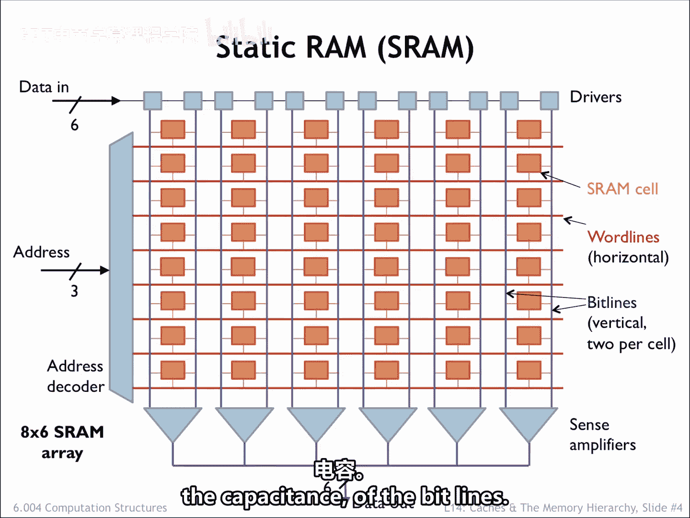
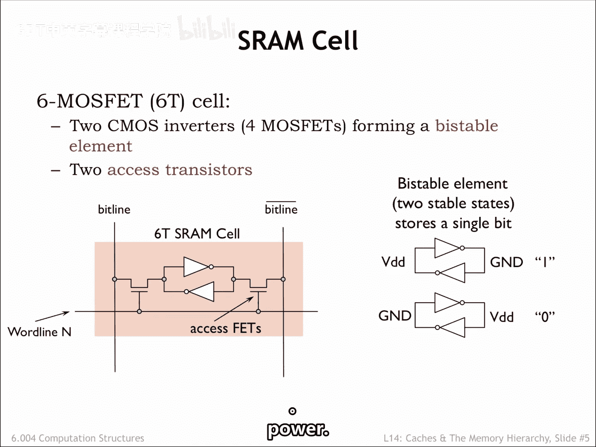
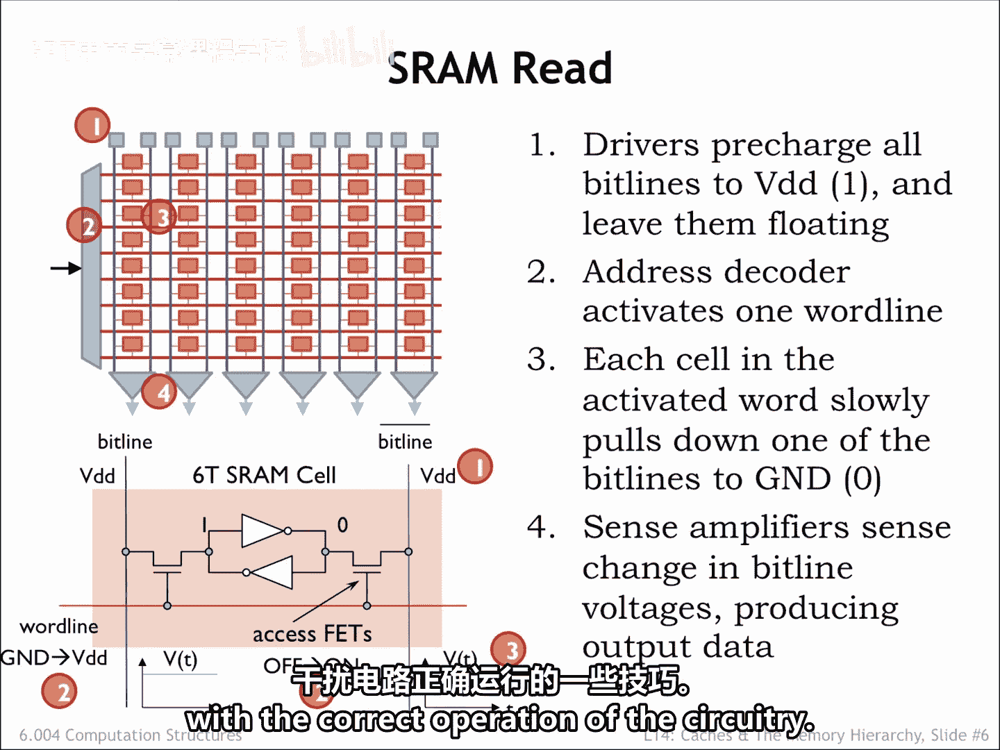
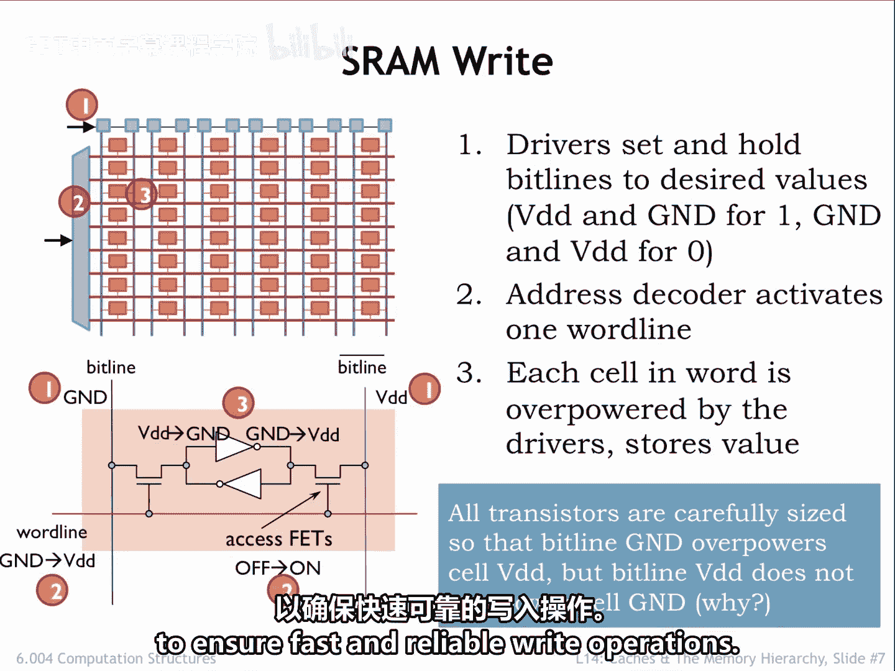
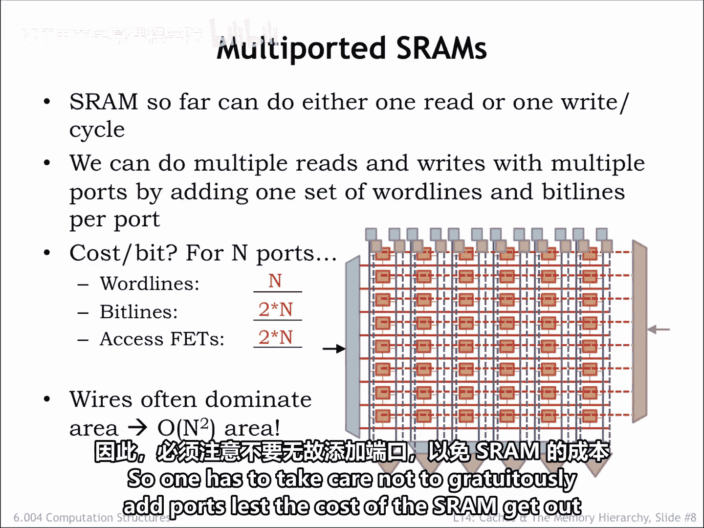

# 数字系统与计算机架构：P2：SRAM 详解 🧠

在本节课中，我们将学习静态随机存取存储器（SRAM）的内部结构与工作原理。SRAM是计算机中用于高速缓存和寄存器文件的关键组件。我们将从SRAM的整体阵列组织开始，深入到其核心存储单元——位元胞的电路设计，并详细解释其读写操作过程。最后，我们会探讨如何为SRAM增加读写端口以及其设计上的权衡。

## SRAM 的组织结构 🏗️

SRAM被组织成一个内存位置的阵列。一次内存访问要么读取，要么写入单个位置中的所有比特位。

下图展示了一个包含8个位置、每个位置存储6比特数据的SRAM阵列的组件布局。可以看到，单个位元胞被组织成8行（每行对应一个存储位置）和6列（每列对应存储字中的一个比特）。阵列外围的电路用于地址解码和支持读写操作。

为了访问SRAM，我们需要提供足够的地址位来唯一指定一个位置。在这个例子中，需要3条地址线来选择8个内存位置中的一个。地址解码器逻辑会将8条字线（阵列中的水平线）中的一条置为高电平，以启用特定行位置进行即将到来的访问。其余的字线则被置为低电平，禁用它们控制的元胞。

被激活的字线会启用选中行上的每一个SRAM位元胞，将每个元胞连接到一对位线（阵列中的垂直线）。在读取操作期间，位线将来自启用元胞的模拟信号传送到感测放大器，感测放大器将这些模拟信号转换为数字数据。在写入操作期间，输入的数据被驱动到位线上，以便存储到启用的位元胞中。

更大的SRAM阵列会采用更复杂的组织结构，以最小化位线的长度，从而降低其电容。

## 核心存储单元：位元胞 ⚡

SRAM的核心是位元胞。一个典型的元胞包含两个CMOS反相器，它们以正反馈回路连接，形成一个双稳态存储元件。

下图展示了两种稳定的配置。在上方的配置中，元胞存储的是比特“1”。在下方的配置中，存储的是比特“0”。只要保持供电，反相器的抗噪声能力就能确保逻辑值得以维持，即使任一反相器的输入端存在电气噪声。

反馈回路的两端通过存取晶体管连接到两条垂直的位线上。当连接到存取晶体管栅极的字线为高电平时，晶体管导通，即在元胞的内部电路和位线之间建立电气连接。当字线为低电平时，存取晶体管关闭，双稳态反馈回路与位线隔离，只要供电，它就能稳定地保持存储的值。

## 读取操作详解 📖

在读取操作期间，驱动器首先将所有位线预充电至VDD（即逻辑“1”值），然后断开连接，让位线保持在“1”的浮动状态。

接着，地址解码器将其中一条字线置为高电平，将一行元胞连接到各自的位线。选中行中的每个元胞随后会将其两条位线中的一条拉至地（GND）。在这个例子中，是右边的位线被拉低。

由于位线具有很大的总电容，而两个反相器中的MOSFET尺寸很小（以尽可能缩小元胞面积），因此位线上的电压变化很慢。大电容部分来自位线的长度，部分来自同一列中其他元胞的存取晶体管的扩散电容。

SRAM不会等待位线达到有效的逻辑电平，而是使用感测放大器来快速检测两条位线之间产生的微小电压差，并生成相应的数字输出。由于检测电压的微小变化对电气噪声非常敏感，SRAM为每个比特使用一对位线和一个差分感测放大器，以提供更强的抗噪声能力。

可以看到，设计低延迟的SRAM需要大量关于MOSFET模拟行为的专业知识，并需要一些巧思来确保电气噪声不会干扰电路的正确运行。

## 写入操作详解 ✍️

写入操作首先将位线驱动到适当的值。在所示的例子中，我们想向元胞写入一个比特“0”。因此，左位线被设置为地（GND），右位线被设置为VDD。和之前一样，地址解码器随后将一条字线置为高电平，选中特定行的所有元胞进行写入操作。

驱动器的MOSFET比元胞内反相器的MOSFET大得多。因此，启用元胞的内部信号被强制为位线上的值，双稳态电路翻转到新的稳定配置。这本质上是将驱动器的输出和内部反相器的输出“短路”在一起，所以这是另一个模拟操作。

由于NMOS晶体管通常比相同宽度的PMOS晶体管能承载更高的源漏电流，并且考虑到NMOS存取晶体管的阈值压降，写入工作几乎全部由连接到零值位线的大型NMOS下拉晶体管完成，它能轻松压倒元胞内反相器的小型PMOS上拉晶体管。同样，SRAM设计师需要大量专业知识来正确平衡MOSFET的尺寸，以确保快速可靠的写入操作。

## 多端口SRAM设计 🔄

为SRAM增加多个读写端口并不困难，这对于寄存器文件电路是一个方便的补充。我们可以通过增加额外的字线组、位线组、驱动器和感测放大器来实现。这将为我们提供多条路径，以独立访问内存阵列中不同行的双稳态存储元件。

对于一个具有N个端口的SRAM，每个比特将需要N条字线、2N条位线和2N个存取晶体管。额外的字线会增加元胞的有效高度，额外的位线会增加元胞的有效宽度，因此所有这些导线所需的面积会迅速主导SRAM的尺寸。

由于在增加端口时，元胞的高度和宽度都会增加，因此总面积随读写端口数量的平方而增长。所以必须注意不要随意增加端口，以免SRAM的成本失控。

## 总结 📝

本节课中，我们一起学习了SRAM的详细工作原理。

我们了解到，SRAM的电路被组织成一个位元胞阵列，每个内存位置对应一行，每个位置的每个比特对应一列。每个比特由两个连接成双稳态存储元件的反相器存储。读写本质上是通过位线和存取晶体管执行的模拟操作。

SRAM为每个位元胞使用六个MOS晶体管。我们能否做得更好？存储单比特信息所需的最少MOS晶体管数量是多少？这将是后续课程可能探讨的有趣问题。

通过本课的学习，你应该对SRAM的内部结构、读写机制以及设计上的考量有了清晰的认识。