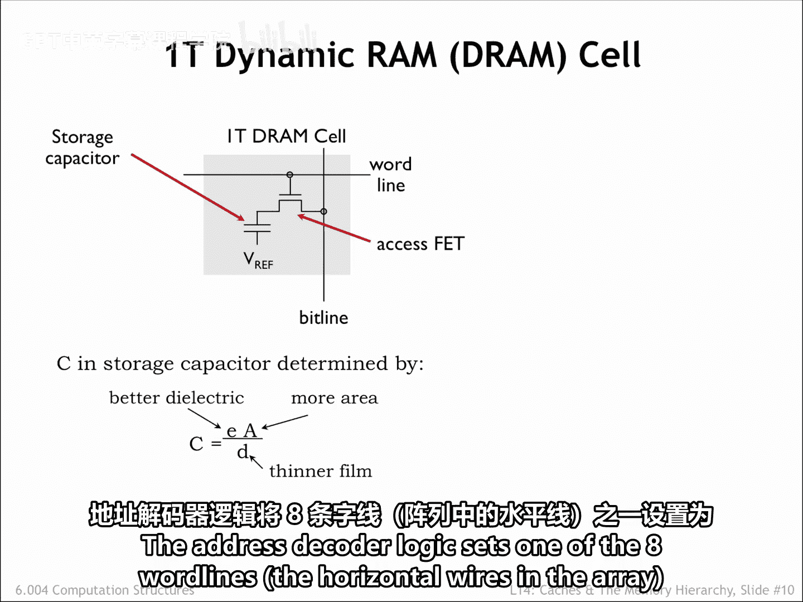
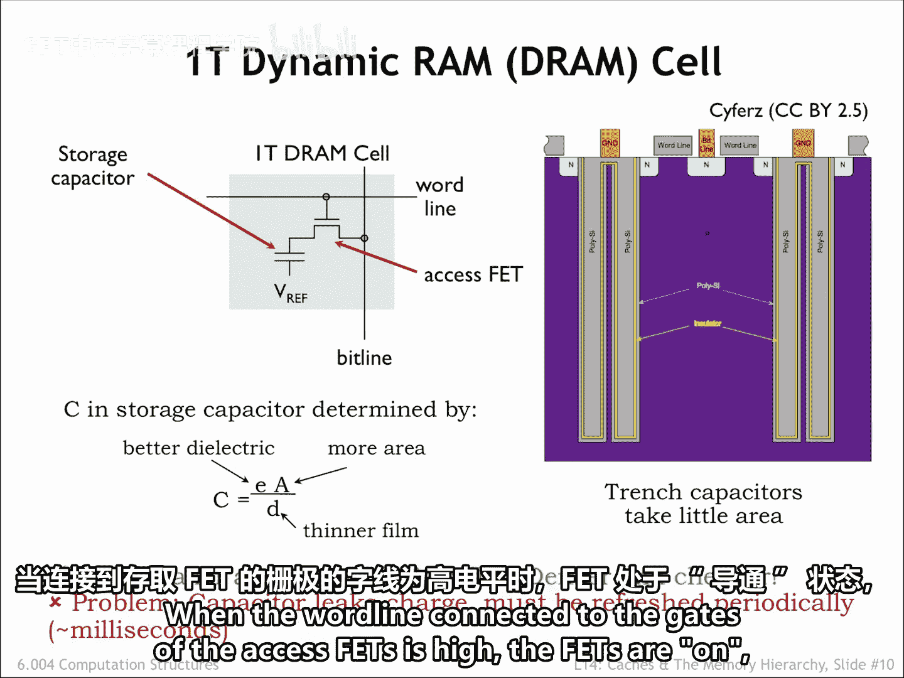
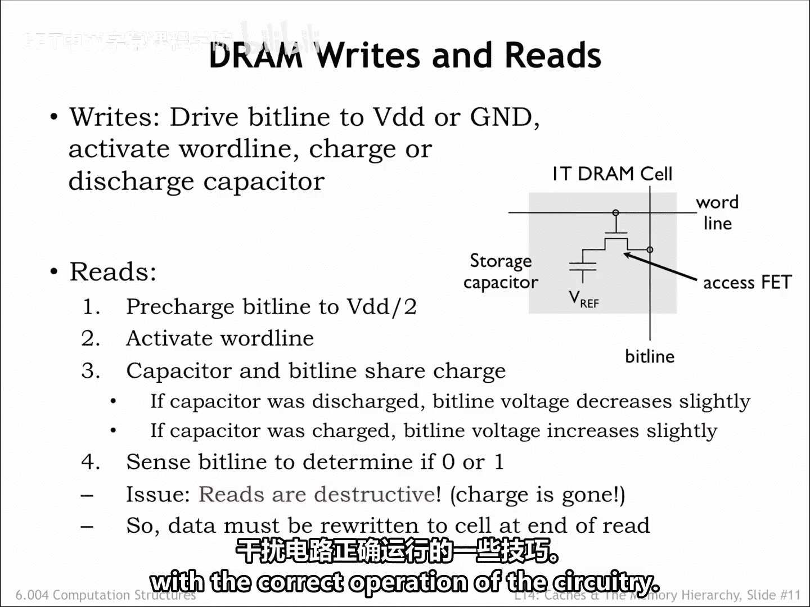
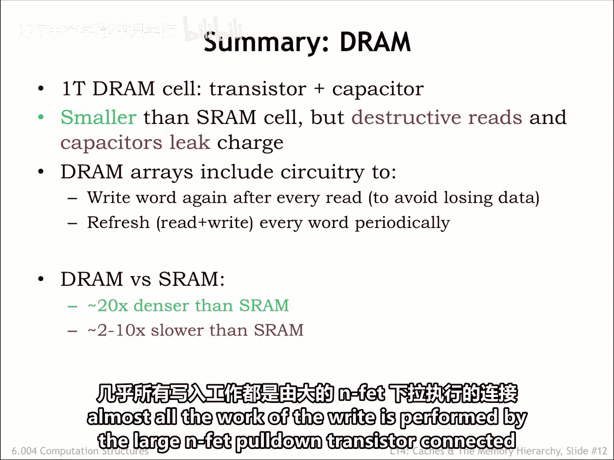

# 数字系统与计算机架构：P2：6.4.2.3 DRAM

在本节课中，我们将学习动态随机存取存储器（DRAM）的基本原理、内部结构、读写操作及其与SRAM的对比。

## 概述

上一节我们介绍了SRAM，本节中我们来看看另一种主流的随机存取存储器——DRAM。DRAM以其高存储密度和低成本而闻名，是现代计算机主存的核心技术。我们将从它的基本存储单元开始，逐步了解其工作原理和面临的挑战。

## DRAM存储单元

我们需要至少一个MOSFET作为访问晶体管，以便选择哪些位会受到读写操作的影响。

我们可以使用一个简单的电容器进行存储，其中存储位的值由电容器极板间的电压表示。

由此产生的电路被称为动态随机存取存储器，或DRAM单元。

如果电容器电压超过某个阈值，我们存储的是1。否则，我们存储的是0。

电容器的电荷量决定了读取存储值的速度和可靠性，它与电容量成正比。

我们可以通过以下方式增加电容量：增加电容器两极板间绝缘层的介电常数、增加极板面积，或减小极板间的距离。所有这些技术都在不断改进。

上图展示了一个现代DRAM单元的横截面。电容器在一个深沟槽中形成，这个沟槽被蚀刻在集成电路的衬底材料中。增加沟槽深度可以在不增加单元面积的情况下增加电容器极板的面积。

字线构成了N型场效应晶体管（NFET）访问晶体管的栅极，它将电容器的外极板连接到位线。一层非常薄的绝缘层将外极板与内极板隔开，内极板连接到某个参考电压（图中显示为地线）。

你可以搜索“沟槽电容器”以获取有关电容器构造中使用的尺寸和材料的最新信息。

由此产生的电路非常紧凑，每个比特的面积比SRAM比特单元小约20倍。

## DRAM的挑战

然而，DRAM也面临一些挑战。没有电路来维持电容器的静态电荷，因此存储的电荷会从电容器的外极板泄漏，故而得名“动态”存储器。

泄漏是由通过PN结流向周围衬底的微小皮安级电流，或访问晶体管即使关闭时也可能存在的亚阈值导通引起的。这限制了我们能让电容器无人照看但仍能读取存储值的时间。

这意味着我们必须安排读取然后重写每个比特单元（称为刷新周期），大约每10毫秒一次，这增加了DRAM接口电路的复杂性。

## DRAM读写操作

DRAM的写操作很直接：只需用字线打开访问晶体管，然后通过位线对存储电容器进行充电或放电。

读操作则稍微复杂一些。以下是读操作的步骤：

1.  首先，位线被预充电到某个中间电压，例如VDD/2，然后预充电电路被断开。
2.  激活字线，将所选单元的存储电容器连接到位线，导致电容器的电荷与位线电容存储的电荷共享。
3.  如果单元电容器中存储的值是1，位线电压会略微增加（例如，几十毫伏）。如果存储的值是0，位线电压会略微下降。
4.  灵敏放大器用于检测这种微小的电压变化，以产生数字输出值。

这意味着读操作会擦除比特单元中存储的信息，因此在读操作结束时，必须用检测到的值重写该单元。

## DRAM的组织结构

DRAM电路通常组织成宽行的形式。换句话说，一次访问可以读取多个连续的位置。

这个特定的位置块由DRAM行地址选择。然后，DRAM列地址用于从该块中选择要返回的特定位置。

如果我们想读取同一行中的多个位置，那么我们只需要发送一个新的列地址，DRAM就会返回该位置的数据，而无需再次访问比特单元。

对一行的首次访问具有较长的延迟，但对同一行的后续访问延迟非常低。正如我们将看到的，我们将能够利用快速的列访问来获得优势。

## 总结

本节课中我们一起学习了DRAM的核心知识。

总结来说，DRAM比特单元由一个访问晶体管连接到一个存储电容器组成，该电容器经过巧妙构造以占用尽可能小的面积。

DRAM在读取后必须重写比特单元的内容，并且每个单元必须定期读取和写入，以确保存储的电荷在泄漏电流破坏之前得到刷新。

由于DRAM比特单元尺寸小，DRAM的容量比SRAM大得多，但DRAM接口电路的复杂性意味着对一行位置的初始访问比SRAM访问慢得多。然而，对同一行的后续访问速度接近SRAM访问速度。

只要电路有电，SRAM和DRAM都会存储数值。但如果电路断电，存储的比特就会丢失。对于长期存储，我们需要使用非易失性存储技术，这将是下一讲的主题。

