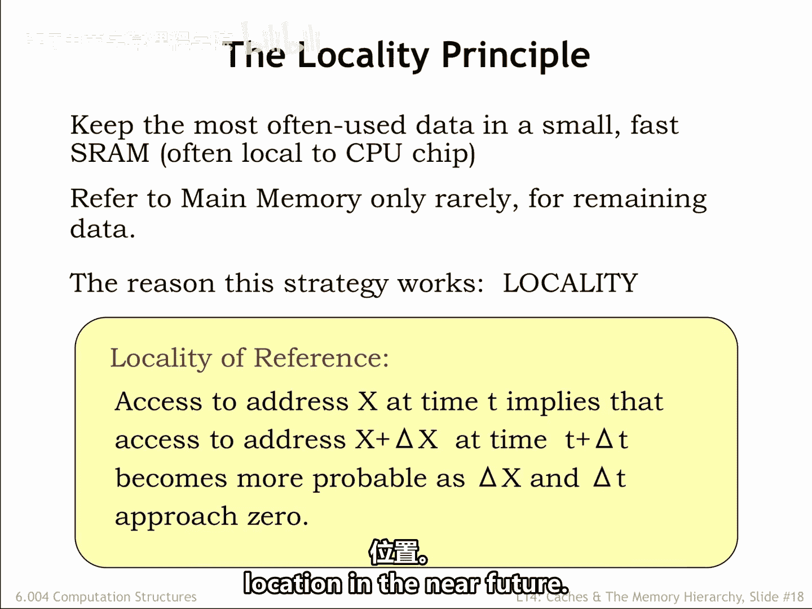
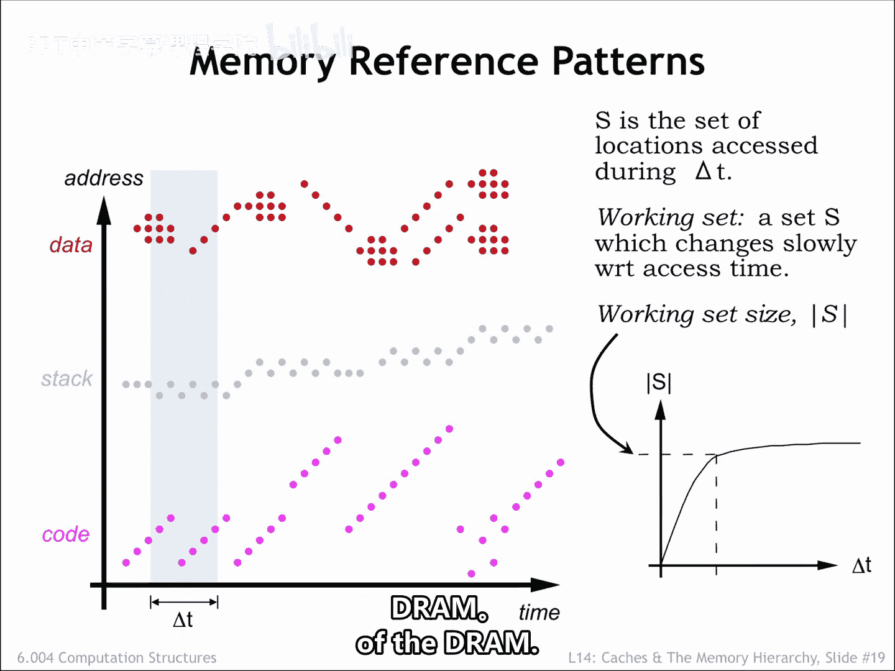
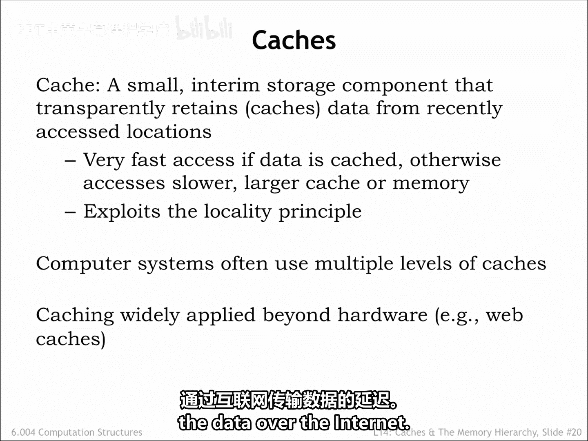
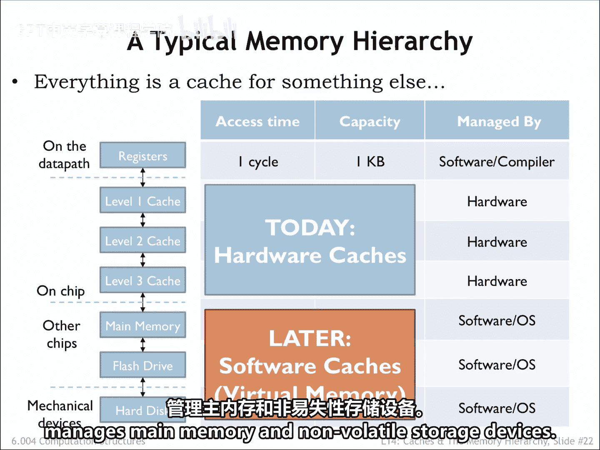
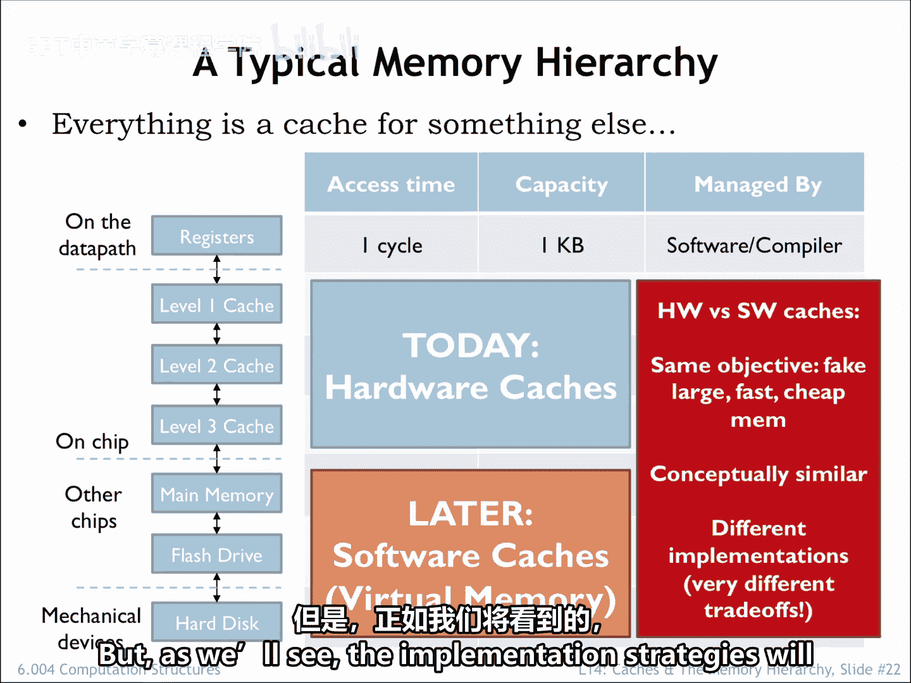

# 数字系统与计算机架构：P2：6.4.2.5 局部性原理 🧠

在本节课中，我们将要学习计算机内存系统如何利用**局部性原理**来高效地组织数据，从而在有限的快速存储资源中，让程序在正确的时间访问到正确的数据。我们将探讨程序访问内存的模式，并理解**缓存**如何作为内存层次结构的关键部分来提升系统性能。

## 内存系统的目标 🎯

上一节我们介绍了内存速度与容量之间的矛盾。本节中我们来看看内存系统如何安排，才能在正确的时间将正确的数据放在正确的位置。

我们的目标是将频繁使用的数据存放在快速的SRAM中。这意味着内存系统必须能够预测哪些内存位置将被访问，并且管理数据移入和移出SRAM的开销必须可控。我们希望将数据移动的成本分摊到多次访问中。换句话说，我们希望移入SRAM的任何数据块都能被多次访问。当数据不在SRAM中时，它们会存放在更大、更慢的DRAM中，作为主内存。如果系统按计划工作，DRAM的访问将很少发生，例如，仅在需要将另一个数据块移入SRAM时。

## 程序访问内存的模式 📊

如果我们观察程序如何访问内存，会发现我们可以准确预测哪些内存位置将被访问。指导原则是**访问的局部性**，它告诉我们：如果在时间T访问了地址X，那么程序在不久的将来很可能会访问附近的位置。

为了理解程序为何表现出访问局部性，让我们看看一个运行中的程序如何访问内存。

### 指令获取的局部性

指令获取是相当可预测的。执行通常是顺序进行的，因为大多数情况下，下一条指令是从当前指令之后的位置获取的。循环代码会重复获取相同的指令序列，如时间线左侧所示。当然，分支和子程序调用会中断顺序执行，但之后我们又会从连续的位置获取指令。一些编程结构，例如面向对象语言中的方法分派，可能会产生对非常短的代码序列的分散引用，如时间线右侧所示，但顺序很快会恢复。

这与我们对程序执行的直觉相符。例如，一旦我们执行了某个过程的第一条指令，几乎肯定会执行该过程中的其余指令。因此，如果我们安排在获取过程的第一条指令时，将该过程的所有代码都移动到SRAM中，那么可以预期许多后续的指令获取都可以由SRAM来满足。尽管从DRAM获取一个数据块的首个字有相对较长的延迟，但DRAM快速的列访问将迅速从连续地址流式传输剩余的字。这将把初始访问的成本分摊到整个传输序列中。

### 数据访问的局部性

过程对其当前栈帧中的参数和局部变量的访问情况类似。同样，在执行过程代码的时间跨度内，会对一小块内存区域进行多次访问。

由加载和存储指令生成的数据访问也表现出局部性。程序可能正在访问对象或结构的组件，或者可能正在遍历数组的元素。有时信息会从一个数组或数据对象移动到另一个，如时间线右侧的数据访问所示。

## 工作集概念 📈

通过模拟，我们可以估计在特定时间跨度内将被访问的不同位置的数量。当我们这样做时，会发现一个**工作集**的概念，即被重复访问的位置集合。

如果我们绘制工作集大小作为时间间隔大小的函数，会发现工作集的大小趋于平稳。换句话说，一旦时间间隔达到一定大小，被访问的位置数量大致相同，与间隔发生在何时无关。正如我们在左侧图表中看到的，实际访问的地址会变化，但在时间间隔内不同地址的数量，平均而言，将保持相对恒定，并且出乎意料地，并不那么大。

这意味着，如果我们能安排SRAM足够大以容纳程序的工作集，那么大多数访问都可以由SRAM来满足。我们偶尔需要将新数据移入SRAM，并将旧数据移回DRAM。但DRAM访问的发生频率将低于SRAM访问。我们稍后会进行数学计算，但你可以看到，由于访问局部性，我们有望构建一个由SRAM和DRAM组合而成的内存，其性能像SRAM，但容量像DRAM。

## 缓存：内存层次结构的关键 🗃️

我们分层内存系统中的SRAM组件称为**缓存**。它提供对最近访问的数据块的**低延迟访问**。

以下是缓存工作的核心机制：
*   **缓存命中**：如果请求的数据在缓存中，则发生缓存命中，数据由SRAM提供。
*   **缓存未命中**：如果请求的数据不在缓存中，则发生缓存未命中，包含请求位置的数据块必须从DRAM移入缓存。

局部性原理告诉我们，应该预期缓存命中的发生频率远高于缓存未命中。

现代计算机系统通常使用多级SRAM缓存。最靠近CPU的级别更小，但速度非常快；而离CPU较远的级别更大，因此也更慢。某一级缓存的未命中会触发对下一级的访问，依此类推，直到需要DRAM访问来满足初始请求。

缓存技术在许多应用中被用来加速对频繁访问数据的访问。例如，你的浏览器维护一个常用网页的缓存，如果它确定数据仍然有效，就会使用网页的本地副本，从而避免了通过互联网传输数据的延迟。

## 现代内存层次结构示例 💻

以下是一个可能出现在现代计算机上的内存层次结构示例：
*   三级片上SRAM缓存
*   DRAM主内存
*   用于硬盘驱动器的闪存缓存

编译器负责决定哪些数据值保存在CPU寄存器中，哪些值需要使用加载和存储指令。三级缓存和对DRAM的访问由内存系统中的电路管理。在此之后，访问时间足够长（数百条指令时间），以至于管理层次结构较低级别之间数据移动的工作就交给了软件。

今天我们讨论的是片上缓存如何工作。在本课程的第三部分，我们将讨论软件如何管理主内存和非易失性存储设备。

## 硬件与软件管理 🔧

无论是硬件管理还是软件管理，内存系统的每一层都旨在为下一较慢层中频繁访问的位置提供更低延迟的访问。正如我们将看到的，在层次结构较慢的层中，实现策略应该有很大不同。

## 总结 ✨

本节课中我们一起学习了**局部性原理**及其在计算机内存系统中的关键作用。我们了解到程序对指令和数据的访问在时间和空间上都具有局部性，这形成了**工作集**的概念。利用这一特性，我们引入了**缓存**作为快速SRAM，用于存放频繁访问的数据块，从而通过高频率的**缓存命中**来显著提升内存访问效率，同时将访问较慢DRAM（**缓存未命中**）的成本分摊。现代系统采用多级缓存构成内存层次结构，共同实现了接近SRAM速度、拥有DRAM容量的高性能内存系统。