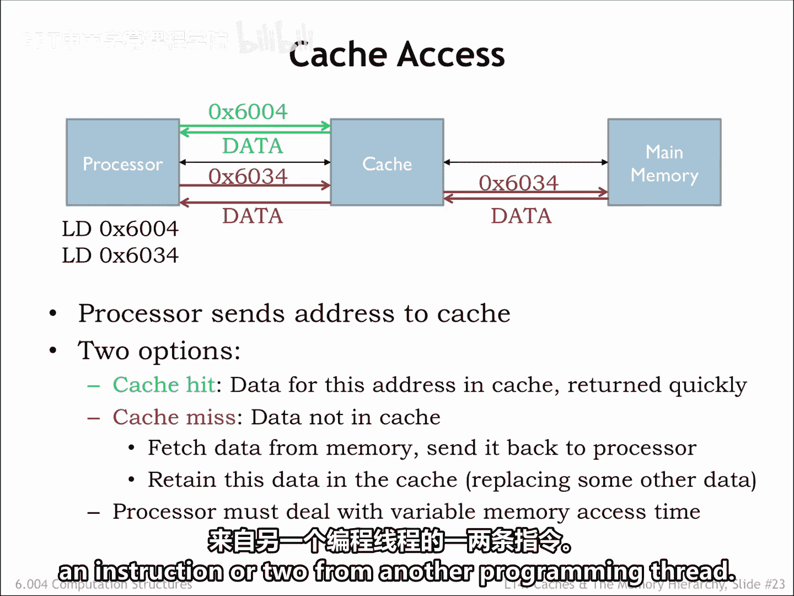
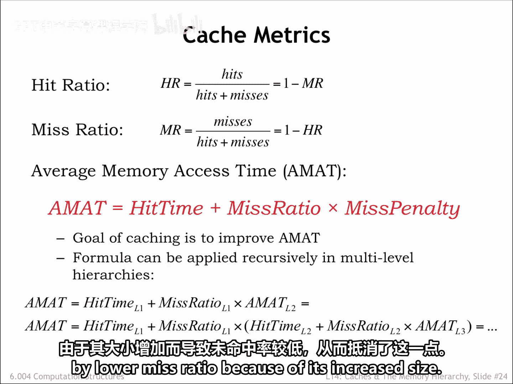
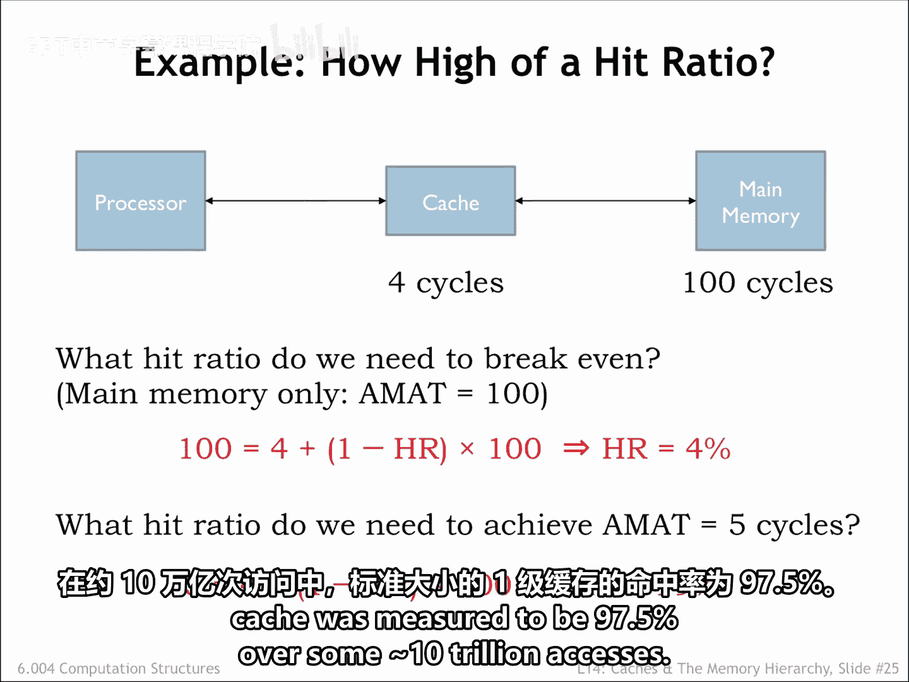
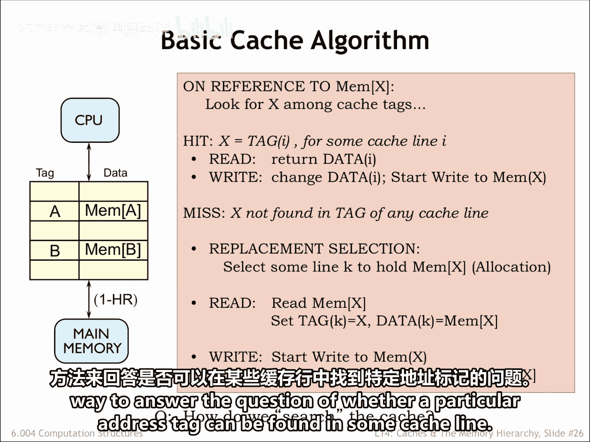

# 【数字系统与计算机架构P2 6.004 2017】麻省理工学院—中英字幕 p26 14.2.6 Caches -BV19m41127Kj_p26-

Okay， let's review our plan。 The processor starts in access by sending an address to the cache。

 If the data for the requested address is held in the cache， it's quickly returned to the CPU。

If the data we request is not in the cache， we have a cachemiss。

 so the cache has to make a request to main memory to get the data。

 which it then returns to the processor。Typically the cache will remember the newly fetched data。

 possibly replacing some older data in the cache。Suppose a cache access takes4 nanoseconds and a main memory access takes 40 nanoseconds。

Then an access that hits the cache has a latency of 4 nanoiseseds。

But an access that misses in the cache has a latency of 44 nanoseconds。

The processor has to deal with the variable memory access time。

 perhaps by simply waiting for the access to complete or in modern hyper threadreaded processors。

 it might execute an instruction or two from another programming thread。

The hit and miss ratios tell us the fraction of accesses which are cache hits and the fraction of accesses which are cache misses。

Of course， the ratios will sum to one。Using these metrics。

 we can compute the average memory access time， since we always checking the cache first。

 every access includes the cache access time called the hit time。If we miss in the cache。

 we have to take the additional time needed to access main memory called the Miss penalty。

But the main memory access only happens on some fraction of the excesses。

 The misraio tells us how often that occurs。So the average memory access time can be computed using the formula shown here。

The lower the miss ratio or equivalently， the higher the hit ratio。

 the smaller the average access time。Our design goal for the cash is to achieve a high hit ratio。

If we have multiple levels of cache， we can apply the formula recursively to calculate the average memory access time at each level of the memory。

Each successive level of the cash is slower， In other words， has a longer hit time。

 which is offset by the lower mis ratio because of its increased to size。

Let's try out some numbers， Sose the cache takes four processor cycles to respond。

 and main memory takes100 cycles。Without the cache， each memory access would take 100 cycles。

With the cache， a cache hit takes four cycles and a cash miss takes 104 cycles。

What hit ratio is needed so that the average memory access time with the cache is 100 cycles。

 the break even point。Using the average memory access time formula from the previous slide。

 we see that we only need a hit ratio of 4% in order for our memory system of the cache plus main memory to perform as well as main memory alone。

The idea， of course， is that we'll be able to do much better than that。

Suppose we wanted an average memory access time of five cycles。

Clearly most of the axises would have to be cash hits。

We can use the average memory access time formula to compute the necessary hit ratio。

Working through the arithmetic， we see that 99% of the accesses must be cash hits in order to achieve an average access time of five cycles。

Could we expect to do that well when running actual programs？Happily， we can come close。

In a simulation of the spec CPU 2000 benchmark， the hit ratio for a standard sized level 1 cash was measured to be 97。

5% over some 10 trillion excesses。

Here's a start at building a cache， the cache will hold many different blocks of data。For now。

 let's assume each block is an individual memory location。Each data block is tagged with its address。

A combination of a data block in its associated address taggged is called a Ca line。

When an address is received from the CPU， we'll search the cache looking for a block with a matching address tag。

If we find a matching address tag， we have a cache hit。

On a read access we'll return the data from the matching cache line on a right access。

 we'll update the data stored in the cache line and at some point update the corresponding location and main memory。

If no matching tag is found， we have a cache miss。So we'll have to choose a cache line to use to hold the requested data。

 which means that some previously cached location will no longer be found in the cache。

For a read operation we' fetch the requested to data from main memory， add it to the cache。

 updating the tag and data fields of the cache line， and of course return the data to the CPU。

On our right， we'll update the tag and data in the selected cache line and at some point update the corresponding location in main memory。

So the contents of the cache is determined by the memory request made by the CPU。

If the CPU requests a recently used address， chances are good。

 the data will still be in the cache from their previous access to the same location。

As the working set slowly changes， the cash contents will be updated as needed。

If the entire working set can fit into the cache， most of the requests will be hits。

 and the average memory access time will be close to the cash access time。So far， so good。Of course。

 we'll need to figure out how to quickly search the cache。In other words。

 we'll need a fast way to answer the question of whether a particular address tag can be found in some cache line。

That's our next topic。