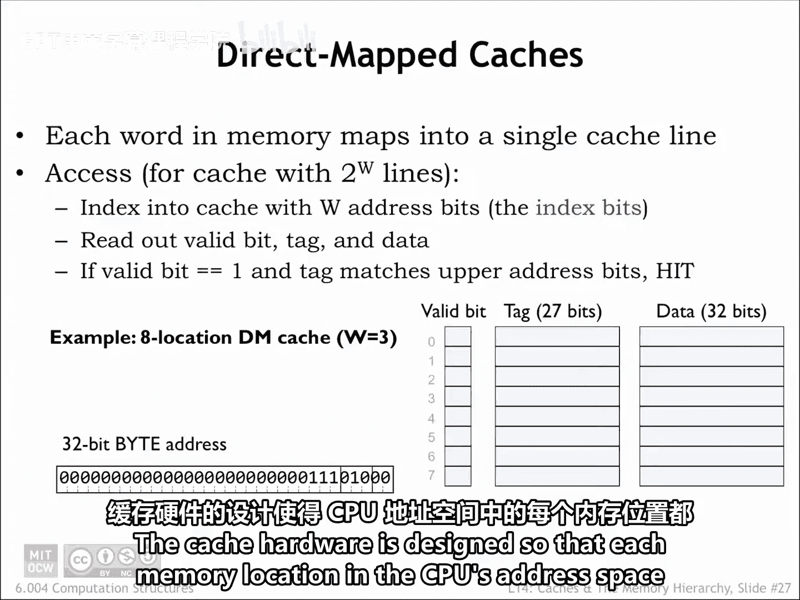
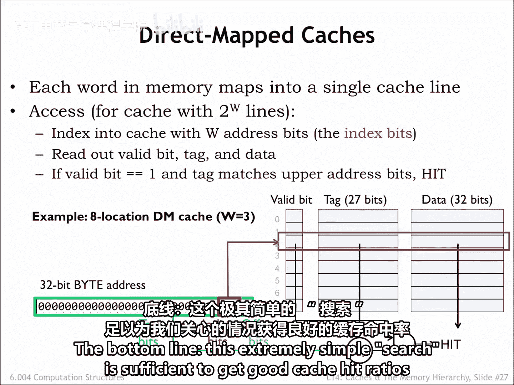
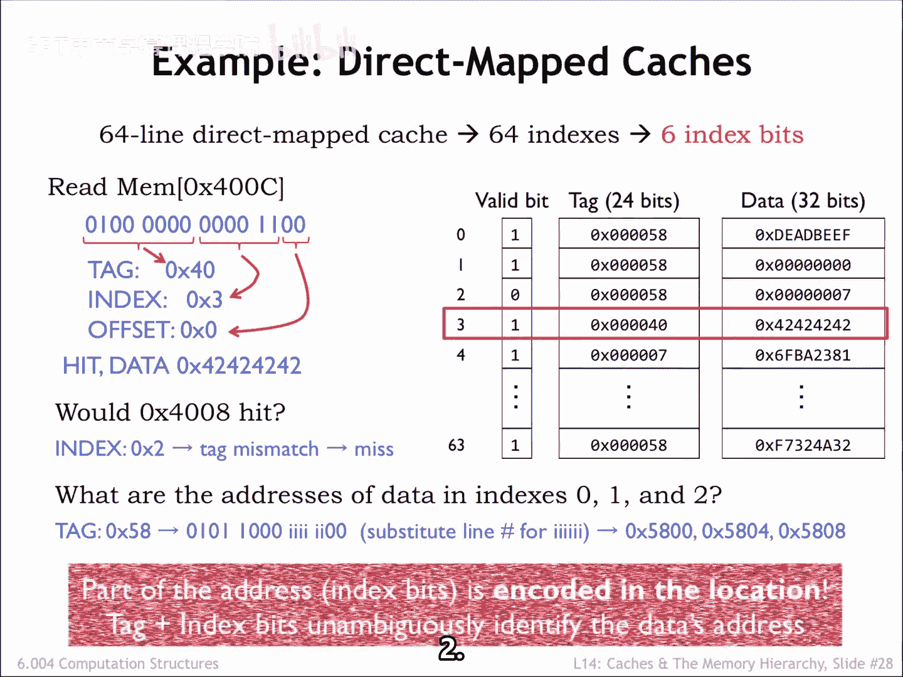
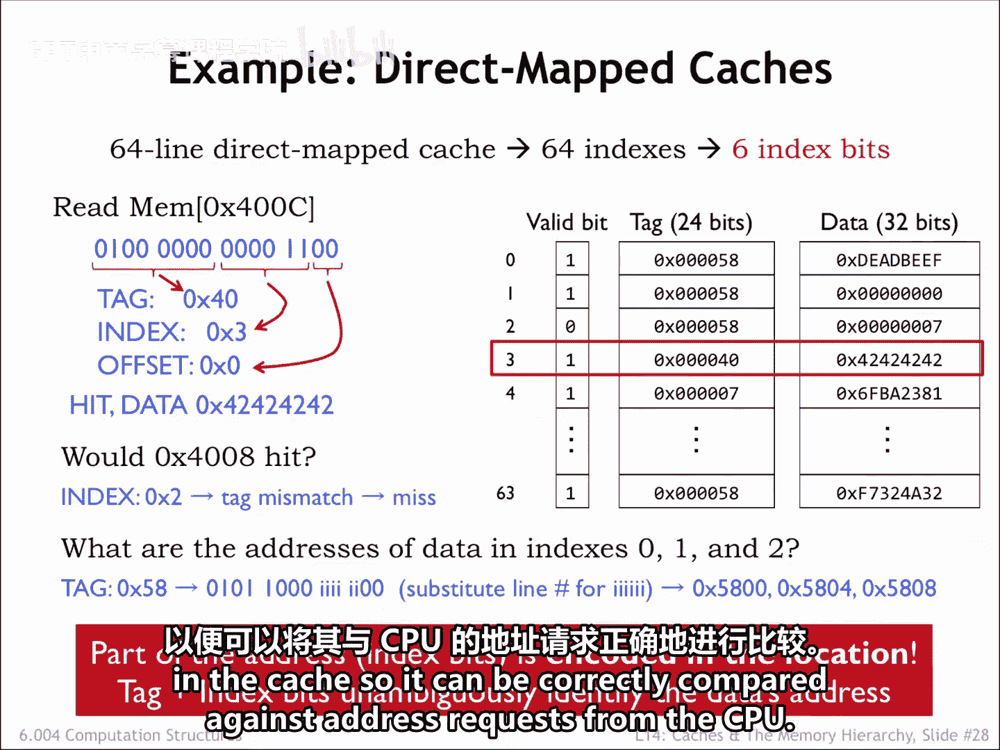

# 数字系统与计算机架构：P2：6.4.2.7 直接映射缓存 🧠

在本节中，我们将学习计算机缓存中最简单的一种硬件实现——直接映射缓存。我们将了解其基本结构、工作原理以及地址如何映射到特定的缓存行。

## 概述

最简单的缓存硬件由一个SRAM和一些额外的逻辑电路组成。缓存硬件被设计成使CPU地址空间中的每个内存位置都映射到一个特定的缓存行，因此得名“直接映射缓存”。

当然，内存位置的数量远多于缓存行的数量，因此许多地址会被映射到同一个缓存行，缓存一次只能保存这些地址中一个的数据。

## 直接映射缓存的工作原理

直接映射缓存的操作是直观的。我们将使用传入地址的一部分作为索引，来选择要搜索的单个缓存行。搜索过程包括将地址的其余部分与所选缓存行的地址标签进行比较。

如果标签与地址匹配，则发生**缓存命中**，我们可以立即使用缓存行中的数据来满足请求。在这个设计中，我们包含了一个额外的**有效位**，当标签和数据字段包含有效信息时，该位为1。

当缓存通电时，每个缓存行的有效位被初始化为0，表示所有缓存行为空。当数据被载入缓存，缓存行的标签和数据字段被填充时，有效位被设置为1。CPU可以请求清除特定缓存行的有效位，这被称为**刷新缓存**。例如，如果CPU发起从磁盘读取的操作，磁盘硬件会将其数据读入主内存的一个块中，那么该块的任何缓存值都将过时。因此，CPU将通过将任何匹配的缓存行标记为无效来从缓存中刷新这些位置。

## 一个具体示例

让我们通过一个包含8行、每行包含一个单字（4字节数据）的小型直接映射缓存来看看这是如何工作的。假设有一个CPU请求地址为十六进制E8的位置。

由于每个缓存行有4字节数据，地址的最低两位表示缓存字内的适当字节偏移。因为缓存只处理字访问，所以字节偏移位不被使用。

接下来，我们需要使用3位地址位来选择要搜索的8个缓存行中的哪一个。我们从地址的低位中选择这些缓存索引位。为什么？这是因为**局部性原理**。局部性原理告诉我们，CPU很可能请求附近的地址。为了让缓存表现良好，我们希望安排附近的地址能够同时保存在缓存中。这意味着附近的位置必须映射到不同的缓存行。附近位置的地址在其低位地址位上有所不同，因此我们将使用这些位作为缓存索引位。这样，附近的位置将映射到不同的缓存行。

由缓存行选择的数据、标签和有效位从SRAM中读取。为了完成搜索，我们将地址的剩余部分与缓存的标签字段进行比较。如果它们相等且有效位为1，我们就有了缓存命中，数据字段可以用来满足请求。

为什么标签字段不是32位，既然我们有32位地址？我们本可以那样做，但由于存储在缓存行2中的所有值都具有相同的索引位（010），我们节省了一些SRAM位，并选择不在标签中保存这些位。换句话说，使用SRAM来保存我们可以从传入地址生成的位是没有意义的。

因此，本例中的缓存硬件是一个8行 x 60位的SRAM，外加一个27位比较器和一个与门。缓存访问时间是SRAM的访问时间，加上比较器和与门的传播延迟。这几乎是我们能期望的最简单和最快的了。这种简单性的缺点是，对于每个CPU请求，我们只查看一个缓存位置，以查看缓存是否持有所需的数据。这算不上什么搜索，对吧？但地址到缓存行的映射在这里对我们有帮助。使用低位地址位作为缓存索引，我们安排了附近的位置映射到不同的缓存行。例如，如果CPU正在执行一个8条指令的循环，所有8条指令都可以同时保存在缓存中。更复杂的搜索机制也无法改进这一点。归根结底，这种极其简单的搜索足以在我们关心的情况下获得良好的缓存命中率。

## 更多示例

现在让我们尝试更多示例，这次使用一个包含64行的直接映射缓存。

假设缓存收到一个对位置400C的读取请求。为了了解请求是如何处理的，我们首先将地址写成二进制，以便轻松地将其划分为偏移、索引和标签字段。

对于这个地址，偏移位的值为0。缓存行索引位的值为3，标签位的值为40。因此，将缓存行3的标签字段与地址的标签字段进行比较，由于匹配，我们发生了缓存命中，缓存行数据字段中的值可以用来满足请求。

访问位置4008会是缓存命中吗？这个地址与第一个例子类似，只是缓存行索引现在是2而不是3。查看缓存行2，我们发现其标签字段58与地址中的标签字段40不匹配，因此此访问将是**缓存未命中**。

那么，保存在缓存行0、1和2中的字的地址是什么？它们都有相同的标签字段。我们可以反向运行地址匹配过程。对于一个要与这三个缓存行匹配的地址，它必须看起来像这里显示的二进制数，我们使用缓存标签字段中的信息来填充高位地址位，低位地址位将来自索引值。如果我们填入索引0、1和2，然后将得到的二进制数转换为十六进制，我们得到5800、5804和5808，分别作为缓存行0、1和2中数据的地址。

请注意，缓存位置的完整地址是通过将缓存行的标签字段与缓存行的索引组合而成的。当然，我们需要能够从缓存中保存的信息中恢复完整地址，以便可以正确地与来自CPU的地址请求进行比较。

## 总结

在本节中，我们一起学习了直接映射缓存的基本概念。我们了解到，直接映射缓存通过将内存地址划分为标签、索引和偏移字段，将每个地址唯一映射到一个特定的缓存行。其硬件实现简单高效，利用地址低位作为索引，有助于利用空间局部性，使附近的地址映射到不同的缓存行，从而在循环等常见场景中获得良好的性能。虽然每次只搜索一个缓存位置，但这种简单的设计对于许多实际应用来说已经足够有效。