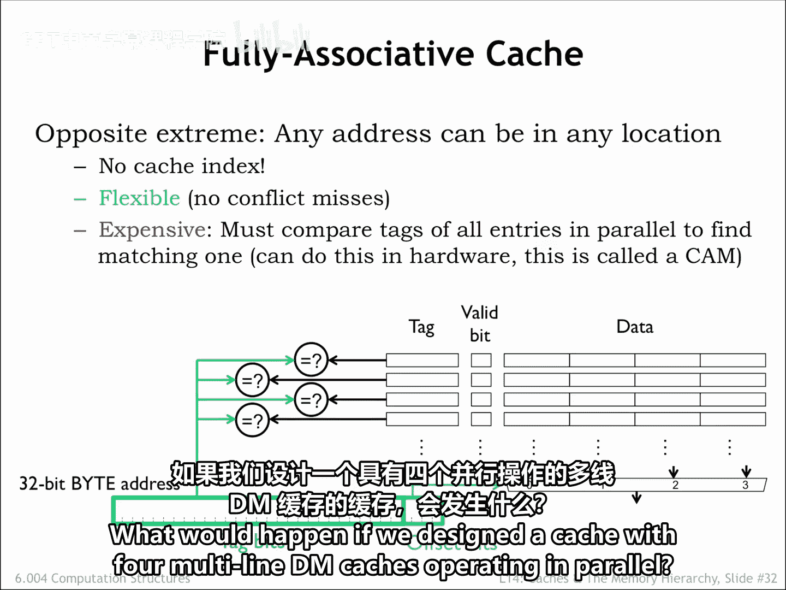
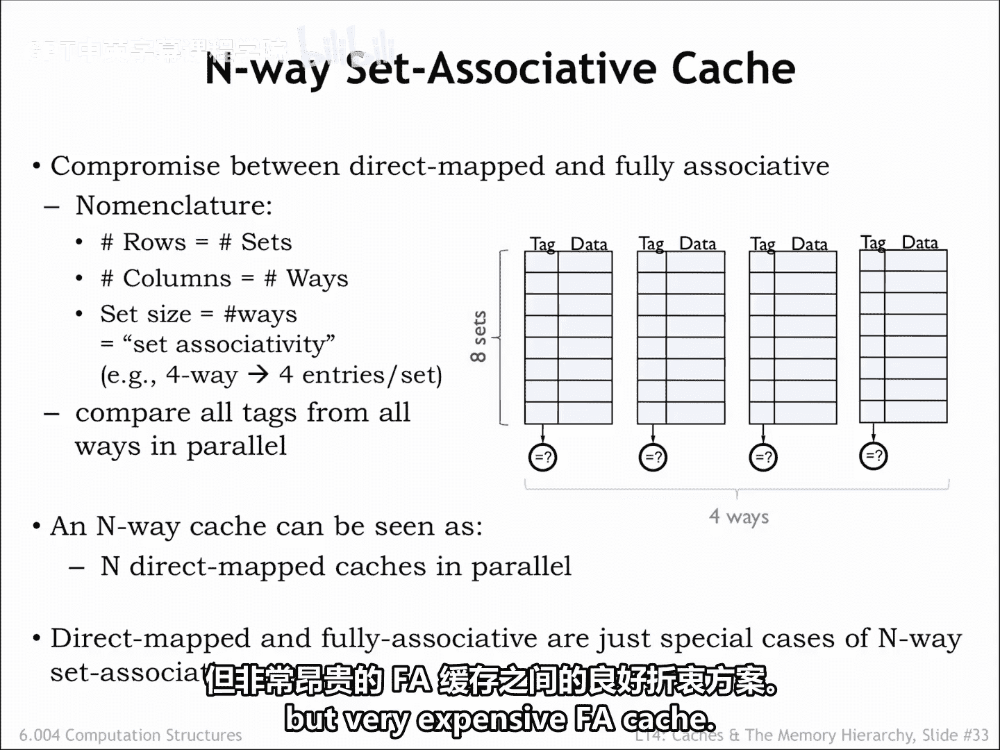
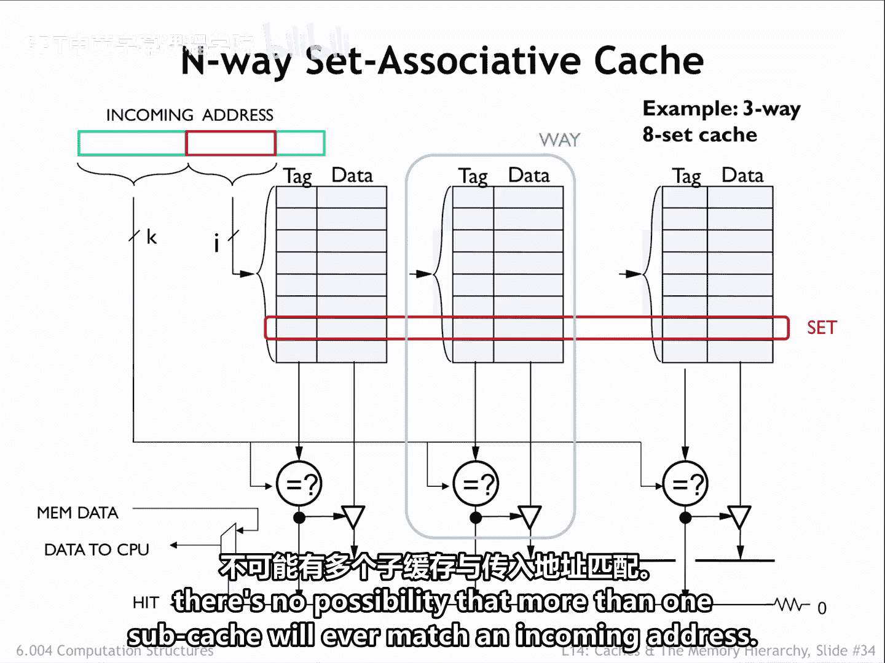
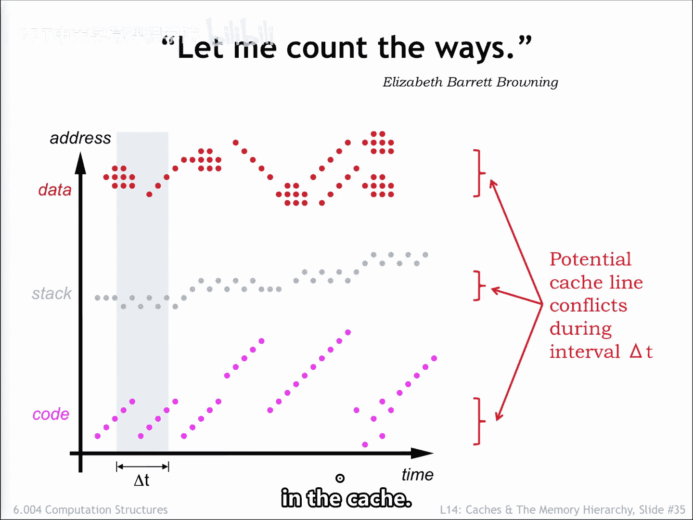
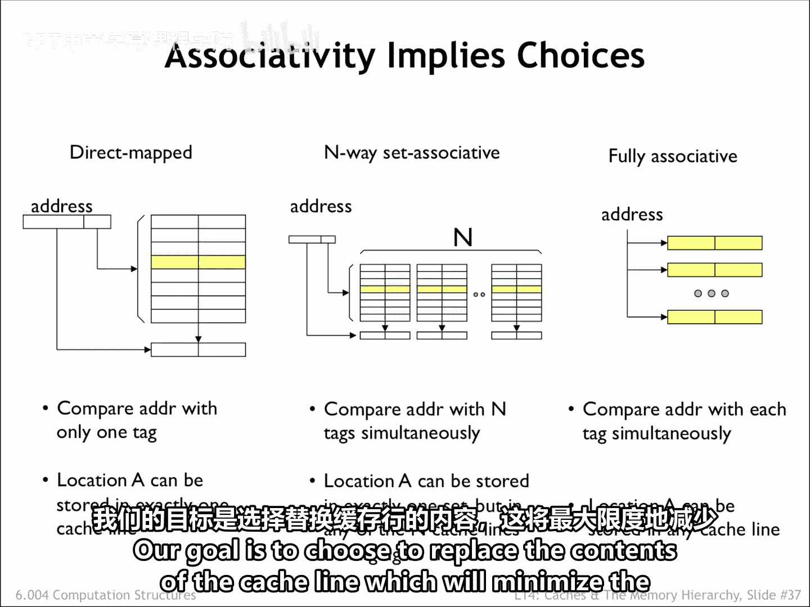
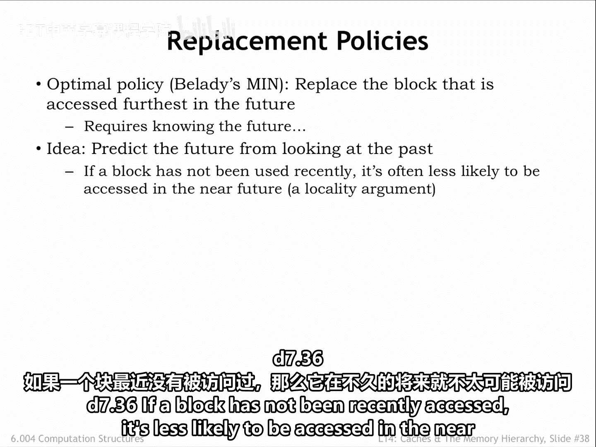
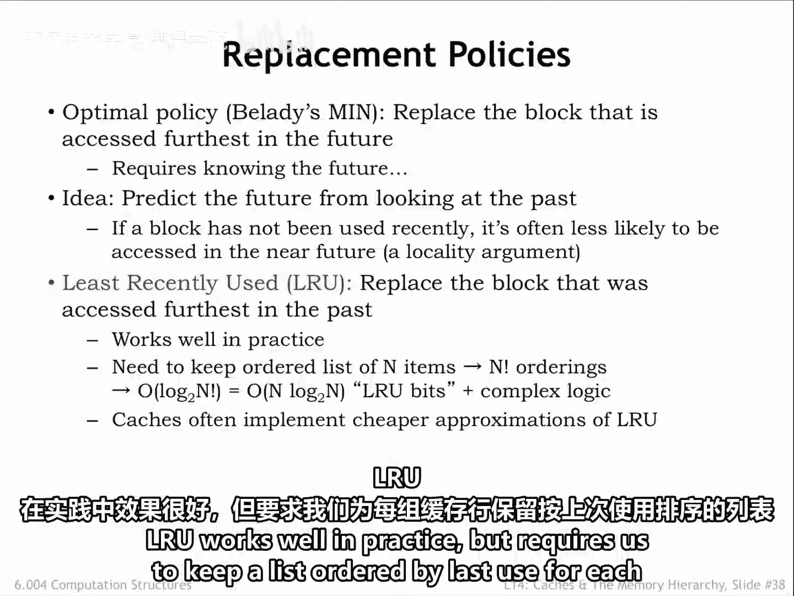
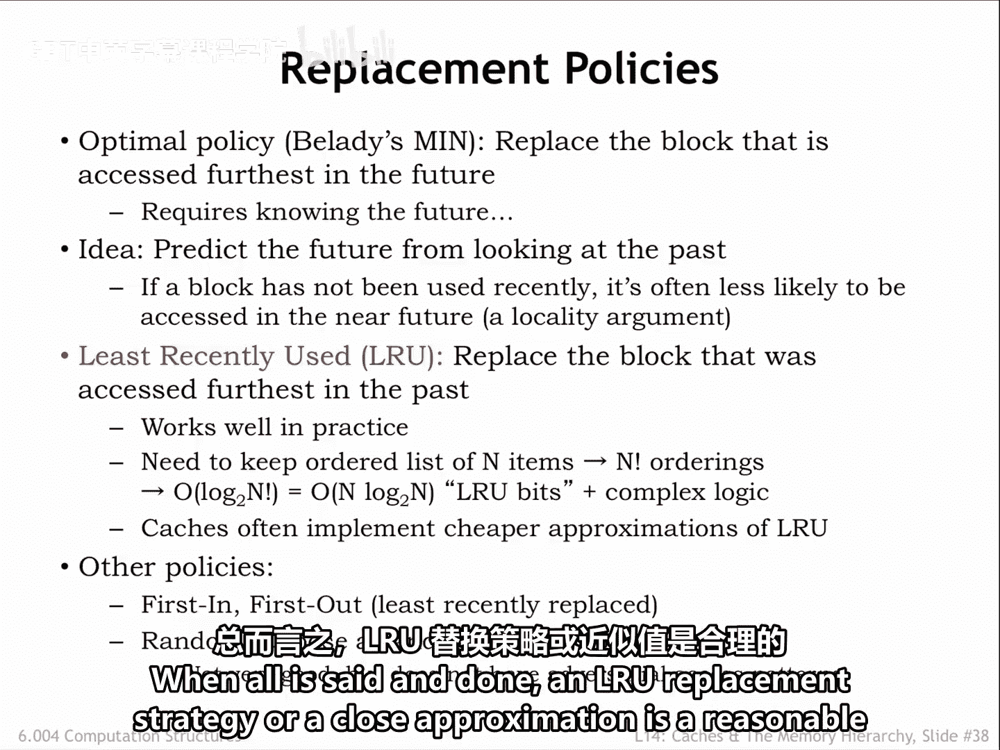

# 数字系统与计算机架构：P2：6.4 关联缓存 🧠

在本节课中，我们将要学习关联缓存的工作原理，包括全关联缓存和组相联缓存。我们将了解它们如何解决直接映射缓存中的地址冲突问题，并探讨其性能与成本之间的权衡。

---

## 全关联缓存

上一节我们介绍了直接映射缓存，本节中我们来看看全关联缓存。

全关联缓存为每个缓存行配备一个标签比较器。因此，传入地址的标签字段会与全关联缓存中**每一个**缓存行的标签字段进行比较。

由于会搜索所有缓存行，特定的内存位置可以存放在任何缓存行中。这消除了因地址冲突导致冲突未命中的问题。

这里展示的缓存行可以存放四个不同的内存块，无论它们的地址是什么。上一节末尾的例子需要一个能存放两个三字块的缓存，一个用于循环指令，一个用于数据字。这个全关联缓存将使用其两个缓存行来完成此任务，并实现100%的命中率，无论指令块和数据块的地址如何。

全关联缓存非常灵活，对于大多数应用具有很高的命中率。其唯一的缺点是成本。为每个缓存行配备标签比较器以实现标签匹配的并行搜索，当缓存行数量很多时，会显著增加所需的电路数量。即使使用称为内容可寻址存储器的混合存储比较电路，也无法大幅降低全关联缓存的总体成本。

---

## 组相联缓存

直接映射缓存只搜索单个缓存行。全关联缓存搜索所有缓存行。是否存在一个折中的方案，可以并行搜索少量缓存行呢？

答案是肯定的。如果你仔细观察这里展示的全关联缓存图，会发现它看起来像四个单行直接映射缓存在并行工作。如果我们设计一个由四个多行直接映射缓存并行工作的缓存，结果会怎样？

结果将是我们所称的**四路组相联缓存**。

一个 **N路组相联缓存** 本质上就是 **N个直接映射缓存**（我们称之为子缓存）并行工作。每个子缓存将传入地址的标签字段与由地址索引位选中的缓存行的标签字段进行比较。在一次特定请求中被搜索的N个缓存行构成了一个**搜索组**，所需的位置可能存放在该组中的任何一个成员里。

这里展示的四路组相联缓存，每个子缓存有8个缓存行。因此，每个组包含4个缓存行（每个子缓存一个），总共有8个组（每个子缓存行对应一个组）。一个N路组相联缓存最多可以容纳**N个**地址映射到相同缓存索引的内存块。因此，最多N个具有冲突地址的块访问仍可在此缓存中得到满足而不会产生未命中。

与直接映射缓存相比，这是一个巨大的改进，因为在直接映射缓存中，地址冲突将导致当前缓存行的内容被驱逐，以容纳新的请求。同时，一个N路组相联缓存可以拥有非常多的缓存行，但只需承担**N个**标签比较器的成本。与全关联缓存相比，这也是一个巨大的改进，因为全关联缓存中大量的缓存行需要大量的比较器。

因此，N路组相联缓存是易于冲突的直接映射缓存与灵活但非常昂贵的全关联缓存之间的一个良好折中方案。

这是一个稍微更详细的示意图，展示的是一个**三路八组**缓存。请注意，路的数量并不要求是2的幂次，因为我们没有使用任何地址位来选择特定的路。这意味着缓存设计者可以微调缓存容量以满足其空间预算。

回顾一下术语：对于特定缓存索引将被搜索的N个缓存行称为一个**组**，而每个N个子缓存称为一**路**。每一路的命中逻辑与其他路的逻辑并行运行。

一个特定的地址是否可能被多于一路匹配？硬件并不排除这种可能性，但组相联缓存的管理方式确保了这种情况不会发生。假设我们从DRAM获取的数据在缓存未命中时只写入一个子缓存（我们稍后会讨论如何选择这一路），那么就不可能出现多个子缓存同时匹配一个传入地址的情况。

---

## 我们需要多少路？

我们希望有足够的路数来避免直接映射缓存中遇到的缓存行冲突。观察我们之前看到的内存访问与时间关系图，我们会发现在任何时间间隔内，只有一定数量的潜在地址冲突需要我们担心。从地址到缓存行的映射设计旨在避免相邻位置之间的冲突，因此我们只需要担心不同区域（代码、堆栈和数据）之间的冲突。

在所示的例子中，有三个这样的区域，或者如果你需要支持从一个数据区域复制到另一个数据区域，则可能需要两个数据区域。如果时间间隔特别大，我们可能需要两倍于这个数量的路数，以避免时间间隔早期访问与晚期访问之间的冲突。关键是，少量的路数就足以避免缓存中的大多数缓存行冲突。

---

## 路数的权衡

与块大小一样，过犹不及。存在一个**最佳路数**，可以最小化平均内存访问时间。超过这个点，组合大量路数的命中信号所需的额外电路将开始产生显著的传播延迟，这会直接增加缓存命中时间和平均内存访问时间。更重要的是，左边的图表显示，超过4到8路后，对未命中率的影响微乎其微。

对于大多数程序，具有大量组的八路组相联缓存的性能，与昂贵得多的同等容量全关联缓存相当。

---

## 替换策略

对于组相联和全关联缓存，还有一个最终问题需要解决：当发生缓存未命中时，应该选择哪个缓存行来存放将从主存获取的数据？这对于直接映射缓存不是问题，因为每个数据块只能存放在由其地址决定的特定缓存行中。但在N路组相联缓存中，有N个可能的缓存行可供选择（每路一个）。在全关联缓存中，可以选择任何缓存行。那么，如何选择？

我们的目标是选择替换那个对未来命中率影响最小的缓存行内容。

最优的选择是替换在未来最久不会被访问（或者可能永远不会再被访问）的块，但这需要预知未来。这里有一个思路：通过观察最近的访问并应用局部性原理来预测未来的访问。如果一个块最近没有被访问过，那么它在不久的将来被访问的可能性就更小。

这引出了**最近最少使用**替换策略，通常称为 **LRU**。我们替换在过去最久未被访问的块。LRU在实践中效果很好，但要求我们为每组缓存行维护一个按最后使用时间排序的列表，并且需要在每次缓存访问时更新这个列表。

当我们需要选择替换组中的哪个成员时，我们会选择这个列表上最后一个缓存行。对于一个八路组相联缓存，有 `8!`（8的阶乘）种可能的排序，因此我们需要 `log₂(8!)` 或 **16个状态位** 来编码当前的排序。在每次访问时更新这些状态位的逻辑并不便宜。基本上，你需要一个查找表来将当前的16位值映射到下一个16位值。

因此，大多数缓存实现的是LRU的近似算法，其更新函数计算起来要简单得多。

还有其他可能的替换策略：
*   **先进先出**：替换最旧的缓存行，无论它最后一次被访问是什么时候。
*   **随机**：使用某种伪随机数生成器来选择替换对象。

除了随机策略外，所有替换策略都可能被“击败”。如果你知道缓存的替换策略，你可以设计一个程序，通过访问你知道缓存刚刚替换掉的地址，从而获得极差的命中率。虽然我们可能不关心一个旨在获得糟糕性能的程序在系统上运行得如何，但重点是，大多数替换策略偶尔会导致特定程序的执行速度比预期慢得多。

总而言之，LRU替换策略或其近似方案是一个合理的选择。

---

## 总结

本节课中我们一起学习了关联缓存的核心概念。我们了解到：
*   **全关联缓存** 高度灵活，命中率高，但硬件成本（比较器数量）也最高。
*   **组相联缓存**（特别是 **N路组相联**）是直接映射缓存和全关联缓存之间的一个优秀折中。它通过并行搜索N个（路）缓存行来减少冲突未命中，同时将硬件成本控制在N个比较器。
*   对于大多数程序，**4到8路**的组相联缓存性能已接近全关联缓存，是实践中的常见选择。
*   当缓存未命中需要替换数据时，**LRU（最近最少使用）** 或其近似算法是常用的替换策略，旨在根据访问的局部性原理保留最可能被再次访问的数据。

通过理解这些缓存组织方式及其权衡，我们可以更好地理解计算机系统如何高效地管理内存访问。