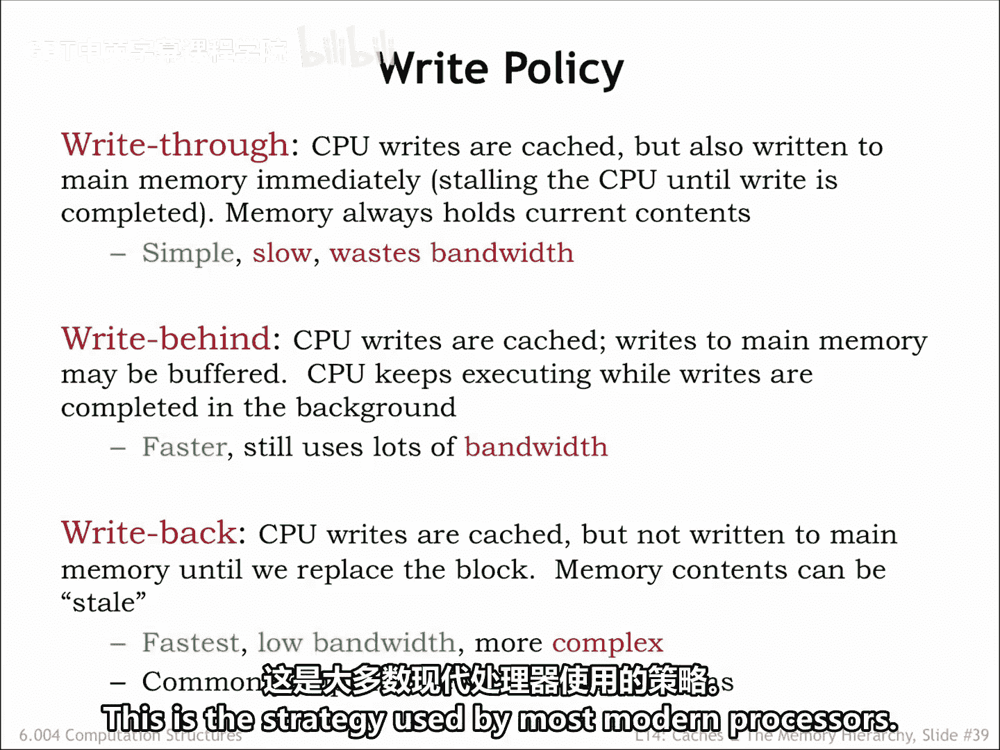
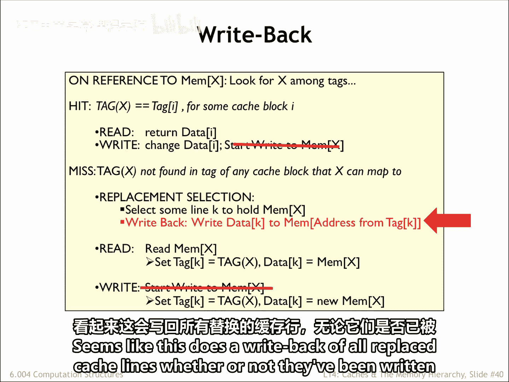
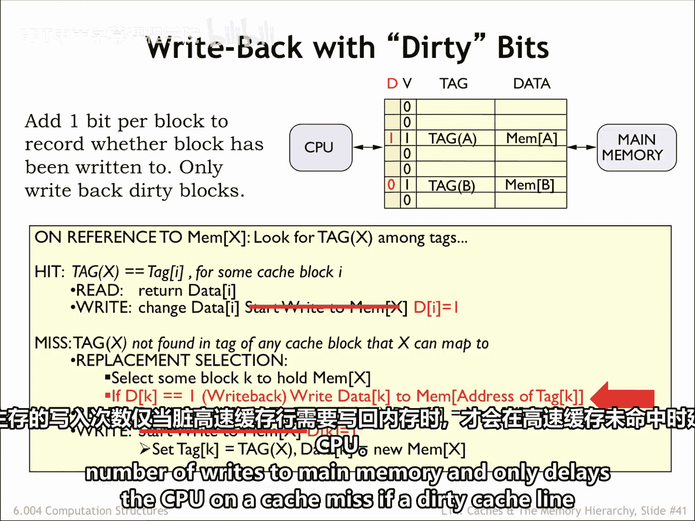
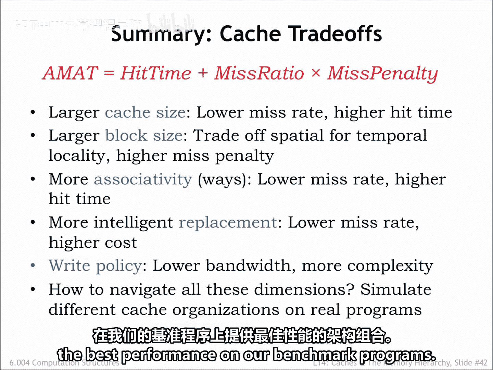

# 【数字系统与计算机架构P2 6.004 2017】麻省理工学院—中英字幕 p30 14.2.10 Write Strategies -BV19m41127Kj_p30-

Okay， one more cash design decision to make， then we're done。

How should we handle memory rights in the cache。Ultimately。

 we'll need to update main memory with the new data， but when should that happen。

The most obvious choice is to perform the right immediately。In other words。

 whenever the CPU sends a right request to the cache。

 the cache then performs the same right to main memory。This is called right Through。That way。

 main memory always has the most up to date value for all locations。

But this can be slow if the CPU has to wait for a D Ramm right access。

 Rs could become a real bottleneck。And what if the program is constantly writing a particular memory location。

 for example， updating the value of a local variable in the current stack frame。In the end。

 we only need to write the last value to main memory。

Reading all the earlier values is a waste of memory bandwidth。

Suppose we let the CPU continue execution while the cache waits for the right to main memory to complete。

This is called right behind。 This will overlap execution of the program with the slow rights domain memory。

Of course， if there's another cache miss while the right is still pending。

 everything will have to wait at that point until both the right and subsequent refill read finish since the CPU can't proceed until the cache miss is resolved。

The best strategy is called right back， where the contents of the cache are updated and the CPU continues execution immediately。

The updated cache value is only written to main memory when the cache line is chosen as the replacement line for a cash miss。

This strategy minimizes the number of accesses to main memory。

 preserving the memory bandwidth for other operations。

This is the strategy used by most modern processors。

Right back is easy to implement returning to our original cash recipe。

 we simply eliminate the start of the right to main memory when there's a right request to the cash。

 we just update the cash contents and leave it at that。However。

 replacing a cache line becomes a more complex operation。

 since we can't reuse the cache line without first writing its contents back to main memory in case they had been modified by an earlier right access。

嗯。😊，Seems like this does a right back of all replaced cache lines。

 whether or not they've been written to。

We can avoid unnecessary write backs by adding another state bit to each cache line， the dirty bit。

The dirty bit is set to0 when a cache line is filled during a cash miss。

If a subsequent right operation changes the data in a cache line， the dirty bit is set to one。

 indicating that the value in the cache now differs from the value in main memory。

When a cache line is selected for a replacement， we only need to write its data back to main memory if its a dirty bit is one。

So a right back strategy with a dirty bit gives an elegant solution that minimizes the number of rights to main memory and only delays the CPU on a cachemiss if a dirty cache line needs to be written back to memory。

That concludes our discussion of caches， which was motivated by our desire to minimize the average memory access time by building a hierarchical memory system that had both low latency and high capacity。

There were a number of strategies we employed to achieve our goal。

Increasing the number of cache lines decreases average memory access time by decreasing the mis ratioio。

Increasing the block size of the cache let us take advantage of the fast column accesses in a DRAM to efficiently load a whole block of data on a cache miss。

The expectation was that this would improve average memory access time by increasing the number of hits in the future as accesses were made to nearby locations。

Increasing the number of ways in the cache reduced the possibility of cash line conflicts。

 lowering the misraio。Choosing the least recently used cache line for a replacement minimize the impact of replacement on the hit ratio。

And finally， we chose to handle rights using a right back strategy with 30 Bs。

How do we make the trade offs among all these architectural choices？As usual。

 we'll simulate different cash organizations and choose the architectural mix that provides the best performance on our benchmark programs。

