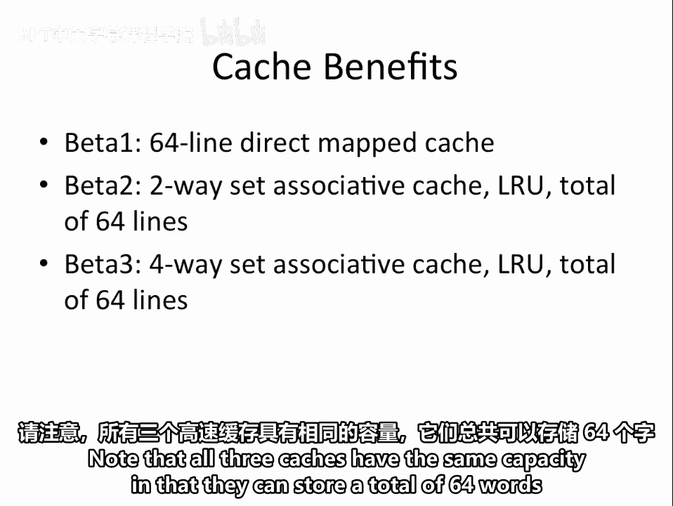
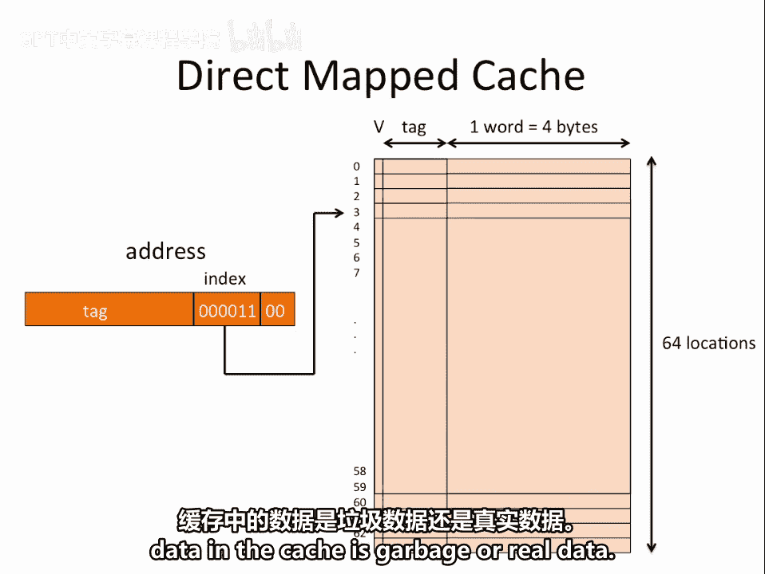
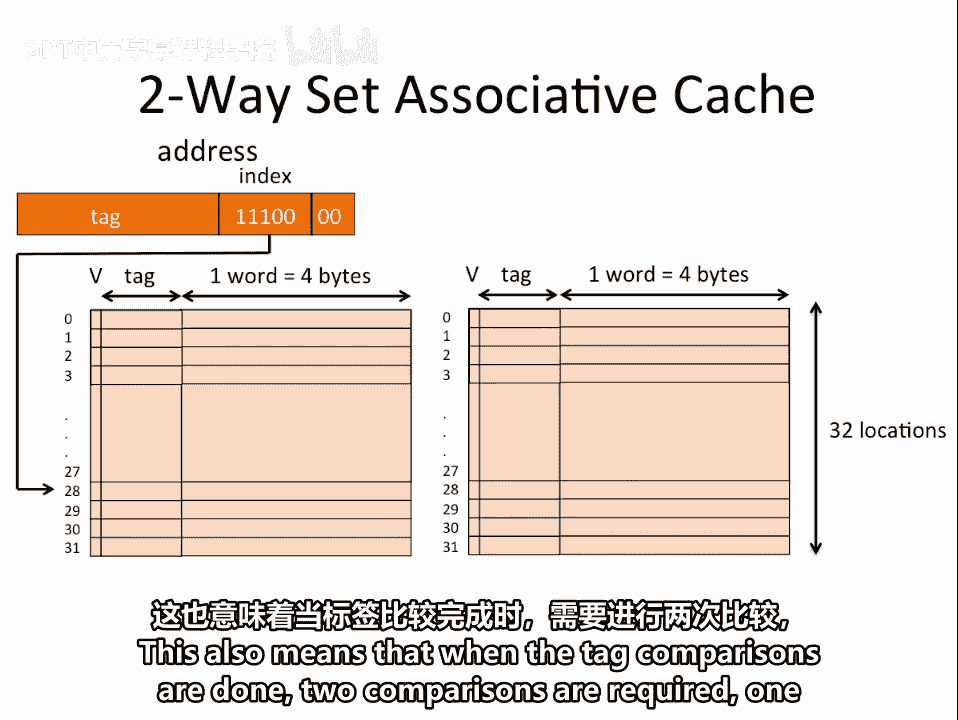
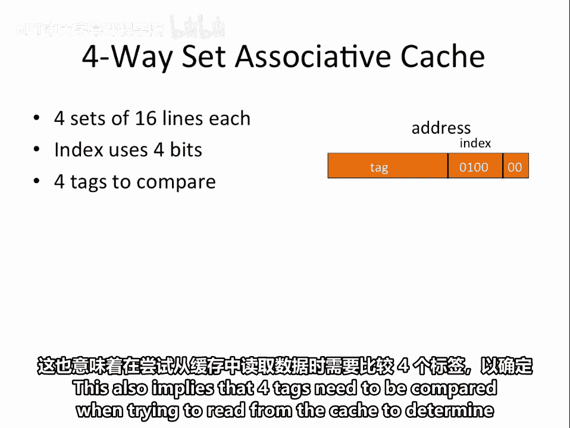
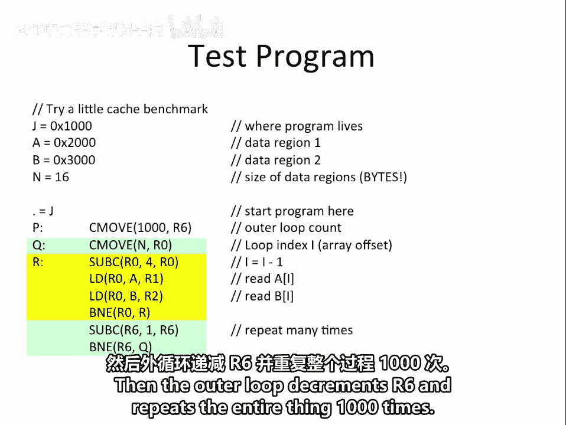
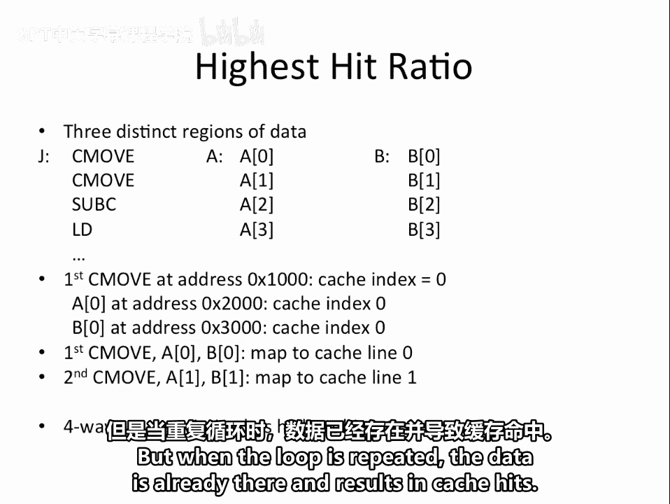
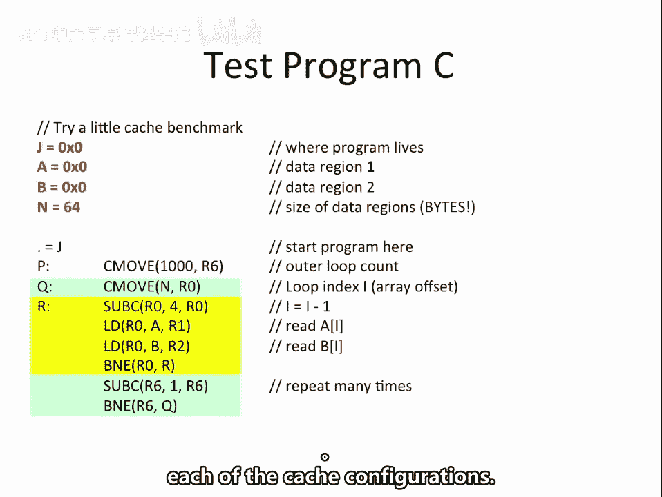
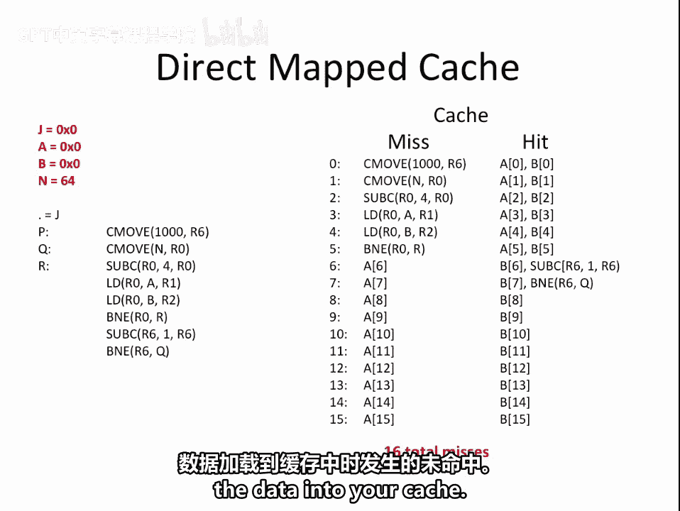
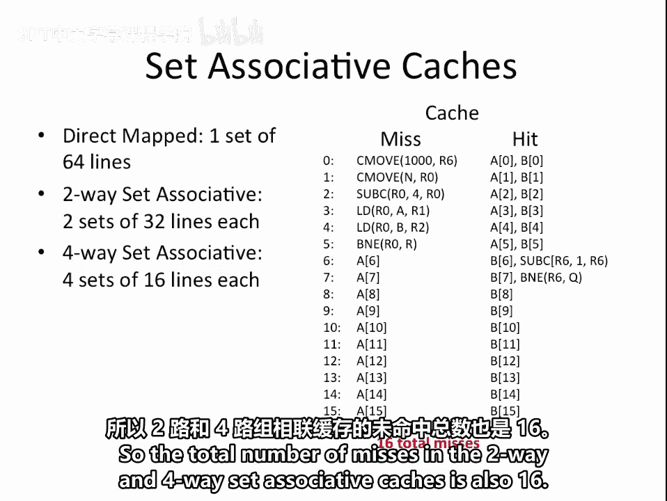

# 【数字系统与计算机架构P2 6.004 2017】麻省理工学院—中英字幕 p31 14.2.11 Worked Examples： Cache Benefits -BV19m41127Kj_p31-

We are going to compare the behavior of three different cash configurations on a benchmark program to better understand the impact of the cash configuration on the performance of the benchmark。

The first cache we will consider is a 64 line direct mapped cache。

The second is a two way set associative cash that uses the LRU or least recently used replacement strategy and has a total of 64 lines。

The third is a four way set Associative cash that uses the LRU replacement strategy and also has a total of 64 lines。

Note that all three caches have the same capacity and that they can store a total of 64 words of data。

In a direct mapped cache， any particular memory address maps to exactly one line in the cache。

Let's assume that our data is 32 bits or 4 bytes wide。

This means that consecutive addresses are4 bytes apart。

 so we treat the bottom two address bits as always being 00 so that our address is on a data word boundary。

Next， we want to determine which cache line this particular address maps to。

Since there are 64 lines in this cache， we need six bits to select one of the 64 lines。

These  six bits are called the index In this example， the index is 0，0，0，0，11。

 So this particular address maps to line 3 of the cache。

 The data that gets stored in the cache is the tag portion of the address of the line plus the 32 B of data。

The tag is used for comparison when checking if a particular address is in the cache or not。

It uniquely identifies the particular memory address。In addition。

 each cash line has a valid bit that lets you know whether the data in the cash is currently valid or not。

This is important upon startup because without the spit。

 there is no way to know whether the data and the cache is garbage or real data。

In a two way set associative cash， the cache is divided into two sets。

 each with half the number of lines。So we have two sets with 32 lines each。

Since there are only 32 lines， we now only need a five bit index to select the line。However。

 any given index can map to two distinct locations， one in each set。

This also means that when the tag comparisons are done， two comparisons are required， one per set。

In a four way set associative cache， the cache is divided into four sets each with 16 lines。

The width of the index is now four bits to select the cache line。Here。

 selecting a line identifies one of four words as possible locations for reading or writing the associated data。

This also implies that four tags need to be compared when trying to read from the cache to determine if the desired address is stored in the cache or not。

The test program begins by defining a few constants。J， A， B， and N。

J specifies the address where the program lives。A is the starting address of data Reg 1。

 and B is the starting address of data region 2。Finally， n specifies the size of the data regions。

Since one word consists of four bytes，16 by of data mean that there are four data elements per region。

Next， the assembler is told that the beginning of the program is at address 0 x1000。

The green rectangle identifies the outer loop， and the yellow rectangle identifies the inner loop of the code。

Before entering the outer loop， a loop counter， which is stored in Reg R 6， is initialized to 1000。

Then， each time through the outer loop， R6 is decremented by 1。

 and the loop is repeated as long as R6 is not equal to 0。

The outer loop also resets our0 to n each time through the loop。

Our zero is used to hold a desired array offset。Since the last element of the array is stored at location n minus4。

The first step of the inner loop is to decrement our 0 by 4。

Our1 is then loaded with a value at address A plus n4。

 which is the address of a of 3 because array indices begin at 0。R2 is loaded with B of 3。

As long as r0 is not equal to 0， the loop repeats itself each time accessing the previous element of each array until the first element in De 0 is loaded。

Then the outer loop decrements our6 and repeats the entire thing 1000 times。

Now that we understand the configuration of our three caches and the behavior of our test benchmark。

 we can begin comparing the behavior of this benchmark on the three caches。

The first thing we want to ask ourselves is which of the three cash configurations gets the highest hit ratio。

Here， we're not asked to calculate an actual hit ratio。 Instead。

 we just need to realize that there are three distinct regions of data in this benchmark。

The first holds the instructions。 The second holds array A， and the third holds array B。

If we think about the addresses of each of these regions in memory。

 we see that the first instruction is at address 0x1000。This will result in an index of0。

 regardless of which cash you consider。So for all three caches。

 the first instruction would map to the first line of the cache。Similarly。

 the first element of arrays A and B are at address 0 x2000 and 0 x3000。

These addresses will also result in an index of 0， regardless of which of the three caches you consider。

So we see that the first C move， A 0 and B 0 would all map the line 0 of the cache。Similarly。

 the second C move， whose address is 0 x 1，0，0，4， would map to line one of the cache as would array elements A of1 and B of1。

This tells us that if we use the direct map cache or a two way set associative cache。

 then we will have cache collisions between the instructions and the array elements。

 Cols in the cache imply cache misses as we replace one piece of data with another in the cache。

However， if we use a four way set associative cache。

 then each region of memory can go in a distinct set in the cache。

 thus avoiding collisions and resulting in 100% hit rate after the first time through the loop。

Note that the first time through the loop， each instruction and data access will result in a cache miss because the data needs to initially be brought into the cache。

 but when the loop is repeated， the data is already there and results in cache hits。

Now， suppose that we make a minor modification to our test program by changing B from 0 x3000 to 0 x2000。

This means that array A and array B now refer to the same locations in memory。

We want to determine which of the cashs hit rate will show a noticeable improvement as a result of this change。

The difference between our original benchmark and this modified one is that we now have two distinct regions of memory to access。

 one for their instructions and one for the data。This means that the two way set Associ of cash will no longer experience collisions in its cash。

 so its hit rate will be significantly better than with the original benchmark。

Now suppose that we change our benchmark once again， this time making J。

 A and B all equal to 0 and changing n to B64。This means that we now have 16 elements in our arrays。

 instead of 4。It also means that the array values that we are loading for arrays A and B are actually the same as the instructions of the program。

Another way of thinking about this is that we now only have one distinct region of memory being accessed。

What we want to determine now is the total number of cash misses that will occur for each of the cash configurations。

Let's begin by considering the direct mapped cache。In the direct map cache。

 we would want to first access the first C moveve instruction。

Since this instruction is not yet in the cache， our first access is a cash miss。

We now bring the binary equivalent of this instruction into line0 of our cache。Next。

 we want to access the second seam of instruction。Once again， the instruction is not in our cache。

 so we get another cache myth。This results in our loading the second sea move instruction to line one of our cache。

We continue in the same manner with the subea instruction and the first load instruction。Again。

 we get cash misses for each of those instructions。

 and that in turn causes us to load those instructions into our cash。

Now we are ready to execute our first load operation。This operation wants to load a of 15 into R1。

Because the beginning of array A is at address 0， then a of 15 maps aligned line 15 of our cache。

Since we have not yet loaded anything into line 15 of our cache。

 this means that our first data access is amiss。We continue with a second load instruction。

 This instruction is not yet in the cache， so we get a cache miss and then load it into line 4 of our cache。

We then try to access B of 15。B of 15 corresponds to the same piece of data as a of 15。

So this data access is already in the cache thus resulting in a data hit for B15。

So far we have gotten five instructiond misses， one data miss and one data hit。Next。

 we need to access the B& the instruction。Once again， we get a cash miss。

 which results in loading the B and the instruction into line 5 of our cache。

The inner loop is now repeated with r0 equal to 60， which corresponds to element 14 of the arrays。

This time through the loop， all the instructions are already in the cache and result in instruction hits。

A of 14， which maps aligned 14 of our cash， results in a data miss because it is not yet present in our cache。

 So we bring a of 14 into the cache。Then， as before， when we try to access B of 14。

 we get a data hit because it corresponds to the same piece of data as a of 14。So in total。

 we have now seen six instruction misses and two data misses。

 The rest of the axises have all been hits。This process repeats itself with a data mis for array element A of I and a data hit for array element B of I until we get to A of 5。

 which actually results in a hit because it corresponds to the location and memory that holds the B& E R0 comma R instruction。

 which is already in the cache aligned 5。From then on。

 the remaining data accesses all result in hits。At this point。

 we have completed the inner loop and proceed through the remaining instructions in the outer loop。

These instructions are the second sub C and the second B&E instructions。

These correspond to the data that is in line 6 and 7 of the cache， thus resulting in hits。

The loop then repeats itself 1000 times， but each time through all the instructions and all the data is in the cache。

 so they all result in hits。So the total number of misses that we get when executing the benchmark on a direct map cache is 16。

These are known as compulsory misses， which are misses that occur when you are first loading the data into your cache。

Recall that the direct mapped cache has one set of 64 lines in the cache。

The two Wayet Associative has two sets of 32 lines each。

And the four way set Associative has four sets of 16 lines each。

Since only 16 lines are required to fit all the instructions and data associated with this benchmark。

 this means that effectively， only one set will be used in the set associative caches。

 And because even in the four way set associative cash， there are 16 lines。

That means that once the data is loaded into the cache。

 it does not need to be replaced with other data。 So after the first miss per line。

 the remaining axises in the entire benchmark will be hits。

So the total number of misses in the two way and four way set associative caches is also 16。

