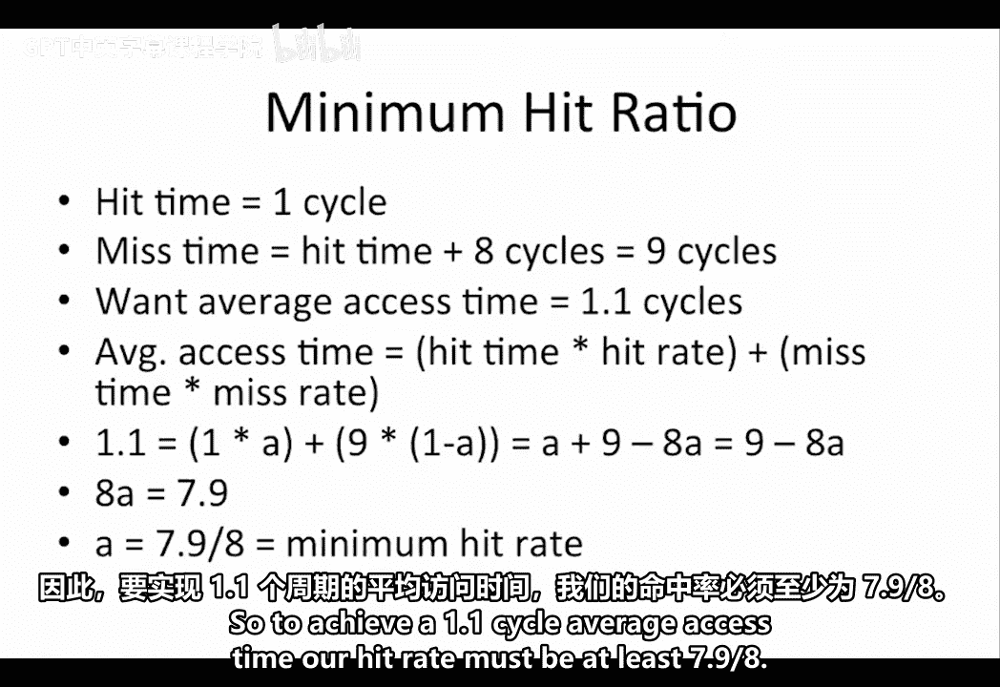
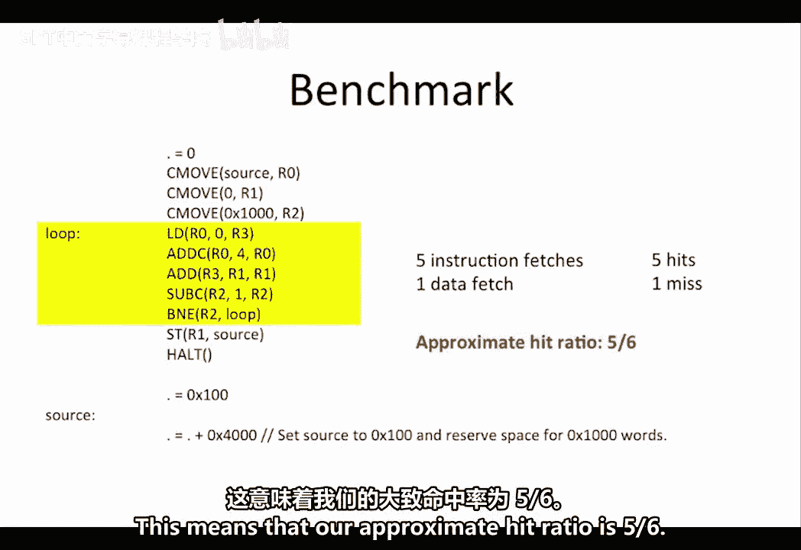
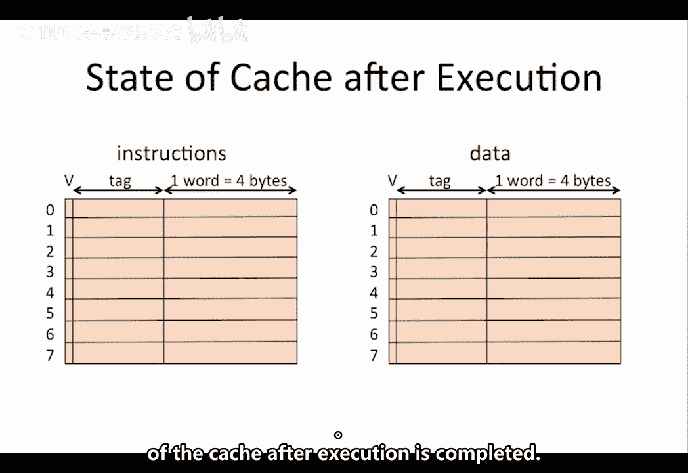
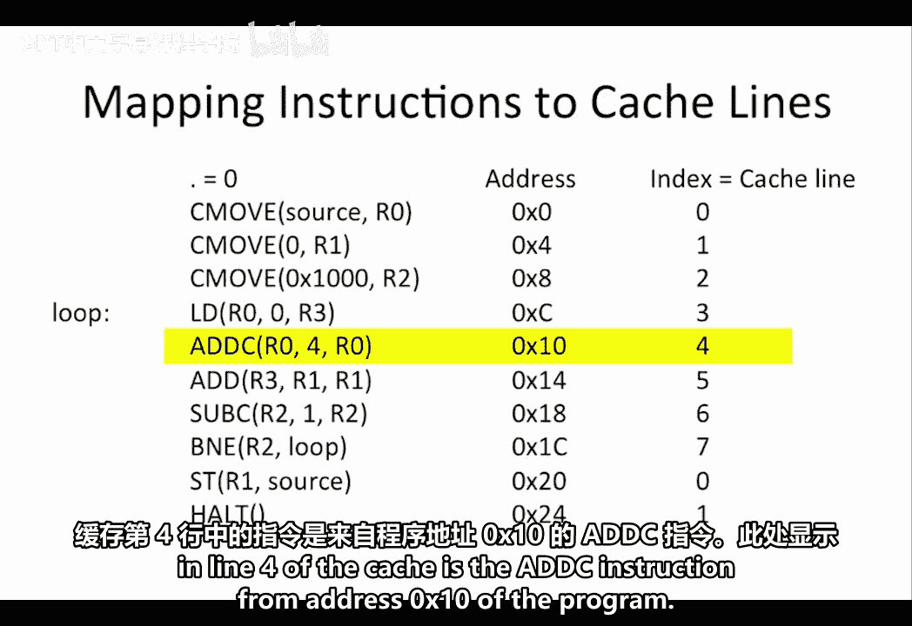
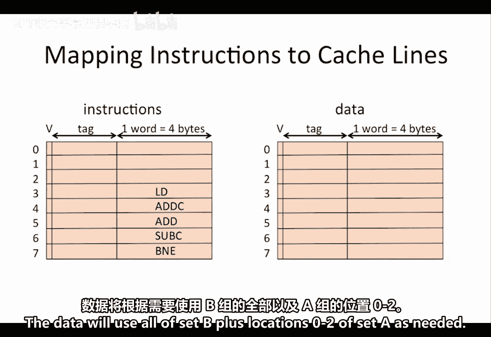
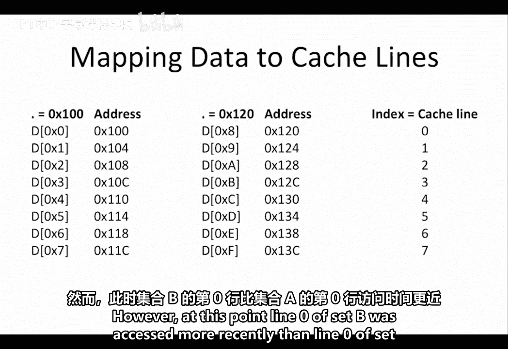
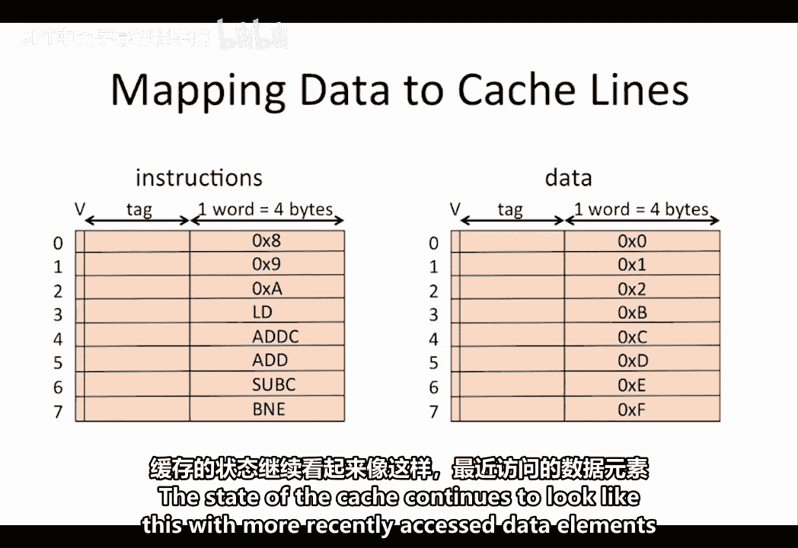
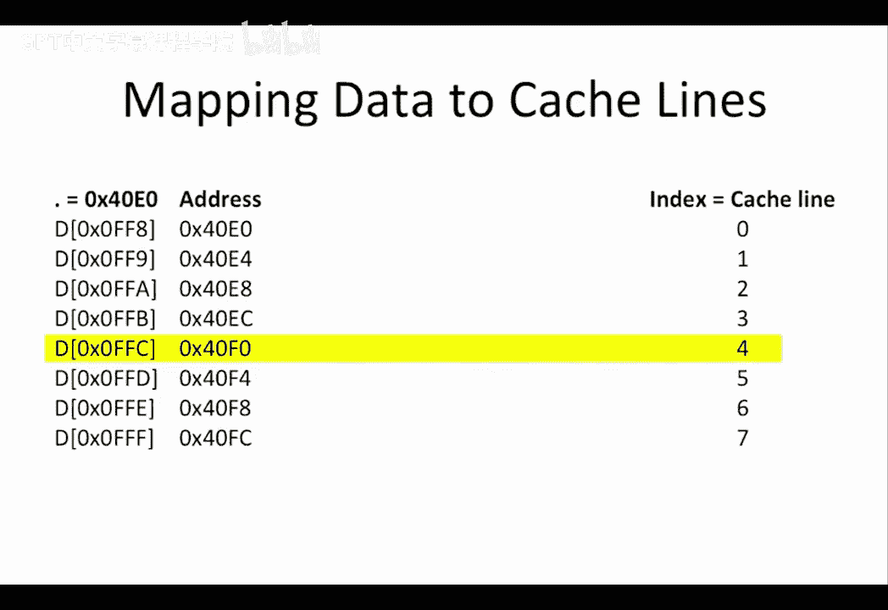

# 数字系统与计算机架构：P2：缓存工作示例详解 🧠

在本节课中，我们将通过一个具体的工作示例，深入探讨缓存（Cache）的工作原理。我们将分析一个与Beta处理器配合使用的两路组相联缓存，学习如何确定地址位的用途、计算缓存命中率，并理解程序执行后缓存的内容状态。

## 缓存地址映射分析 🔍

上一节我们介绍了缓存的基本概念，本节中我们来看看如何为一个具体的缓存设计地址映射。

考虑一个与我们的Beta处理器配合使用的两路组相联缓存。每个缓存行（Cache Line）存储一个32位（4字节）的数据字，并附带一个有效位（Valid Bit）和一个标记（Tag）。Beta处理器使用32位字节地址。我们需要确定哪些地址位应用作缓存索引（Index），哪些应用作标记（Tag），以确保最佳的缓存性能。

由于我们的地址以字节为单位，但数据以32位（4字节）字为单位，因此地址的最低2位始终被假定为 `0, 0`，以实现字对齐（Word Alignment）。

我们的缓存有8行，这意味着索引位必须是3位宽。我们希望用作索引的位是紧接着的次重要位，即地址的位 `[4:2]`。我们希望将这些位作为索引的一部分而非标记，是出于局部性（Locality）的考虑。其思想是，内存中彼此靠近的指令或数据比位于内存不同部分的指令或数据更有可能在同一时间段内被访问。

例如，如果我们的指令来自地址 `0x1000`，那么我们也很可能访问下一条位于地址 `0x1004` 的指令。在这种映射方案下，第一条指令的索引将映射到缓存的第0行，而下一条指令将映射到缓存的第1行，因此它们不会在缓存中引起冲突或缺失。

剩下的高位用作标记。为了能够唯一标识每个不同的地址，我们需要使用所有剩余的位作为标记。由于许多地址会映射到缓存中的同一行，我们必须比较数据的标记和缓存行的标记，以确认是否找到了我们正在寻找的数据。因此，我们使用地址位 `[31:5]` 作为标记。

## 缓存访问过程解析 🛠️

理解了地址映射后，我们来看看一个具体的访问过程。

假设我们的Beta处理器执行一次对地址 `0x5678` 的读取操作。我们希望确定需要检查缓存中的哪些位置，以判断数据是否已在缓存中。

为了确定这一点，我们需要识别地址中对应于索引的部分。索引位是位 `[4:2]`，对于地址 `0x5678`，这部分对应的二进制是 `1, 1, 0`。这意味着该地址将映射到我们缓存的第6行。

由于这是一个两路组相联缓存，我们的数据可能位于两个可能的位置：第6行的A组或B组。因此，我们需要比较这两个位置的标记，以确定我们试图读取的数据是否已经在缓存中。

## 缓存性能计算 📊

在分析了单次访问后，我们来评估缓存的整体性能。

假设在读取时检查缓存需要1个周期，而在缺失时重新填充缓存需要额外的8个周期。这意味着发生缺失时的总时间为9个周期（1个周期用于首次检查值是否在缓存中，加上8个周期用于将值带入缓存）。

现在，假设我们希望实现平均读取访问时间为1.1个周期。要达到这个在许多次读取上的平均访问时间，所需的最低命中率是多少？

我们知道：
**平均访问时间 = 命中时间 × 命中率 + 缺失时间 × 缺失率**

如果我们称命中率为 `A`，那么缺失率就是 `1 - A`。因此，我们期望的平均访问时间1.1必须等于：
`1 × A + 9 × (1 - A)`

这简化为：
`1.1 = 9 - 8A`

这意味着：
`8A = 7.9`
或
`A = 7.9 / 8`

因此，要实现1.1个周期的平均访问时间，我们的命中率必须至少为 `7.9/8`。

## 基准程序缓存行为分析 📈

接下来，我们通过一个基准程序来具体分析缓存的行为。

我们获得了一个用于测试两路组相联缓存的基准程序。在执行开始前，缓存初始为空，即所有缓存行的有效位均为0。假设使用LRU（最近最少使用）替换策略，我们希望确定该程序的大致缓存命中率。

首先理解这个基准程序的功能。程序从地址0开始。它使用三条 `CMOVE` 操作初始化寄存器：
1.  第一条将 `R0` 初始化为 `source`，这是数据在内存中的存储地址。
2.  第二条将 `R1` 初始化为 `0`。
3.  第三条将 `R2` 初始化为 `0x1000`，这是基准程序将要处理的数据字数。

然后程序进入循环（图中黄色矩形部分）。循环从地址 `source + 0` 加载数据的第一个元素到寄存器 `R3`。接着，它将 `R0` 递增以指向下一个数据块。由于数据是32位宽，这需要加上常数 `4`（表示连续数据字之间的字节数）。然后，它将刚刚加载的值加到 `R1` 中，`R1` 保存了迄今为止所有数据的运行总和。最后，`R2` 减1，表示还剩更少的数据需要处理。只要 `R2` 不等于 `0`，循环就会重复。在基准程序的最后，最终的总和被存储在地址 `source`，程序停止。

在确定近似命中率时，可以基本忽略只执行一次（位于循环外）的指令。因此，只关注循环中反复发生的情况：每次循环，我们有5次指令取指和1次数据取指。

以下是循环中缓存行为的逐步分析：
*   **第一次循环**：指令取指全部缺失，然后将它们载入缓存。从地址 `0x100` 的数据加载也会缺失。当这些数据被载入缓存时，它不会替换最近加载的指令，而是被加载到缓存的B组中。
*   **后续循环**：所有指令取指都命中。然而，我们现在需要的数据是一个新的数据块，这将导致缓存缺失，并再次将新的数据字加载到缓存的B组中。
*   **稳定状态**：由于循环执行多次，我们也可以忽略第一次循环迭代时的初始指令取指缺失。因此，在稳定状态下，每次循环我们得到5次指令缓存命中和1次数据缓存缺失。

这意味着我们近似的命中率是 `5/6`。

## 缓存最终状态确定 🗂️

最后，我们考虑在这个基准程序执行完成后，缓存中存储了什么内容。

正如我们之前看到的，由于我们有一个两路组相联缓存，指令和数据不会相互冲突，因为它们可以各自进入不同的组。我们希望确定在执行完成后，缓存的第4行中最终会存储哪条指令和哪个数据块。

首先确定指令到缓存行的映射。由于程序从地址0开始，第一条 `CMOVE` 指令在地址0，其索引等于二进制 `0b000`（即0）。这意味着它将映射到缓存第0行。由于此时缓存为空，它将被加载到A组的第0行。以类似的方式，接下来的两条 `CMOVE` 指令和 `LOAD` 指令将被加载到A组的第1至3行。

此时，我们开始加载数据。由于缓存是两路组相联，数据将被加载到B组，而不是移除加载到A组的指令。循环外的指令最终会被从A组中替换出来，以便为映射到相同行的数据项腾出空间，但构成循环的指令不会被替换，因为每次有东西映射到缓存第3至7行时，最近最少使用的位置将对应于一个数据值，而不是被反复使用的指令。

这意味着在基准程序执行结束时，位于缓存第4行的指令是程序中地址 `0x10` 处的 `ADD` 指令。

现在，考虑这个基准程序中使用的数据会发生什么。我们期望循环指令保留在缓存A组的第3至7行。数据将根据需要占用整个B组以及A组的第0至2行。

数据从地址 `0x100` 开始。地址 `0x100` 的索引部分是 `0b000`，因此这个数据元素映射到缓存第0行。由于第0行最近最少使用的组是B组，它将进入B组，从而保持A组的指令完整。下一个数据元素在地址 `0x104`。由于最低两位用于字对齐，该地址的索引部分是 `0b001`。因此，这个数据元素映射到B组的第1行，依此类推。

数据元素 `0x8` 位于地址 `0x120`。该地址的索引部分再次是 `0b000`，因此这个元素像元素 `0x0` 一样映射到缓存第0行。然而，此时，B组第0行比A组第0行最近被访问过，因此只执行一次的 `CMOVE` 指令将被一个映射到第0行的数据元素替换。

如前所述，循环中的所有指令都不会被替换，因为它们被反复访问，所以它们永远不会成为缓存行中最近最少使用的项。

在执行循环 `0x1000` 次（即访问了数据元素 `0` 到 `0xFFF`）之后，缓存的状态将如描述所示。循环指令继续保留在缓存中的原始位置。缓存状态持续如此，最近访问的数据元素替换更早的数据元素。

当基准程序执行完毕时，最终位于缓存第4行的数据元素是来自地址 `0x40F0` 的数据元素 `0x0FFC`。

---

**本节课总结**：在本节课中，我们一起学习了如何为一个两路组相联缓存设计地址映射（索引位与标记位），如何根据访问时间和缺失惩罚计算所需的缓存命中率，以及如何通过分析一个具体程序的执行流程来预测其缓存行为（命中/缺失）和最终缓存状态。这些是理解和优化计算机内存系统性能的核心技能。