# 【数字系统与计算机架构P2 6.004 2017】麻省理工学院—中英字幕 p36 15.2.4 Control Hazards -BV19m41127Kj_p36-

Now let's turn our attention to control hazards illustrated by the code fragment shown here。

Which instruction should be executed after the B&E？If the value in R3 is non0。

 at C should be executed。 If the value in R3 is 0， the next instruction should be sub。

If the current instruction is an explicit transfer of control， in other words， jumps or branches。

The choice of the next instruction depends on the execution of the current instruction。

What are the implications of this dependency on our execution pipeline？

How does the unpipelined implementation determine the next instruction？For branches， BEQ or B&E。

 the value to be loaded into the program counter depends on one， the Op code， in other words。

 whether the instruction is a BEQ or B&E，2， the current value of the program counter since that's used in the offset calculation。

 and three， the value stored in the register specified by the RA field of the instruction。

 since that's the value tested by the branch。For jump instructions。

 the next value of the program counter depends once again on the Op code field and the value of the RA register。

For all other instructions， the next PC value depends only on the op code of the instruction and the value PC+ 4。

Exceptions also change the program counter we'll deal with them later in the lecture。

The control hazard is triggered by jump and branches since their execution depends on the value in the RA register。

 In other words they need to read from the register file， which happens in the RF stage。

Our bypass mechanisms ensure that we'll use the correct value for the RA register。

 even if it's not yet written into the register file。

What we're concerned about here is that the address of the instruction following the Juer branch will be loaded into the program counter at the end of the cycle when the jump or branch is in the RF stage。

But what should the IF stage be doing while all this is going on in the RFf stage？

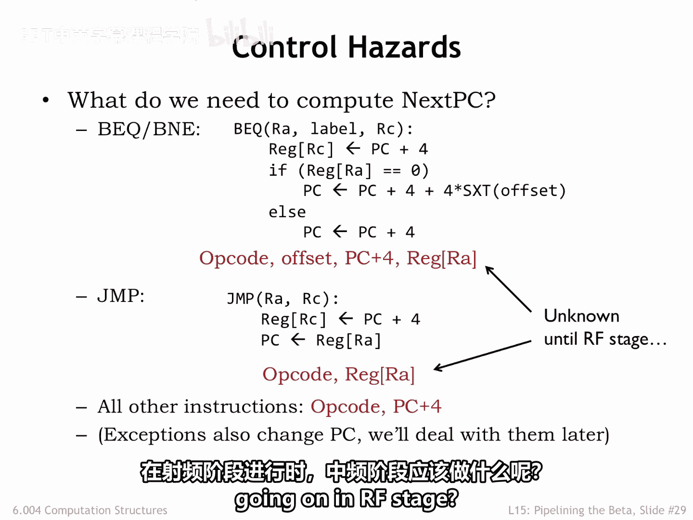

The answer is that in the case of jumps and taken branches。

 we don't know what the IF stage should be doing until those instructions are able to access the value of the RA register in the R stage。

One solution is to stall the IF stage until the IF stage can compute the necessary result。

This was the first of our general strategies for dealing with hazards。How would this work？

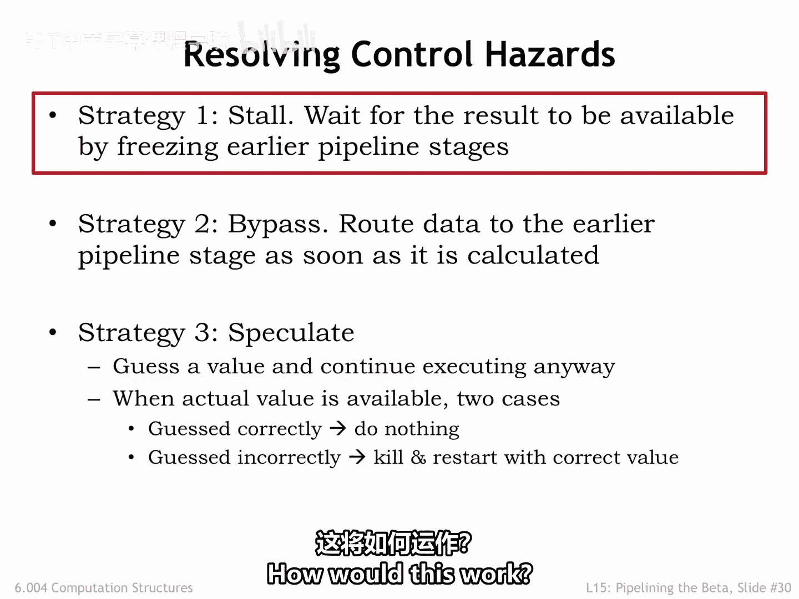

If the Op code in the RF stage is jump， the EQ or B&E， stall the IF stage for one cycle。

In the example code shown here， assume that the value in R3 is nonze when the B&E is executed。

 in other words that the instruction following the B&E should be the aC at the top of the loop。

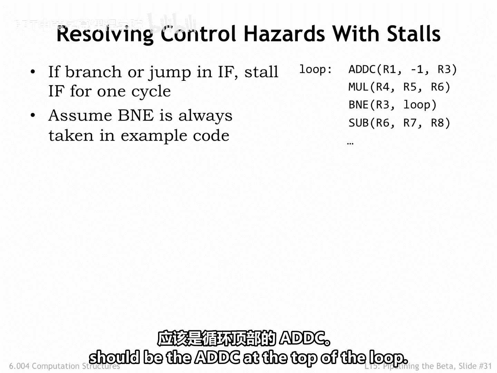

The pipeline diagram shows the effect we're trying to achieve。

A no op is inserted into the pipeline in cycles 4 and8。

Then execution resumes in the next cycle after the RF stage determines what instruction comes next。

Note， by the way， that we're relying on our bypass logic to deliver the correct value for R3 from the MEm stage since the ADC instruction that wrote into R3 is still in the pipeline。

 In other words， we have a data hazard to deal with too。Looking at say。

 the right backtage in the pipeline diagram， we see that it takes four cycles to execute one iteration of our three instruction loop。

So the effective CPI is4/3， an increase of 33%。Using Sta to deal with control hazards has had an impact on the instruction throughput of our execution pipeline。

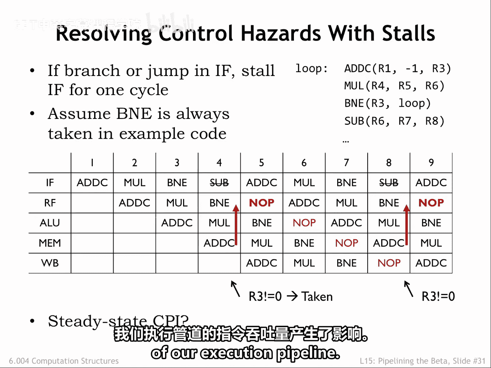

We've already seen the logic needed to introduce no ops into the pipeline。 In this case。

 we add a muux to the instruction path in the IF stage controlled by the IR source IF signal。

We use the superscript on the control signals to indicate which pipeline state holds the logic they control。

If the Op code in the RF stage is Ju the EQ or B&E， we set IR source IF to 1。

 which causes a no op to replace the instruction that was being read from main memory。And of course。

 we'll be setting the PC control signals to select the correct next PC value so the IO stage will fetch the desired follow on instruction in the next cycle。

If we replace an instruction with a no opP， we say we annued the instruction。

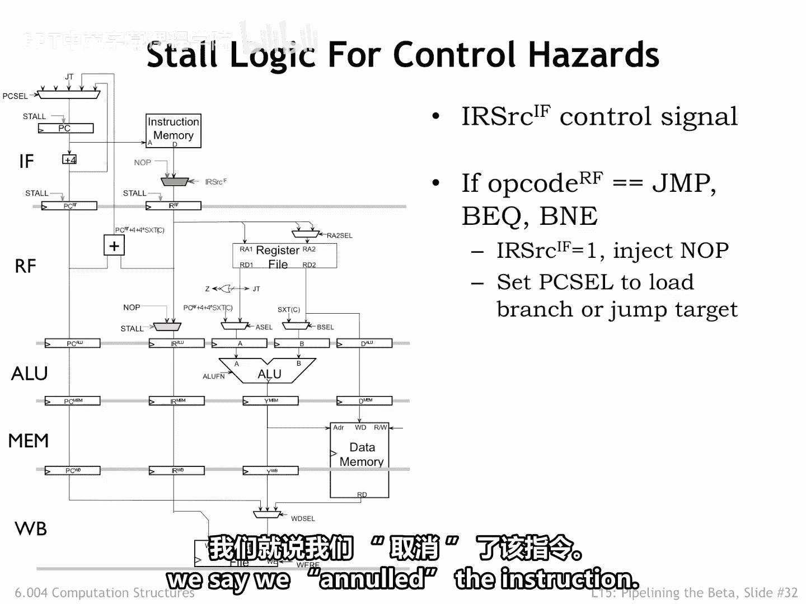

The branch instructions in the Beta ISA make their branch decision in the RF stage。

 since they only need the value in register RA。But suppose the ISA had a branch where the branch decision was made in the AOU stage。

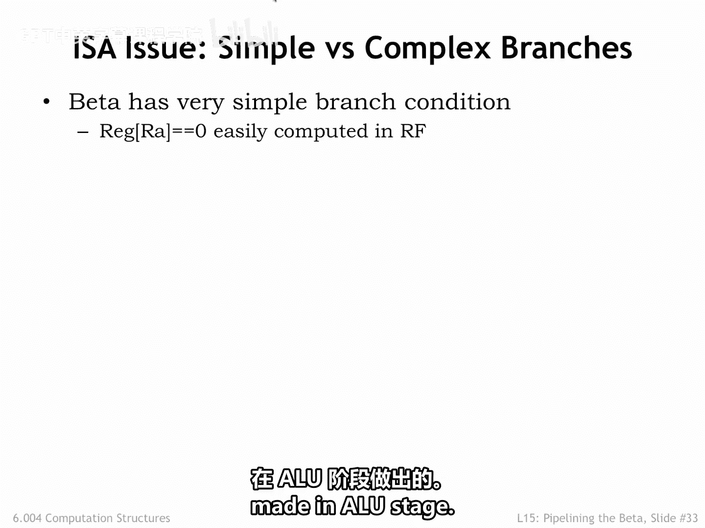

When the branch's decision is made in the ALU stage。

 we need to introduce two no ops into the pipeline。

 replacing the now unwanted instructions in the RF and IF stages。

This would increase the effect of CPI even further。

But the trade off is that the more complex branches may reduce the number of instructions in the program。

If we anul instructions in all the earlier pipeline stages， this is called Flushing the pipeline。

Since flushing the pipeline has a big impact on the effect of CPI。

 we do it when it's the only way to ensure the correct behavior of the execution pipeline。

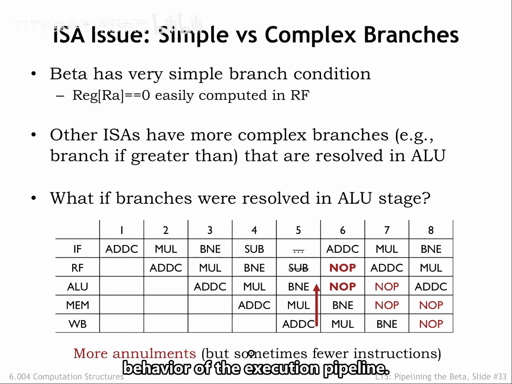

We can be smarter about when we choose to flush the pipeline when executing branches。

If the branch is not taken， it turns out that the pipeline has been doing the right thing by fetching the instruction following the branch。

Starting execution of an instruction， even when we're unsure whether we really want it executed is called speculation。

Speculation is okay if we're able to annuul the instruction before it has an effect on the CPU state。

 for example， by writing into the register file or main memory。Since these state changes。

 called side effects happen in the later pipeline stages。

 and instruction can progress through the IF， RF and AU stages before we have to make a final decision about whether it should be annulled。

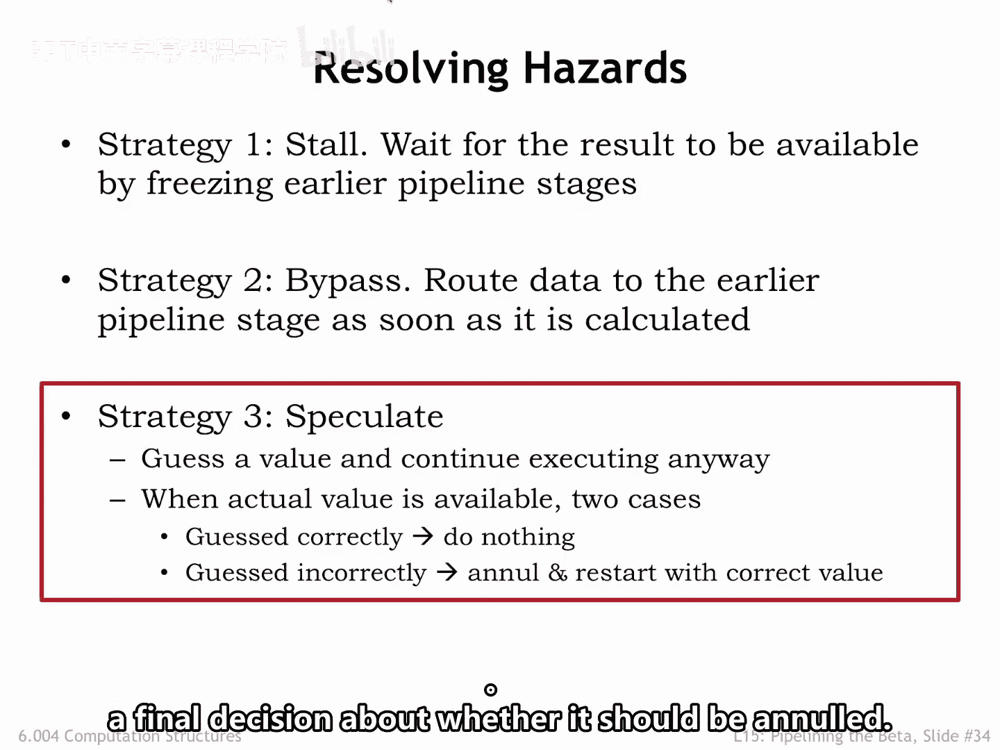

How does speculation help with control hazards？Guessing that the next value of the program counter is PC+4 is correct for all but jumps and taken branches。

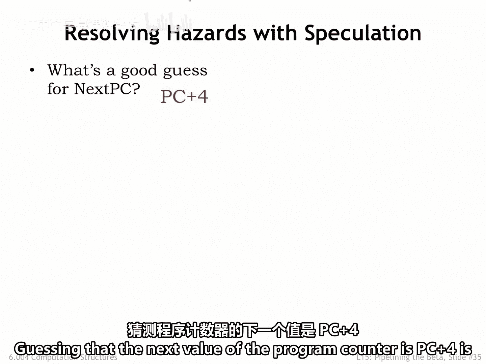

Here's our example again， but this time let's assume that the B&E is not taken。

 in other words that the value in R3 is 0。The sub instructionion enters the pipeline at the start of cycle 4 at the end of cycle 4。

 we know whether or not to ennu the sub。If the branch is not taken。

 we want to execute the subinstruction， so we just let it continue down the pipeline。In other words。

 instead of always anuling the instruction following the branch。

 we only annul it if the branch was taken。IfThe branch is not taken。

 the pipeline is speculated correctly and no instructions need to be annulled。

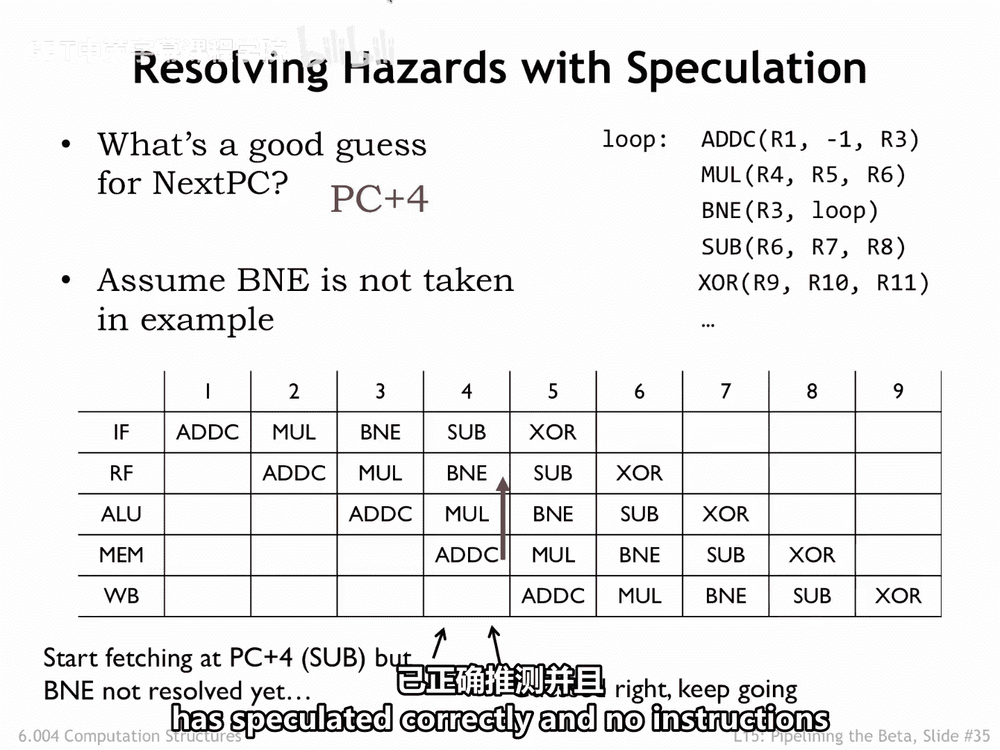

However， if the B&E is taken， the sub is annulled at the end of cycle 4。

 and a no op is executed in cycle 5。So we only introduce a bubble in the pipeline when there's a taken branch。

 fewerer bubbles will decrease the impact of ennulment on the effective CPI。

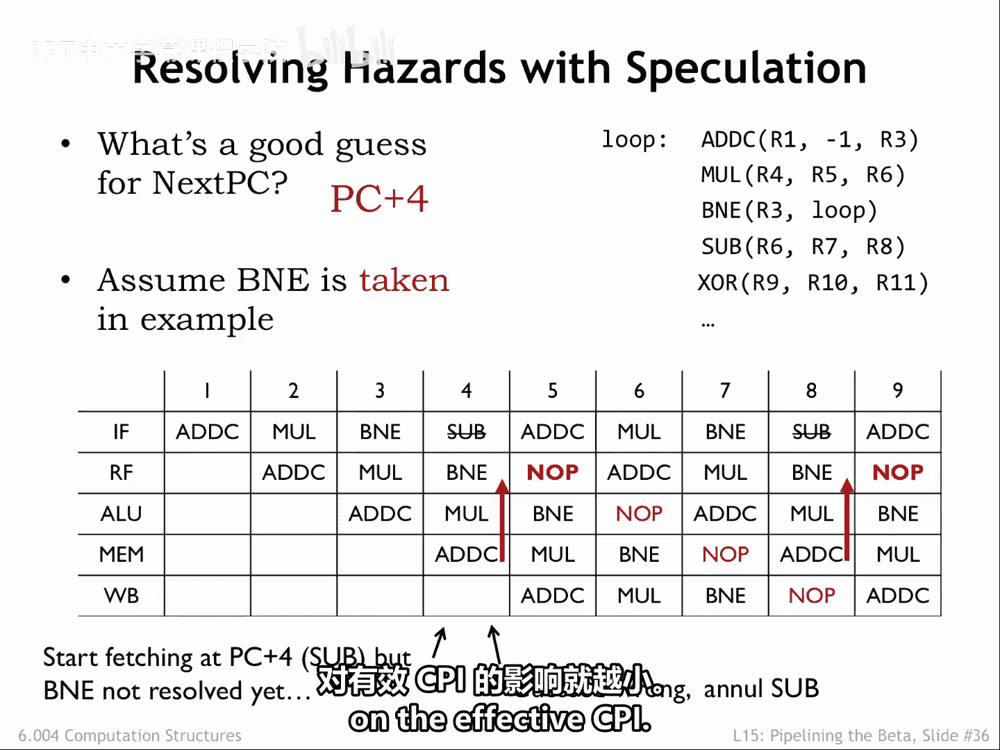

We'll be using the same data pass circuitry as before。

 we'll just be a bit more clever about when the value of the IR source IF control signal is set to one。

Instead of setting it to one for all branches， we only set it to one when the branch is taken。

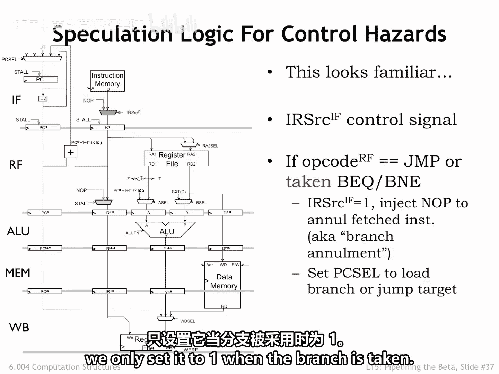

Our naive strategy of always speculating that the next instruction comes from PC+4 is wrong for jumps and taking branches。

Looking at simulated execution traces， we'll see that this error in speculation leads to about 10% higher effective CPI。

Can we do better？This is an important question for CPUs with D pipelines， for example。

 Intels in a heum processor from 2009 resolves the more complex X86 branch instructions quite late in the pipeline。

Since Nahalem is capable of executing multiple instructions each cycle。

 flushing the pipeline in Nehalem actually ans the execution of many instructions。

 resulting in a considerable hit on the CPI。Like many modern processor implementations。

 Nehalum has a much more sophisticated speculation mechanism。

Rather than always guessing the next instruction is at PC+4。

 it only does that for non branch instructions。For branches。

 it predicts the behavior of each individual branch based on what the branch did last time it was executed。

 and some knowledge of how the branch is being used。For example。

 backward branches at the end of loops， which are taken for all but the final iteration of the loop can be identified by their negative branch offset values。

Nheem can even determine if there's a correlation between branch instructions。

 using the results of another earlier branch to speculate on the branch's decision of the current branch。

With these sophisticated strategies， Neheum's speculation is correct 95 to 99% of the time。

 greatly reducing the impact of branches on the effect of CPI。

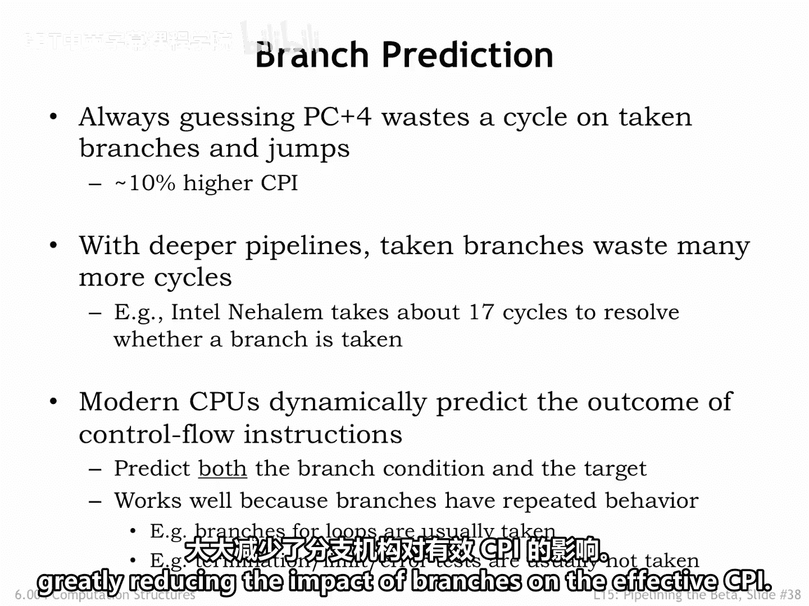

There's also the lazy option of changing the ISA to deal with control hazards。 For example。

 we could change the ISA to specify that the instruction following a jumper branch is always executed。

In other words， the transfer of control happens after the next instruction。

This change ensures that the guess of PC+ 4 as the address of the next instruction is always correct。

In the example shown here， assuming we change the ISA。

 we can reorganize the execution order of the loop to place the mall instruction after the B&ne instruction in the so called branch delay slot。

Since the instruction in the branch delay slot is always executed。

 the mall instruction will be executed during each iteration of the loop。

The resulting execution shown in this pipeline diagram。

 assuming we can find an appropriate instruction to place in the delay slot。

 the branch will have zero impact on the effect of CPI。

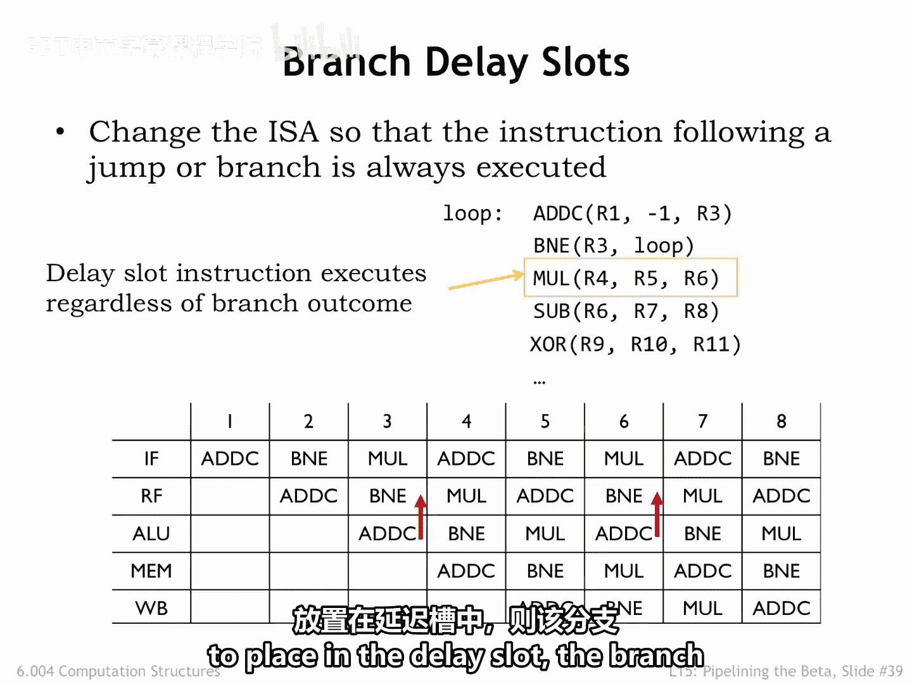

A branch delay lace slots a good idea。Seems like they reduce the negative impact that branches might have on instruction throughput。

The downside is that only half of the time can we find instructions to move to the branch delay slot。

The other half of the time， we have to fill it with an explicit No op instruction。

 increasing the size of the code。And if we make the branch decision later in the pipeline。

 there are more to branch delay slots， which would be even harder to fill。In practice。

 it turns out that branch prediction works better than delay slots in reducing the impact of branches。

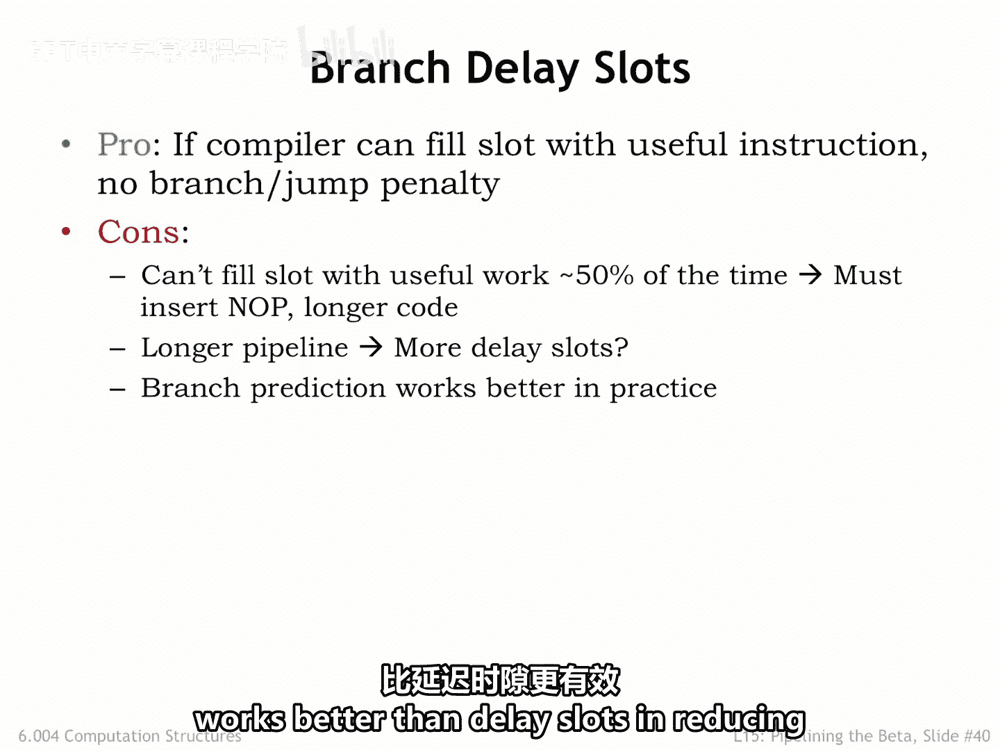

So once again， we see it's problematic to alter the ISA to improve the throughput of pipeline execution。

ISSAs outlive implementations， so it's best not to change the execution cemantics to deal with performance issues created by a particular implementation。

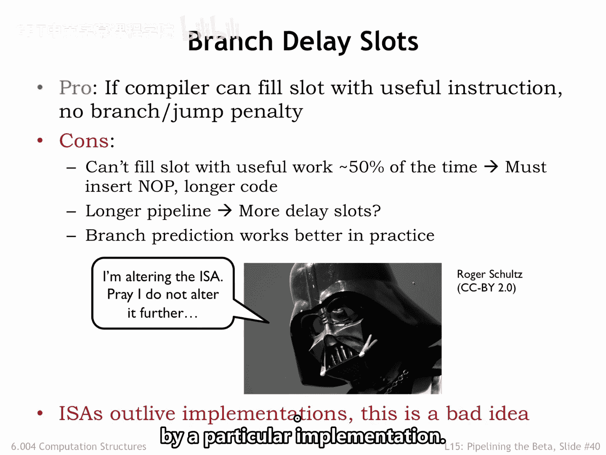