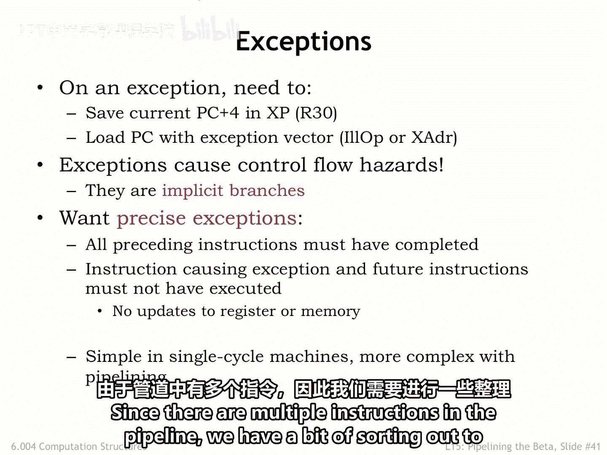
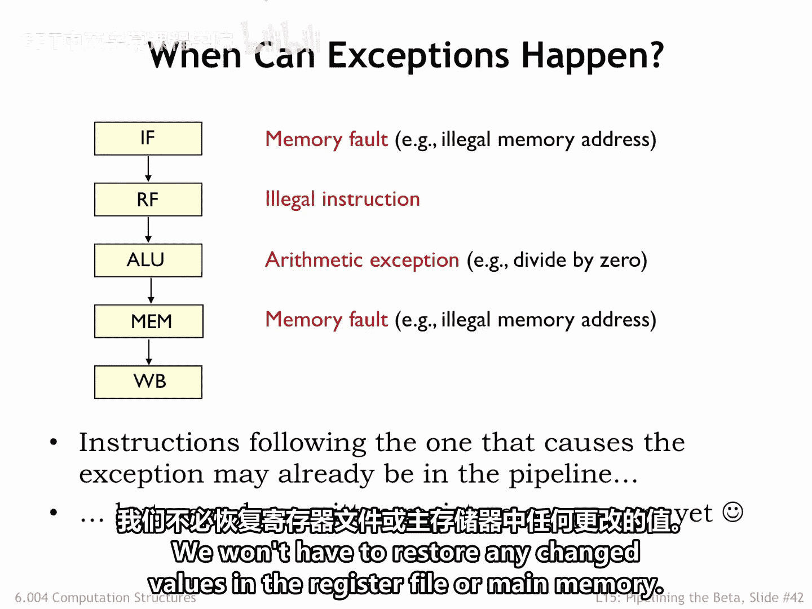
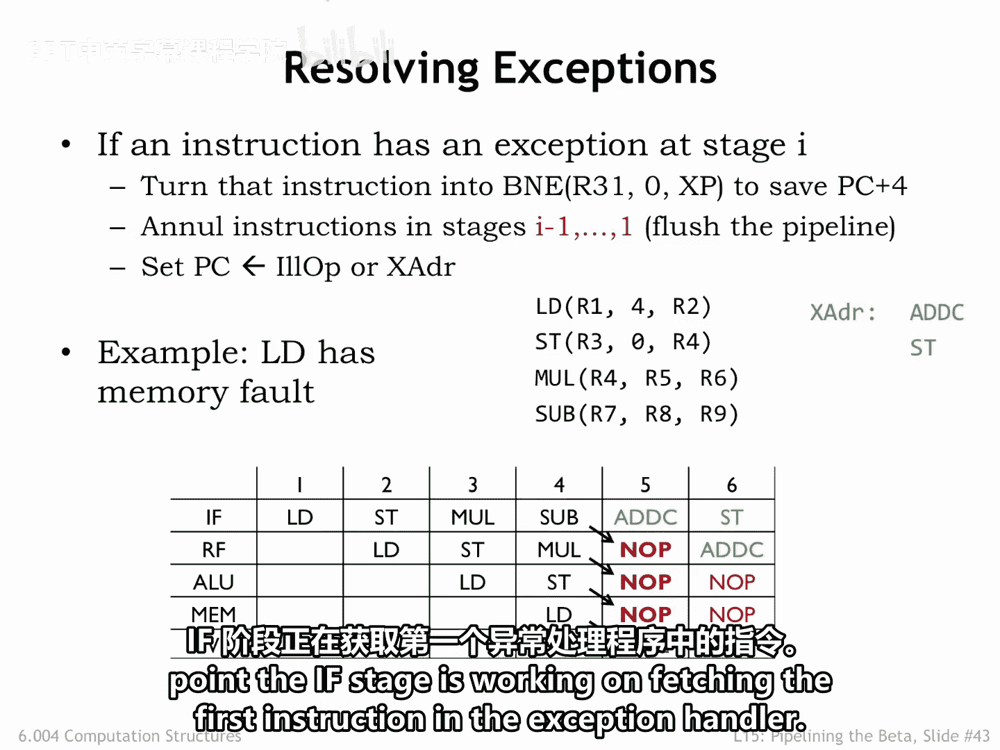
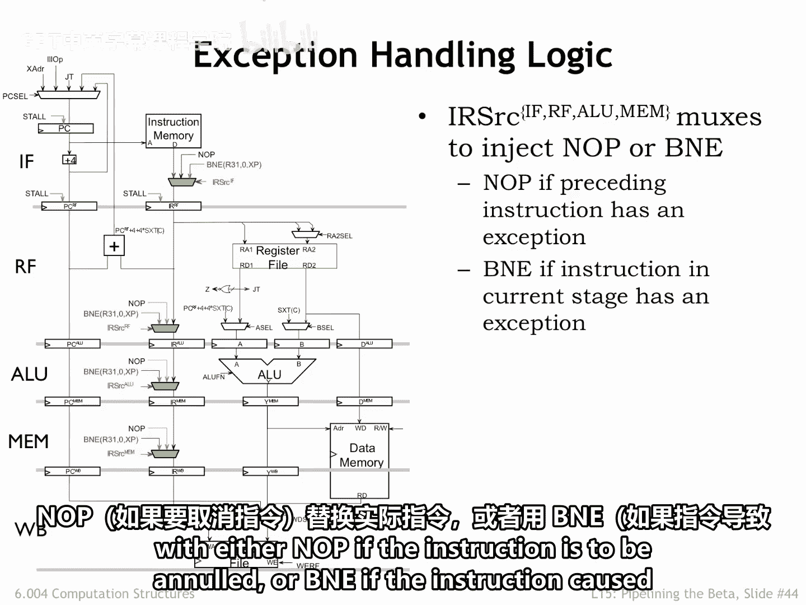
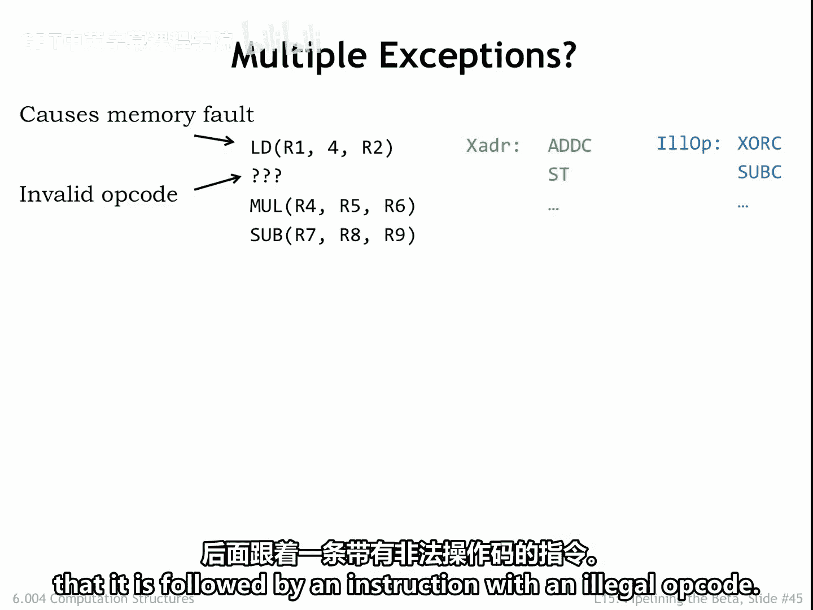
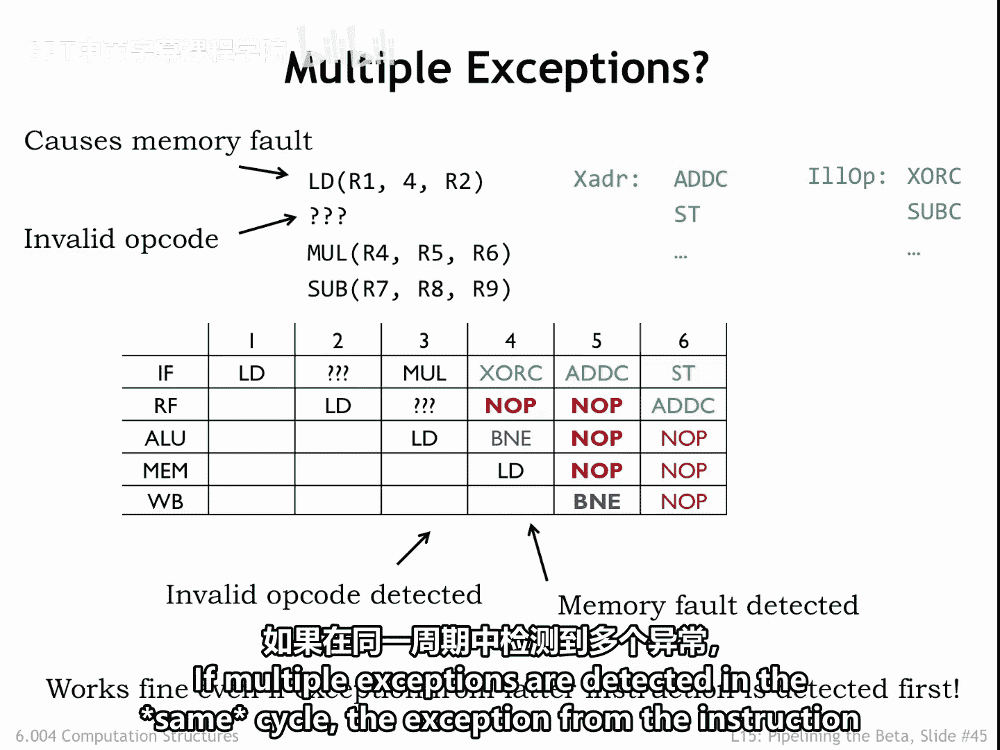
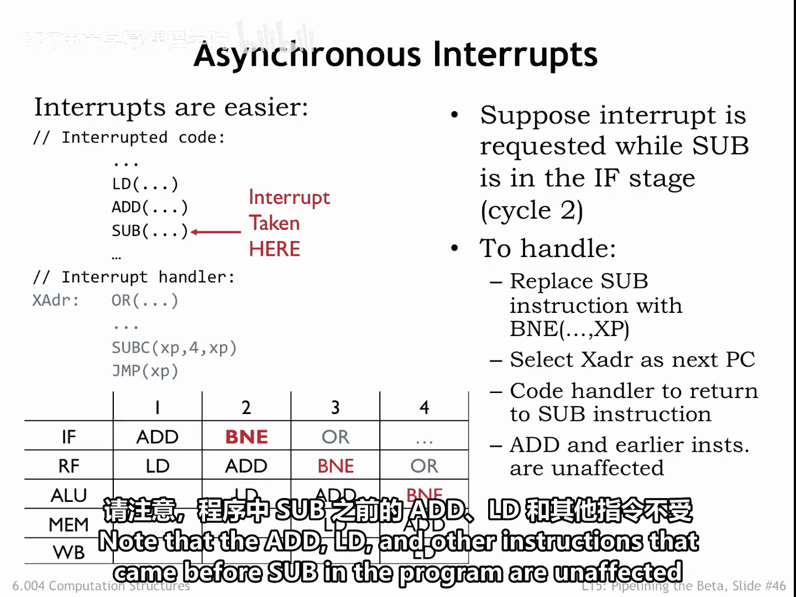
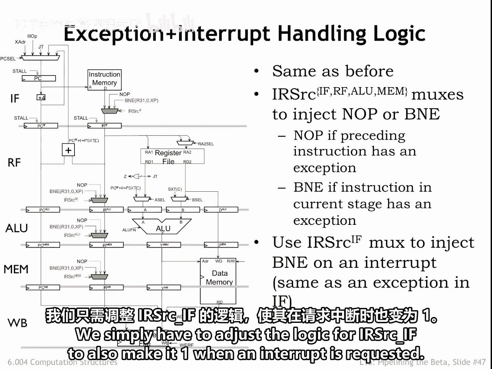

# 数字系统与计算机架构：P2：异常与中断处理 🚨

在本节课中，我们将要学习异常和中断如何影响流水线执行。我们将探讨当发生非法指令或外部中断时，处理器如何保存现场、跳转到处理程序，并确保程序的正确执行状态。

上一节我们介绍了流水线的基本原理，本节中我们来看看当程序执行遇到意外情况时，流水线应如何应对。

## 异常对流水线的影响

当发生非法指令或外部中断时，我们需要将 `PC+4` 的值存入 `XP` 寄存器，并将程序计数器加载到相应异常处理程序的地址。异常会导致控制流冒险，因为它们本质上是隐式的分支。

在非流水线实现中，异常只影响当前指令的执行。我们希望在我们的流水线实现中达到完全相同的效果。

因此，我们首先需要识别流水线中哪条指令受到了影响，然后确保该指令之前的代码正确完成，同时作废受影响的指令及其之后所有在流水线中的指令。由于流水线中存在多条指令，我们需要进行一些梳理工作。

## 异常的检测时机

在流水线执行过程中，我们何时确定一条指令将引发异常？

一个明显的例子是在 RF 阶段解码指令时检测到非法操作码。但异常也可能在其他流水线阶段产生。例如：
*   ALU 阶段可能在除法指令的第二操作数为 0 时产生异常。
*   MEM 阶段可能检测到指令试图访问非法地址。
*   类似地，IF 阶段在获取下一条指令时可能产生内存异常。

在每种情况下，引发异常的指令之后的指令可能已经进入流水线，需要被作废。

好消息是，由于寄存器值只在写回阶段更新，作废一条指令只需要将其替换为 `NOP` 操作。我们无需恢复寄存器文件或主存中任何已更改的值。

## 异常处理方案

以下是我们的处理方案。如果一条指令在阶段 `I` 引发异常：
1.  将该指令替换为特殊的 `B anE` 指令，其唯一副作用是将 `PC+4` 值写入 `XP` 寄存器。
2.  通过作废更早流水线阶段中的指令来清空流水线。
3.  最后，将程序计数器加载到异常处理程序的地址。

在这个例子中，假设 `load` 指令将在 MEM 阶段（发生在周期 4）产生内存异常。箭头显示了周期 5 时流水线中指令的改写情况，此时 IF 阶段正在获取异常处理程序的第一条指令。

## 流水线的必要修改

我们需要修改指令路径中的多路选择器，使其能够将实际指令替换为 `NOP`（如果指令被作废）或 `B anE`（如果指令引发异常）。

## 多异常处理

由于流水线同时执行多条指令，我们必须考虑如果在执行期间检测到多个异常会发生什么。

在这个例子中，假设 `load` 指令将在 MEM 阶段引起内存异常，并且请注意它后面跟着一条具有非法操作码的指令。

观察流水线图。非法操作码在周期 3 的 RF 阶段被检测到，导致非法指令异常处理在周期 4 开始。但在该周期，MEM 阶段检测到来自 `load` 指令的非法内存访问，因此导致内存异常处理在周期 5 开始。

请注意，由较早指令 `load` 引起的异常覆盖了由较晚非法操作码引起的异常，即使非法操作码异常被先检测到。这是正确的行为，因为一旦 `load` 的执行被放弃，流水线的行为应如同 `load` 之后的所有指令都未被执行一样。

如果在同一周期检测到多个异常，应优先处理流水线中最靠后指令引发的异常。

## 外部中断的处理

外部中断也表现为隐式分支，但事实证明它们在流水线中处理起来稍微容易一些。

我们将把外部中断视为影响 IF 阶段的异常。假设外部中断发生在周期 2。这意味着 `sub` 指令将被替换为我们的特殊 `B& E` 指令以捕获 `PC+4` 值，并强制下一条 PC 为中断处理程序的地址。

中断处理程序完成后，我们希望在被中断的 `sub` 指令处恢复执行。因此，我们将编写处理程序来更正已保存的 `XP` 寄存器中的值，使其指向 `sub` 指令。

这一切都显示在流水线图中。请注意，程序中位于 `sub` 之前的 `add`、`load` 和其他指令不受中断影响。

我们可以使用现有的指令路径多路选择器来处理中断，因为我们将其视为 IF 阶段异常。我们只需要调整 IF 阶段 IR 源的逻辑，使其在请求中断时也输出 `B anE` 指令。

## 总结

本节课中我们一起学习了异常和中断在流水线处理器中的处理机制。我们了解到，异常通过在流水线特定阶段检测并替换为特殊指令来处理，需要保存 `PC+4` 并跳转到处理程序。当多个异常发生时，流水线中最靠后指令引发的异常具有优先权。外部中断则被当作影响取指阶段的异常来处理，确保了程序状态的正确保存与恢复。