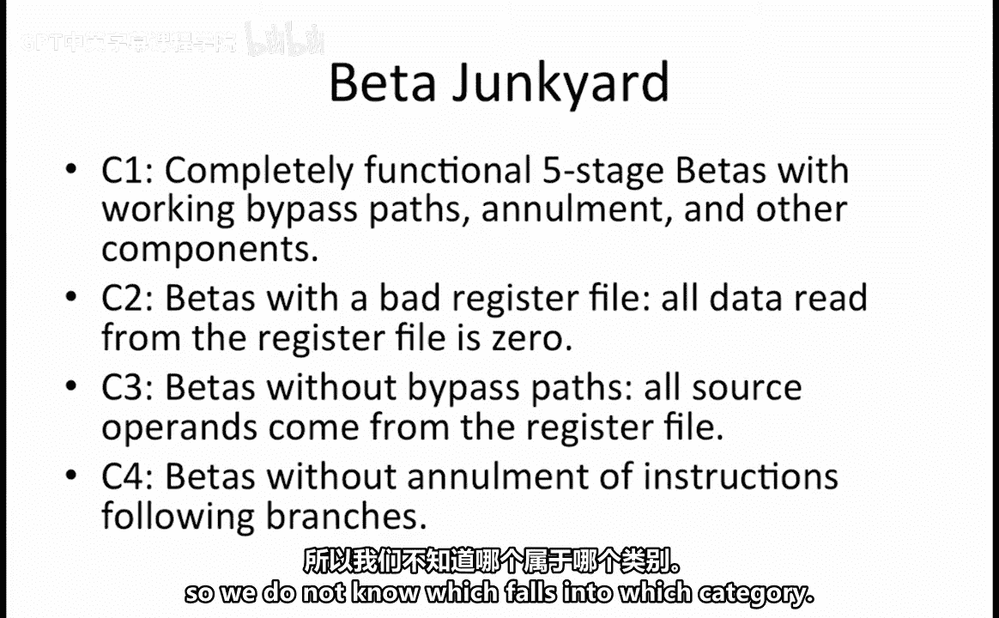
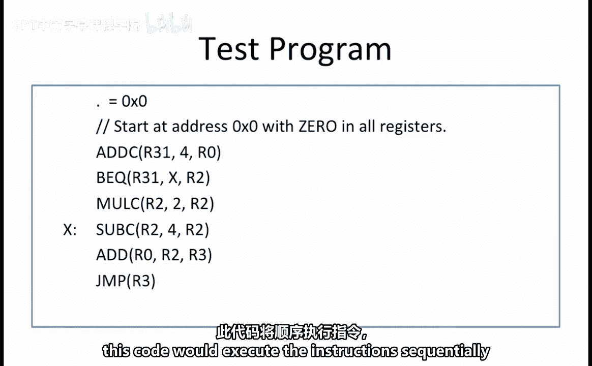
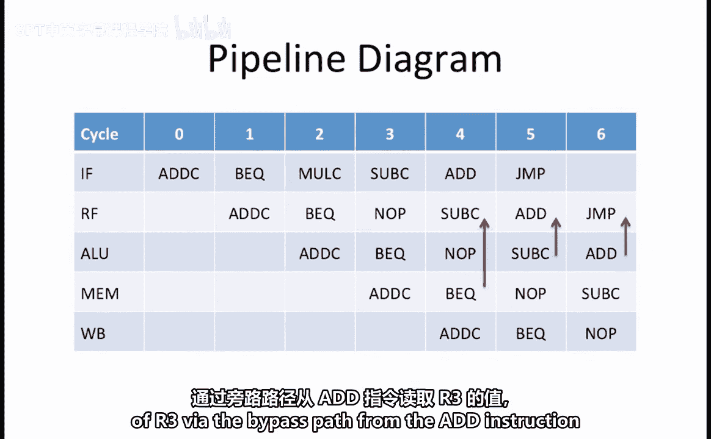
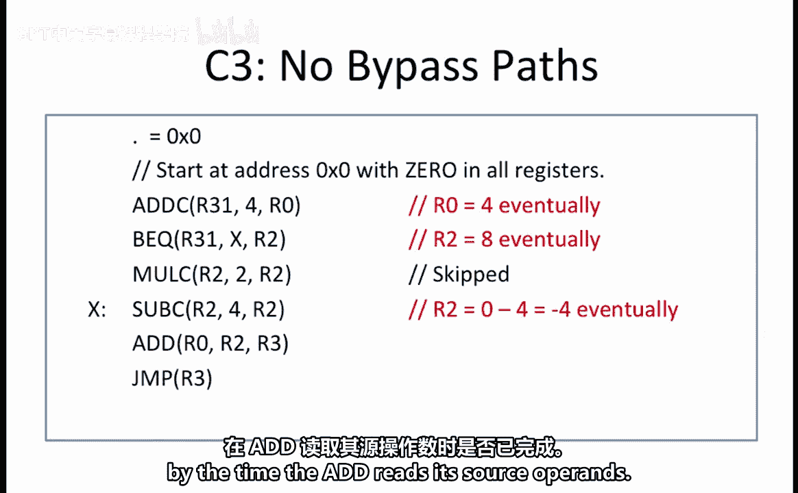
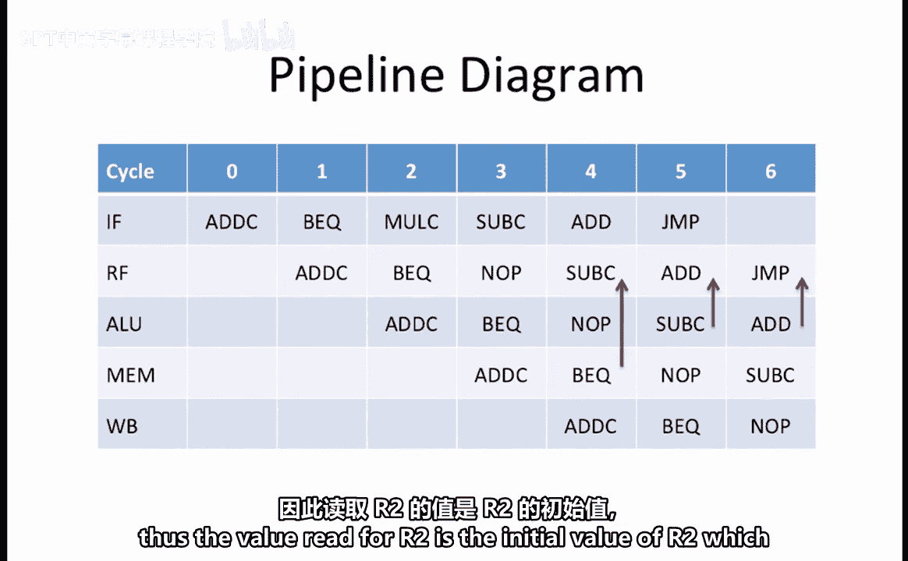
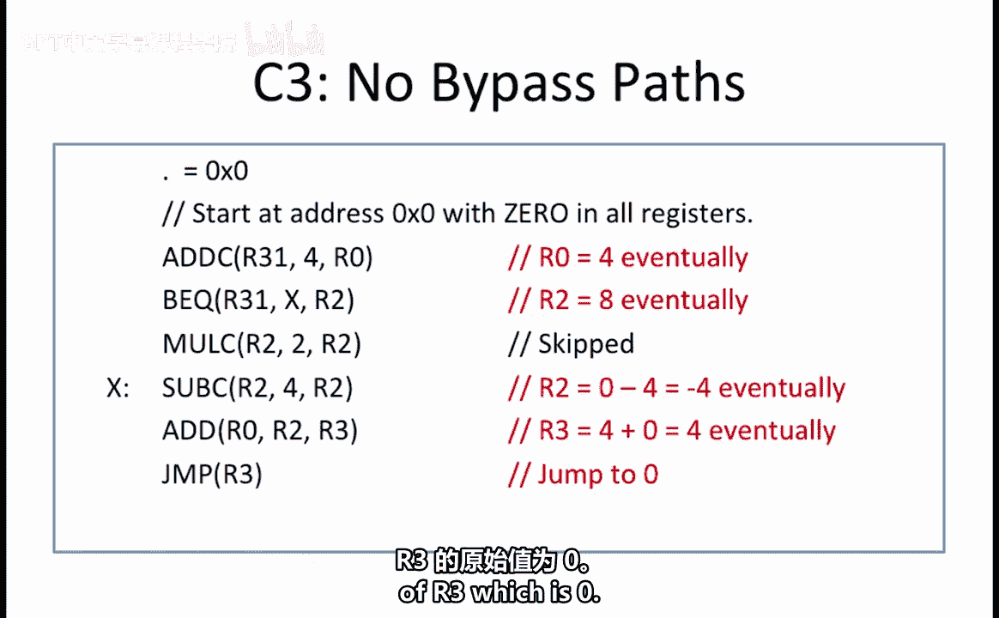
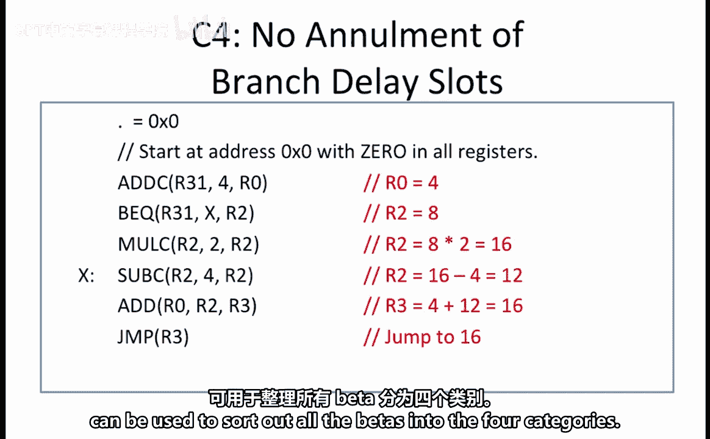

# 【数字系统与计算机架构P2 6.004 2017】麻省理工学院—中英字幕 p40 15.2.7 Worked Examples： Beta Junkyard -BV19m41127Kj_p40-

For this problem， assume that you have discovered a room full of discarded five stage pipeline betas。

 These betas fall into four categories。 The first is completely functional five stage betas with full bypass and annulment logic。

😊，The second are betas with a bad register file in these beta。

 all data read directly from the register file is 0。Note that if the data is read from a bypass path。

 then the correct value will be read。The third set are betas without bypass pads。 And finally。

 the fourth are betas without enulment of branch delay slots。

The problem is that the betas are not labeled， so we do not know which falls into which category。

You come up with a test program shown here。 Your plan is to single step through the program using each beta chip。

 carefully noting the address that the final jump loads into the PC。

 Your goal is to determine which of the four classes each chip falls into via this jump address。

Notice that on a fully functional beta， this code would execute the instruction sequentially。

 skipping the Mli instruction。😊。

Here we see a pipeline diagram showing execution of this program on a fully functional beta from category C1。

It shows that although the Molsi instruction is fetched in cycle 2。

 it gets annulled when the B EQ is in the RF stage。

 and it determines that the branch to label X or the sub C instruction will be taken。

The mole sea is annulled by inserting a no op in its place。

The Ad C and BQ instructions read R31 from the registerister file。The subea， however。

 gets the value of R2 via the bypass path from the BQ instruction， which is in the MEM stage。

The ad then reads R 0 and R 2。 R 0 has already made it back to the register file because the add C instruction completed by the end of cycle 4。

R 2， however， is read via the bypass path from the subea instruction， which is in the AL U stage。

 Finally， the jump reads the value of R 3 via the bypass path from the add instruction。

 which is in the AL U stage in cycle 6。

When run on a fully functional beta with bypass paths and aulment of branch delay slots。

 the code behaves as follows。The add C sets our0 equal to 4。The BEQ stores PC+ 4 into R2。

 Since the add C is at address 0， the BQ is at address 4， so PC+ 4 equals 8 is stored into R2。

 and the program branches to label X。Next， the subs subtracts 4 from the latest value of R2 and stores the result。

 which is 4 back into R 2。The ad add are 0 and R 2， or 4 and 4， and stores the result。

 which is 8 into r 3。The jump jumps to the address in R3， which is 8。When run on C2。

 which has a bad register file that always outputs a zero， the behavior of the program changes a bit。

The add C and BQ instructions which use R31， which is 0 anyways， behave in the same way as before。

The sub C， which gets the value of R2 from the bypass path， reads the correct value for R2。

 which is 8。Recall that only reads directly from the register file returnturn a0。

 whereas if the data is coming from a bypass path， then you get the correct value。

 So the sub C produces a4。The ad reads R0 from the register file and R2 from the bypass path。

The result is that the value of r0 is red as if it was0， while that of r2 is correct and is4。

So R3 gets the value 4 assigned to it， and that is the address that the jump instruction jumps to because it too reads its register from a bypass path。

When run on C3， which does not have any bypass paths。

 some of the instructions will read stale values of their source opera。

 Let's go through the example in detail。 the add C and B， E， Q instructions。Read R 31。

 which is 0 from the register file。 So what they ultimately produce does not change。 However。

 you must keep in mind that the updated value of the destination register will not get updated until after that instruction completes the right back stage of the pipeline。

When the sub C reads R2， it gets a stale value of R2 because the BQ instruction has not yet completed。

 so it assumes that r2 equals 0。 It then subtracts 4 from that and tries to write-4 into R2。Next。

 the ad runs， recall that the ad would normally read our0 from the register file because by the time the ad is in the RF stage。

 the add C， which writes to our 0， has completed all the pipeline stages。

The ad also normally read R2 from the bypass path。However， since C3 does not have bypass paths。

 it reads a stale value of R2 from the register file to determine which stale value it reads。

 we need to examine the pipeline diagram to see if either the BQ or the subea operations。

 both of which eventually update R 2 have completed by the time the ad reads its source opera。

Looking at our pipeline diagram， we see that when the addd is in the RFf stage。

 neither the B EQ nor the sub C have completed。 thus the value read for R2 is the initial value of R2。

 which is 0。

We can now determine the behavior of the add instruction。

 which is that it assumes r0 equals 4 and r2 equals 0 and will eventually write a 4 into r3。Finally。

 the jump instruction wants to read the result of the ad， however， since there are no bypass paths。

 it reads the original value of R3， which was0 and jumps to address 0。Of course。

 had we looked at our code a little more closely， we could have determined this without all the intermediate steps。

 because the ad is the only instruction that tries to update R3。

 And you know that the jump would normally get R3 from the bypass path， which is not available。

 Therefore， it must read the original value of R 3， which is 0。

In Cat C 4， the betas do not annul instructions that were fetched after a branch instruction。

 but aren't supposed to get executed。 This means that the mole C， which is fetched after the B， E Q。

 is actually executed in the pipeline and affect the value of R 2。

Let's take a close look at what happens at each instruction。Once again。

 we begin with the add C setting R 0 to 4 and the B Q setting R 2 to 8。

 Since our bypass paths are now working， we can assume that we can immediately get the updated value。

Next， we execute the mole C， which takes the latest value of R2 from the bypass path and multiplies it by 2。

 so it sets art 2 equal to 16。The subc now uses this value for R2。

 from which it subtracts 4 to produce r2 equal to 12。The addd then reads are 0 equal to4。

 and adds to it are 2 equal to 12 to produce our3 equal to 16。Finally， the jump jumps to address 16。

Since each of the four categories produces a unique jump address。

 this program can be used to sort out all the betas into the four categories。

