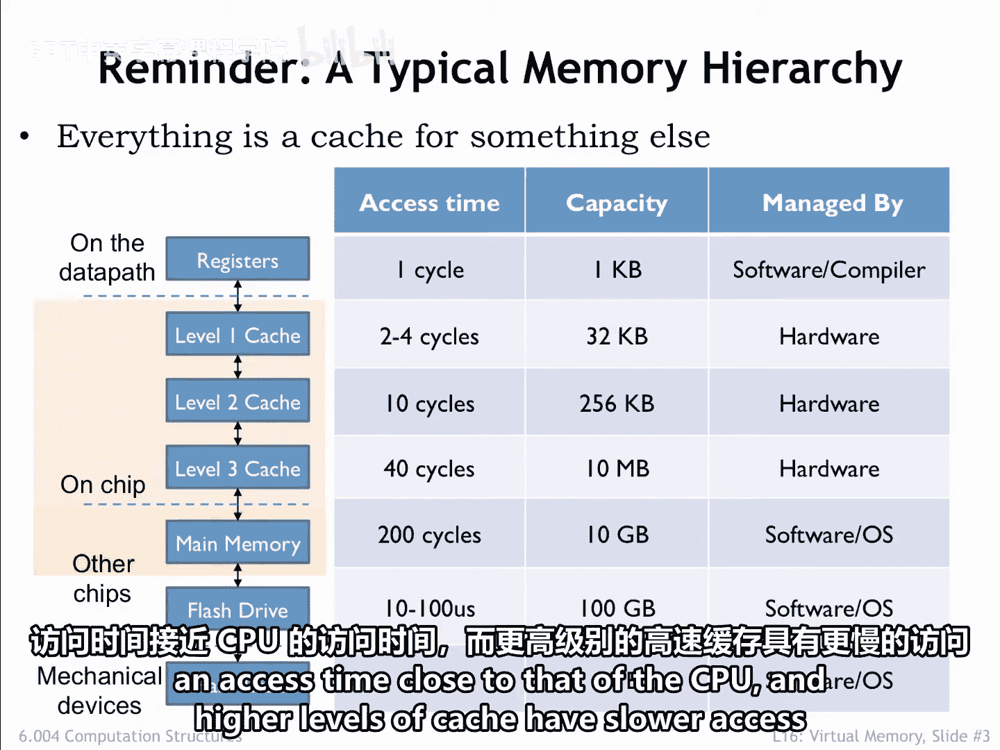
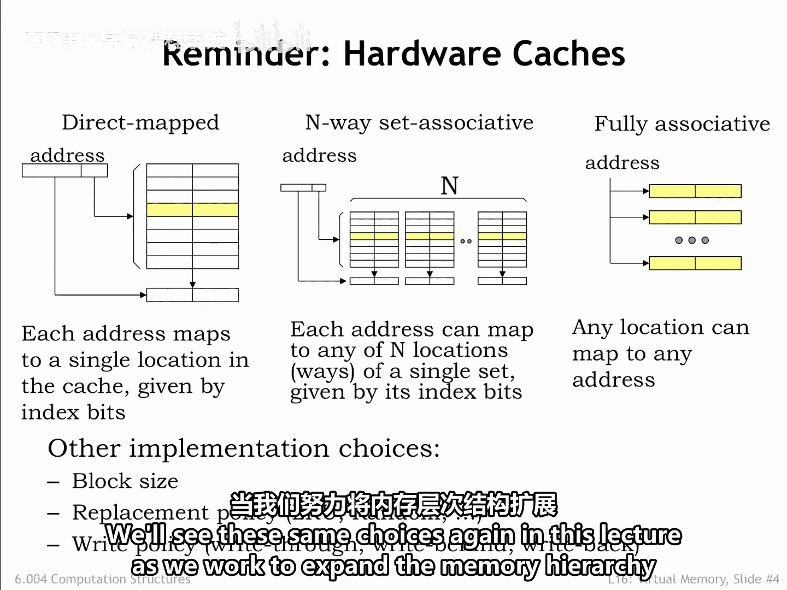
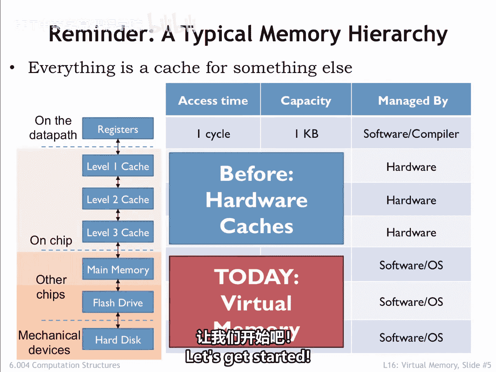
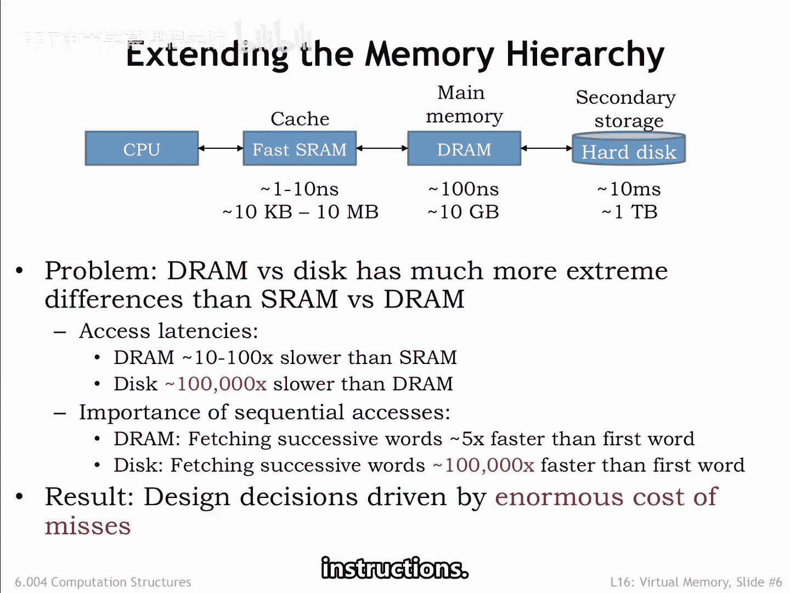
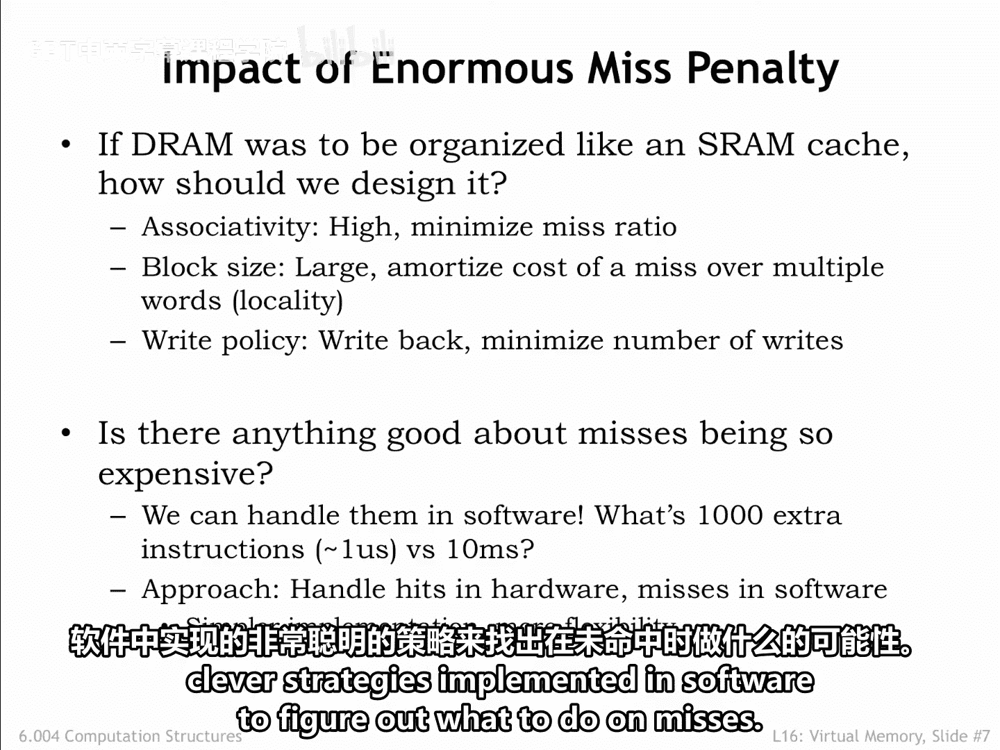

# 数字系统与计算机架构P2：6.004：16.2.1 更深入的内存层次结构 🧠

在本节课中，我们将回到在第二部分第14讲中讨论过的内存系统。我们将探讨如何将内存层次结构扩展到主存之外，并引入虚拟内存系统的概念。

## 概述：从缓存到虚拟内存

上一节我们介绍了缓存如何利用局部性原理，通过硬件自动管理，为CPU提供对少量内存位置的快速访问。本节中，我们来看看如何将主存视为一个更大的“缓存”，用于访问容量巨大但速度极慢的二级存储（如硬盘），从而构建一个虚拟内存系统。

## 回顾：缓存与主存

我们之前了解到，现代内存技术存在一个根本性的权衡：随着内存容量的增加，其访问时间也会增加。缓存通过关联寻址等技术，自动管理CPU最常访问的内存位置内容，从而构建出兼具大容量和短平均访问时间的内存系统。缓存的有效性基于**局部性原理**：如果CPU在时间T访问了位置X，那么它在不久的将来很可能访问附近的位置。

缓存的组织方式使得附近的位置可以同时驻留在缓存中。如果CPU请求的地址存在于缓存中，则访问速度非常快。为了提高请求地址存在于缓存中的概率，我们引入了**关联性**的概念，增加了每次访问时检查的缓存位置数量，并解决了指令和数据竞争同一缓存位置的问题。我们还讨论了**块大小**（缓存行中的字数）、**替换策略**（在缓存未命中时选择重用哪条缓存行）和**写策略**（决定何时将更改的数据写回主存）的适当选择。

## 引入二级存储

我们从未讨论过主存中的数据来自哪里，以及填充主存的过程是如何管理的。这就是本节课的主题。

闪存驱动器和硬盘等二级存储设备提供了比主存更大的容量，并且具有**非易失性**的额外好处，即断电后数据依然保存。这些新设备的通用名称是**二级存储**，数据将驻留在这里，直到被移动到**主存**（即一级存储）以供使用。

因此，当我们首次启动计算机系统时，所有数据都位于二级存储中，我们可以将其视为内存层次结构的最终层。在设计正确的内存架构时，我们将基于之前讨论缓存时的思路，将主存视为永久性、大容量二级存储的另一个缓存层。

我们将构建一个**虚拟内存系统**。与缓存类似，该系统将根据需要自动将数据从二级存储移动到主存。虚拟内存系统还将允许我们控制程序可以访问哪些数据，为构建能够在单个CPU上安全运行多个程序的系统奠定基础。

## 二级存储的特性

让我们开始深入探讨。下图展示了我们第14讲中开发的内存系统的两个组件：缓存和主存。以及我们新的二级存储层。

好消息是，二级存储的容量非常巨大。😊 即使是最普通的现代计算机系统也有数百GB的二级存储，中型台式机上拥有1-2TB也很常见。云端的二级存储容量可以增长到许多PB（1 PB = 10^15 字节，即一百万GB）。

坏消息是，磁盘的访问时间比DRAM长**100,000倍**。因此，从DRAM到磁盘的访问时间变化，远比从缓存到DRAM的变化大得多。在研究DRAM时序时，我们发现，与访问第一个字的时间相比，检索连续字块的额外访问时间很小。因此，假设我们最终会访问额外的字，获取一个块是正确的计划。

对于磁盘，第一个字和后续字的访问时间差异更加显著，因此毫不奇怪，我们将从磁盘读取相当大的数据块。二级存储访问时间极长的后果是，如果我们需要的数据不在主存中，访问磁盘将非常耗时。因此，我们需要设计虚拟内存系统，以最小化访问主存时的未命中率。一次未命中及随后的磁盘访问将对平均内存访问时间产生巨大影响。因此，未命中率需要非常非常低，例如，相对于指令执行速率而言。

## 虚拟内存系统的设计考量

考虑到二级存储巨大的未命中代价，这告诉我们应该如何将其用作内存层次结构的一部分？

以下是关键的设计考量：

*   **高关联性**：我们需要极大的灵活性来确定磁盘数据如何放置在主存中。换句话说，如果我们的内存访问工作集能够放入主存，虚拟内存系统应该能够实现这一点，避免不同数据块访问之间不必要的冲突。
*   **大块大小**：为了利用从磁盘读取连续字时增量成本低的优势，我们希望使用大的块大小。根据局部性原理，我们预期会访问该块的其他字，从而将未命中的成本分摊到未来的多次命中上。
*   **写回策略**：我们希望采用一种写回策略，即只有当主存中已更改的数据需要被二级存储中其他块的数据替换时，才需要更新磁盘内容。

未命中具有如此长的延迟也有一个好处：我们可以用软件来管理主存的组织和二级存储的访问。即使处理一次未命中的后果需要执行数千条指令，与磁盘的访问时间相比，执行这些指令也很快。因此，我们的策略将是：**用硬件处理命中，用软件处理未命中**。这将导致简单的内存管理硬件，并有可能使用软件实现的非常聪明的策略来决定在未命中时该怎么做。

## 总结

本节课中，我们一起学习了如何将内存层次结构扩展到主存之外。我们引入了**二级存储**（如硬盘）作为大容量、非易失性但速度慢的存储层。为了有效利用它，我们提出了**虚拟内存系统**的概念，将主存视为二级存储的缓存。鉴于二级存储极长的访问延迟，虚拟内存系统的设计需要**高关联性**、**大块大小**和**写回策略**。一个关键的策略转变是，利用软件来处理代价高昂的未命中事件，而让硬件高效处理常见的命中情况。这为后续讨论内存管理和多程序安全运行奠定了基础。