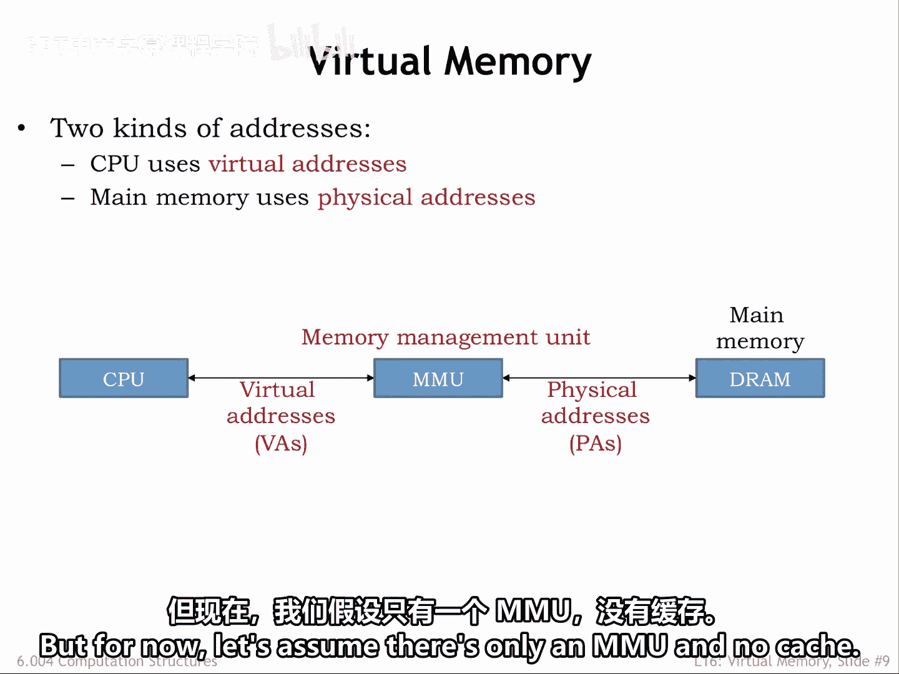
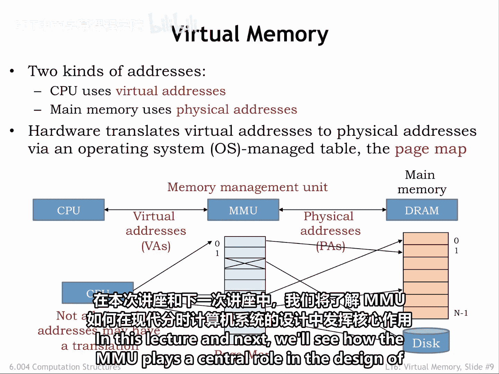
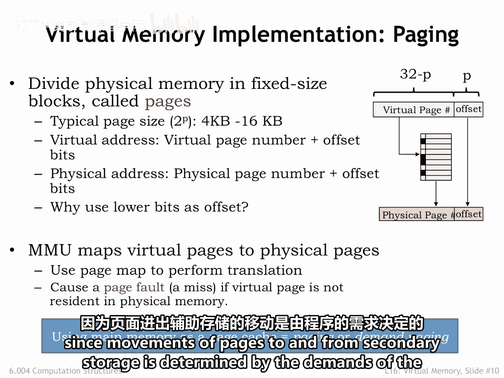
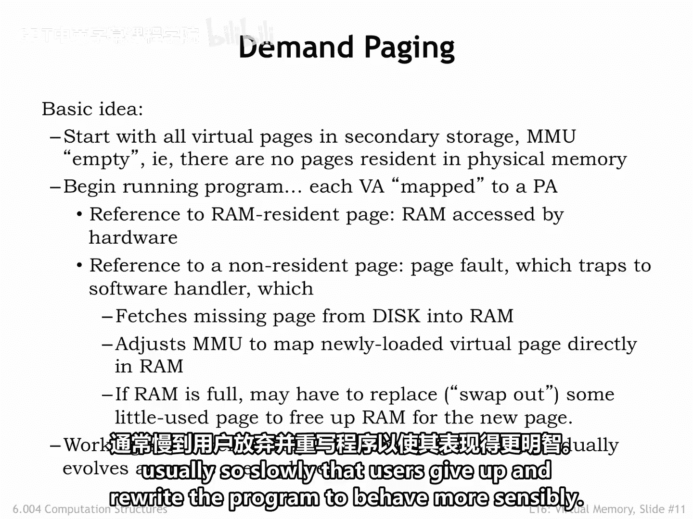
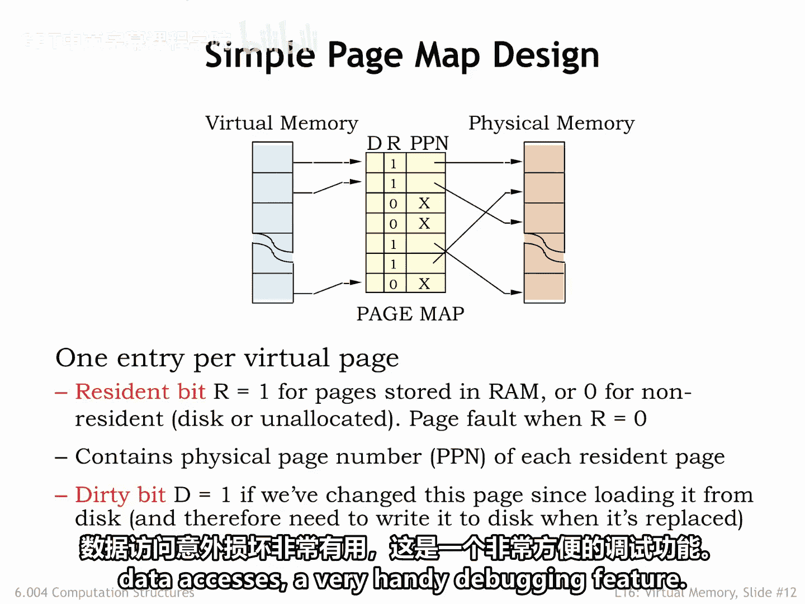
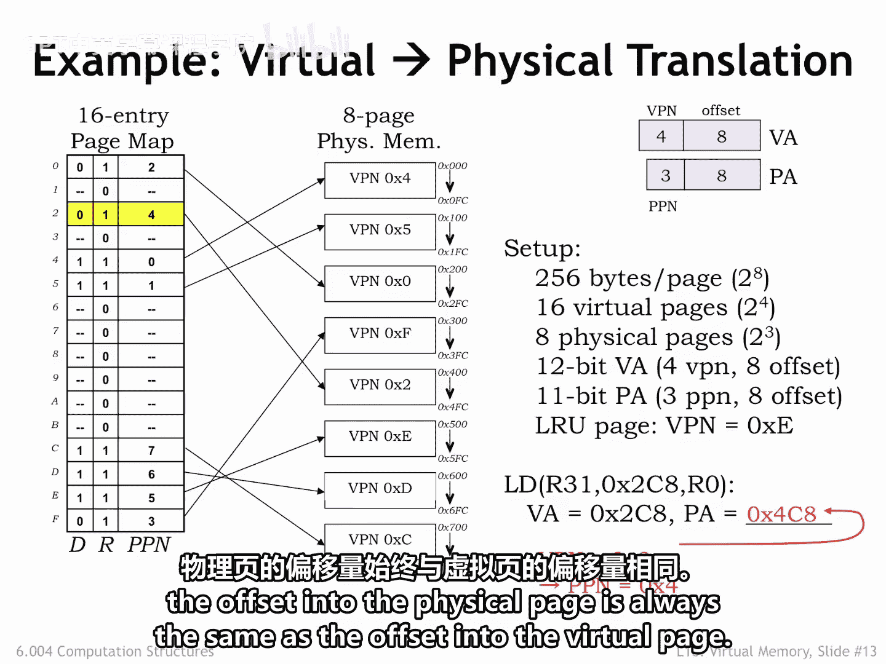

# 数字系统与计算机架构：P2：虚拟内存基础 🧠

在本节课中，我们将要学习虚拟内存系统的基本工作原理。虚拟内存是现代计算机系统中的一项关键技术，它允许程序使用比物理内存更大的地址空间，并提供了内存隔离和按需加载等强大功能。

## 概述

虚拟内存系统通过在CPU和主存之间引入一个称为内存管理单元（MMU）的硬件来工作。CPU生成的内存地址被称为虚拟地址，以区别于主存使用的物理地址。MMU的核心任务是将虚拟地址转换为物理地址。

上一节我们介绍了地址空间的概念，本节中我们来看看虚拟内存是如何具体实现的。

## MMU与地址转换

MMU硬件通过一个简单的表查找来完成虚拟地址到物理地址的转换。这个表被称为页表。

从概念上讲，MMU使用虚拟地址作为索引来选择表中的条目，该条目会告诉我们对应的物理地址。这个表允许特定的虚拟地址被映射到主存中的任何位置。

在正常操作中，我们需要确保两个虚拟地址不会映射到同一个物理地址。但是，如果某些虚拟地址没有对应的物理地址转换，这是可以接受的。这表明所请求的虚拟地址的内容尚未加载到主存中，因此MMU会向CPU发出一个内存管理异常信号。CPU可以分配一个物理内存位置，并执行所需的I/O操作，从二级存储（如硬盘）中初始化该位置。

MMU表为系统提供了对CPU上运行的程序如何访问物理内存的大量控制。例如，我们可以安排快速连续地运行多个程序，这种技术称为分时。通过在不同程序间切换时更改页表，并妥善管理各自的页表，可以使一个程序可访问的主存位置对另一个程序不可访问。

我们还可以利用内存管理异常，按需将程序内容加载到主存中，而不是在程序开始执行前就必须加载整个程序。实际上，我们只需要确保程序的当前工作集实际驻留在主存中即可。当前未使用的位置可以留在二级存储中，直到需要时再加载。

在本节课和下一节课中，我们将看到MMU如何在现代分时计算机系统的设计中扮演核心角色。

## 分页机制

当然，我们需要一个不可能巨大的表来将每个虚拟地址单独映射到物理地址。因此，我们将虚拟和物理地址空间都划分为固定大小的块，称为页。

以下是关于分页的关键细节：
*   **页大小**：页大小总是2的幂字节，例如 `2^P` 字节。因此，`P` 是选择页上特定位置所需的地址位数。
*   **地址划分**：我们使用虚拟或物理地址的低 `P` 位作为页内偏移量。剩余的地址位告诉我们正在访问哪个页，称为页号。
*   **典型值**：典型的页大小是4到16千字节，分别对应 `P=12` 和 `P=14`。

假设 `P=12`。如果CPU产生一个32位的虚拟地址，那么虚拟地址的低12位是页内偏移量，高20位是虚拟页号。同样，物理地址的低 `P` 位是页内偏移量，剩余的物理地址位是物理页号。

关键思想是MMU将管理页，而不是单个内存位置。它将整个页从二级存储移动到主存中。根据局部性原理，如果一个程序访问了页上的一个位置，我们预计它很快就会访问附近的其他位置。通过从低地址位选择页内偏移量，我们可以确保附近的位置位于同一页上（除非我们靠近页的某一端）。因此，页自然地捕捉了局部性的概念。并且由于页很大，在处理二级存储访问时，读写许多位置只比访问第一个位置稍微耗时一点，这让我们能利用这个优势。

MMU将虚拟页号映射到物理页号。它通过使用虚拟页号作为页表的索引来实现这一点。页表中的每个条目指示该页是否驻留在主存中，如果是，则提供相应的物理页号。物理页号与页内偏移量结合，形成主存的物理地址。

如果请求的虚拟页未驻留在主存中，MMU会向CPU发出一个称为页错误的内存管理异常信号，以便CPU可以从二级存储加载适当的页，并在MMU中建立相应的映射。

我们计划使用主存作为页缓存，这被称为分页，有时也称为按需分页，因为页在二级存储和主存之间的移动是由程序的需求决定的。

## 按需分页流程

以下是按需分页的具体计划。

最初，程序的所有虚拟页都驻留在二级存储中，MMU是空的。换句话说，没有页驻留在物理内存中。

CPU开始运行程序，它生成的每个虚拟地址（无论是用于取指令还是数据访问）都会传递给MMU，以映射到主存中的物理地址。

如果虚拟地址驻留在物理内存中，主存硬件可以完成访问。如果虚拟地址未驻留在物理内存中，MMU会发出页错误异常，迫使CPU切换到称为页错误处理程序的特殊代码执行。

处理程序分配一个物理页来保存请求的虚拟页，并将虚拟页从二级存储加载到主存中。然后，它调整请求的虚拟页的页表条目，以显示其现在已驻留，并指示新分配和初始化的物理页的物理页号。

在尝试分配物理页时，处理程序可能会发现所有物理页当前都在使用中。在这种情况下，它会选择一个现有的页进行替换，例如，选择一个最近未被访问的驻留虚拟页。它将所选虚拟页的内容交换到二级存储，并更新被替换虚拟页的页表条目，以指示其不再驻留。现在，就有了一个空闲的物理页可以重新使用，来保存缺失的虚拟页的内容。

程序的工作集，即程序当前正在访问的页集合，通过一系列页错误被加载到主存中。在程序开始运行时经历一阵页错误之后，工作集变化缓慢，因此页错误的频率会急剧下降，可能接近于零（如果程序规模小且行为良好）。但是，也有可能编写出持续产生页错误的程序，这种现象称为颠簸。考虑到二级存储的长访问时间，发生颠簸的程序运行得非常慢，通常慢到用户放弃并重写程序以使其行为更合理。

## 页表设计

页表的设计是直观的。页表中为每个虚拟页设置一个条目。

以下是页表条目的构成：
*   **条目数量**：例如，如果CPU生成32位虚拟地址，页大小为 `2^12` 字节，则虚拟页号有 `32-12=20` 位，页表将有 `2^20` 个条目。
*   **驻留位（R）**：页表中的每个条目包含一个驻留位 `R`，当虚拟页驻留在物理内存中时，该位设置为1。如果 `R` 为0，访问该虚拟页将导致页错误。如果 `R` 为1，该条目还包含物理页号，指示在主存中何处可以找到该虚拟页。
*   **脏位（D）**：还有一个额外的状态位称为脏位 `D`。当一个页刚从二级存储加载时，它是干净的。换句话说，物理内存的内容与二级存储中页的内容匹配。因此，脏位被设置为零。如果随后CPU向该页上的某个位置进行存储操作，则该页的脏位被设置为1，表示该页是脏的。换句话说，内存的内容现在与二级存储的内容不同。如果一个脏页被选择进行替换，在页被重用之前，必须将其内容写入二级存储以保存更改。

一些MMU在每个页表条目中还有额外的状态位。例如，可以有一个只读位，当设置时，如果程序试图向该页存储数据，将生成异常。这对于保护代码页免受错误数据访问的意外损坏非常有用，这是一个非常方便的调试功能。

## MMU工作示例

这里有一个MMU实际工作的例子。为了简化，假设虚拟地址是12位，由一个8位的页内偏移量和一个4位的虚拟页号组成，因此有 `2^4=16` 个虚拟页。物理地址是11位，分为相同的8位页内偏移量和一个3位的物理页号，因此有 `2^3=8` 个物理页。

在左侧，我们看到一个显示16条目页表内容的图表，即每个虚拟页一个条目。每个页表条目包括一个脏位 `D`、一个驻留位 `R` 和一个3位的物理页号，总共5位。因此，页表有16个条目，每个5位，总共 `16 * 5 = 80` 位。表中的第一个条目对应虚拟页0，第二个条目对应虚拟页1，依此类推。

在幻灯片中间，有一个显示八个物理页的物理内存图。每个物理页的注释显示了其内容的虚拟页号。请注意，虚拟页存储在物理内存中没有特定的顺序。哪个页保存什么内容取决于页错误发生时哪些页是空闲的。一般来说，在程序运行一段时间后，我们会期望看到这里显示的这种混乱排序。

让我们跟随MMU处理虚拟地址 `0x2C8` 的请求，该地址由这里显示的加载指令执行生成。

将虚拟地址拆分为页号和偏移量，我们看到虚拟页号是2，偏移量是 `0xC8`。查看索引为2的页表条目，我们看到 `R` 是1，表示虚拟页2驻留在物理内存中。该条目的 `PPN` 字段告诉我们，虚拟页2可以在物理页4中找到。将 `PPN` 与8位偏移量结合，我们发现虚拟地址 `0x2C8` 的内容可以在主存位置 `0x4C8` 找到。

请注意，偏移量在转换过程中保持不变，物理页内的偏移量始终与虚拟页内的偏移量相同。

## 总结

本节课中我们一起学习了虚拟内存的基础知识。我们了解到，虚拟内存系统通过内存管理单元（MMU）和页表，将程序使用的虚拟地址空间映射到实际的物理内存地址空间。核心机制是分页，它将内存划分为固定大小的页，并按需在物理内存和二级存储之间移动这些页。这允许程序使用比物理内存更大的地址空间，并支持内存隔离、按需加载等高级功能，是现代操作系统实现多任务和高效内存管理的基石。