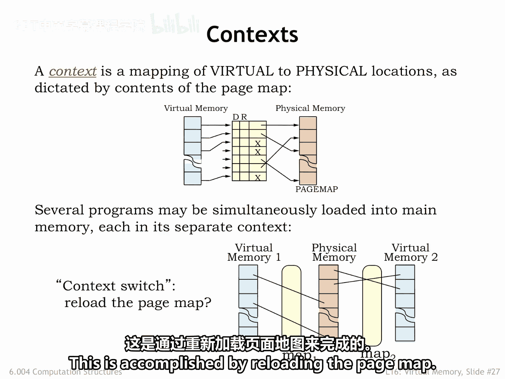
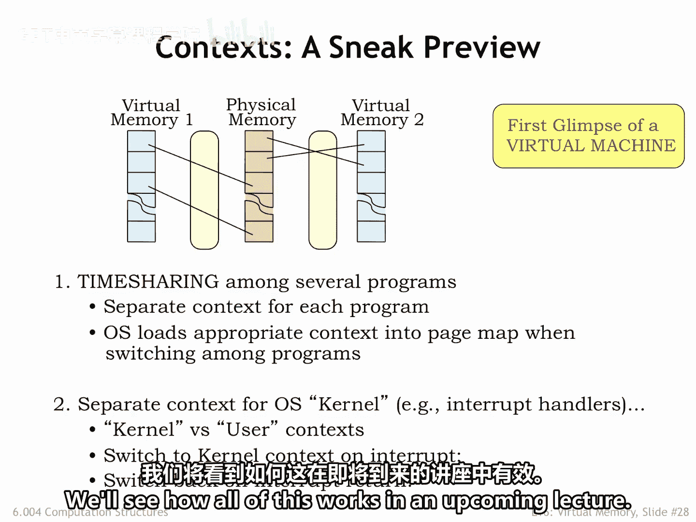
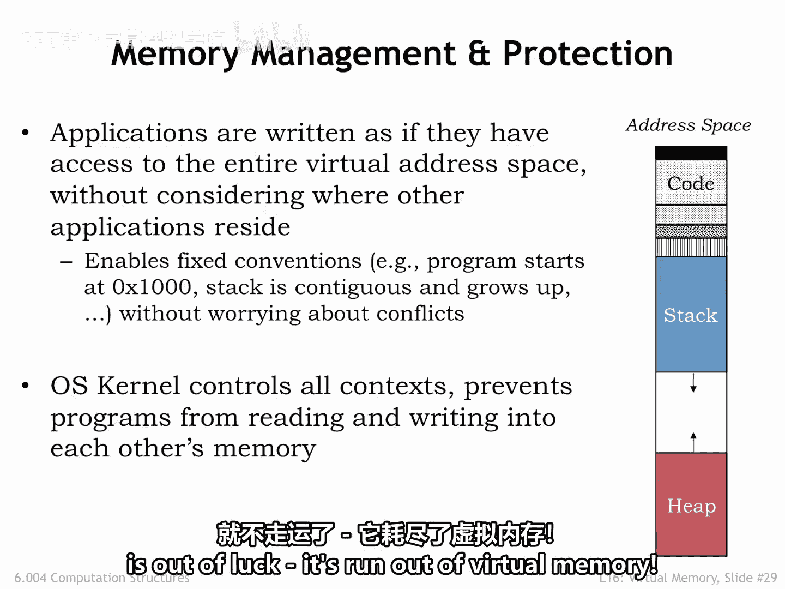

# 【数字系统与计算机架构P2 6.004 2017】麻省理工学院—中英字幕 p45 16.2.5 Contexts -BV19m41127Kj_p45-

The page map provides the context for interpreting virtual addresses， In other words。

 it provides the information needed to correctly determine where to find a virtual address in main memory or secondary storage。

Several programs may be simultaneously loaded into main memory， each with its own context。

Note that the separate contexts ensure that the programs don't interfere with each other。

 For example， the physical location for virtual address 0 in one program will be different than the physical location for virtual address 0 in another program。

Each program operates independently in its own virtual address space。

It's the context provided by the page map that allows them to coexist and share a common physical memory。

So we need to switch contexts when switching programs。

 this is accomplished by reloading the page map。

In a time sharing system， the will periodically switch from running one program to another。

 giving the illusion that multiple programs are each running on their own virtual machine。

This is accomplished by switching context when switching the CPU state to the next program。

There's a privileged set of code called the operating system that manages the sharing of one physical processor and main memory amongst many programs each with its own CPU。

 state and virtual address space。The OS is effectively creating many virtual machines and choreographing their execution using a single set of shared physical resources。

The OS runs in a special OS context， which we call the kernelel。

The OS contains the necessary exception handlers and time sharing support。

Since it has to manage physical memory， it's allowed to access any physical location as it deals with page faults。

 etc。Exceptions in running programs cause the hardware to switch to the kernel context。

 which we call entering kernel mode。After the exception handling is complete。

 execution of the program resumes in what we call user mode。Since the OS runs in C mode。

 it has privileged access to many hardware registers that are inaccessible in user mode。

These include the MMU state， IO devices， and so on。User mode programs that need to access， say。

 the disk need to make a request to the OS kernel to perform the operation。

 giving the OS the chance to vet the request for appropriate permissions， etc。

We'll see how all of this works in an upcoming lecture。

User mode programs， also known as applications， are written as if they have access to the entire virtual address space。

They often obey the same conventions such as the address of the first instruction of the program。

 the initial value for the stack pointer， etc。Since all these virtual addresses are interpreted using the current context by controlling the context。

 the operating system can ensure。That the programs can coexist without conflict。

The diagram on the right shows a standard plan for organizing the virtual address space of an application。

Typically， the first virtual page is made inaccessible。

 which helps catch errors involving references to uninitialized， in other words。

 zero valued pointers。Then come some number of read only pages that hold the applications code and perhaps the code from any shared libraries it uses。

Marking code pages its read only avoids hard to find bugs where errant data accesses inadvertently change the program。

Then there are readWrite pages holding the application statically allocated data structures。

The rest of the virtual address space is divided between two data regions that can grow over time。

The first is the application stack used to hold procedurec activation records。

Here we show it located at the lower end of virtual address space since our convention is that the stack grows towards higher addresses。

The other global region is the HeEAP used when dynamically allocating storage for long lived data structures。

Dynaically means that the allocation and delocation of object is done by explicit procedure calls while the application is running。

In other words， we don't know which objects will be created until the program actually executes。

As shown here， as the heap expands， it grows towards lower addresses。

The page fault handler knows to allocate new pages when these regions grow。Of course。

 if they ever meet somewhere in the middle and more space is needed， the application is out of luck。

 it run out of virtual memory。

