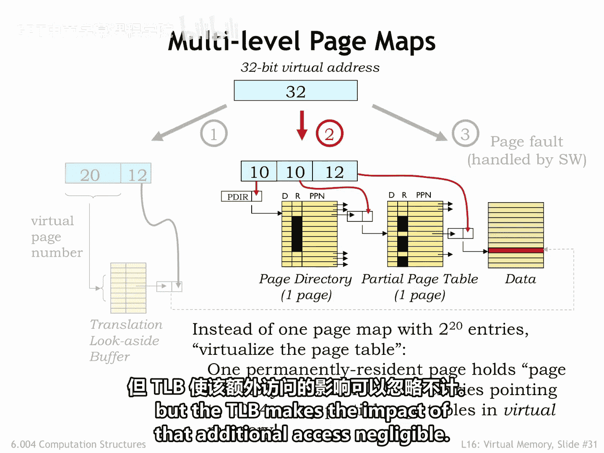
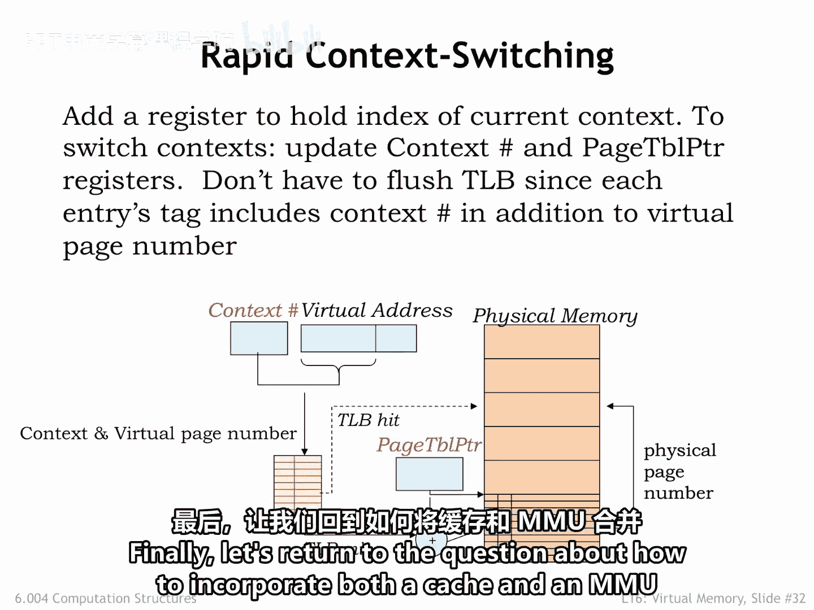
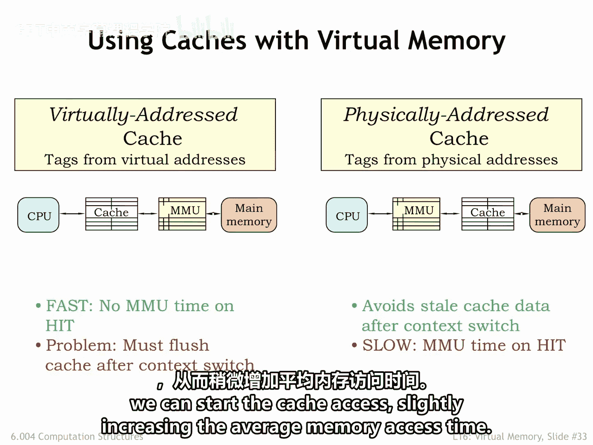
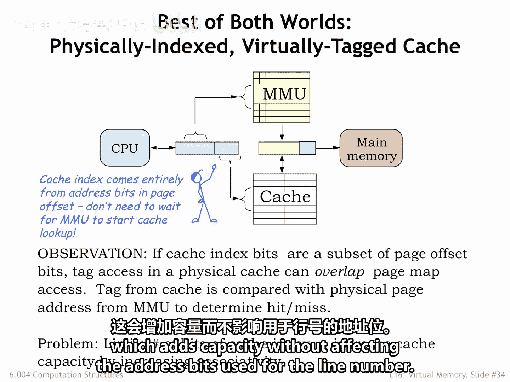
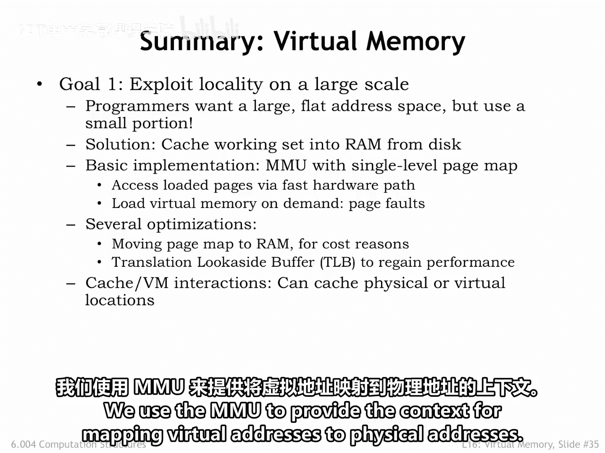
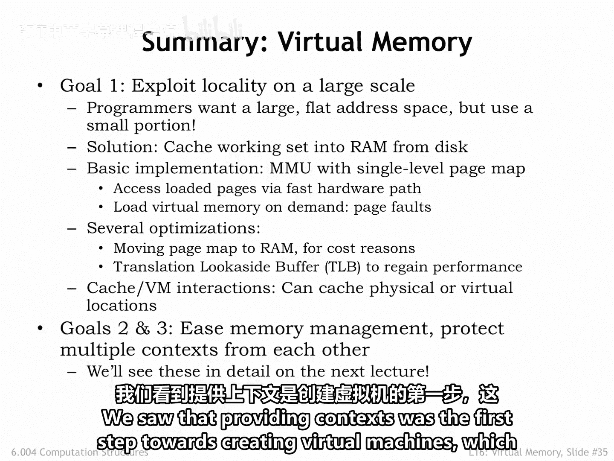

# 数字系统与计算机架构：P2：6.004：MMU的改进 🚀

在本节课中，我们将探讨内存管理单元（MMU）的一些实现细节优化，这些优化旨在提升效率或增加功能。我们将了解分层页表、上下文切换的性能影响，以及如何将缓存与MMU高效集成。

## 分层页表结构 🗂️

上一节我们介绍了简单的页表映射。在那种实现中，完整的页表会占用一定数量的物理页。例如，如果每个页表项占用主存的一个字，那么一个包含2^20个项的页表就需要2^10个物理页来存储。当系统中有多个进程上下文时，每个进程都需要自己的页表，这对物理内存资源的需求会变得非常大。

为了应对这个问题，我们可以采用一种**分层页表**的实现。以下是其工作原理：

*   **页目录**：虚拟地址的最高10位用于访问一个**页目录**。页目录本身也是一个存储在物理内存中的数据结构。
*   **页表段**：页目录中的每一项指向一个物理页，该物理页存放着对应那部分虚拟地址空间的**页表段**。
*   **按需驻留**：关键在于，这些页表段本身也位于虚拟内存中。换句话说，它们并不需要在任何时刻都全部驻留在物理内存里。
*   **节省资源**：如果正在运行的应用程序只活跃地使用其虚拟地址空间的一小部分，那么我们可能只需要少数几个页来存放页目录和必要的页表段。当系统中有许多应用程序时，这种节省效果会非常显著。

在这个例子中，页目录中对应于堆和栈之间尚未分配的虚拟内存的条目都被标记为“未驻留”。因此，我们无需为海量的、标记为“未驻留”的页表项分配任何页表资源。

访问页表现在需要两次内存访问：首先访问页目录，然后访问相应的页表段。但由于**转换后备缓冲器（TLB）** 的存在，这次额外访问的影响可以忽略不计。

## 优化上下文切换 🔄

通常，在切换上下文时，操作系统会重新加载页表指针，使其指向新进程的页表（或页目录）。由于这次切换实际上改变了页表中的所有条目，操作系统还必须**使TLB中的所有条目失效**。这自然会对TLB命中率产生巨大影响，并且在TLB被重新填满之前，大量的页表访问会导致平均内存访问时间急剧增加。

为了减少上下文切换的影响，一些MMU包含一个**上下文编号寄存器**。其内容会与虚拟页号（VPN）拼接起来，共同作为查询TLB的键值。本质上，这意味着TLB缓存条目中的标签字段被扩展，包含了填充该TLB条目时提供的上下文编号。

以下是其工作方式：

*   **切换上下文**：现在，操作系统在切换上下文时，会同时加载新的上下文编号到上下文编号寄存器，以及新的页表指针。
*   **无需刷新TLB**：由于TLB中属于其他上下文的条目将不再匹配新的查询键值，因此在上下文切换时**无需刷新整个TLB**。
*   **性能提升**：如果TLB有足够的容量来缓存多个上下文的VPN到物理页号（PPN）映射，那么上下文切换对平均内存访问时间的影响将大大降低。

## 集成缓存与MMU ⚙️

最后，让我们回到如何将缓存和MMU集成到内存系统中的问题。这里有两种主要选择。

第一种选择是将缓存放在CPU和MMU之间。换句话说，缓存基于**虚拟地址**工作。这看起来不错，因为VPN到PPN的转换成本只发生在缓存未命中时。但困难在于上下文切换时，虚拟内存的有效内容会改变。这意味着操作系统在执行上下文切换时，必须**使缓存中的所有条目失效**，这会导致在缓存被重新填满之前，缓存未命中率非常高，从而再次对性能产生重大影响。

我们可以通过缓存**物理地址**来解决这个问题，即将缓存放在MMU和主存之间。这样，缓存的内容不受上下文切换的影响（请求的物理地址会不同，但缓存会正常处理）。这种方法的缺点是，在开始缓存访问之前，我们必须先承担MMU转换的成本，这可能会增加平均内存访问时间。

但是，如果我们足够聪明，就不必等到MMU完成转换再开始访问缓存。缓存需要虚拟地址中的**行号**来获取相应的缓存行。如果用于行号的地址位完全包含在虚拟地址的**页偏移量**中，那么这些位不受MMU转换的影响。因此，**缓存查找可以与MMU操作并行进行**。

一旦缓存查找完成，就可以将缓存行的标签字段与MMU产生的物理地址的相应位进行比较。如果MMU中的TLB命中，物理地址大约会在缓存查找产生标签字段的同时就绪。通过并行执行MMU转换和缓存查找，通常不会对平均内存访问时间产生影响。这样，我们就实现了两全其美：一个物理寻址的缓存，且不因MMU转换而产生时间惩罚。

还有一个细节：增加缓存容量的一种方法是增加缓存行的数量，从而增加用作行号的地址位数。由于我们希望行号能放入虚拟地址的页偏移量字段，我们能拥有的缓存行数量是有限的。同样的道理也适用于增加块大小。因此，要增加缓存容量，我们唯一的选择是**增加缓存的相联度**，这可以在不影响用于行号的地址位的情况下增加容量。

## 总结 📝

本节课中我们一起学习了虚拟内存相关的MMU改进技术。

我们使用MMU来提供将虚拟地址映射到物理地址的上下文。通过切换上下文，我们可以创造出许多虚拟地址空间的假象，从而使多个程序可以共享单个CPU和物理内存而互不干扰。

我们讨论了使用页表将虚拟页号转换为物理页号。为了节省成本，我们将页表放在物理内存中，并使用TLB来消除大多数虚拟内存访问中访问页表的成本。访问未驻留的页面会导致页错误异常，允许操作系统管理跨多个应用程序公平共享物理内存的复杂性。

我们还看到，提供上下文是创建虚拟机的第一步，这将是我们下一讲的主题。

