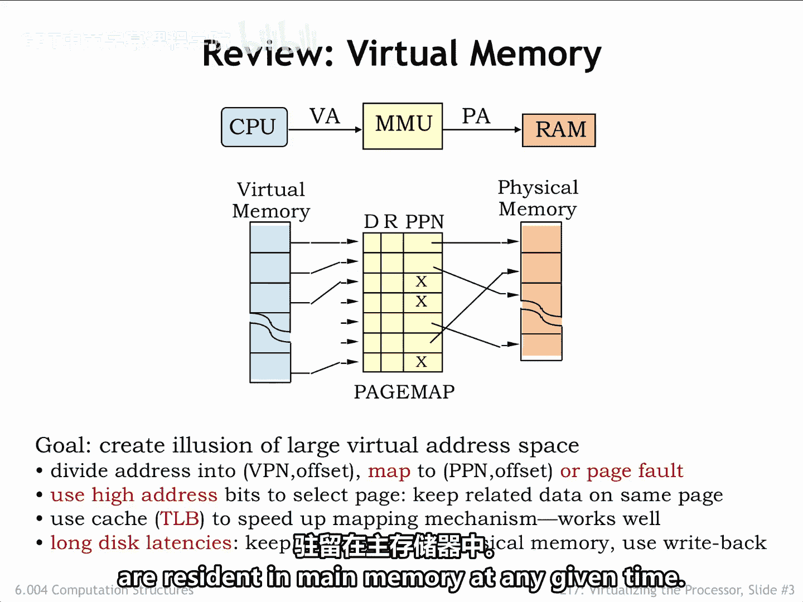
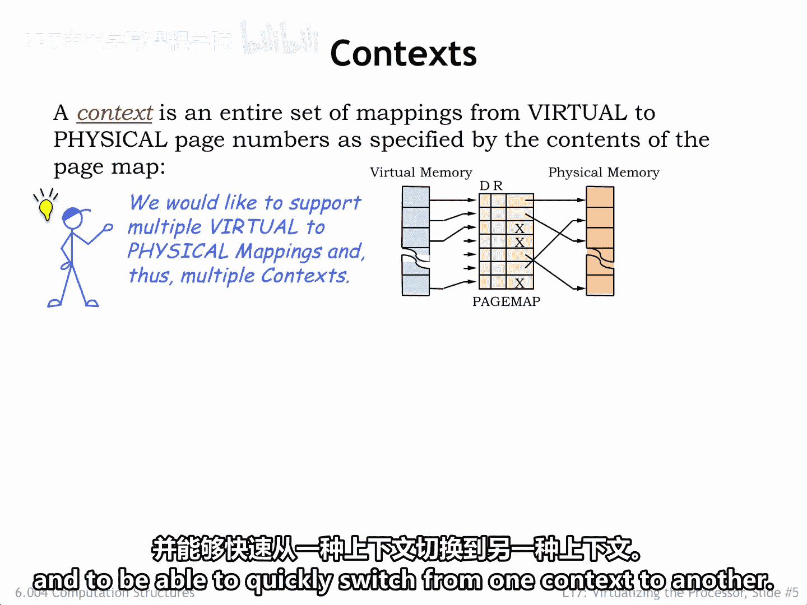
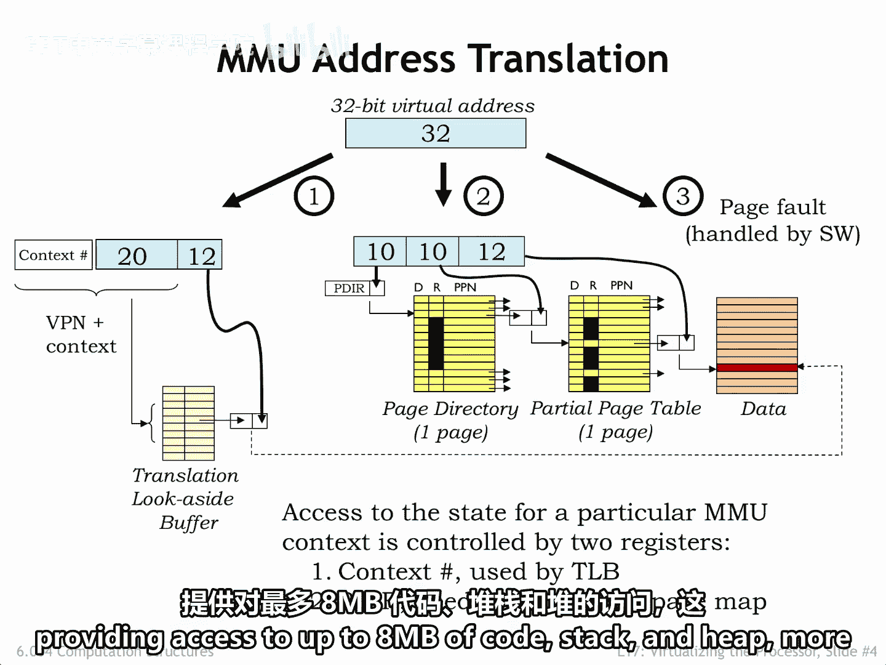
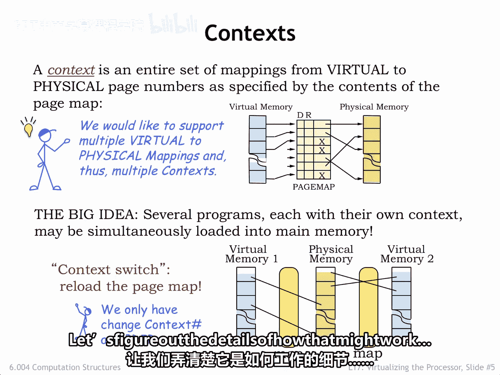

# 数字系统与计算机架构：P2：虚拟内存回顾 🧠

在本节课中，我们将回顾虚拟内存的核心概念。我们将了解内存管理单元（MMU）如何工作，以及它如何通过地址翻译让多个程序共享物理内存，同时为每个程序提供拥有独立大地址空间的假象。

---

## 虚拟内存与地址翻译

上一节我们介绍了虚拟内存的概念并引入了内存管理单元（MMU）。本节中，我们来看看MMU如何具体实现虚拟地址到物理地址的翻译。

虚拟地址空间和物理地址空间都被划分为一系列**页**。每个页包含固定数量的存储位置。例如，如果每页包含 2^12 字节，那么一个32位地址空间将包含 2^32 / 2^12 = 2^20 个页。

在这个例子中，32位地址可以被视为包含两个字段：
*   一个由高位地址位组成的20位**虚拟页号**。
*   一个由低位地址位组成的12位**页内偏移量**。

这种安排确保了相邻的数据会位于同一个页上。

MMU使用一个**页表**将虚拟页号翻译成物理页号。从概念上讲，页表是一个数组，数组中的每个条目包含一个物理页号以及几个指示页面状态的位。翻译过程很简单：虚拟页号被用作数组的索引，以获取对应的物理页号。然后，物理页号与页内偏移量结合，形成完整的物理地址。

在实际实现中，页表通常被组织成**多级结构**，这允许我们只将正在使用的部分页表驻留在内存中。为了避免每次地址翻译都访问页表的开销，我们使用一个名为**翻译后备缓冲器**的缓存来记住最近的VPN到PPN的翻译结果。

每个虚拟地址空间的所有已分配位置都可以在二级存储（如硬盘）上找到。请注意，它们不一定驻留在主内存中。如果CPU试图访问一个未驻留在主内存中的虚拟地址，就会发出一个**缺页异常**信号，操作系统将安排将所需的页面从二级存储移入主内存。实际上，在任何给定时间，只有每个程序的活动页面才驻留在主内存中。

以下是翻译过程的示意图：

以下是翻译过程的步骤：
1.  首先检查所需的VPN到PPN映射是否缓存在TLB中。
2.  如果没有，则必须访问多级页表，以查看该页是否驻留，如果是，则查找其物理页号。
3.  如果发现该页未驻留，则向CPU发出缺页异常信号，以便CPU可以运行处理程序从二级存储加载该页。

---

## 多上下文与上下文切换

页表创建了将虚拟地址翻译为物理地址所需的**上下文**。在一个同时处理多个任务的计算机系统中，我们希望支持多个上下文，并能够快速从一个上下文切换到另一个上下文。

多上下文将允许我们在多个程序之间共享物理内存。每个程序都将拥有独立的虚拟地址空间。例如，两个程序都可以将虚拟地址0作为其第一条指令的地址，但最终会访问主内存中不同的物理位置。在程序之间切换时，我们将执行**上下文切换**以切换到适当的MMU上下文。

对特定映射上下文的访问由两个寄存器控制：
*   **上下文编号寄存器**：控制TLB中可访问哪些映射。
*   **页目录寄存器**：指示哪个物理页保存多级页表的顶层。

通过简单地重新加载这两个寄存器，我们就可以切换到另一个上下文。

为了有效地容纳多个上下文，我们需要足够的TLB容量来同时缓存所有进程最频繁使用的映射，并且需要一定数量的物理页来保存所需的页目录和页表段。例如，对于一个特定的进程，3个页就足以容纳虚拟地址空间两端各1024个页的驻留两级页表，从而提供对高达8 MB的代码、堆栈和堆的访问。这对于许多简单程序来说绰绰有余。

---

## 总结与展望

本节课中我们一起学习了虚拟内存系统的核心机制。我们回顾了MMU如何通过页表进行地址翻译，引入了TLB来加速这一过程，并解释了缺页异常的处理。我们还探讨了如何通过多上下文支持来实现多个程序间的内存共享与快速切换。

在多个程序之间共享CPU的能力似乎是一个很棒的想法。接下来，让我们探讨一下这可能如何工作的细节。

