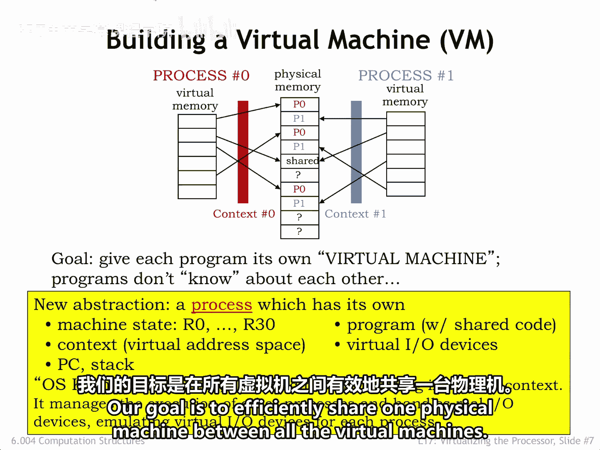
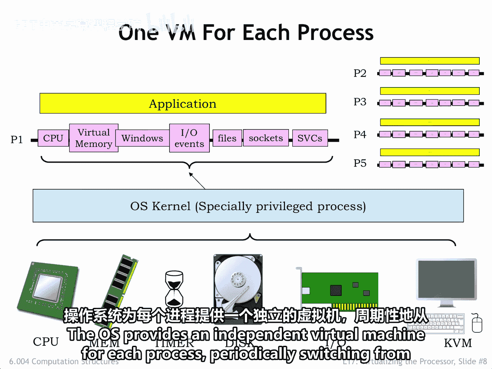
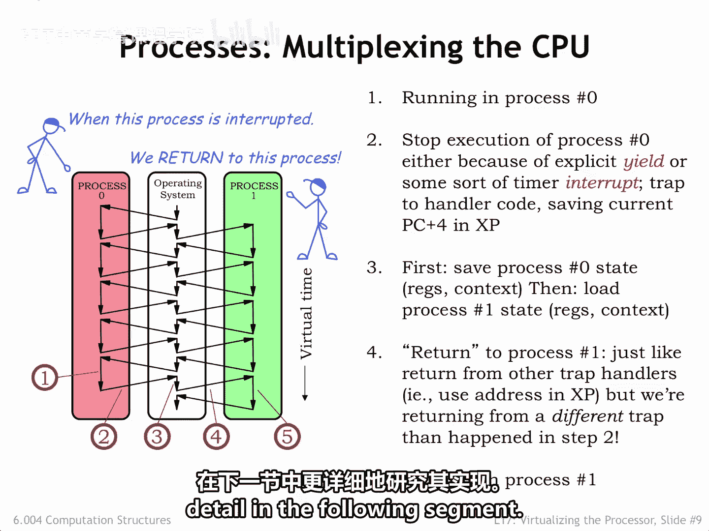

# 数字系统与计算机架构：P2：6.004：进程

## 概述
在本节课中，我们将要学习一个核心的抽象概念——**进程**。我们将了解进程如何封装一个正在运行的程序的所有资源，以及操作系统如何通过管理多个进程，让它们看起来像是在独立的虚拟机上运行，从而高效地共享一台物理计算机。

---

## 进程：一个运行程序的抽象

我们创建一个名为“进程”的新抽象，用以捕捉“正在运行的程序”这一概念。

一个进程囊括了运行一个程序所需的所有资源，包括CPU、MMU、输入输出设备等资源。

每个进程都有一个状态，该状态捕获了我们所知的关于其执行的一切信息。

进程数据包括CPU的硬件状态，换句话说，就是寄存器和程序计数器中的值。

进程状态还包括进程虚拟地址空间的内容，包括代码、数据值、栈以及从堆中动态分配的数据对象。

在MMU的管理下，这部分状态可以驻留在主存中，也可以驻留在辅助存储中。

进程状态还包括MMU的硬件状态，正如我们之前所见，这取决于页目录寄存器中的上下文编号。

此外，还包括为分层页表分配的页面。

进程状态还包含关于进程输入输出活动的额外信息，例如它在文件系统中读写文件的位置、与已打开网络连接相关的状态和缓冲区、来自用户界面的待处理事件（例如键盘字符和鼠标点击）等等。

正如你将看到的，有一个特殊的特权进程称为操作系统，运行在其自己的内核模式上下文中。操作系统管理每个进程的所有簿记工作，安排进程定期运行。操作系统将为进程提供各种服务，例如访问数据和文件、建立网络连接、管理窗口系统和用户界面等。

为了从一个用户模式进程切换到另一个，操作系统需要捕获并保存当前用户模式进程的完整状态。其中一部分状态已经存在于主存中，所以这部分已经就绪。另一部分可以在各种内核数据结构中找到。还有一部分需要能够从CPU和MMU的各种硬件资源中保存和恢复。

为了成功实现进程，操作系统必须能够使每个进程看起来像是在其自己的虚拟机上运行，该虚拟机独立于其他进程的其他虚拟机工作。我们的目标是在所有虚拟机之间高效地共享一台物理机器。

---

## 虚拟机的组织架构

上一节我们介绍了进程的概念，本节中我们来看看操作系统如何组织资源来支持多个进程。

下图展示了我们提议的组织架构示意图。

物理机器提供的资源显示在幻灯片的底部。CPU和主存构成了系统核心的计算引擎。连接到CPU的是各种外围设备，这是一个从英语单词“periphery”衍生出来的集合名词，表示围绕CPU的资源。

一个定时器产生周期性的CPU中断，可用于触发周期性操作。辅助存储为系统提供大容量的非易失性存储器。与外部世界的连接也很重要，许多计算机包括用于可移动设备的USB连接，大多数提供有线或无线网络连接。最后，通常还有服务于用户界面的视频显示器、键盘和鼠标。摄像头和麦克风作为下一代用户界面正变得越来越重要。

物理机器由运行在特权内核上下文中的操作系统管理。操作系统处理与外围设备的低级接口，初始化和管理MMU上下文等。正是操作系统为每个进程创建了它们所看到的虚拟机。

用户模式程序直接在物理处理器上运行，但它们的执行可以被定时器中断，从而给操作系统一个机会来保存当前进程的状态，并切换到运行下一个进程。通过MMU，操作系统为每个进程提供了一个独立的虚拟地址空间，该空间与其他进程的操作隔离。操作系统提供的虚拟外围设备使进程无需关心与其他进程共享资源的所有细节。

窗口的概念允许进程访问一个矩形像素阵列，而无需担心窗口中的某些像素是否被其他窗口遮挡，也无需担心如何确保鼠标光标始终显示在任何内容之上等等。

每个进程不是直接访问IO设备，而是可以访问一个IO事件流，这些事件在键入字符、点击鼠标等时生成。例如，操作系统负责确定哪些键入的字符属于哪个进程。在大多数窗口系统中，用户点击一个窗口来表示拥有该窗口的进程现在拥有键盘焦点，并应接收任何后续键入的字符。点击时鼠标的位置可能决定哪个进程接收点击事件。所有这些都意味着，共享的细节已被抽象出虚拟外围设备提供的简单接口之外。

访问磁盘上的文件也是如此。操作系统提供了一个有用的抽象，使每个文件看起来像一个连续的、可滚动的字节数组，支持读写操作。操作系统知道文件如何映射到磁盘上的扇区池，并处理坏扇区、减少碎片化以及通过预读和后写来提高吞吐量。

对于网络，操作系统提供对某个远程套接字的有序字节流的访问。它实现了适当的网络协议来对数据流进行分组、寻址数据包以及处理丢失、损坏或乱序的数据包。

为了配置和控制这些虚拟服务，进程使用**管理程序调用**或**SVC**与操作系统通信，这是一种调用操作系统内核代码的控制转移访问过程调用。

每个虚拟服务的设计和实现细节超出了本课程的范围，如果你感兴趣，操作系统课程将详细探讨这些主题。

操作系统为每个进程提供一个独立的虚拟机，并定期从一个进程的运行切换到下一个进程的运行。

---

## 进程切换：从进程0到进程1

上一节我们了解了虚拟机的组织，本节中我们具体看看操作系统如何在进程之间进行切换。

让我们跟随从运行进程0切换到运行进程1的过程。最初，CPU正在执行进程0中的用户模式代码。

该执行要么被程序中的显式**yield**中断，要么更可能被定时器中断中断。无论哪种方式，最终都会将控制权转移到操作系统代码，同时将当前的PC+4值保存在XP寄存器中，操作系统在内核模式下运行。我们稍后将更详细地讨论中断机制。

操作系统将进程0的状态保存在内核存储的适当表中。然后，它从进程1的内核表中重新加载状态。请注意，进程1的状态是在进程1在更早的某个时间点被中断时保存的。接着，操作系统使用跳转指令，利用新恢复的进程1状态来恢复用户模式执行。

执行在进程1中恢复，正好是它之前被中断的地方。现在，我们正在运行进程1中的用户模式程序。

我们已经中断了一个进程，并恢复了另一个进程的执行。我们将以循环轮转的方式持续这样做，在每个进程开始新一轮执行之前，给每个进程一个运行的机会。

黑色箭头给出了时间感知的感觉。对于每个进程，虚拟时间随着执行的指令序列展开。除非查看实时时钟，否则进程不会意识到其执行偶尔会暂停一段时间。暂停和恢复对于一个正在运行的进程是完全透明的。

当然，从外部看，我们可以看到在实时中，执行路径从一个进程移动到另一个进程，在切换期间访问操作系统，从而产生我们在此处看到的交错执行路径。CPU的时间复用被称为**分时**，我们将在下一节更详细地研究其实现。

---

## 总结
本节课中我们一起学习了**进程**这一核心抽象。我们了解到进程封装了运行程序所需的所有资源状态，操作系统通过为每个进程创建独立的虚拟机来管理它们。我们还探讨了操作系统如何通过保存和恢复进程状态，在多个进程之间进行切换，实现CPU的分时共享，从而让每个进程都感觉自己独占计算机资源。