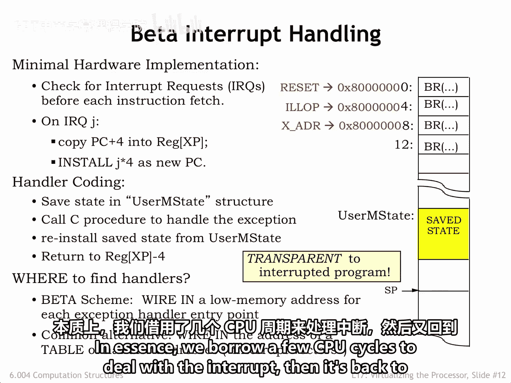
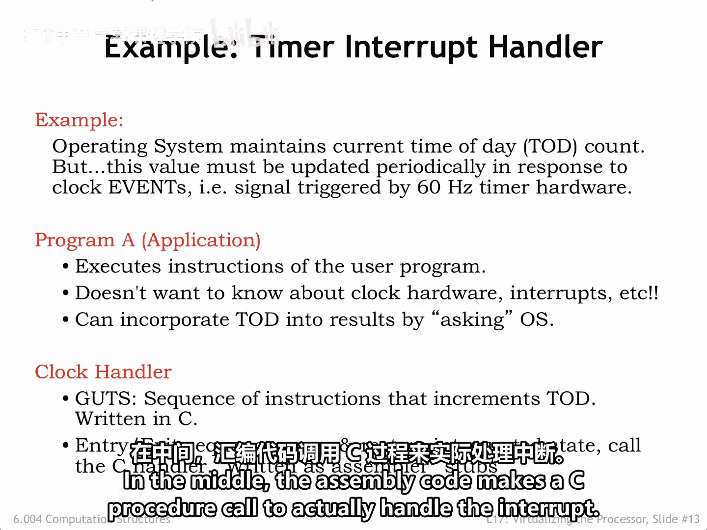
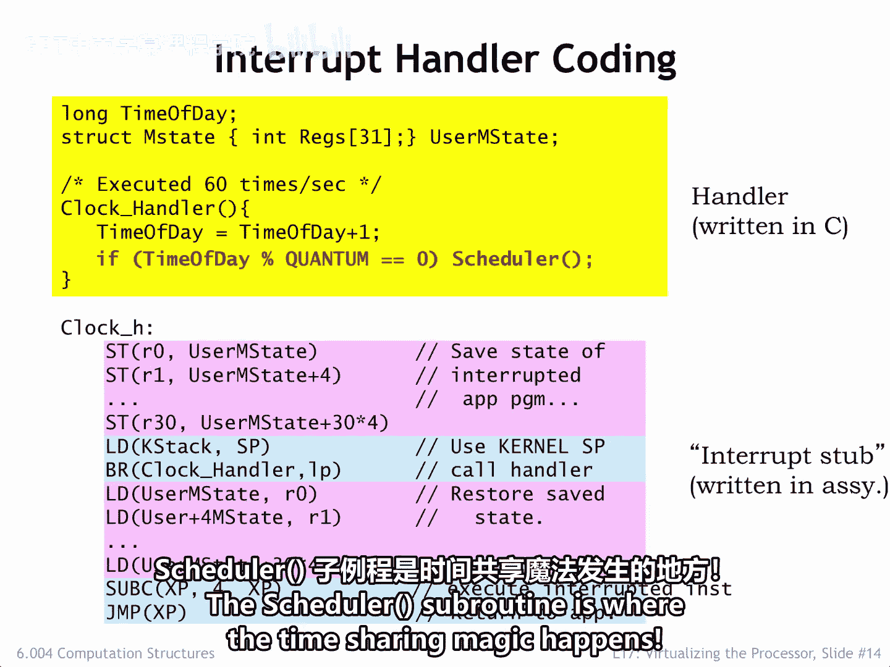
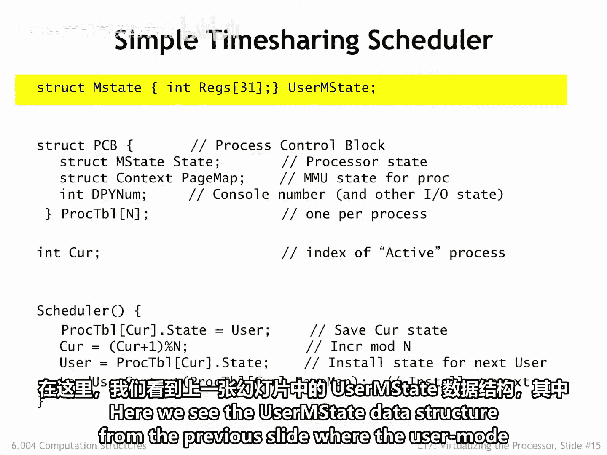
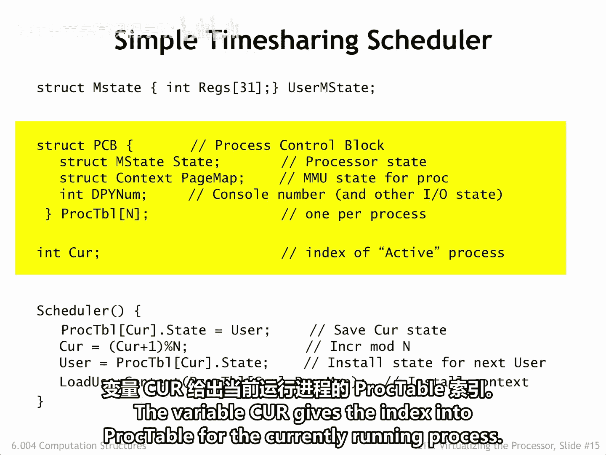
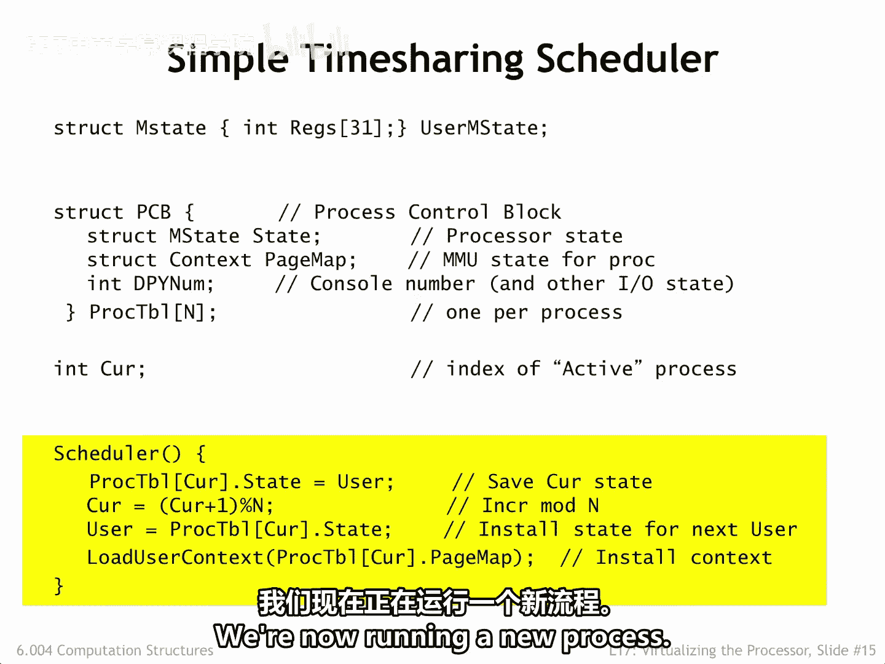
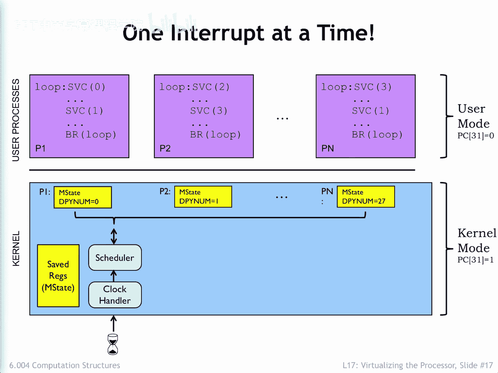

# 数字系统与计算机架构：P2：6.004：17.2.3 分时技术 ⏱️

在本节课中，我们将要学习分时技术的关键实现机制——定时器中断。我们将了解硬件如何触发中断，操作系统软件如何保存和恢复进程状态，并最终实现多个进程在单个CPU上轮流执行。

## 概述

分时技术允许多个用户程序共享一个处理器。其核心是**定时器中断**，它周期性地打断当前运行的用户程序，将控制权交给操作系统。操作系统借此机会可以保存当前进程的状态，并选择另一个进程恢复执行。

## 定时器中断硬件机制

上一节我们介绍了分时的概念，本节中我们来看看实现它的关键技术——定时器中断。让我们回顾一下Beta处理器中的中断硬件是如何工作的。

外部设备通过置位Beta处理器的中断请求输入来请求中断。如果Beta处理器正运行在用户模式（即程序计数器PC中存储的超级用户位为0），那么置位IRQ将在识别到中断的时钟周期触发以下动作。

其目标是：将当前的PC+4值保存到XP寄存器中，并强制程序计数器跳转到一个特定的内核模式指令，该指令是中断处理程序的起始点。

基于当前指令生成控制信号的正常流程被覆盖，部分控制信号被强制设置为特定值。

*   PC单元被设置为4，这选择了一个指定的内核模式地址作为程序计数器的下一个值。
*   所选地址取决于外部中断的类型。对于定时器中断，地址是十六进制数 `0x80000008`。注意，PC31（超级用户位）被置为1，CPU将在开始执行中断处理程序代码时处于内核模式。
*   WA单元、WD单元和Wth控制信号被设置，以便将PC+4写入XP寄存器（即寄存器文件中的R30）。
*   最后，MWR被设置为0，以确保如果我们中断的是一条存储指令，该指令的执行能被正确中止。

因此，在下一个周期，CPU将从内核模式中断处理程序的第一条指令开始执行，该处理程序可以在CPU的XP寄存器中找到被中断指令的PC+4值。

正如我们所见，中断硬件机制非常精简：它保存了被中断用户模式程序的PC+4值到XP寄存器，并将程序计数器设置为一个取决于发生何种外部中断的预定值。处理中断请求的其余工作由软件完成。

## 中断处理的软件流程

上一节我们看到了硬件如何启动中断，本节中我们来看看操作系统软件如何接管并完成中断处理。

被中断进程的状态（例如，CPU寄存器R0到R30中的值）被存储在主内存中一个名为 `user_m_state` 的操作系统数据结构里。然后，调用适当的处理程序代码（通常是一个用C语言编写的过程）来完成主要工作。当该过程返回时，进程数据从 `user_m_state` 重新加载。操作系统将XP中的值减去4，使其指向被中断的指令，然后通过 `JUMP(XP)` 恢复用户模式执行。

需要注意的是，在我们简单的Beta实现中，各种中断处理程序的第一条指令占据着内存中连续的位置。由于中断处理程序长度超过一条指令，这第一条指令总是一条跳转到实际中断代码的分支指令。

*   复位中断（CPU首次启动时触发）将PC设置为 `0x80000000`。
*   非法指令中断将PC设置为 `0x80000004`。
*   定时器中断将PC设置为 `0x80000008`，依此类推。

在所有情况下，新PC值的第31位都被置为1，以便处理程序在超级用户或内核模式下执行，从而访问内核上下文。另一种常见的替代方案是在一个已知位置提供一个新PC值表，让中断硬件访问该表以获取适当处理程序的PC。这提供了与我们简单的Beta实现相同的功能。

由于进程数据在中断期间被保存和恢复，因此中断对正在运行的用户模式程序是透明的。本质上，我们借用几个CPU周期来处理中断，然后恢复正常程序执行。

## 定时器中断处理程序示例

理解了基本流程后，我们来看一个具体的定时器中断处理程序是如何工作的。我们的初始目标是使用定时器中断来更新操作系统中记录当前时间的数据值。假设定时器每六分之一秒触发一次中断。

用户模式程序正常执行，无需做任何特殊处理来应对定时器中断。周期性地，定时器中断用户模式程序，运行操作系统中的时钟中断处理程序代码，然后恢复用户模式程序的执行。该程序继续执行，就像中断从未发生过一样。如果程序需要访问当前时间，它会向操作系统发出相应的系统调用请求。

操作系统中的时钟处理程序代码以一小段汇编语言代码开始和结束，用于保存和恢复状态。在中间，汇编代码调用一个C过程来实际处理中断。

以下是处理程序代码在C语言中可能的样子。我们找到了时间数据值的声明，以及一个名为 `user_m_state` 的结构，它临时保存进程状态。还有一个用于递增时间值的C过程。

定时器中断执行位置8处的 `BR` 指令，该指令跳转到 `clock_handler` 处的实际中断处理程序代码。代码首先将所有CPU寄存器的值保存到 `user_m_state` 数据结构中。注意，我们不保存R31的值，因为它的值总是0。在设置好内核模式堆栈后，汇编语言存根调用上面的C过程来完成繁重的工作。当该过程返回时，CPU寄存器从保存的进程数据中重新加载，并且XP寄存器值减4，使其指向被中断的指令。然后，`JUMP(XP)` 恢复用户模式执行。

## 从定时中断到进程切换

哦，这看起来足够简单。但这与分时有什么关系呢？我们的目标不是安排定期切换正在运行的进程吗？既然我们有一段代码在每次定时器中断时运行，那么就让我们修改它，以便每隔一段时间就安排调用操作系统的调度器例程。

在这个例子中，如果我们希望每两次定时器中断调用一次调度器，我们会将常量 `QUANTUM` 设置为2。调度器例程正是分时魔法发生的地方。

## 进程状态管理数据结构

为了实现进程切换，我们需要管理多个进程的状态。以下是相关的数据结构。

我们看到上一张幻灯片中的 `user_m_state` 数据结构，用户模式进程数据在中断期间存储于此。

这里是一个进程控制块数组，每个数据结构对应系统中的一个进程。进程控制块保存着当我们进程当前未执行时的完整状态，它是处理器状态的长期存储。如你所见，它包括一个包含进程寄存器值的 `m_state` 副本、MMU状态以及与进程输入输出活动相关的各种状态（这里用一个数字表示连接到该进程的虚拟用户界面控制台）。总共有N个进程。变量 `curpid` 给出了当前运行进程在进程表中的索引。

## 分时调度的实现代码

以下是实现分时调度的、出奇简单的代码。

每当调度器例程被调用时，它首先将临时保存的状态移动到当前进程的进程控制块中。然后递增 `curpid` 以移动到下一个进程，确保当我们刚运行完最后一个进程时，它能回绕到0。接着，它从新进程的进程控制块中重新加载临时状态，并相应地设置MMU。此时，调度器返回，时钟中断处理程序从更新后的临时安全状态重新加载CPU寄存器并恢复执行。瞧，我们现在正在运行一个新进程了！

## 分时工作流程总览

让我们用这张图再次梳理分时是如何工作的。在图的顶部，你会看到用户模式进程的代码，下方是操作系统代码及其数据结构。

定时器中断当前正在运行的用户模式程序，并开始执行操作系统的C处理程序代码。处理程序做的第一件事是将所有寄存器保存到 `user_m_state` 数据结构中。如果调用了调度器例程，它会将临时保存的状态移动到进程控制块中，后者为进程状态提供长期存储。接着，调度器将下一个进程的保存状态复制到临时保存区，然后时钟处理程序将更新后的状态重新加载到CPU寄存器中，并恢复执行——这次运行的是新进程中的代码。

当我们查看操作系统时，请注意，由于其代码运行时超级用户模式位被置为1，因此在操作系统内中断是被禁止的。这防止了在处理第一个中断的过程中又收到第二个中断的尴尬问题，这种情况可能会意外地覆盖 `user_m_state` 中的状态。但这意味着在编写操作系统代码时必须非常小心。任何类型的无限循环都无法被中断。你可能经历过这种情况：你的机器似乎冻结了，不接受任何输入，只是像块木头一样呆在那里。此时，你唯一的选择是循环上电硬件（终极中断）并重新开始。

在用户模式程序执行期间是允许中断的，因此，如果它们陷入死循环需要被中断，这总是可能的，因为操作系统仍然在响应（例如键盘中断）。每个操作系统都有一个神奇的按键组合，保证可以挂起当前进程的执行，有时还会安排复制进程数据以供后续调试。这非常方便。

## 总结

本节课中我们一起学习了分时技术的核心实现。我们了解到，**定时器中断**是周期性打断CPU执行的关键硬件机制。中断发生后，硬件自动保存返回地址并跳转到内核处理程序。操作系统软件则负责保存完整的进程状态（到 `user_m_state` 和**进程控制块**），并通过**调度器**选择下一个要运行的进程，恢复其状态，从而实现多个进程在单个CPU上的轮流执行。整个机制对用户程序是透明的，并且通过在内核中禁用中断来保证状态切换的原子性。