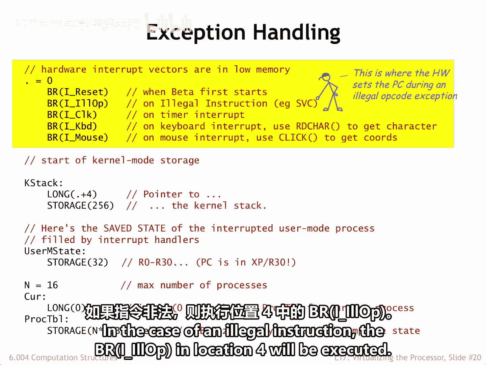
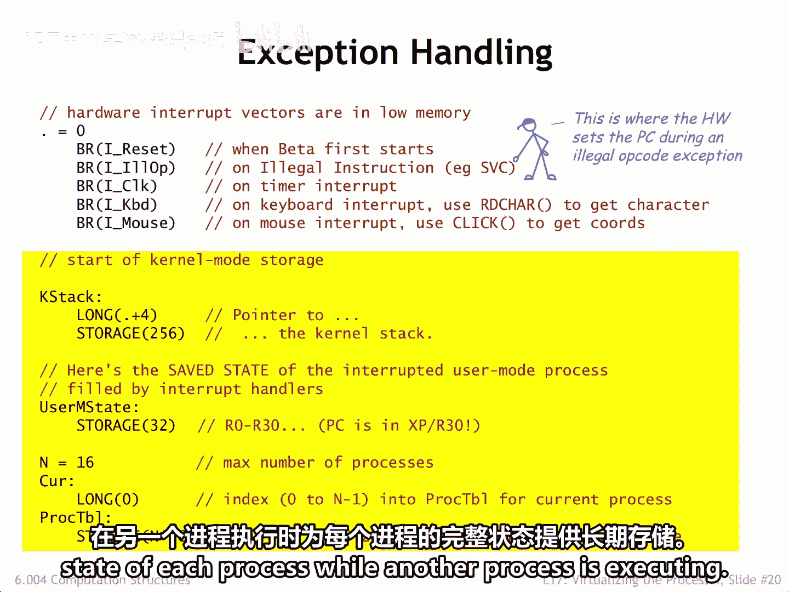
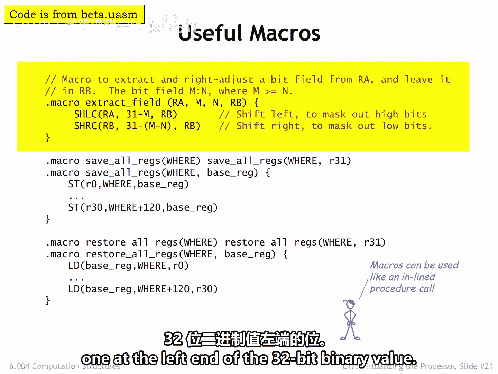
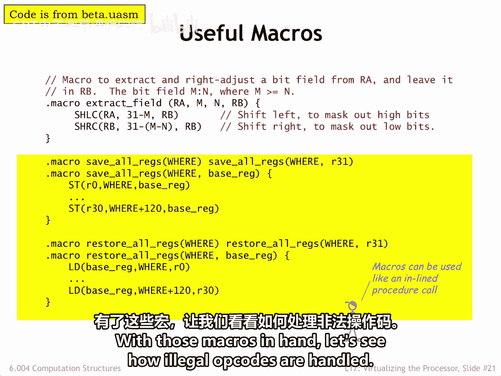
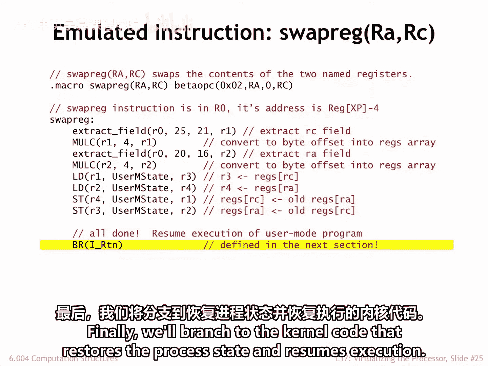

# 【数字系统与计算机架构P2 6.004 2017】麻省理工学院—中英字幕 p51 17.2.4 Handling Illegal Instructions -BV19m41127Kj_p51-

Another service provided by the operating system is dealing properly with the attempt to execute instructions with illegal opcodes。

Illegal is in quotes， because that just means Opcodes whose operations aren't implemented directly by the hardware。

As we'll see， it's possible to extend the functionality of the hardware via software emulation。

The action of the CPU upon encountering in illegal instructions sometimes referred to as an unimloplemented user operation or UUO。

Is very similar to how it processes interrupts。Think of illegal instructions as an interrupt caused directly by the CPU。

 as for interrupts， the execution of the current instruction is suspended。

 and the control signals are set to values to capture PC+ 4 in the XP register and set the PC2 in this case。

 Hex 800004。Note that B31 of the new PC， also known as the supervisor bit， is set to one。

 meaning that the OS handler will have access to the kernel mode context。

Here are some codes similar much to that found in the tiny operating system。

 which you'll be experimenting with in the final lab assignment。

 Let's do a quick walk through of the code when an illegal instruction is executed。

Starting at locations zero， we see the branches to the handlers for the various interrupts and exceptions。

In the case of an illegal instruction， the branch I underscore illop in location4 will be executed。

Immediately following is where the OS data structures are allocated。

 This includes space for the OS stack。User M State where user Mo register values are stored during interrupts。

And the process table， providing long term storage for the complete state of each process。

 while another process is executing。

When writing an assembly language is convenient to define macros for operations that are used repeatedly。

 we can use a macro call whenever we want to perform the action。

 and the asemler will insert the body of the macro in place of the macro call。

 performing electrical substitution of the macros arguments。

Here is a macro for a two instruction sequence that extracts a particular field of bits from a 32 B value。

 M is the bit number of the leftmost bit。 N is the bit number of the rightmost bit。

 Bs are numbered 0 to 31， where bit 31 is the most significant bit。 In other words。

 the one at the left end of the 32 B binary value。

And here are some macros that expand into instruction sequences that save and restore the CPU registers to or from the Use M State temporary storage area。

With those macros in hand， let's see how illegal op codes are handled。

Like all interrupt handlers， the first action is to save the user mode registers in the temporary storage area and initialize the OS stack。

Next we fetch the illegal instruction from the user mode program。

 note that the save PC+4 value is a virtual address in the context of the interrupted program。

 so we'll need to use the MMU routines to compute the correct physical address More about this on the next slide。

Then we'll use the op code of the illegal instruction as an index into a table of subbertine addresses。

 one for each of the 64 possible op codes。Once we have the address of the handler for this particular illegal op code。

 we jump there to deal with the situation。Selecting a destination from a table of addresses called dispatching。

 and the table is called the Dispatch table。If the dispatch table contains many different entries。

 dispatching is much more efficient in time and space than a long series of comparison branches。

In this case， the table is indicating that the handler for most illegal opcodes is the UUO error routine。

So it might have been smaller and faster simply to test for the two illegal opcodes the OS is going to emulate。

Illegal Op code 1 will be used to implement procedure calls from user mode to the operating system。

 which we call supervisor calls。More on this in the next segment。

As an example of having the OS emulated instruction。

 we'll use illegal Op code2 as the Op code for the swap re instruction， which we'll discuss now。

But first， a quick look at how the OS converts user mode virtual addresses into physical addresses it can use。

We'll build on the MMU V to P procedure described in the previous lecture。

This procedure expects as its arguments the virtual page number and offset fields of the virtual address。

 so following our convention for passing arguments to see procedures。

 these are pushed onto the stack in reverse order。The corresponding physical address is returned in R0。

We can then use the calculated physical address to read the desired location from physical memory。

Okay， back to dealing with illegal op codes。 here's the handler for op codes that are truly illegal。

 In this case， the Os uses various kernel routines to print out a helpful error message on the user's console。

 then crashes the system。You might have seen these blue screens of death if you run the Windows operating system full of cryptic He numbers。

Actually， this wouldn't be the best approach to handling illegal op code in a user's program。

In a real operating system， it would be better to save the state of the process in a special debugging file historically referred to as a cordup。

And then terminate this particular process， perhaps printing a short error message on the user's console to let them know what happened。

Then later， the user could start a debugging program to examine the dump file to see where their bug is。

Finally， here's the handler that will emulate the actions of the swap reconstruction。After which。

 program execution will resume as if the instruction had been implemented in hardware。

SwpRg is an instruction that swaps the values in the two specified registers。

To define a new instruction， we first have to let the asmbler know how to convert the swap Reg RA comm RC assembly languagegu statement into binary。

In this case， we'll use a binary format similar to the Add C instruction。

 but setting the unused literal field to0。The encoding for the RA and RC registers occur in their usual fields。

 and the Op code field is set to2。Emmulation is surprisingly simple。 First。

 we extract the RA and RC fields from the binary for the swap rig instruction and convert those values into the appropriate bite offsets for accessing the temporary array of saved register values。

Then we use the RA and RC offsets to access the user mode register values that have been saved in user M State。

We'll make the appropriate interchange， leaving the updated Reg values in user M State。

 where they'll be loaded into the CPU registers upon returning from the illegal instruction interruptt handler。

Finally， we'll branch to the kernel code that restores the process state and resumes execution。

We'll see this code in the next segment。