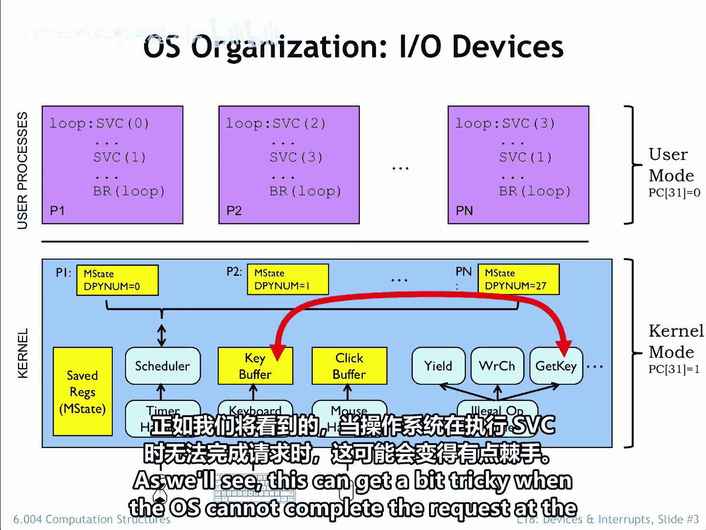
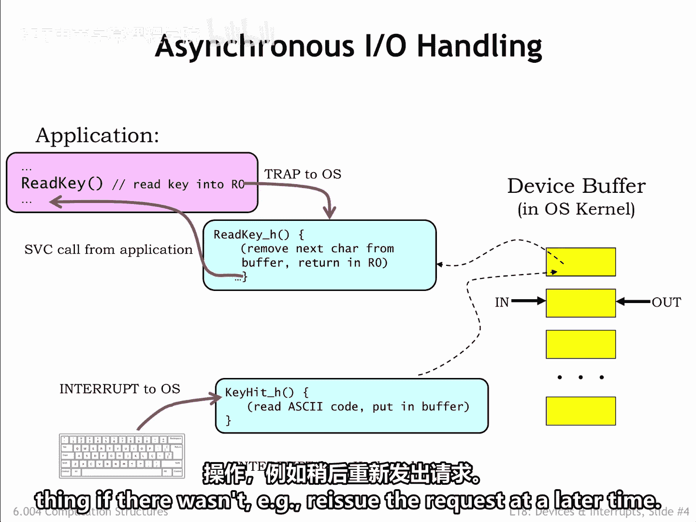
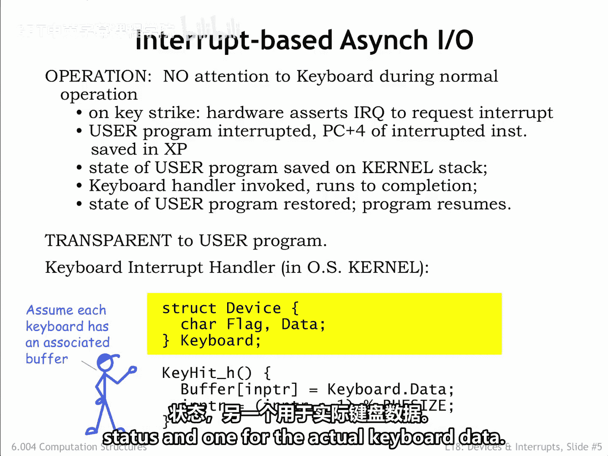
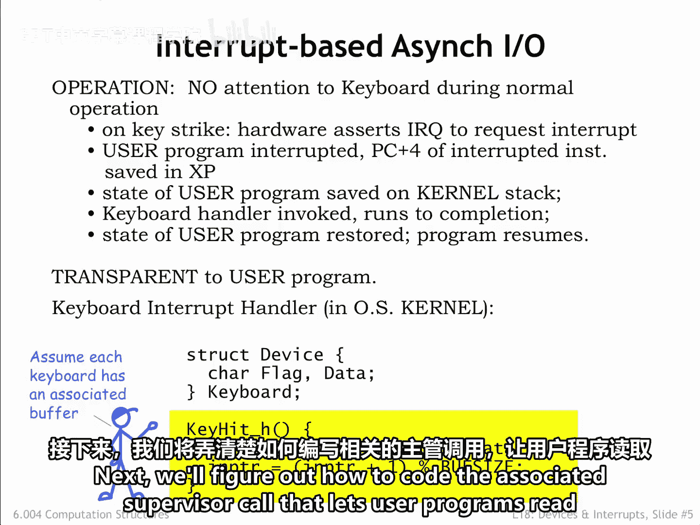

# 【数字系统与计算机架构P2 6.004 2017】麻省理工学院—中英字幕 p54 18.2.1 OS Device Handlers -BV19m41127Kj_p54-

Let's turn our attention to how the operating system deals with input output devices。

There are actually two parts to the discussion。 First。

 we'll talk about how the O S interacts with the devices themselves。

 This will involve a combination of interrupt handlers and kernel buffers。

Then we'll discuss how Supervisor calls access the kernel buffers in response to requests from user mode processes。

As we'll see， this didn't get a bit tricky when the OS cannot complete their request at the time the SVC was executed。

Here's the plan when the user types a key on the keyboard。

 the keyboard triggers an interrupt request to the CPU。

 The interrupt suspends execution of the currently running process and executes the handler whose job it is to deal with this particular I event。

In this case， the keyboard handler reached the character from the keyboard and saves it in a kernel buffer associated with the process that has been chosen to receive incoming keystrokes。

In the language of OSs， we'd say the process has the keyboard focus。

This transfer takes just a handful of instructions， and when the handler exits。

 we resume running the interrupted process。Assuming the interrupt request is serviced promptly。

 the CPU can easily keep up with the arrival of typed characters。

 Human are pretty slow compared to the rate of executing instructions。

But the buffer and the colonel can only hold so many characters before it fills up。

 What happens then。Well， there are a couple choices。

Overriding characters received earlier doesn't make much sense。

 why keep later characters if the earlier ones have been discarded？

Better that the CPU discard any characters received after the buffer was full。

 but it should give some indication that is doing so。And in fact。

 many systems beep at the user to signal that the character they've just typed is being ignored。

At some later time， a user Mo program executes a Read key supervisor call。

 requesting that the OS return the next character in R0。In the OS。

 the Readed key supervisor call" grabs the next character from the buffer。

Places it in the users's R0 and resumes execution at the instruction following the SVC。

There are a few tricky bits we need to figure out。The Read key supervisor call is what we call a blocking IO request。

 In other words， the program assumes that when the SVC returns， the next character is in R0。

If there isn't yet a character to be returned。Execution should be blocked。In other words。

 suspended until such time that a character is available。

Many OSs also provide for non blocking IR requests。

 which always return immediately with both a status flag and a result。

The program can checklist out of flag to see if there was a character and do the right thing if there wasn't。

 for example， reissue the request at a later time。

Note that the user mode program didn't have any direct interaction with the keyboard。

 in other words it's not constantly pulling the device to see if there is a keystroke to be processed。

Instead， we're using an event driven approach where the device signals the OS via an interrupt when it needs attention。

This is an elegant separation of responsibilities。 Imagine how cumbersome it would be if every program had to check constantly to see if there were pending I O operations。

Our event driven organization provides for on demand servicing of devices。

 but doesn't devote CPUU resources to the IO subsystem until there's actually work to be done。

The interrupt driven OS interactions with iOSO devices are completely transparent to user programs。

Here's a sketch of what the OS keyboard handler code might actually look like。

Depending on the hardware， the CPU might access device status and data using special IO instructions in the ISA。

 For example， in the simulated beta used for lab assignments。

 there is a Rechar instruction for reading keyboard characters and a click instruction for reading the coordinates of a mouse click。

Another common approach is to use memoryory mapped IO。

 where a portion of the kernel address space is devoted to servicing IO devices。In this scheme。

 ordinary load and store instructions are used to access specific addresses。

 which the CPU recognizes as accesses to the keyboard or mouse device interfaces。

This is the scheme shown in the code here。 the C data structure represents the two IO locations devoted to the keyboard。

 one for status， and one for the actual keyboard data。

The keyboard interrupt handler reads the keystroke data from the keyboard and places the character into the next location in the circular character buffer in the kernel。

In real life， keyboard processing is usually a bit more complicated。

What one actually read from a keyboard is a key number and a flag indicating whether the event is a key press or a key release。

Knowing the keyboard layout， the OS translates the key number into the appropriate Ask key character。

 dealing with complications like holding down the shift key or control key indicate a capital character or a control character。

And certain combinations of keystrokes， for example。

 control Alt Dell on a Windows system are interpreted as special user commands to start running particular applications like the task manager。

Many OSs let the user specify whether they want raw keyboard input， in other words。

 the key numbers and status， or digested input， in other words， AS key characters。

who knew that processing keystrokes could be so complicated？

Next we'll figure out how to code the Assoated supervisorvis call that lets user programs read characters。

