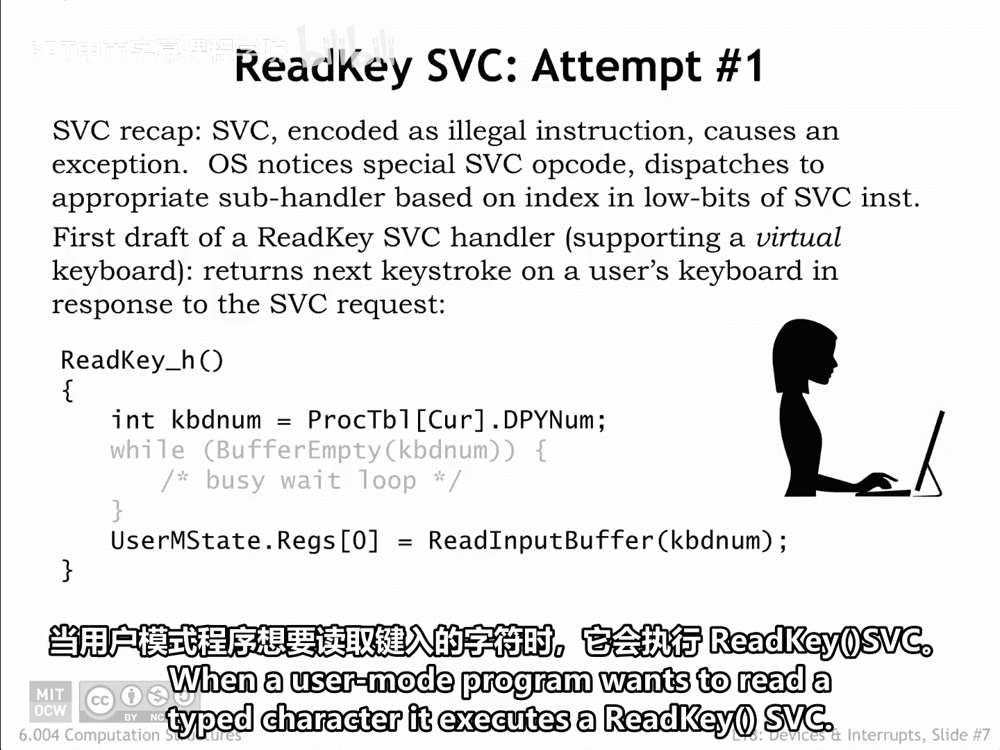
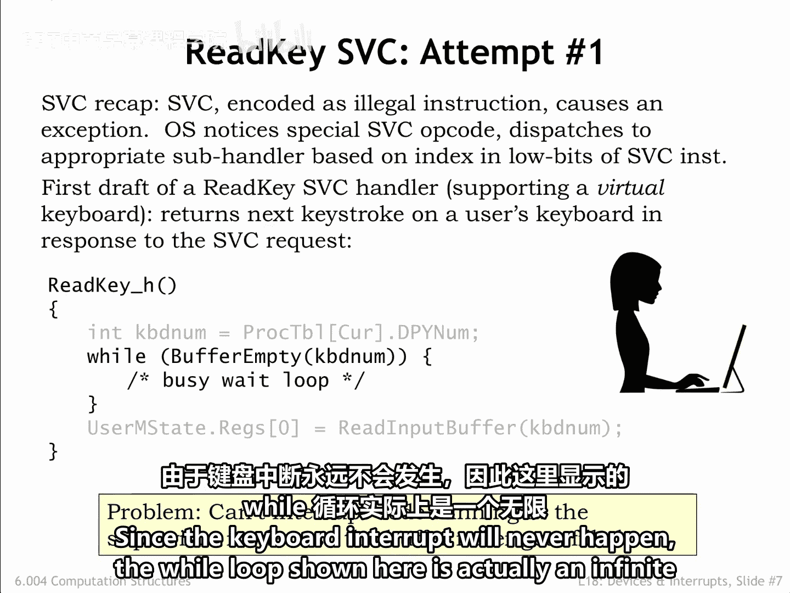
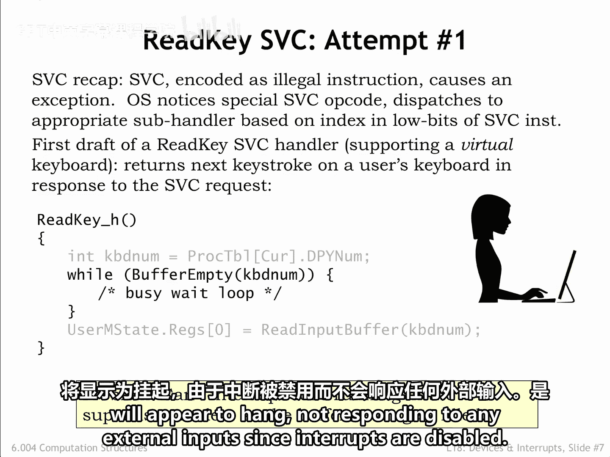
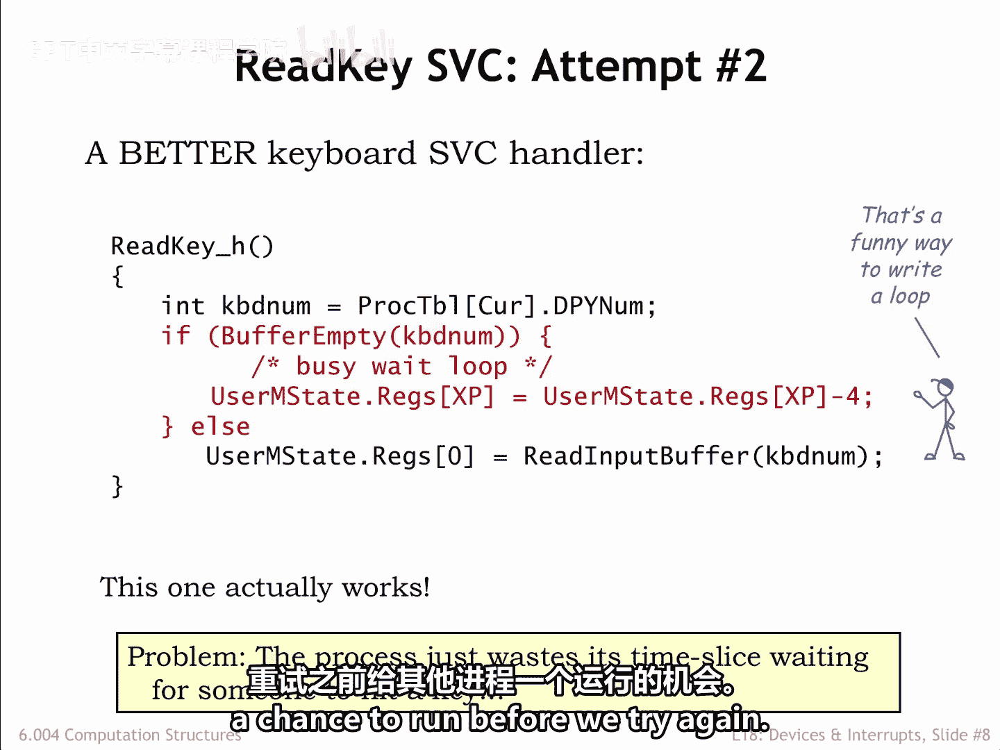
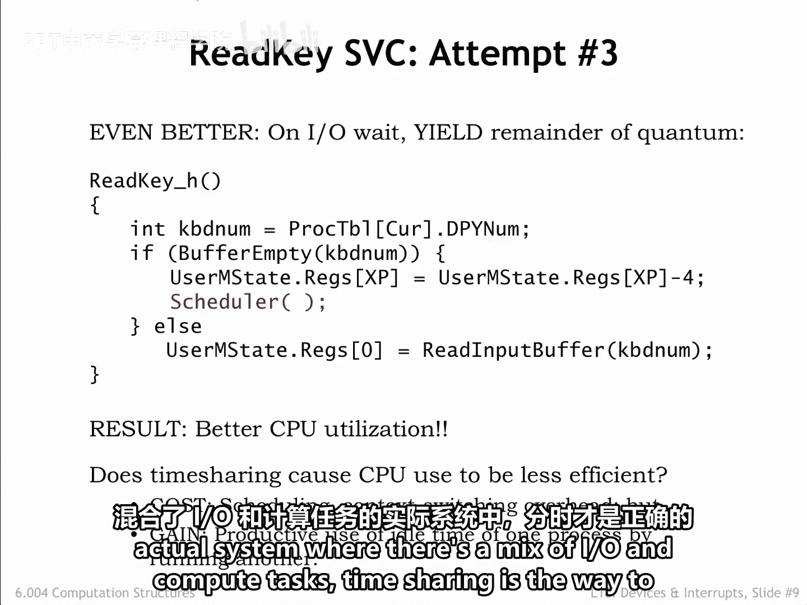
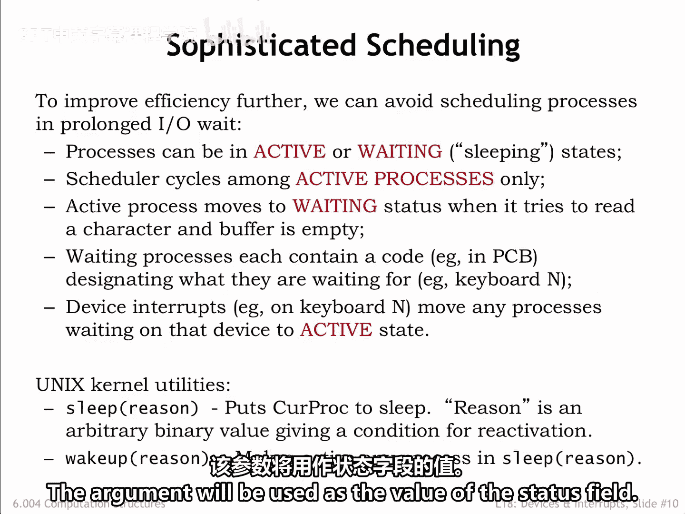
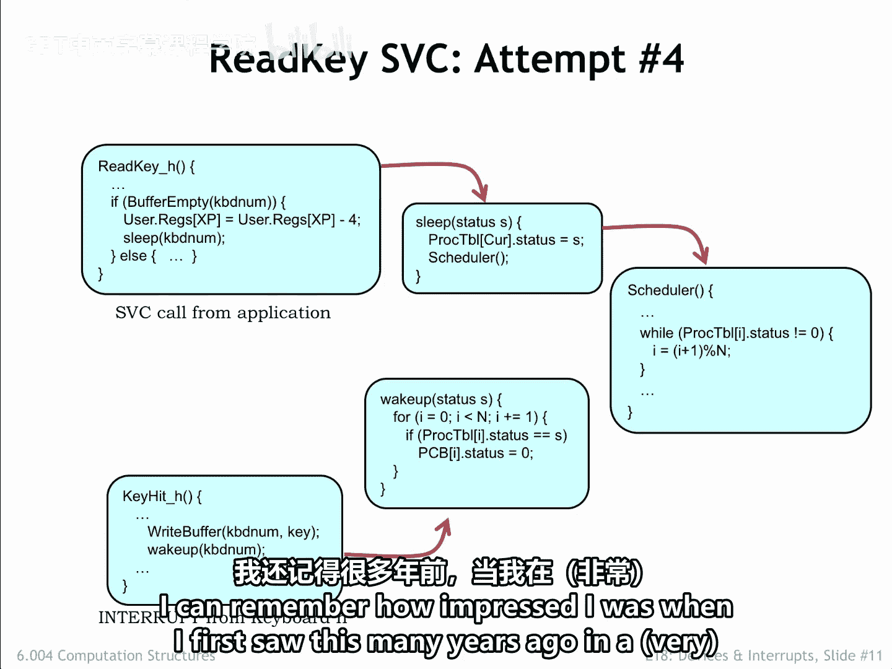

# 数字系统与计算机架构：P2：SVCs用于输入输出 🖥️➡️⌨️

在本节课中，我们将学习用户程序如何通过**监督程序调用**来请求输入/输出服务，特别是读取键盘输入。我们将探讨SVC处理程序的基本实现、遇到的挑战（如无限循环问题）以及如何通过进程调度和状态管理来优雅地解决这些问题。

---

## 用户程序的读取请求

当用户模式程序想要读取一个键入的字符时，它会执行一个“读取按键”监督程序调用。

SVC的二进制表示在其操作码字段中包含一个非法值。因此，CPU硬件会引发一个异常，开始执行操作系统中的非法操作码处理程序。

操作系统处理程序识别出该非法操作码值是一个SVC，并使用SVC指令的低位比特来确定调用哪个子处理程序。

---

## 读取按键处理程序初版

以下是“读取按键”子处理程序的第一个草案，这次用C语言编写。

处理程序首先查看当前进程的进程表条目，以确定哪个键盘缓冲区持有该进程的字符。

我们暂时假设缓冲区不为空，因此跳过最后一行代码。该行代码从缓冲区读取字符，并用它来替换保存寄存器值数组中用户R0的已保存值。

当处理程序退出时，操作系统将重新加载保存的寄存器，并恢复用户模式程序的执行，此时R0中就是刚刚读取的字符。

---

## 处理空缓冲区的情况

现在，让我们弄清楚当键盘缓冲区为空时该怎么做。

这里显示的代码只是简单地循环，直到缓冲区不再为空。其理论是，最终用户会键入一个字符，从而引发一个中断。该中断将运行上一节讨论的键盘中断处理程序，该处理程序会将一个新字符存储到缓冲区中。

这一切听起来不错，直到我们想起SVC处理程序运行时，监督位（PC31）被设置为1，从而**禁用了中断**。糟糕！😊 由于键盘中断永远不会发生，这里显示的while循环实际上是一个无限循环。

因此，如果用户模式程序试图从空缓冲区读取字符，系统将**看起来像是挂起**，由于中断被禁用，它不会响应任何外部输入。

---

## 修复循环问题

是时候采取行动了。我们将通过添加代码，在返回前从已保存的XP寄存器值中减去4，来修复这个循环问题。

这个修复是如何起作用的？回想一下，当SVC非法指令异常发生时，CPU将非法指令的PC+4值存储在了用户的XP寄存器中。

当处理程序退出时，操作系统将通过重新加载寄存器然后执行`跳转 XP`来恢复用户模式程序的执行，这通常会执行SVC指令之后的那条指令。

通过从已保存的XP值中减去4，将要重新执行的将是SVC指令本身。这当然意味着我们将再次经历相同的步骤集，重复这个循环，直到键盘缓冲区不再为空。这只是一个更复杂的循环。

但有一个**关键区别**：其中一条指令，即“读取按键”SVC，是在用户模式下执行的，此时PC31等于0。因此，在那个周期中，如果有一个来自键盘的待处理中断，设备中断将取代“读取按键”的执行，键盘缓冲区将被填充。

当键盘处理程序结束时，“读取按键”SVC将再次执行，这次会发现缓冲区不再为空。太好了！

---

## 效率优化与进程调度

所以这个版本的处理程序实际上可以工作，但有一个小注意事项。如果缓冲区为空，用户模式程序将不断重新执行复杂的用户模式-内核模式循环，直到定时器中断最终将控制权转移给下一个进程。

这似乎效率很低。一旦我们检查并发现缓冲区为空，最好在再次尝试之前给其他进程一个运行的机会。

这个问题很容易修复：在安排好重新执行“读取按键”监督程序调用之后，我们只需添加一个对调度程序`Sched`的调用。

对`Sched`的调用会挂起当前进程的执行，并安排在处理程序退出时运行下一个进程。最终，轮询调度会回到当前进程，“读取按键”SVC将再次尝试。通过这个简单的一行修复，系统将大大减少浪费周期检查空缓冲区的时间，而是将这些周期用于运行其他（希望是）更有生产力的进程。

代价是在键入字符后重新启动程序会有**一小段延迟**，但通常每个进程的时间片足够小，以至于一轮进程执行发生得比两次键入字符之间的时间更快，所以额外的延迟并不明显。

---

## 关于分时系统的讨论

现在我们有了对传统反对分时系统论点的一些见解。

论点如下：假设我们有10个进程，每个进程需要一秒钟来完成其计算。在没有分时的情况下，第一个进程将在一秒后完成，第二个在两秒后，依此类推。

使用分时，比如说1/10秒的时间片，所有进程将在10秒后的某个时间完成，因为在完成之前发生的约100次进程切换需要一点额外时间。

因此，在分时系统中，所有进程的完成时间与没有分时情况下的最坏完成时间一样长。那么，为什么要费心使用分时呢？

我们在前面的幻灯片中看到了这个问题的答案之一：如果一个进程不能有效利用其时间片，它可以将这些周期捐赠给完成其他任务。

因此，在大多数进程都在等待某种I/O的系统中，分时实际上是**将周期用在最能发挥作用的地方**的好方法。

如果你现在打开你正在使用的系统的任务管理器或活动监视器，你会看到有数百个进程，几乎所有这些进程都处于某种I/O等待状态。

所以，分时在运行计算密集型任务时确实会带来成本，但在一个I/O和计算任务混合的实际系统中，分时是正确的方式。

---

## 进程状态管理：Sleep与Wakeup

我们实际上可以更进一步，确保不运行那些正在等待尚未发生的I/O事件的进程。

我们将向进程状态添加一个**状态字段**，指示进程是**活动的**（例如，状态为0）还是**等待的**（例如，状态非0）。我们将使用不同的非零值来指示进程正在等待什么事件。

然后，我们将修改调度程序，使其只运行活动进程。

要了解其工作原理，最容易的方法是使用一个具体例子。Unix操作系统有两个内核子程序：`sleep`和`wakeup`，两者都需要一个非零参数。该参数将用作状态字段的值。

让我们看看它的实际运作。当“读取按键”监督程序调用检测到缓冲区为空时，它调用`sleep`，并带有一个唯一标识它正在等待的I/O事件的参数（在本例中，是特定缓冲区中字符的到来）。

`sleep`将此进程的状态设置为这个唯一标识符，然后调用`Sched`。调度程序已被修改为跳过状态非零的进程，不给它们运行的机会。

同时，键盘中断将导致中断处理程序向键盘缓冲区添加一个字符，并调用`wakeup`来通知任何正在等待该缓冲区的进程。

当键盘中断处理程序中的缓冲区标识符与“读取按键”处理程序中的匹配时，`wakeup`会遍历所有进程，寻找正在等待这个特定I/O事件的进程。当它找到一个时，它将该进程的状态设置为0，将其标记为活动状态。

这个零状态将导致该进程在调度程序下一次在轮询搜索中轮到它时再次运行。

效果是，一旦一个进程进入睡眠状态等待一个事件，在事件发生且`wakeup`将该进程标记为活动之前，它不会再被考虑执行。

非常巧妙。这是确保没有CPU周期浪费在无用活动上的另一个优雅修复。我记得多年前在Unix代码的一个非常早期的版本中第一次看到这个时，印象是多么深刻。

---

## 总结

本节课中，我们一起学习了用户程序如何通过SVC请求I/O服务。我们探讨了处理程序的基本逻辑、因禁用中断导致的无限循环问题，以及通过修改返回地址来巧妙重启SVC的解决方案。我们还讨论了分时系统的效率权衡，并深入了解了通过`sleep`和`wakeup`机制进行进程状态管理的高级技术，这确保了CPU资源只被分配给可以取得进展的进程，从而显著提高了系统在I/O密集型环境中的整体效率。