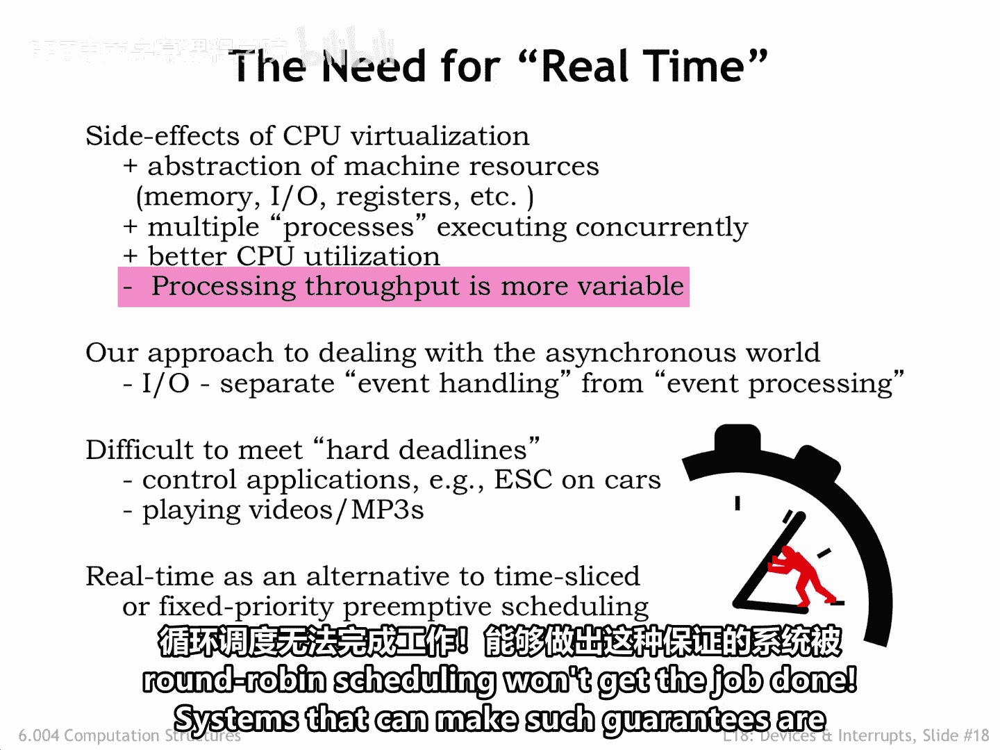
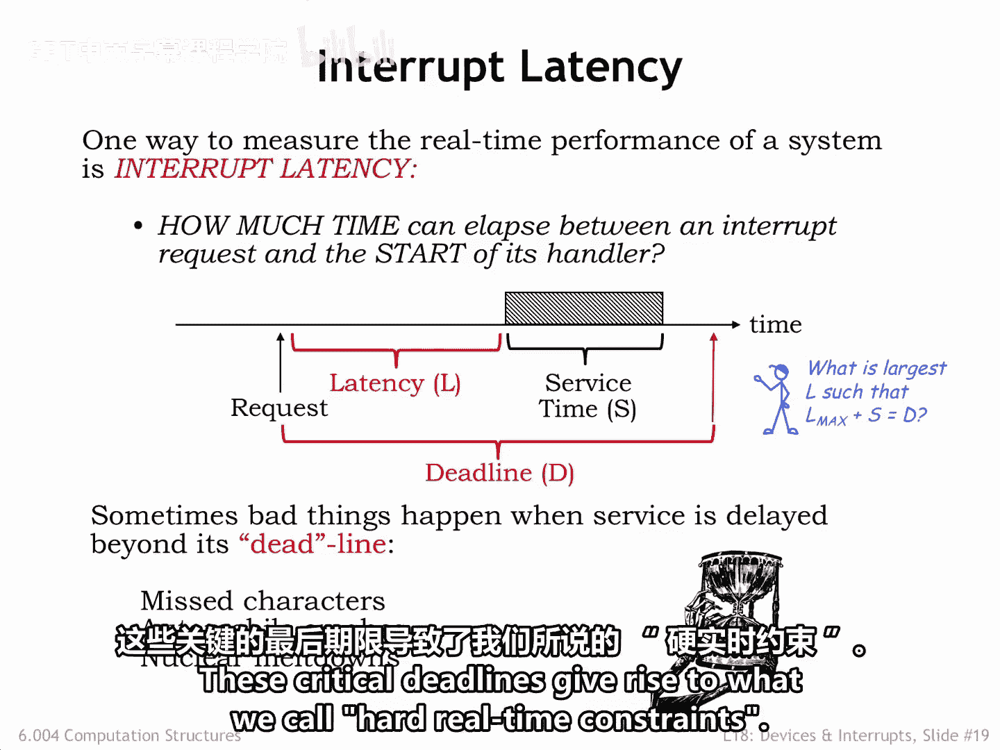
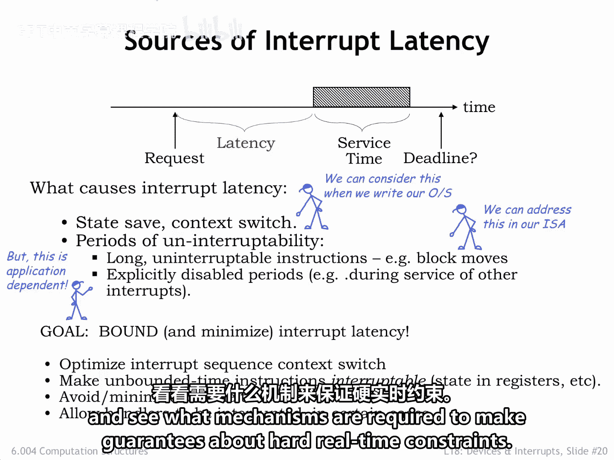

# 数字系统与计算机架构：P2：实时系统 🚨

在本节课中，我们将要学习实时系统的基本概念。我们将探讨传统分时系统的局限性，理解实时系统为何需要保证任务在特定截止时间前完成，并分析影响系统响应时间的关键因素。

---

在构建分时系统的过程中，我们努力创建了一个执行环境，让每个进程仿佛运行在各自独立的虚拟机上。

进程看起来是并发运行的，尽管实际上我们是在单个硬件系统上快速切换运行的进程。

这通常能带来更好的整体利用率，因为如果某个特定进程正在等待一个I/O事件，我们可以将不需要的CPU周期用于运行其他进程。

分时系统的缺点是，很难精确预测一个进程需要多长时间才能完成，因为它将获得的CPU时间取决于其他进程使用了多少时间。

因此，我们需要知道有多少其他进程，它们是否在等待I/O事件等等。

在我们的分时系统中，无法对完成时间做出任何保证。

我们选择让操作系统扮演外部世界触发的中断事件与进行事件处理的用户模式程序之间的中介。

换句话说，我们将事件处理（数据由操作系统存储）与事件处理（数据通过管理程序调用传递给用户模式程序）分离开来。

这意味着，使用传统的分时系统，很难确保事件处理能在指定的事件截止时间前完成。换句话说，很难确保在事件触发后的指定时间段结束前完成处理。

由于现代CPU芯片提供了廉价、高性能的通用计算能力，它们常被用作控制系统的“大脑”，而这些系统对截止时间有严格要求。例如，考虑现代汽车的电子稳定控制系统。

该系统通过保持汽车朝向驾驶员预期的方向，帮助驾驶员在转向和制动操作中保持对车辆的控制。

系统核心的计算机测量汽车所受的力、转向方向和车轮旋转，以判断是否因失去牵引力而失控。换句话说，判断汽车是否打滑。

如果是，电子稳定控制系统会快速自动地对单个车轮进行制动，以防止汽车航向偏离驾驶员的预期航向。

有了电子稳定控制，你可以猛踩刹车或急转弯避开障碍物，而不用担心汽车会突然甩尾失控。

你可以通过制动器发出的“咔嗒”声感觉到系统在工作。为了有效，电子稳定控制系统必须保证在接收到危险的传感器信号后的一定时间内，对每个车轮采取正确的制动动作。

这意味着它必须能够保证某些子程序在传感器事件发生后的预定时间内运行完成。

为了能够做出这些保证，我们必须想出一种更好的方法来调度进程执行。轮询调度无法完成这项工作。能够做出此类保证的系统被称为实时系统。

实时系统的一个性能衡量指标是中断延迟 **L**，即从请求运行某些代码到该代码实际开始执行之间经过的时间量。

如果处理该请求有一个截止时间 **D** 相关联，我们可以计算出仍允许服务程序在截止时间前完成的最大允许延迟。

换句话说，满足 **L_max + S = D** 的最大 **L** 是多少？

如果错过了某些截止时间，可能会发生不好的事情。也许这就是我们称之为“截止时间”的原因。

在这些情况下，我们希望我们的实时系统能保证实际延迟始终小于最大允许延迟。

这些关键的截止时间催生了我们所谓的**硬实时约束**。

哪些因素会导致中断延迟？在处理中断时，保存进程状态、切换到内核上下文以及分派到正确的中断处理程序都需要时间。

在编写操作系统时，我们可以努力最小化中断处理程序设置阶段所涉及的代码量。

我们还必须避免处理器长时间无法被中断的情况。

一些指令集架构有复杂的多周期指令。例如，块移动指令，单条指令在进行数据块从一个位置移动到另一个位置时，会进行多次内存访问。在设计指令集架构时，我们需要避免此类指令，或者将其设计为可中断和可重启的。

最大的问题出现在我们在内核模式下执行另一个中断处理程序时。😊

在内核模式下，中断是被禁用的，因此实际延迟将由完成当前中断处理程序所需的时间加上上述其他开销共同决定。

这种延迟不受CPU设计者的控制，将取决于特定的应用程序。

编写具有硬实时约束的程序可能会变得复杂。

我们的目标是限制并最小化中断延迟。我们将通过优化接收中断并分派到正确处理程序代码的成本来实现这一点。

我们将避免执行时间依赖于数据的指令。

并且我们将努力最小化在内核模式下花费的时间。但即使采取了所有这些措施，我们也会看到在某些情况下，我们必须修改我们的系统以允许中断，即使在内核模式下也是如此。

接下来，我们将看一些具体的例子，了解需要哪些机制来保证硬实时约束。

---

本节课中，我们一起学习了实时系统的基本原理。我们了解到，与无法保证完成时间的传统分时系统不同，实时系统（尤其是硬实时系统）必须保证任务在严格的截止时间前完成。我们探讨了中断延迟 **L** 的概念及其与截止时间 **D** 的关系（**L_max + S = D**），并分析了导致延迟的因素，如上下文切换、不可中断的内核代码等。最后，我们认识到为了实现硬实时约束，需要在系统设计上做出调整，例如优化中断处理路径和允许内核模式下的有限中断。