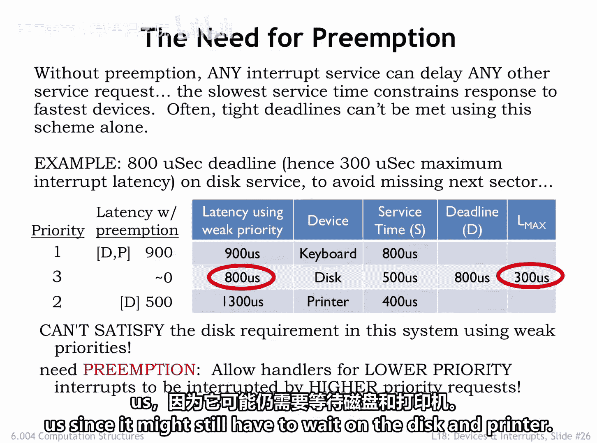
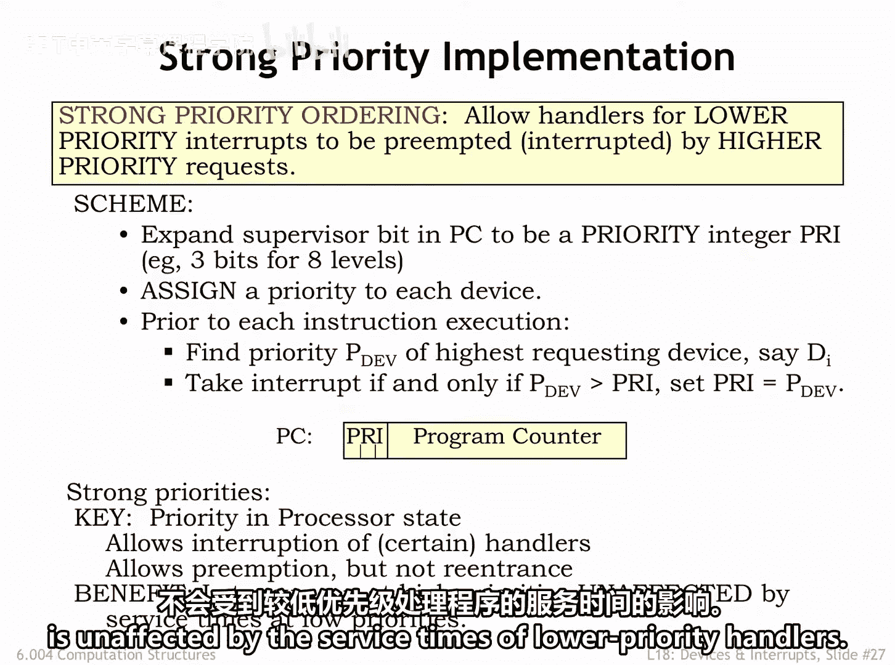
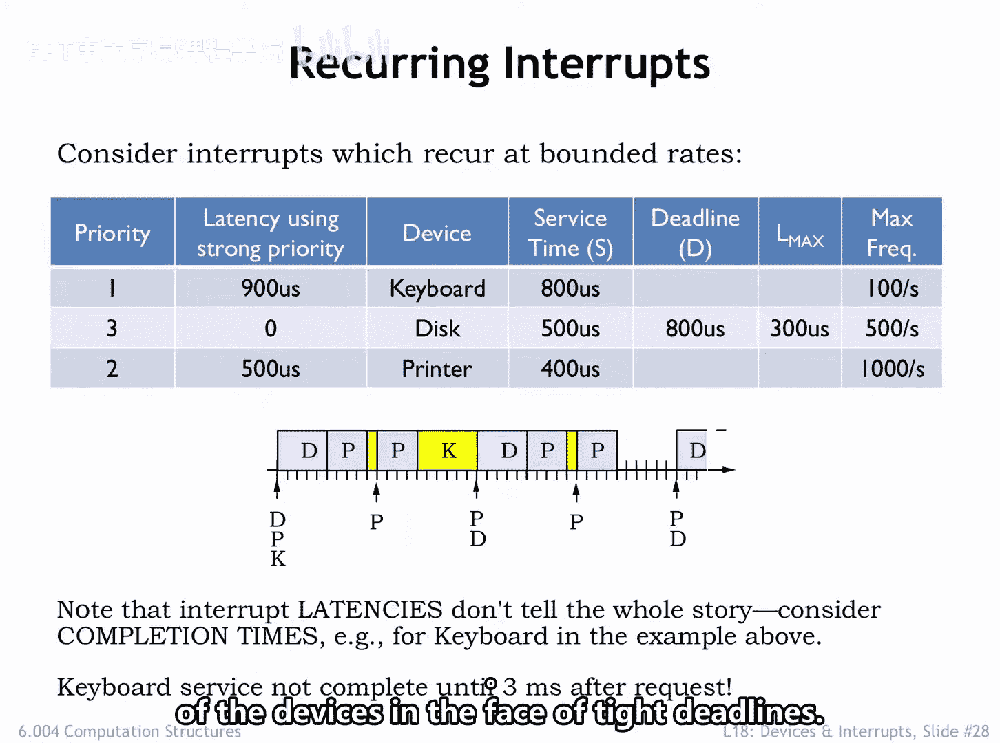
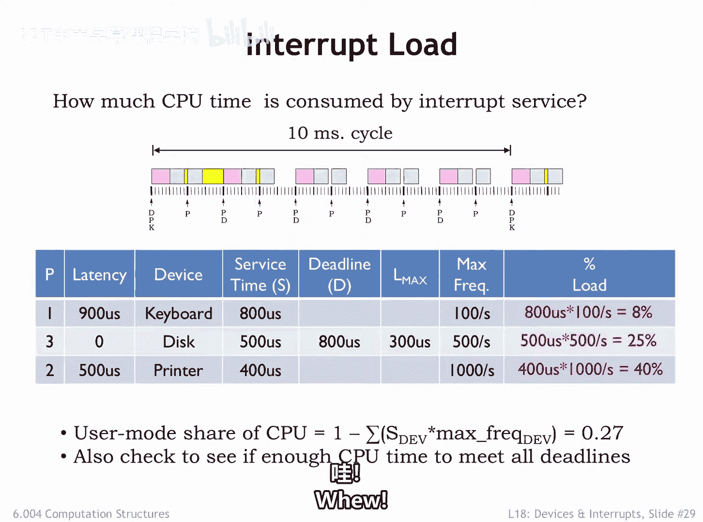

# 【数字系统与计算机架构P2 6.004 2017】麻省理工学院—中英字幕 p59 18.2.6 Strong Priorities -BV19m41127Kj_p59-

In a weak priority system， the currently running task will always run to completion before considering what to run next。

This means the worst case latency for a device always includes the worst case service time across all the other devices。

 In other words， the maximum time we have to wait for the currently running task to complete。

If theres a long running task， that usually means it will be impossible to meet tight deadlines for other tasks。

 For example， suppose disk requests have an 800 microcond deadline in order to guarantee the best throughput from the disk subsystem。

Since the disk candler service time is 500 microseconds。

 the maximum allowable latency between a disk request and starting to execute the diskserv routine is 300 microseconds。

 oops， the weak priority scheme could only guarantee a maximum latency of 800 microseconds。

 not nearly fast enough to meet the disk deadline。 We can't meet the disk deadline using weak priorities。

We need to introduce a preemptive priority system that allows lower priority handlers to be interrupted by higher priority requests。

We're referred to this as a strong priority system。Suppose we gave the disk the highest priority。

 the printers second priority and the keyboards lowest priority， just like we did before。 Now。

 when a disc request arrives， it will start executing immediately without having to wait for the completion of the lower priority printer or keyboard handlers。

The worst case latency for the disk has dropped to 0。 The printer can only be preempted by the disk。

 so its worst case latency is 500 microseconds。Since it has the lowest priority。

 the worst case latency for the keyboard is unchanged at 900 microseconds。

 since it might still have to wait on the disk and printer。The good news。

 with the proper assignment of priorities， the strong priority system can guarantee that this request will be serviced by the 800 microcond deadline。

😊。

We'll need to make a small tweak to our beta hardware to implement a strong priority system。

 Will replace the single supervisor mode bit in PC31 with say a 3 bit field p in PC 31 to 29。

 that indicates which of the eight priority levels the processor is currently running at。Next。

 we'll modify the interrupt mechanism as follows。 In addition to requesting and interrupt。

 the requesting device also specifies the 3 B priority it was assigned by the system architect Well add a priority encoder circuit to the interrupt hardware to select the highest priority request and compare the priority of that request。

 Pd to the3 B Pri value in the PC。The system will take the interrupt request only if P dev is greater than p。

 In other words， if the priority of the request is higher than the priority the system is running at。

When the interrupt is taken， the old PC and p information is saved in X P。

 and the new PC is determined by the type of interrupt， and the new p field is set to Pdev。

 so the processor will now be running at the higher priority specified by the device。

A strong priority system allows low priority handlers to be interrupted by higher priority requests。

 so the worst case latencies seen at high priorities is unaffected by the service times of lower priority handlers。

Using strong priorities allows us to assign a high priority to devices with tight deadlines and thus guarantee their deadlines are met。

Now let's consider the impact of recurring interrupts， in other words。

 multiple interrupt requests from each device。We've added a maximum frequency column to our table。

 which gives us the maximum rate at which requests will be generated by each device。

The execution diagram for a strong priority system is shown below the table。

Here we see there are multiple requests from each device， in this case。

 shown at their maximum possible rate of request。Each tick on the timeline represents 100 microseconds of real time。

Prriter requests occur every1 millisecond， 10 ticks， disrequest every 2 milliseconds， 20 ticks。

 and keyboard requests every 10 milliseconds， 100 ticks。In the diagram。

 you can see the high priority disk request are serviced as soon as they're received。

And that medium priority printer request preempt lower priority execution of the keyboard handler。

Printer request would be preempted by disk requests， but given their request patterns。

 there is never a printer request in progress when a disc request arrives。

 so we don't see that happening here。The maximum latency before a keyboard request starts is indeed 900 microseconds。

But that doesn't tell the whole story， as you can see。

 the poor keyboard handler is continually preempted by higher priority disk printer request。

And so the keyboard handler doesn't complete until three milliseconds after its request was received。

This illustrates why real time constraints are best expressed in terms of deadlines and not latencies。

If the keyboard deadline had been less than 3 milliseconds。

 even the strong priority system would have failed to meet the hard real time constraints。

 The reason would be that there simply aren't enough CPU cycles to meet the recurring demands of the devices in the face of tight deadlines。

Speaking of having enough CPU cycles， there are several calculations we need to do when thinking about recurring interrupts。

The first is to consider how much load each periodic request places on the system。

 there's one keyboard request every 10 milliseconds and servicing each request takes 800 microseconds。

 which consumes 800 microseconds divided by 10 milliseconds or 8% of the CPU。

A similar calculation shows that servicing the disk takes 25% of the CPU and seracing the printer takes 40% of the CPU。

Collectively servicing all the devices takes 73% of the CPU cycles。

 leaving 27% for running user mode programs。Obviously。

 we'd be in trouble if it takes more than 100% of the available cycles to service the devices。

Another way to get in trouble is to not have enough CPU cycles to meet each of the deadlines。

 we need 500 over 800 or 67。5% of the cycles to service the disk in the time between the disk request and the disk deadline。

If we assume we want to finish servicing one printer request before receiving the next。

 the effective printer deadline is 1，000 microseconds。In 1，000 microseconds。

 we need to be able to service one higher priority diskre， 500 microseconds。

 and obviously the printer request 400 microseconds。

So we'll need to use 900 microseconds of the CPU in that 1000 microsecond interval。

ew just barely made it。Suppose we tried setting the keyboard deadline to 2，000 microseconds。

In that time interval， we'd also need to service one disk request and two printer requests。

So the total service time needed is 500 plus 2 times 400 plus 800 equals 2，100 microseconds oops。

 that exceeds the 2000 microsecond window we were given so we can't meet the 2000 microsecond deadline with the available CPUU resources。

But if the keyboard deadline is 3，000 microseconds， let's see what happens。

In a 3000 microsecond interval， we need to service two disk request，3 printer requests。

 and of course， one keyboard request for a total service time of 2 times 500 plus 3 times 400 plus 800 equals 3000 microseconds。

 Who just made it。

