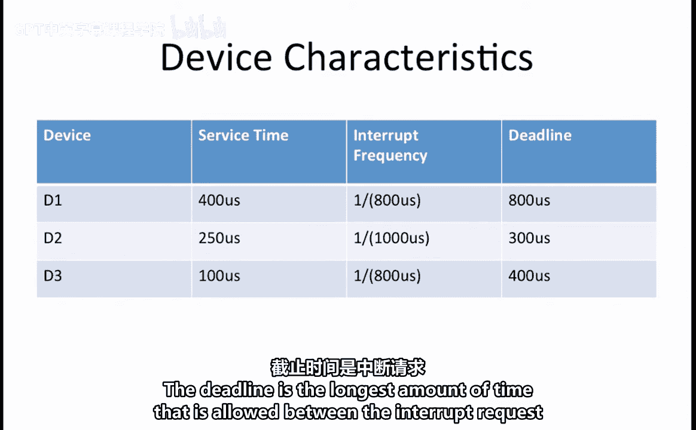
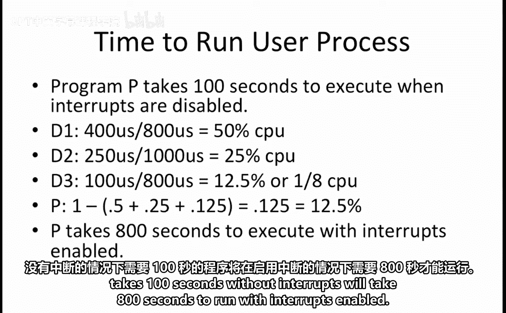
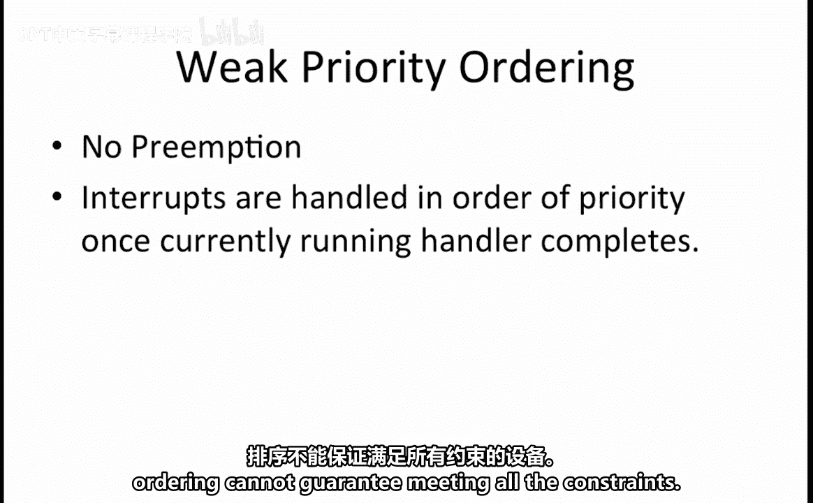
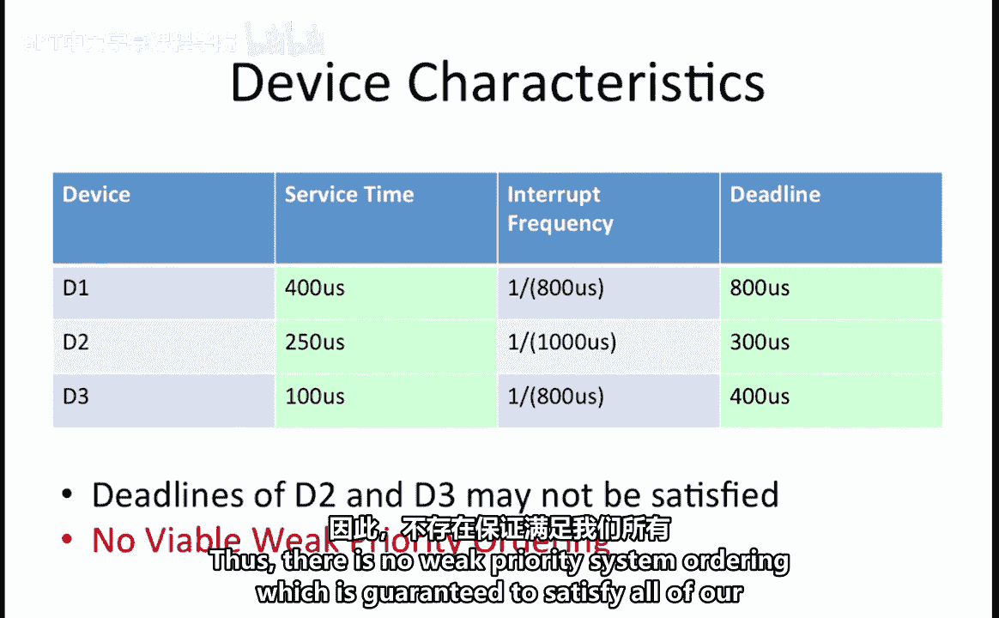
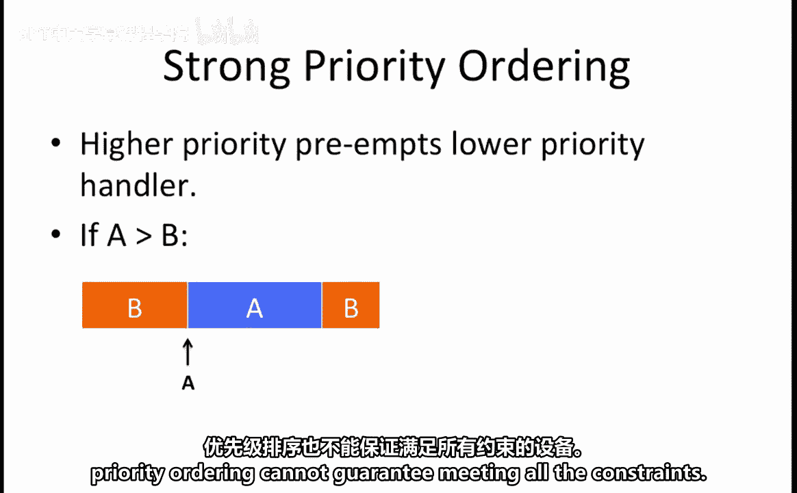
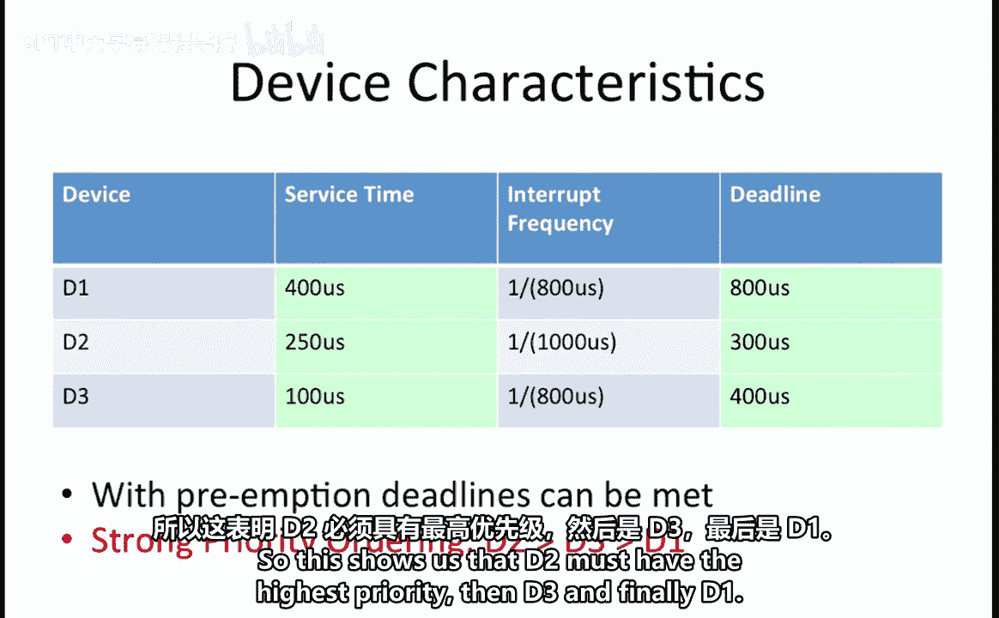

# 数字系统与计算机架构：P2：中断处理实例分析 🧠

在本节课中，我们将学习如何分析一个包含多个中断设备的计算机系统。我们将探讨在弱优先级和强优先级两种中断处理机制下，如何计算程序执行时间，以及如何确定能否满足所有设备的中断处理时限要求。

---

## 系统设备与中断特性

假设我们有一个计算机系统，包含三个设备：D1、D2 和 D3。每个设备都可能引发中断。

下表总结了每个设备的中断特性：

| 设备 | 服务时间 | 中断频率 | 截止时间 |
| :--- | :--- | :--- | :--- |
| D1 | 400 微秒 | 每 800 微秒 | 500 微秒 |
| D2 | 250 微秒 | 每 1000 微秒 | 300 微秒 |
| D3 | 100 微秒 | 每 800 微秒 | 400 微秒 |

**服务时间**是指处理该设备中断所需的时间。
**中断频率**是指该设备中断到达的频率。
**截止时间**是指从中断请求发出到中断处理程序完成所允许的最长时间。

---

## 计算程序执行时间

假设有一个程序 P，在禁用中断的情况下执行需要 100 秒。我们想计算在启用中断的情况下，执行该程序需要多长时间。

要回答这个问题，我们需要确定 CPU 用于处理每个设备中断的时间比例。

以下是计算过程：
*   D1 占用 CPU 时间比例：`400 / 800 = 50%`
*   D2 占用 CPU 时间比例：`250 / 1000 = 25%`
*   D3 占用 CPU 时间比例：`100 / 800 = 12.5%`

这意味着用户程序可用的剩余 CPU 时间为：
`100% - 50% - 25% - 12.5% = 12.5%`

如果用户程序只能占用八分之一的 CPU 时间，那么一个在无中断时需要 100 秒的程序，在启用中断后将需要：
`100 秒 / (12.5%) = 800 秒`

---

## 弱优先级排序分析

上一节我们计算了程序的总执行时间，本节中我们来看看在弱优先级排序下，系统能否满足所有设备的截止时间要求。

在弱优先级系统中，没有抢占机制。一旦一个中断处理程序开始运行，它将运行到完成，即使有更高优先级的中断在其完成前到达。处理程序完成后，系统会按优先级顺序处理所有已到达的中断。

我们需要判断是否存在一种弱优先级排序能满足所有系统约束。如果存在，则确定该排序；如果不存在，则指出哪些设备的约束无法被保证满足。

观察设备特性表，比较截止时间与服务时间。在弱优先级系统中，如果服务时间为 400 微秒的 D1 处理程序正在运行，此时 D2 或 D3 中断到达，那么 D2 或 D3 可能会错过其截止时间。因为 D1 的服务时间加上它们自身的服务时间，超过了它们的截止时间。

具体来说：
*   如果 D2 必须等待 400 微秒才开始被服务，那么它的完成时间将是 `400 + 250 = 650` 微秒，这超过了其 300 微秒的截止时间。
*   如果 D3 必须等待 400 微秒才开始被服务，那么它的完成时间将是 `400 + 100 = 500` 微秒，这超过了其 400 微秒的截止时间。

因此，**不存在**一种弱优先级排序能保证满足我们系统的所有约束。

---

## 强优先级排序分析

现在，让我们在强优先级排序的假设下重新考虑同样的问题。

在强优先级系统中，高优先级设备的中断处理程序可以抢占正在运行的低优先级设备的处理程序。换句话说，如果设备 A 的优先级高于设备 B，并且一个 A 中断在 B 中断处理过程中到达，那么 B 中断处理程序将被中断。系统会先运行 A 的处理程序，待其完成后，再恢复执行 B 的处理程序。

我们需要判断是否存在一种强优先级排序能满足所有系统约束。如果存在，则确定该排序；如果不存在，则指出哪些设备的约束无法被保证满足。

由于我们现在允许抢占低优先级设备的处理程序以满足高优先级设备的要求，因此不再面临“如果 D1 先运行，则 D2 和 D3 无法满足截止时间”的问题。

此外，在本问题开始时，我们已经确定，根据各设备的服务时间和中断频率，系统有足够的时间服务所有中断。这意味着**必定存在**一种强优先级排序可以满足系统的所有约束。

我们可以采用“截止时间越短的设备，优先级越高”的原则来得出一个有效的强优先级排序。

一个有效的强优先级排序是：**D2 优先级最高，其次是 D3，最后是 D1**。用符号表示为：`D2 > D3 > D1`。

对于本例，这个排序是唯一能满足强优先级系统所有约束的有效排序。为了验证这一点，让我们简要分析其他排序的可能性：
*   如果 D1 的优先级高于 D2 或 D3，那么 D2 和 D3 的截止时间将无法得到保证。因此，D1 必须具有最低优先级。
*   在 D2 和 D3 之间，如果 D3 的优先级高于 D2，那么当 D3 正在被服务时 D2 中断到达，D2 中断可能要到 350 微秒后才能完成（D3服务时间100微秒 + D2服务时间250微秒），这超出了其 300 微秒的截止时间。因此，D2 必须具有最高优先级。

所以，最终的排序是 D2 > D3 > D1。

---

## 总结

本节课中我们一起学习了中断处理系统的实例分析。我们首先根据设备的中断频率和服务时间，计算了在中断启用环境下用户程序的执行时间。接着，我们分析了在**弱优先级**（非抢占式）系统中，由于低优先级的长服务时间中断可能阻塞高优先级中断，导致无法保证所有设备满足截止时间要求。最后，我们探讨了在**强优先级**（抢占式）系统中，通过为截止时间短的设备分配高优先级（即 `D2 > D3 > D1`），可以确保所有中断的时限约束得到满足。这个例子清晰地展示了不同中断处理策略对系统实时性的影响。