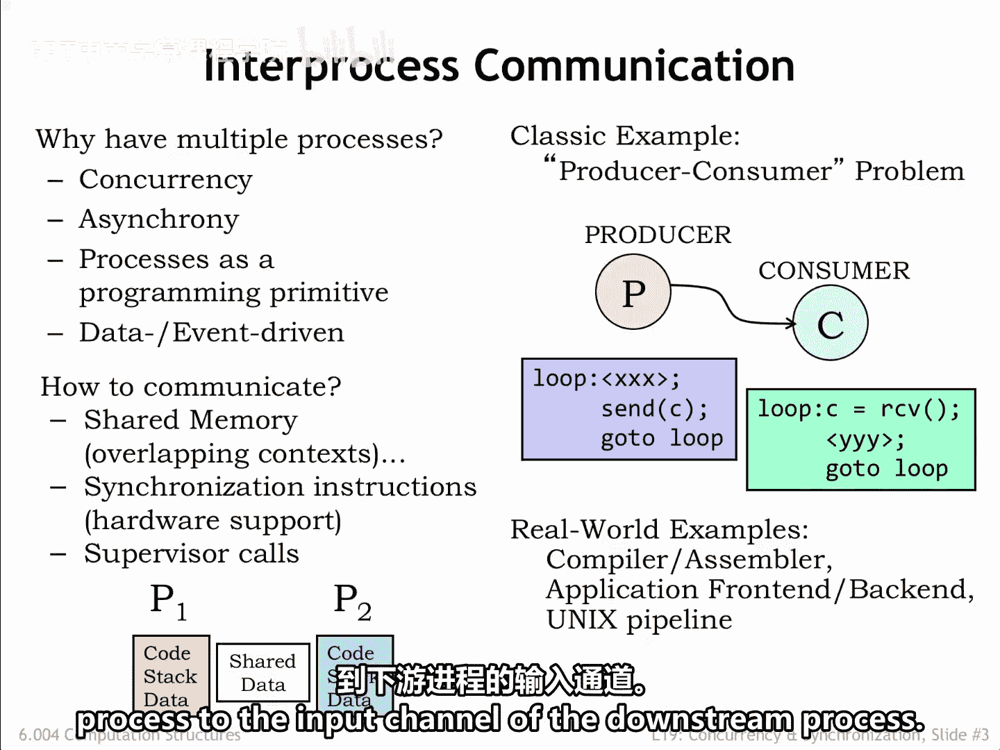
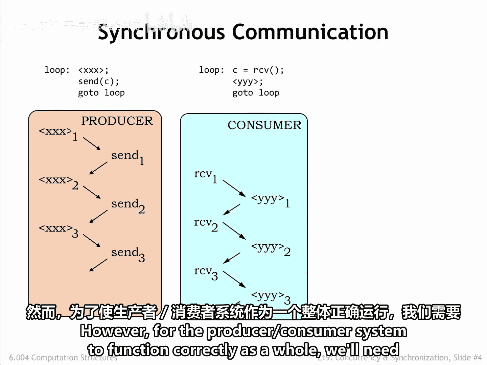
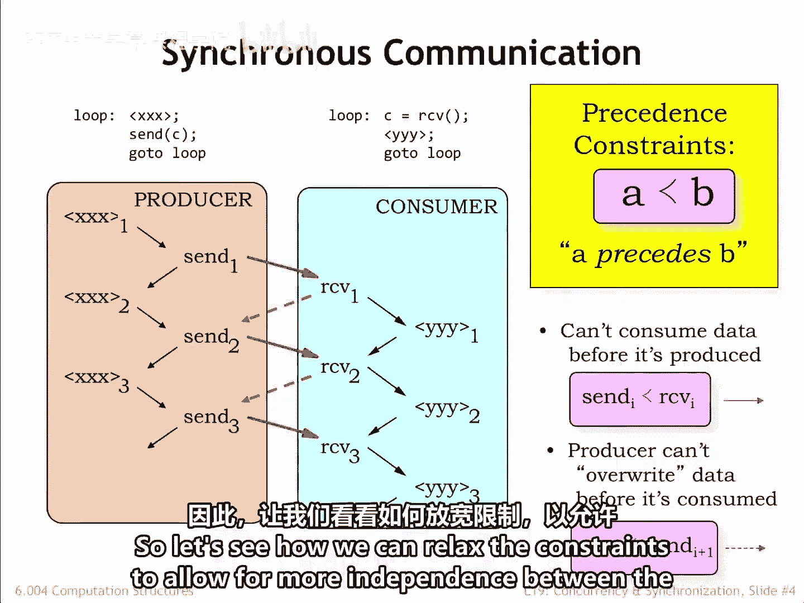
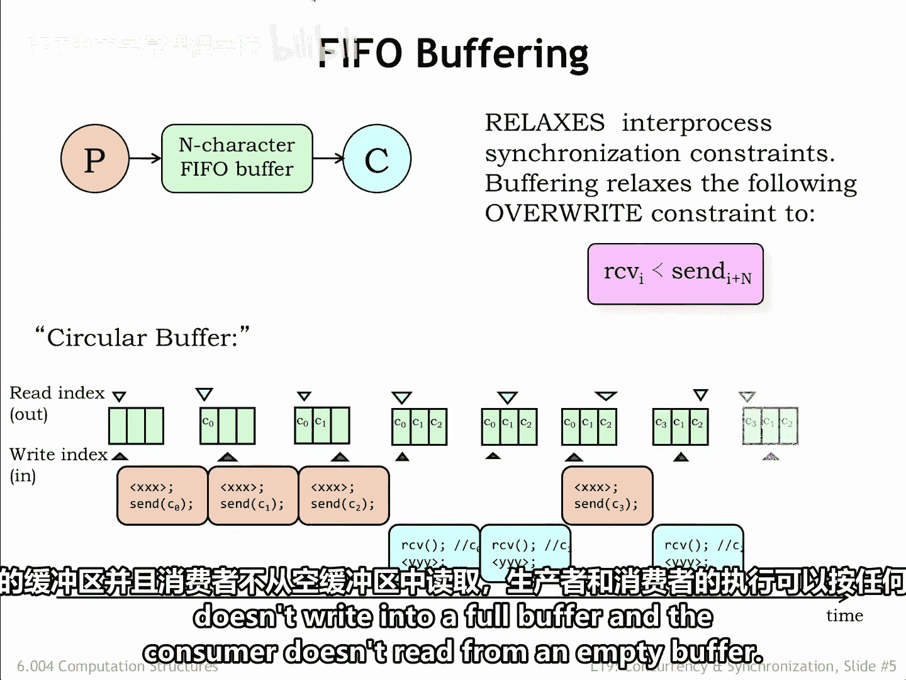
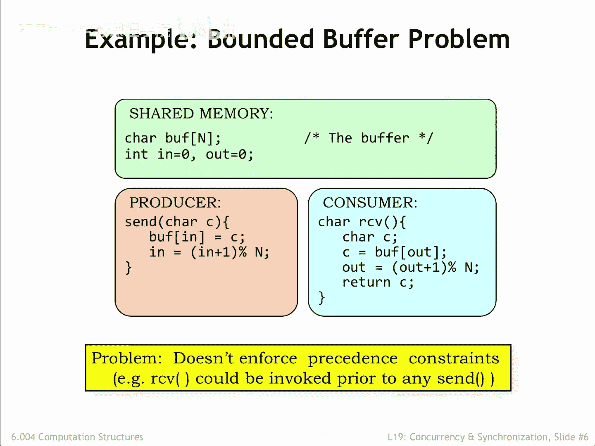

# 【数字系统与计算机架构P2 6.004 2017】麻省理工学院—中英字幕 p62 19.2.1 Interprocess Communication -BV19m41127Kj_p62-

Is not unusual to find that an application is organized as multiple communicating processes。

 What's the advantage of using multiple processes instead of just a single process。

Many applications exhibit concurrency， in other words。

 some of the required computations can be performed in parallel for example。

Video compression algorithms represent each video frame as an array of 8 pixel by8 pixel macro blocks。

 Each macrob is individually compressed by converting the 64 intensity and color values from the spatial domain to the frequency domain。

 and then quantizing and Huffman encoding the frequency coefficients。😊。

If you're using a multicore processor to do the compression。

 you can perform the macroblock compressions concurrently。

Applications like video games are naturally divided into the front end user interface and back end simulation and rendering engines。

Inputs from the user arrive asynchronously with respect to the simulation。

 is easiest to organize the processing of user events separately from the back end processing。

Processes are an effective way to encapsulate the state and computation for what are logically independent components of an application。

 which communicate with one another when they need to share information。

These sorts of applications are often data or event driven， in other words。

 the processing required is determined by the data to be processed or the arrival of external events。

How should the processes communicate with each other？

If the processes are running out of the same physical memory。

 it would be easy to arrange to share memory data by mapping the same physical page into the context for both processes。

Any data written to that page by one process will be able to be read by the other process。

To make it easier to coordinate the processes communicating via shared memory will see its convenient to provide synchronization primitives。

 Some I Ss include instructions that make it easy to do the required synchronization。

Another approach is to add OS supervisor calls to pass messages from one process to another。

Message passing involves more overhead than shared memory。

 but makes the application programming environment independent of whether the communicating processes are running on the same physical processor。

In this lecture， we'll use the classic producer consumer problem as our example of concurrent processes that need to communicate and synchronize。

There are two processes， a producer and a consumer。

The producer is running in a loop which performs some computation Xxx， to generate information。

 in this case a single character C。The consumer is also running in a loop。

 which waits for the next character to arrive from the producer， then perform some computation。

 whyhy， why， why？The information passing between the producer and consumer could obviously be much more complicated than a single character。

For example， a compiler might produce a sequence of assembly language statements that are passed to the assembler to be converted into the appropriate binary array representation。

The user interface front end for a video game might pass a sequence of player actions to the simulation and rendering back end。

In fact， the notion of hooking multiple processes together in a processing pipeline is so useful that the UniX and Linux operating systems provide a pipe primitive in the operating system that connects the output channel of the upstream process to the input channel of the downstream process。

Let's look at a timing diagram for the actions of our simple producer consumer example。

 we'll use the arrows to indicate when one action happens before another。Inside a single process。

 for example， the producer， the order of execution implies a particular ordering in time。

The first execution of Xxx is followed by the sending of the first character。

 then there's the second execution of Xxx， followed by the sending of the second character and so on。

In later examples， we'll om the timing arrows between successive statements in the same program。

We see a similar order of execution in the consumer， the first characters received。

 then the computationYY why is performed for the first time， etc。Inside of each process。

 the Pro's program counter is determining the order in which computations are performed。

So far is so good， each process is running as expected。However。

 for the producer consumer system to function correctly as a whole。

 we'll need to introduce some additional constraints on the order of execution。

These are called precedence constraints and will use the styleized less than signed to indicate that a computation A must proceed。

 in the words come before computation B。In the producer consumer system。

 we can't consume data before it's been produced， a constraint we can formalize as requiring that the Ith send operation has to precede the Ith receive operation。

This timing constraint is shown as the solid red arrow in the timing diagram。Assuming we're using。

 say， a shared memory location to hold the character being transmitted from the producer to the consumer。

 we need to ensure that the producer doesn't overwrite the previous character before it's been read by the consumer。

In other words， we require the Ithe receive to precede the Ithe plus first send。

These timing constraints are shown as the dotted red arrows in the timing diagram。Together。

 these precede's constraints mean that the producer and consumer are tightly coupled in the sense that a character has to be read by the consumer before the next character can be sent by the producer。

Which might be less than optimal if the XXx and YYY computations take a variable amount of time。

So let's see how we can relax the constraints to allow for more independence between the producer and consumer。

We can relax the execution constraints on the producer and consumer by having them communicate via an end character first in。

 first out，5 buffer。As the producer produces characters， it inserts them into the buffer。

The consumer reads characters from the buffer in the same orders as they were produced。

The buffer can hold between0 and n characters。If the buffer holds zero characters is empty。

 if it holds n characters， it's full。The producer should wait if the buffer is full。

 the consumer should wait if the buffer is empty。Using the end character 50 buffer relaxes our second overwrite constraint to the requirement that the Ith receive must happen before the I+ nth send。

In other words， the producer can get up to end characters ahead of the consumer。

Phi0 buffers are implemented as an n element character array with two indices。

 The read index indicates the next character to be read。

 The right index indicates the next character to be written。

 We'll also need a counter to keep track of the number of characters held by the buffer。

 but that's been omitted from this diagram。The indices are incremented modo n。 In other words。

 the next element to be accessed after the n minus first element is the zeroth element。

 hence the name circular buffer。Here's how it works。

 The producer runs using the right index to add the first character to the buffer。

The producer can produce additional characters， but must wait once the buffer is full。

The consumer can receive a character any time the buffer is not empty。

 using the read index to keep track of the next character to be read。

Execution of the producer and consumer can proceed in any order so long as the producer doesn't write into a full buffer and the consumer doesn't read from an empty buffer。

Here's what the code for the producer and consumer might look like。

The array and indices for the circular buffer live in a shared memory where they can be accessed by both processes。

The send routine in the producer uses the right index in to keep track of where to write the next character。

 Similarly， the receive routine in the consumer uses the read index out to keep track of the next character to be read。

 After each use， each index is incremented， modo n。The problem with this code is that。

 as currently written， neither of the two precede's constraints is enforced。

 The consumer can read from an empty buffer， and the producer can overwrite entries when the buffer is full。

We'll need to modify this code to enforce the constraints， and for that。

 we'll introduce a new programming construct that we'll use to provide the appropriate inter process synchronization。

