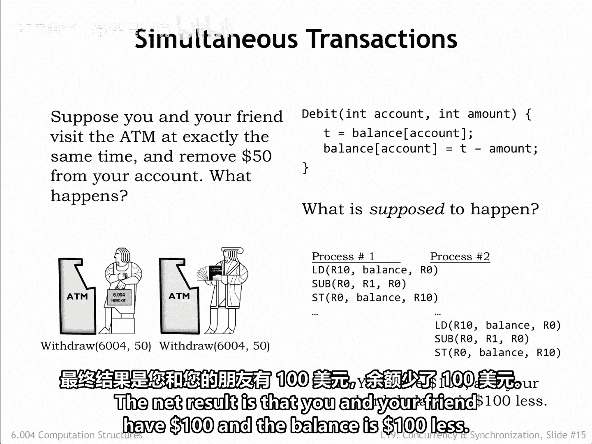
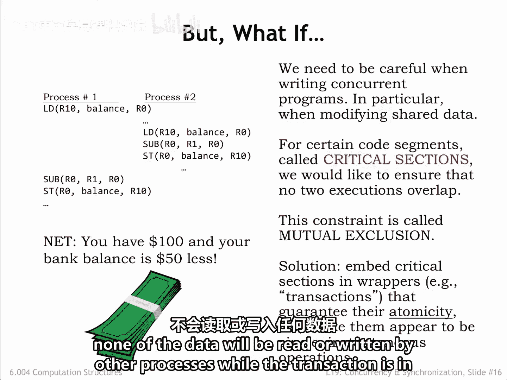
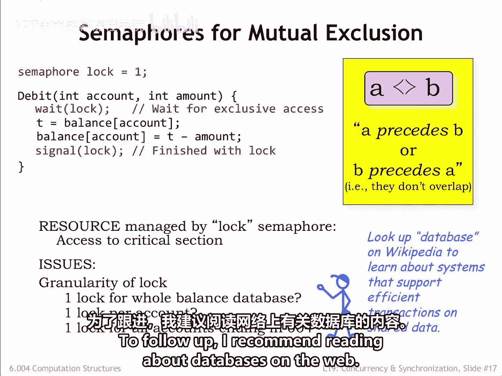
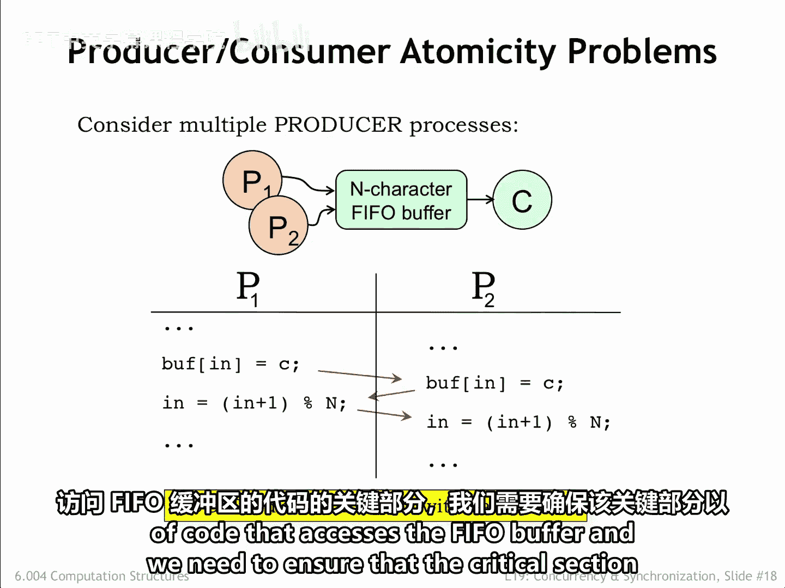
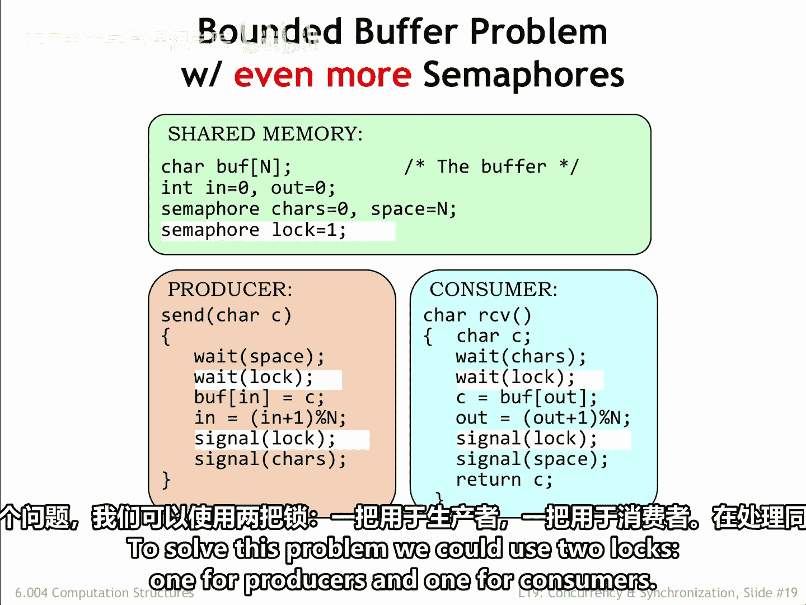
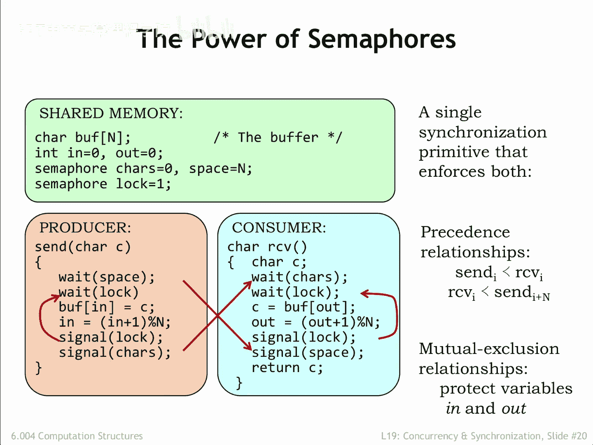

# 【数字系统与计算机架构P2 6.004 2017】麻省理工学院—中英字幕 p64 19.2.3 Atomic Transactions -BV19m41127Kj_p64-

Let's take a moment to look at a different example。

 automatedated teller machines allow bank customers to perform a variety of transactions， deposits。

 withdrawals， transfers， etc。Let's consider what happens when two customers try to withdraw $50 from the same account at the same time。

 a portion of the bank's code for a withdrawal transaction is shown in the upper right。

This code is responsible for adjusting the account balance to reflect the amount of the withdrawal。

 Presumably， the check to see if there are sufficient funds has already happened。

What's supposed to happen。Let's assume the bank is using a separate process to handle each transaction。

 so the two withdrawal transactions cause two different processes to be created。

 each of which will run the debit code。If each of the calls to debit run to completion without interruption。

 we get the desired outcome。 The first transaction debits the account by $50。

 Then the second transaction does the same。The net result is that you and your friend have $100 and the balance is $100 less。

So far， so good。But what happens if the process for the first transaction is interrupted just after it's read the balance。

The second process subtracts $50 from the balance completing that transaction。

Now the first process resumes using the now out of date balance it loaded just before being interrupted。

The net result is that you and your friend have $100， but the balance has only been debitted by $50。

The moral of the story is that we need to be careful when writing code that reads and writes shared data says other processes might modify the data in the middle of our execution。

When say updating a shared memory location， well need to load the current value， modify it。

 and then store the updated value。We would like to ensure that no other processes access the shared location between the start of the load and the completion of the store。

The load Mo store code sequence is what we call a critical section。

We need to arrange that other processes attempting to execute the same critical section are delayed until our execution is complete。

This constraint is called mutual exclusion。 In other words。

 only one process at a time can be executing code in the same critical section。

Once we've identified critical sections， we'll use sephoce to guarantee they execute atomically。

 in other words， that once execution of the critical section begins。

 no other process will be able to enter the critical section until the execution is complete。

The combination of the Semapho to enforced the mutual exclusion constraint and the critical section of code。

Implement what's called a transaction。 A transaction can perform multiple reads and rights of shared data with a guarantee that none of the data will be read or written by other processes。

 while the transaction is in progress。

Here's the original code to Debit， which will modify by adding a lock sephore。 In this case。

 the resource controlled by the semaphore is the right to run the code in the critical section。

By initializing lock to1， we're saying that at most one process can execute the critical section at a time。

A process running the debit code waits on the lock sepho； if the value of lock is 1。

 the weight will decrement the value of lock to 0。And let the process enter the critical section。

This is called acquiring the lock。If the value of lock is0。

 some other process has acquired the lock and is executing the critical section。

 and our execution is suspended until the lock value is non0。

When the process completes execution of the critical section。

 it releases the lock with a call to signal， which will allow other processes to enter the critical section。

If there are multiple weighting processes， only one will be able to acquire the lock。

 and the others will still have to wait their turn。Used in this manner。

 semaphos are implementing a mutual exclusion constraint。 In other words。

 there's a guarantee that two executions of the critical section cannot overlap。

Note that if multiple processes need to execute the critical section。They may run in any order。

 and the only guarantee is that their executions will not overlap。

There are some interesting engineering issues to consider。

There's the question of the granularity of the lock， in other words。

 what shared data is controlled by the lock。In our bank example。

 should there be one law controlling access to the balance for all accounts？

That would mean that no one could access any balance while a transaction was in progress。

That would mean that transactions accessing different accounts would have to run one after the other。

 even though they're accessing different data。So one lock for all the balances would introduce unnecessary precedence constraints。

 greatly slowing the rate at which transactions could be processed。

Since the guarantee we need is that we shouldn't permit multiple simultaneous transactions on the same account。

 it would make more sense to have a separate lock for each account and change the debit code to acquire the accounts lock before proceeding。

That will only delay transactions that truly overlap an important efficiency consideration for a large system processing many thousands of mostly non overlapping transactions each second。

Of course， having per account locks would meet a lot of locks。If that's a concern。

 we can adopt a compromise strategy of having locks that protect groups of accounts， for example。

 accounts with the same last three digits in the account number。

That would mean we'd only need 1000 locks， which would allow up to 1000 transactions to happen simultaneously。

The notion of transactions on shared data is so useful that we often use a separate system called a database that provides the desired functionality。

Databases are engineered to provide low latency access to shared data。

 providing the appropriate transactional semantics。

The design and implementation of databases and transactions is pretty interesting。To follow up。

 I recommend reading about databases on the web。

Returning to our producer consumer example， we see that if multiple producers are trying to insert characters into the buffer at the same time。

 it's possible that their execution may overlap in a way that causes characters to be overwritten and or at the index to be improperly incremented。

We just saw this bug in the bank example， the producer code contains a critical section of code that accesses the PIO buffer。

 and we need to ensure that the critical section is executed atomically。

Here we've added a third semopho called Locke to implement the necessary mutual exclusion constraint for the critical section of code that inserts characters into the PIO buffer。

With this modification， the system will now work correctly when there are multiple producer processes。

 There's a similar issue with multiple consumers。 So we've used the same lock to protect the critical section for reading from the buffer and the receive code。

Using the same lock for producers and consumers will work。

 but does introduce unnecessary precede constraints since producers and consumers use different indices。

 in other words， in for producers and out for consumers。To solve this problem。

 we could use two locks， one for producers and one for consumers。

Semaphorees are a pretty handy Swiss army knife when it comes to dealing with synchronization issues。

When weight and signal appear in different processes。

 the same ensures correct execution timing between processes。In our example。

 we use two semophores to ensure that consumers can't read from an empty buffer and that producers can't write into a full buffer。

We also use semaphos to ensure that execution of critical sections， in our example。

 updates of the indices in and out were guaranteed to be atomic。In other words。

 that the sequence of reads and writes needed to increment a shared index would not be interrupted by another process between the initial read of the index and the final write。

