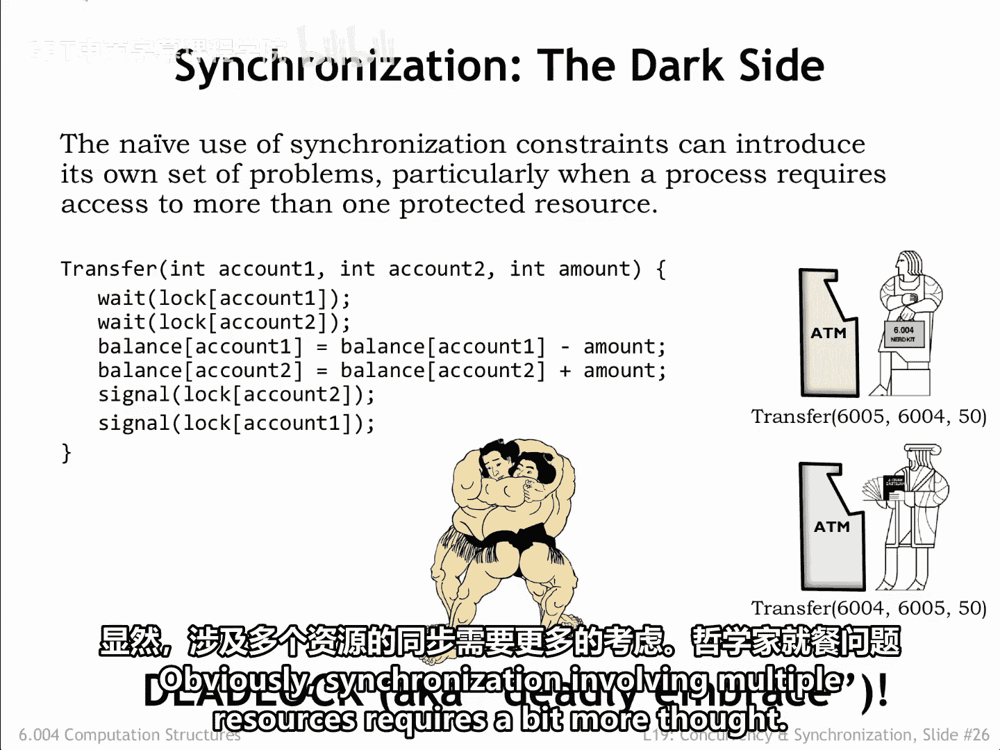
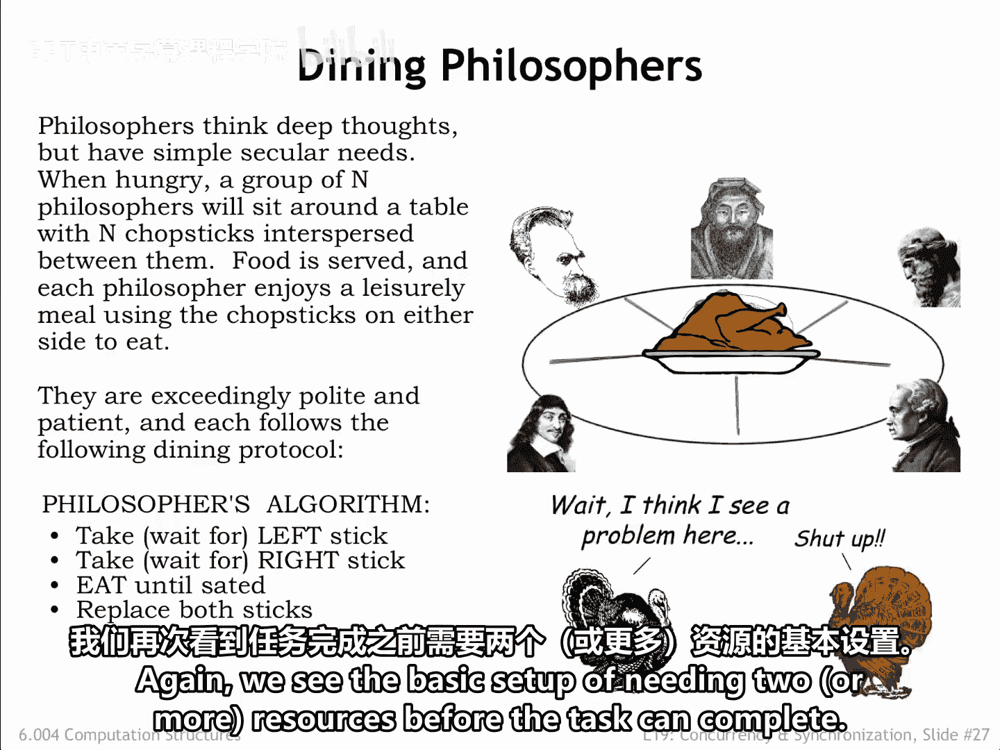
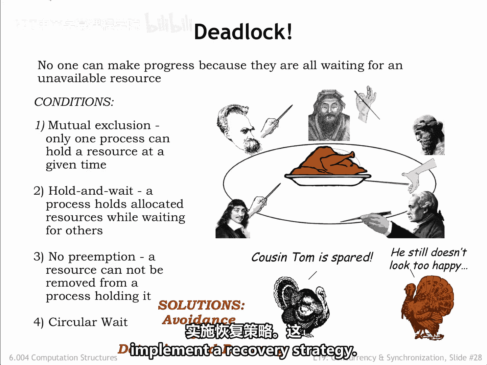
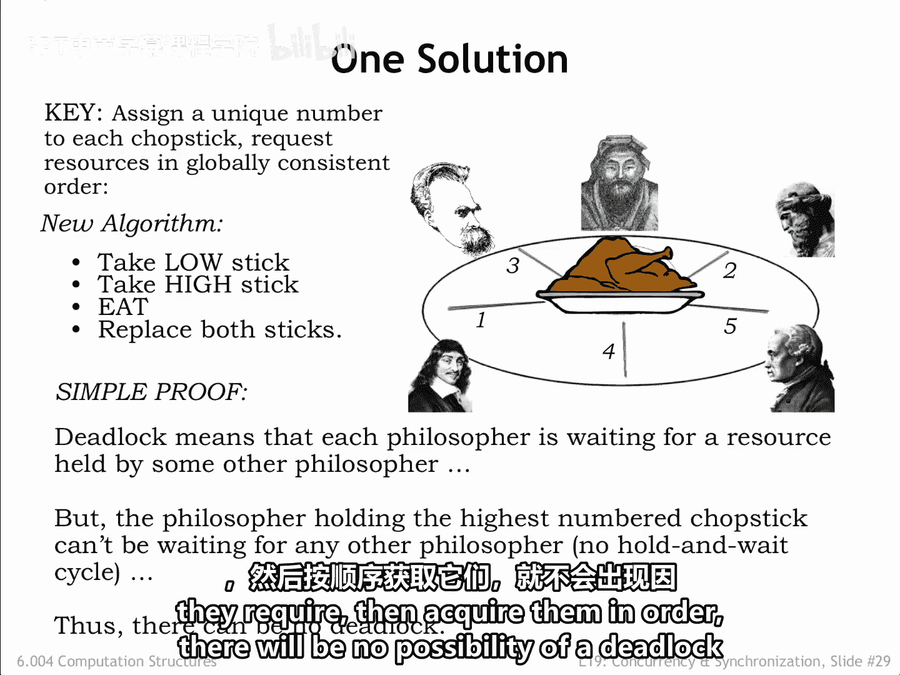
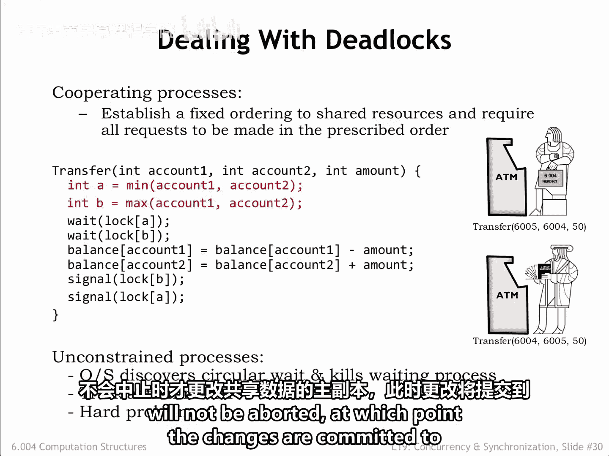
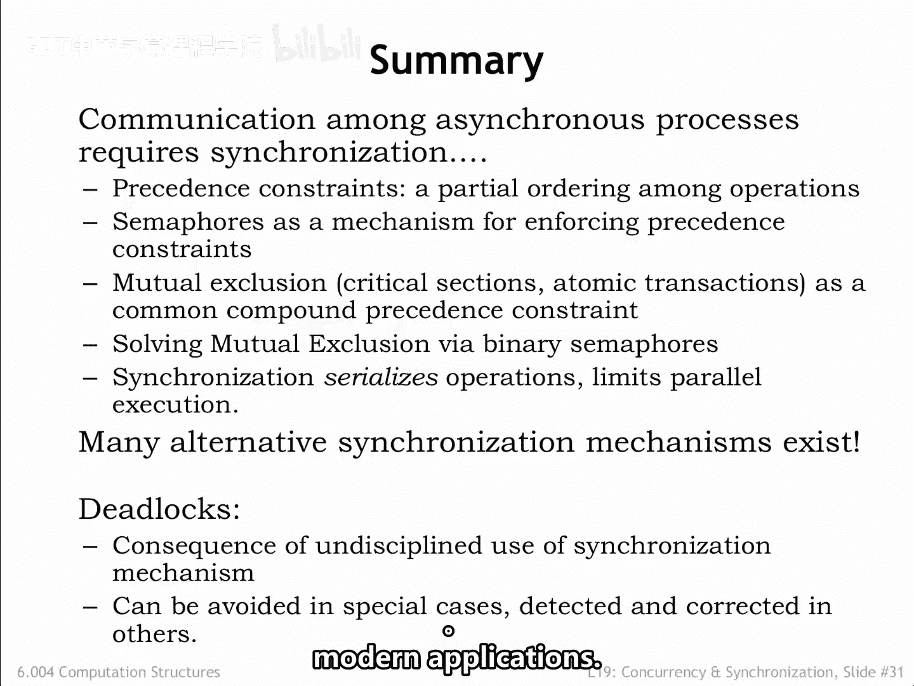

# 【数字系统与计算机架构P2 6.004 2017】麻省理工学院—中英字幕 p66 19.2.5 Deadlock -BV19m41127Kj_p66-

If the necessary synchronization requires acquiring more than one lock。

 there are some special considerations that need to be taken into account。For example。

 the code below implements the transfer of funds from one bank account to another。

The code assumes there is a separate semophore lock for each account。

 and since it needs to adjust the balance of two accounts， it acquires the lock for each account。

Consider what happens if two customers try simultaneous transfers between their two accounts。

The top customer will try to acquire the locks for accounts 605 and 604。

The bottom customer tries to acquire the same locks， but in the opposite order。

Once a customer has acquired both locks， the transfer code will complete releasing the locks。

But what happens if the top customer acquires his first lock for account 605 and the bottom customer simultaneously acquires his first lock for account 604？

So far so good。 but now each customer will not be successful in acquiring their second lock since those locks are already held by another customer。

This situation is called a deadlock or deadly embrace。

 because there is no way execution for either process will resume。

 Both will wait indefinitely to acquire a lock that will never be available。Obviously。

 synchronization involving multiple resources requires a bit more thought。

The problem of deadlock is elegantly illustrated by the dining philosopher's problem。 Here there are。

 say， five philosophers waiting to eat。Each requires two chopsticks in order to proceed。

 and there are five chopsticks on the table。The philosophers follow a simple algorithm。 First。

 they pick up the chopstick on their left。 Then the chopstick on their right。

 When they have both chopsticks， they eat until they're done。

 At which point they return both chopstick to the table。

 perhaps enabling one of their neighbors to pick them up and begin eating。Again。

 we see the basic setup of needing two or more resources before the task can complete。

Hopefully you can see the problem that may arise。If all philosophers pick up the chopstick on their left。

 then all the chopsticks have been acquired， and none of the philosophers will be able to acquire their second chopstick and eat another deadlock。

Here are the conditions required for a deadlock， One mutual exclusion where a particular resource can only be acquired by one process at a time。

Two， hold and weight， where a process holds allocated resources while waiting to acquire the next resource。

Three， no preemption where a resource cannot be removed from the process which required it。

Resources are only released after the process has completed its transaction。Four circular weight。

 where resources needed by one process are held by another and vice versa。

How can we solve the problem of deadlocks when acquiring multiple resources。

 Either we avoid the problem to begin with or we detect that deadlock has occurred and implement a recovery strategy。

 Both techniques are used in practice。

In the dining philosopher's problem， deadlock can be avoided with a small modification to the algorithm。

We start by assigning a unique number to each toptick to establish a global ordering of all the resources。

 then rewrite the code to acquire resources using the global ordering to determine which resource to acquire first。

 which second and so on。With the chopsticks numbered。

 the philosophers pick up the lowest numbered chopstick from either their left or right。

Then they pick up the other higher numbered chopstick， eat。

 and then return the chopstick to the table。How does this avoid deadlock？

Deadlock happens when all the chopsticks have been picked up， but no philosopher can eat。

If all the chopsticks have been picked up， that means some philosopher has picked up the highest numbered chopstick and so must have earlier picked up the lower numbered chopstick on his other side。

 so that philosopher can eat then return both chopsticks to the table。

 breaking their hold and weight cycle。So if all the processes in the system can agree upon a global ordering for the resources they acquire。

 then acquire them in order， there will be no possibility of a deadlock caused by a hold and wait cycle。

A global ordering is easy to arrange in our banking code for the transfer transaction will modify the code to first acquire the lock for the lower numbered account。

 then acquire the lock for the higher numbered account。Now。

 both customers will first try to acquire the lock for the 6W04 account。

The customer that succeeds can then acquire the lock for the 6W05 account and complete the transaction。

The key to deadlock avoidance was that customers contended for the lock for the first resource they both needed。

 acquiringring that lock ensured they would be able to acquire the remainder of the shared resources without fear that they would already be allocated to another process in a way that would cause a hold and wait cycle。

Establishing and using a global order for shared resources is possible when we can modify all processes to cooperate。

A footing deadlock without changing the processes is a harder problem。For example。

 at the operating system level， it would be possible to modify the weight supervisor call to detect circular weight and terminate one of the waitingtting processes。

 releasing its resources and breaking the deadlock。

The other strategy we mentioned was detection and recovery。

Datase systems detect text when there's been an external access to the shared data used by a particular transaction。

 which causes the database to abort the transaction。When issuing a transaction to a database。

 the programmer specifies what should happen if the transaction is aborted。 For example。

 she can specify that the transaction be retried。The database remembers all the changes to shared data that happened during a transaction and only changes the master copy of the shared data when it is that the transaction will not be aborted。

At which point the changes are committed to the database？In summary。

 we saw that organizing an application as communicating processes is often a convenient way to go。

We use semaphos to synchronize the execution of the different processes。

 providing guarantees that certain precedents constraints would be met。

 even between statements in different processes。We also introduced the notion of critical code sections and mutual exclusion constraints that guaranteed that a code sequence would be executed without interruption by another process。

We saw that sephos could also be used to implement those mutual exclusion constraints。Finally。

 we discussed the problem of deadlock that it can occur when multiple processes must acquire multiple shared resources。

And we propose several solutions based on a global ordering of resources or the ability to restart a transaction。

Synchronization prims play a key role in the world of big data。

 where there are vast amounts of shared data， or when trying to coordinate the execution of thousands of processes in the cloud。

Understanding synchronization issues and their solutions is a key skill when writing most modern applications。

