# 数字系统与计算机架构：P2：6.4：总线

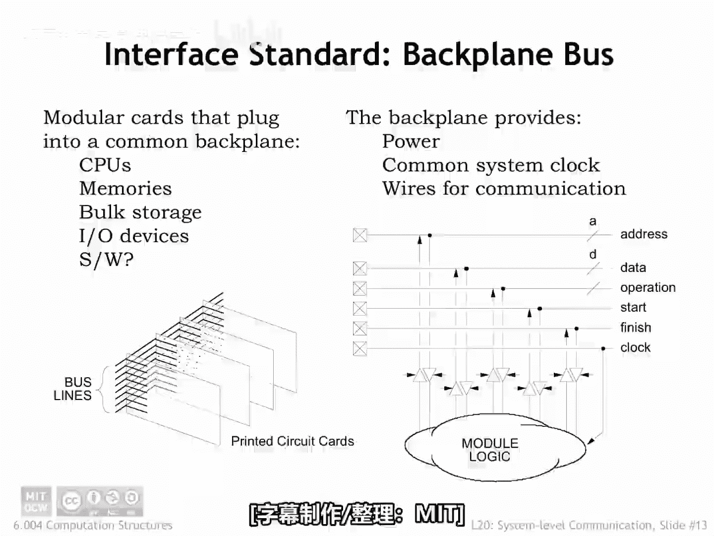

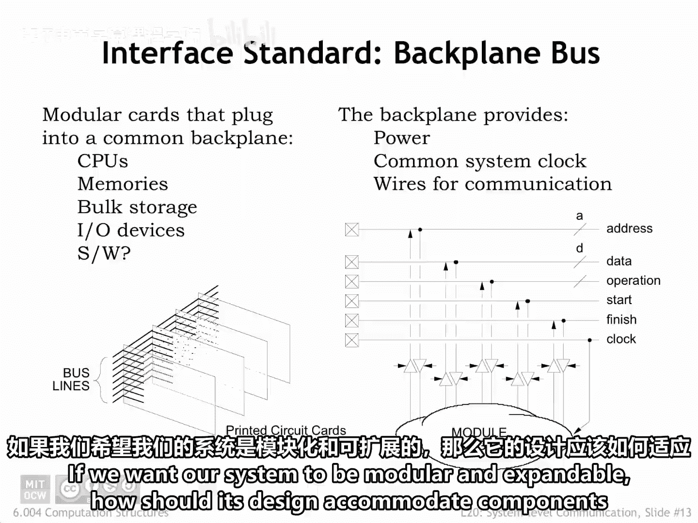

在本节课中，我们将要学习计算机系统中的总线概念。总线是连接系统内不同组件（如CPU、内存和输入/输出设备）的通信通道。我们将探讨总线的基本工作原理、其设计如何支持系统模块化，以及随着系统速度提升，总线设计所面临的挑战。

## 系统模块化与扩展性 🧩

上一节我们介绍了计算机系统的基本组成，本节中我们来看看如何设计系统以支持模块化和扩展性。

如果我们希望系统是模块化且可扩展的，其设计应如何适应用户未来可能想要添加的组件？

多年来，通用的方法是在承载CPU、内存和初始I/O组件集合的主板上，提供一种插入额外印刷电路板（即扩展卡）的方式。主板上的插槽将扩展卡上的电路连接到主板上的信号，这些信号允许CPU与扩展卡通信。

## 什么是总线？ 🚌

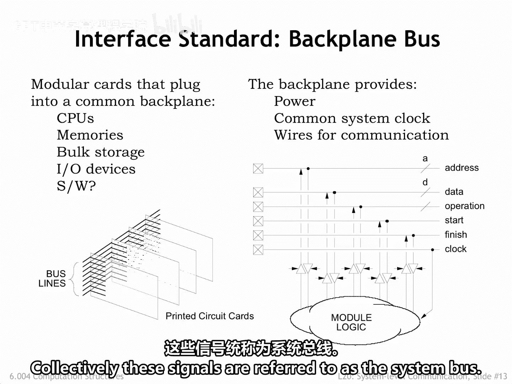

上一节我们提到了主板上的信号集合，本节中我们正式介绍“总线”这一核心概念。

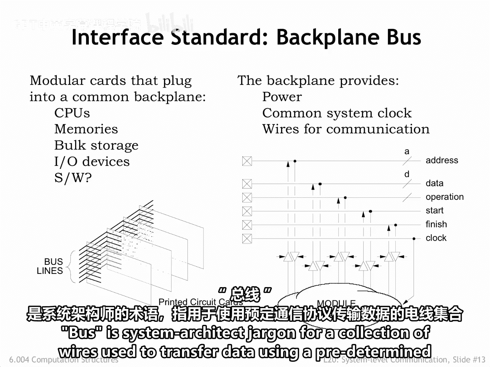

“总线”是系统架构领域的术语，指代一组使用预定通信协议传输数据的导线集合。

以下是构成系统总线的关键信号线：

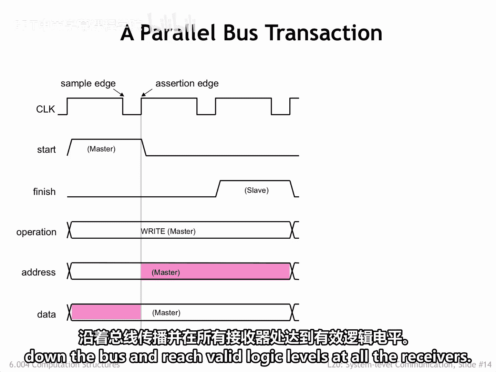

*   **地址线**：用于选择扩展卡上不同的通信端点（如内存位置、控制寄存器、诊断端口等）。
*   **数据线**：用于在CPU和扩展卡之间双向传输数据。在旧系统中，会有多条数据线以支持字节或字宽度的数据传输。
*   **控制线**：用于告知扩展卡特定传输何时开始，并允许扩展卡指示其何时已做出响应。

如果主板上有多个插槽用于插入多张扩展卡，相同的信号线可能会连接到所有卡上，此时地址线将用于区分哪些传输是针对哪张卡的。

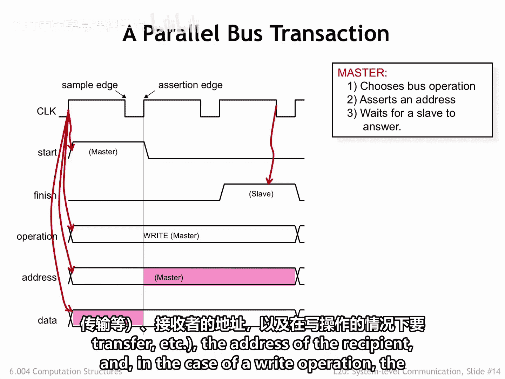

## 总线事务如何工作？ ⏱️

了解了总线的构成后，本节中我们来看看一次典型的总线事务是如何进行的。

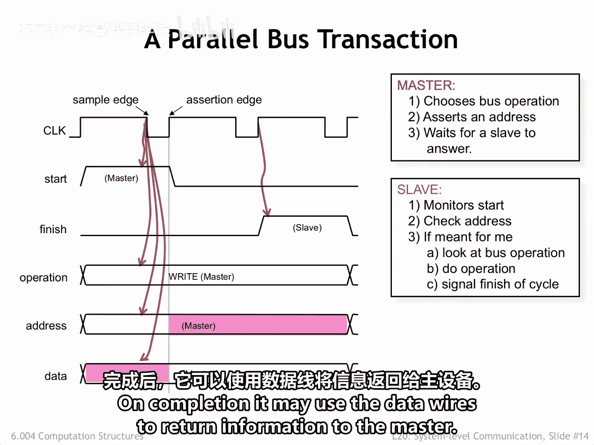

时钟信号用于同步通信。信号在时钟的**断言边沿**被放置到总线导线上，并在时钟的**采样边沿**被接收方读取。时钟波形的时序设计旨在为信号沿总线传播并在所有接收器处达到有效逻辑电平留出足够时间。

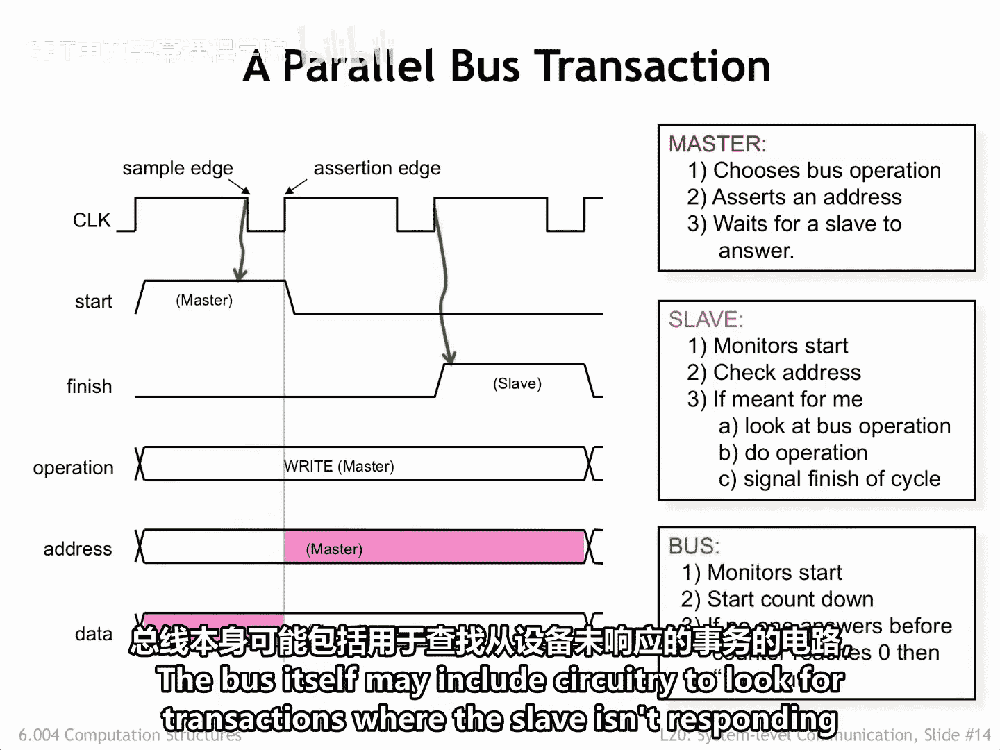

以下是总线事务的基本步骤：

1.  **发起事务**：发起事务的组件称为**总线主设备**，它拥有总线控制权。大多数总线提供一种机制，用于将所有权从一个组件转移到另一个。主设备设置总线线路以指示期望的操作（读、写、块传输等）、接收方的地址，以及在写操作中要发送给接收方的数据。
2.  **响应事务**：预期的接收方称为**从设备**，它在每个采样边沿监视总线线路，寻找自己的地址。当从设备看到针对自己的事务时，它执行请求的操作，并使用总线信号指示操作何时完成。完成后，它可能使用数据线向主设备返回信息。
3.  **错误处理**：总线本身可能包含电路，用于检测从设备未响应的事务，并在适当的间隔后生成错误响应，以便主设备可以采取相应措施。

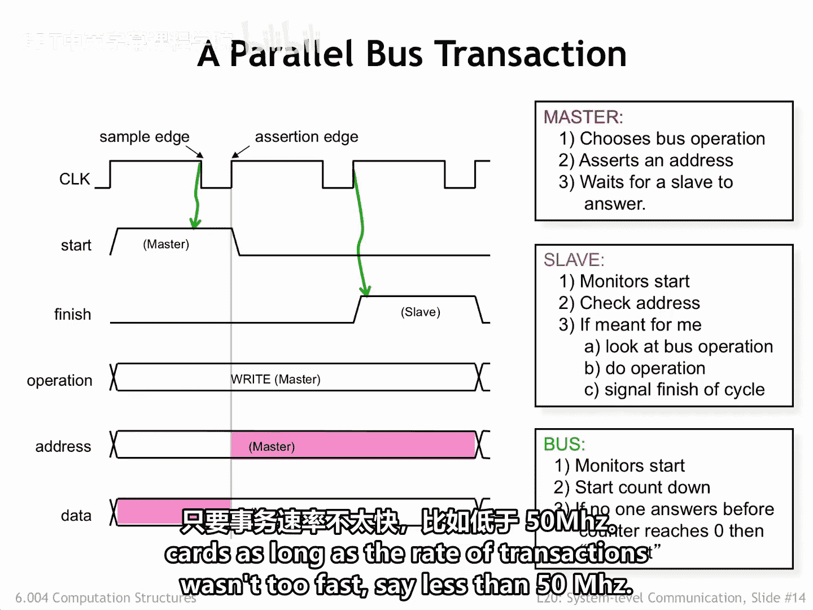

## 总线设计的挑战与局限 🚧

上一节我们介绍了总线在低速下的工作方式，本节中我们来看看当系统速度提升时，总线设计会遇到哪些问题。

只要事务速率不太快（例如低于50 MHz），这种总线架构被证明是一种非常可行的、用于容纳扩展卡的设计。

但随着系统速度的提高，事务速率也必须提高以保持系统性能在可接受的水平。因此，每次事务的时间变得更短。随着总线导线上信号传输时间的减少，各种效应开始凸显。

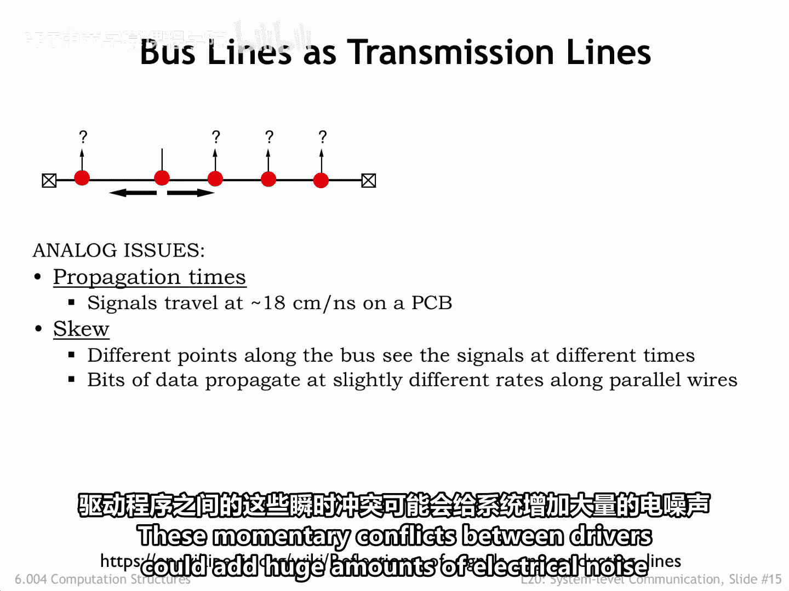

以下是高速总线面临的主要问题：

*   **时序问题**：如果时钟周期过短，可能没有足够的时间让主设备看到断言边沿、启用其驱动器、让信号沿长总线传播到目标接收器，并在采样边沿之前在所有接收器处稳定足够长的时间。
*   **时钟偏移**：时钟信号在不同扩展卡上到达的时间不同。一个接收到较早时钟信号的卡可能认为轮到自己开始驱动总线信号了，而一个接收到较晚时钟信号的卡可能仍在驱动上一个周期的总线信号。驱动器之间的这些瞬时冲突会给系统增加巨大的电气噪声。
*   **信号反射**：能量会在总线连接器造成的所有微小阻抗不连续点发生反射。如果连接器很多，就会产生许多小的回波，这些回波可能破坏各个接收器看到的信号。右上角的公式显示了在每个不连续点有多少信号能量被传输，有多少被反射。其净效应就像对着大峡谷快速喊话，除非在词语之间留出足够的时间让回波消失，否则回波可能会使信息失真到无法识别。

最终，总线被降级用于相对低速的通信任务，对于高速通信，必须开发不同的方法。

## 总结 📝

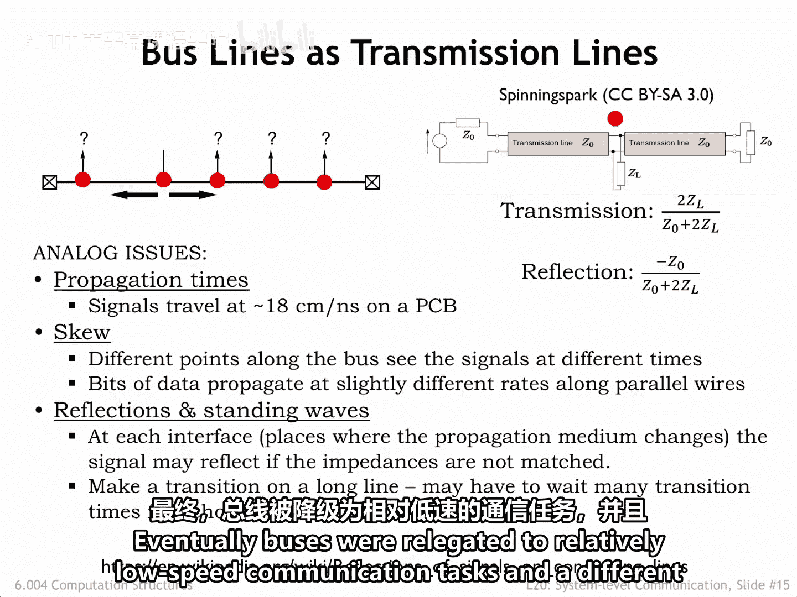

本节课中我们一起学习了计算机系统中的总线。我们了解到总线是一组用于数据传输的导线，它通过地址线、数据线和控制线，使CPU能够与扩展卡等组件通信。我们探讨了基于时钟同步的总线事务基本流程，涉及主设备和从设备的交互。最后，我们认识到随着系统速度的提升，总线在时序、时钟偏移和信号反射等方面面临根本性挑战，这导致了其在高速通信场景下的局限性。理解总线是理解计算机内部组件如何协同工作的基础。