# 【数字系统与计算机架构P2 6.004 2017】麻省理工学院—中英字幕 p71 20.2.4 Point-to-point Communication -BV19m41127Kj_p71-

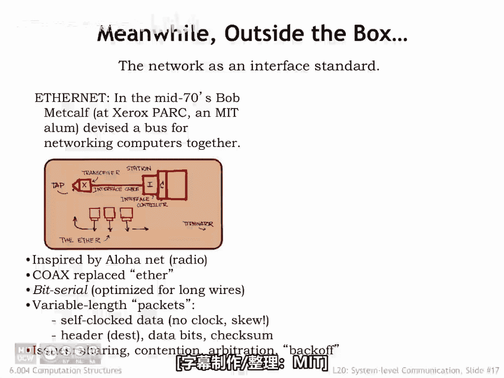

Network technologies were developed to connect components， in this case。

 individual computer systems separated by larger distances， in other words。

 distances measured in meters instead of centimeters。

 communicating over these larger distances led to different design tradeoffs。

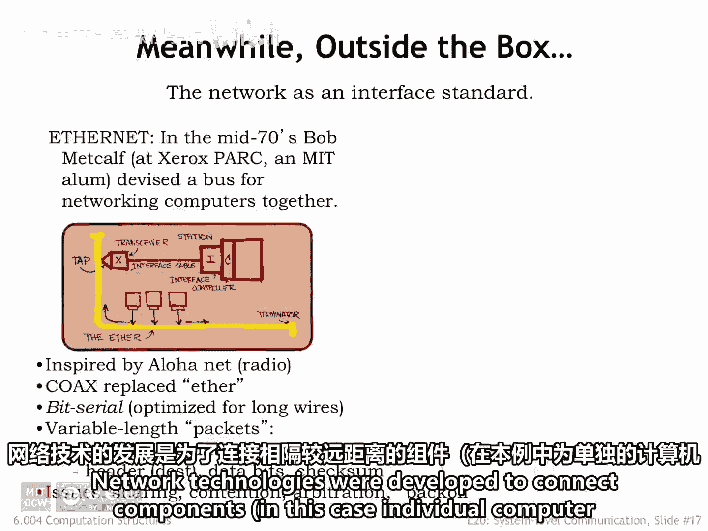

In early networks， information was sent as a sequence of bits over the shared communication medium。

 The bits were organized into packets each containing the address of the destination packets also included a check sum used to detect errors and transmission。

 and the protocol supported the ability to request the retransmission of corrupted packets。

The software controlling the network is divided into a stack of modules。

 each implementing a different communication abstraction。

The lowest level physical layer is responsible for transmitting and receiving an individual packet of bits。

Bit errors are unde detectedected and corrected， and packets with uncorrectable errors are discarded。

There are different physical error modules available for the different types of physical networks。

The network layer deals with the addressing and routing of packets。

Clliver routing algorithms find the shortest communication path through the multihop network and deal with momentary or long term outages on particular network links。

The transport layer is responsible for providing the reliable communication of a stream of data。

 dealing with the issues of discarded or out of order packets。

In an effort to optimize network usage and limit packet losses due to network congestion。

 the transport layer deals with flow control。 In other words， the rate at which packets are sent。

A key idea in the networking community is the notion of building a reliable communication channel on top of a best efforts packet network。

Higher layers of the protocol are designed so that it is possible to recover from errors in the lower layers。

This has proven to be much more cost effective and robust than trying to achieve 100% reliability at each layer。

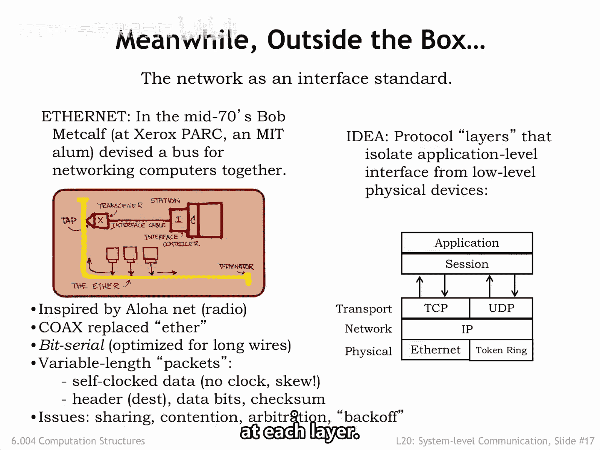

As we saw in the previous section， there are a lot of electrical issues when trying to communicate over a shared wire with multiple drivers and receivers。

Slowing down the rate of communication helps to solve the problem。

 but slow isn't in the courage for today's high performance systems。

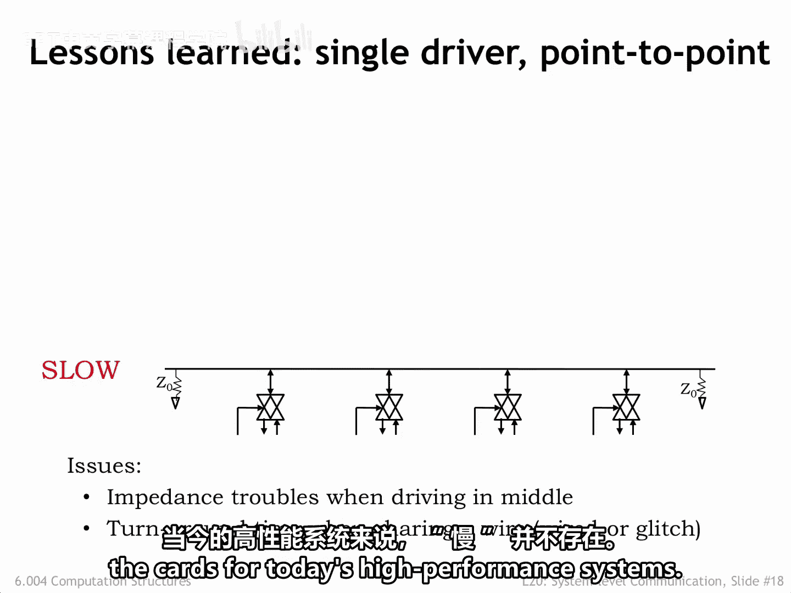

Experience in the network world has shown that the fastest and least problematic communication channels have a single driver communicating with a single receiver what's called a point to point link。

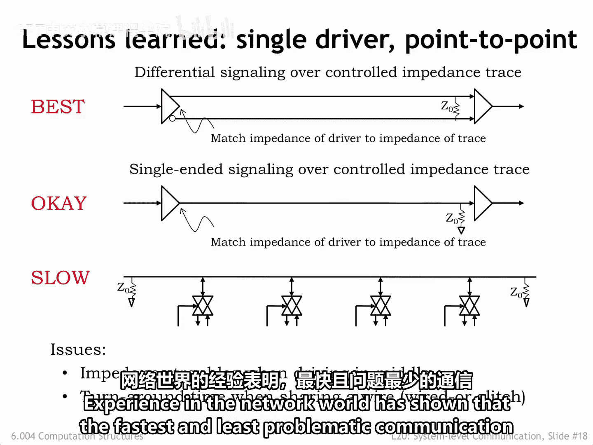

Using differential signaling is particularly robust with differential signaling。

 the receiver measures the voltage difference across the two signalling wires。

Electrical effects that might induce voltage noise on one signalling wire will affect the other in equal measure。

So the voltage difference will largely be unaffected by most noise。

Almost all high performance communication links use differential signaling。

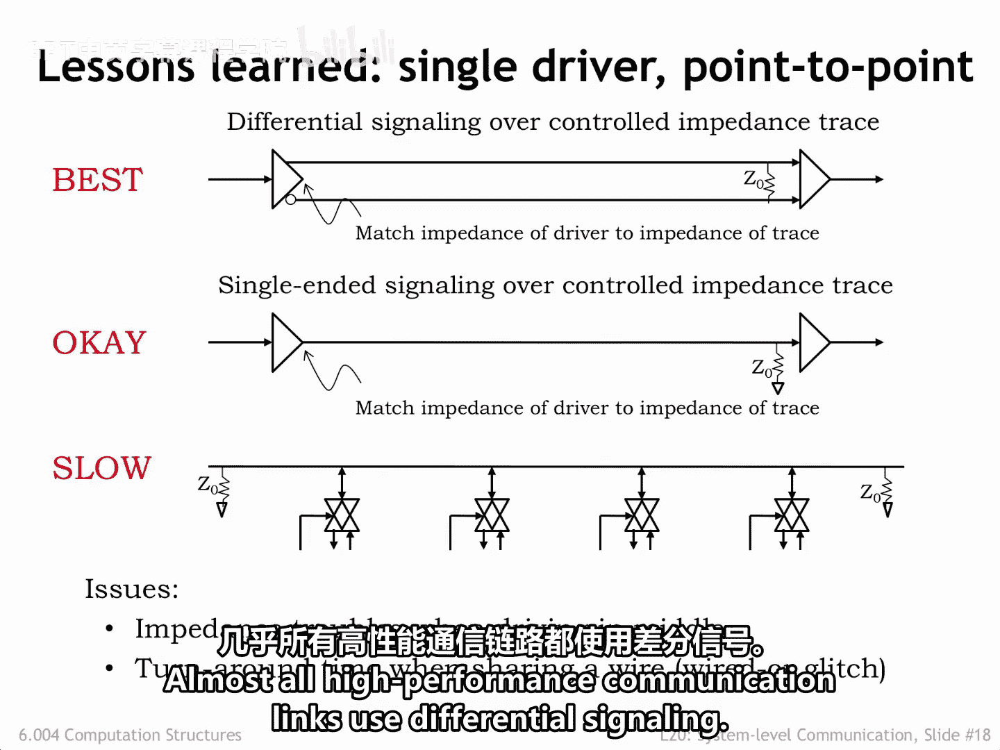

If we're sending digital data， does that mean we also have to send a separate clock signal so the receiver knows when to sample the signal to determine the next bit？

With some cleverness， it turns out we can recover the timing information from the received signal。

 assuming we know the nominal clock period at the transmitter。

If the transmitter changes the bit at sending at the rising edge of the transmitter's clock。

 then the receiver can use the transitions in the received waveform to infer the timing for some of the clock edges。

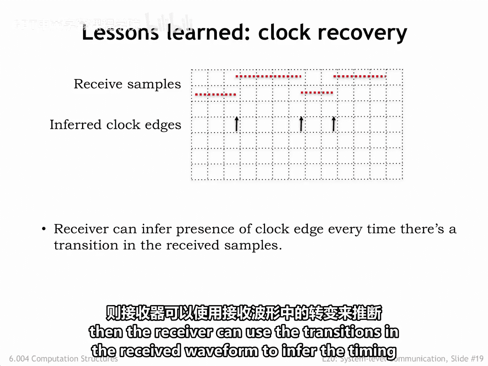

Then the receiver can use this knowledge of the transmitter's nominal clock period to infer the location of the remaining clock edges。

It does this by using a phase locked loop to generate a local facsimile of the transmitter's clock。

 using any received transitions to correct the phase in period of the local clock。

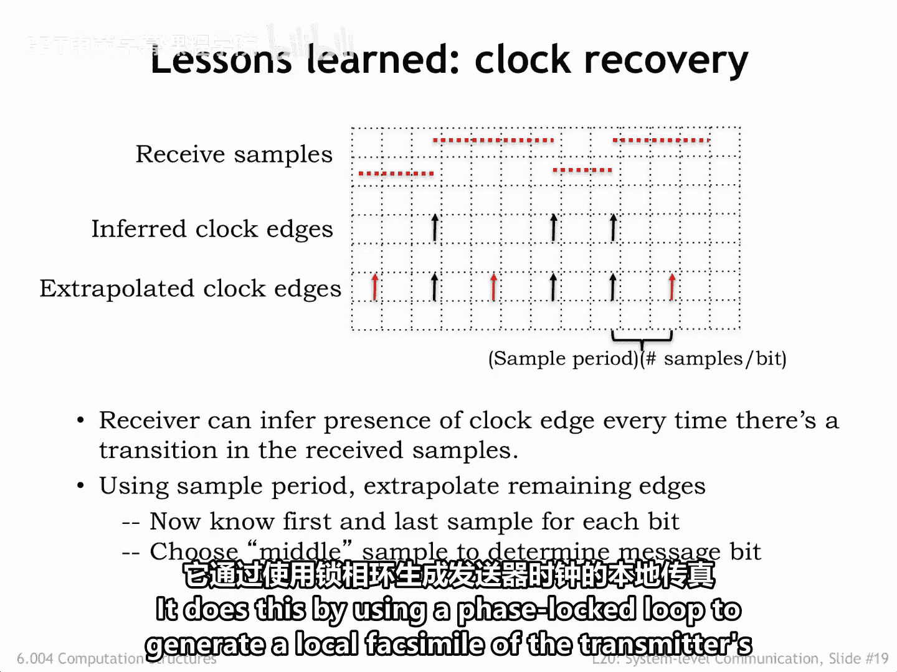

The transmitter adds a training sequence of bits at the front of the packet to ensure that the receiver's phase lock loop is properly synchronized before the packet data itself is transmitted。

A unique bit sequence is used to separate the training signal from the packet data so the receiver can tell exactly where the packet starts。

 even if it missed a few training bits while the clocks were being properly synchronized once the receiver knows the timing of the clock edges。

 it can then sample the incoming waveform towards the end of each clock period to determine the transmitted bit。

To keep the local clock in sync with a transmitter's clock。

 the incoming waveformm needs to have reasonably frequent transitions。

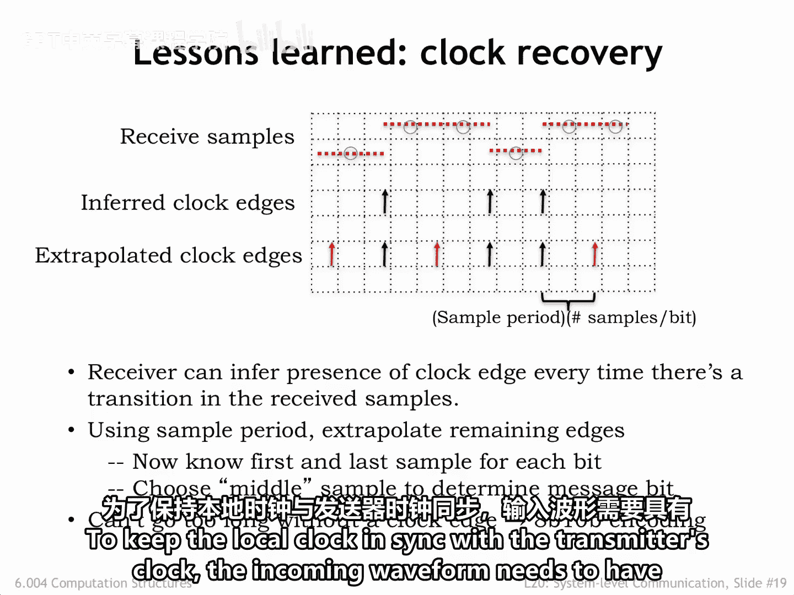

But if the transmitter ascenting say all zeros， how can we guarantee frequent enough clock edges？

The trick invented by IBM is for the transmitter to take the stream of message bits and reencode them into a bitstream that is guaranteed to have transitions。

 no matter what the message bits are。The most commonly used encoding is 8B10B。

 where 8 me bits are encoded into 10 transmitted bits。

 where the encoding guarantees a transition at least every six bit times。Of course。

 the receiver has to reverse the 8B10B encoding to recover the actual message bits。Pretty neat。

The benefit of this trick is that we truly only need to send a single stream of bits。

The receiver will be able to recover both the timing information and the data without also needing to transmit a separate clock signal。

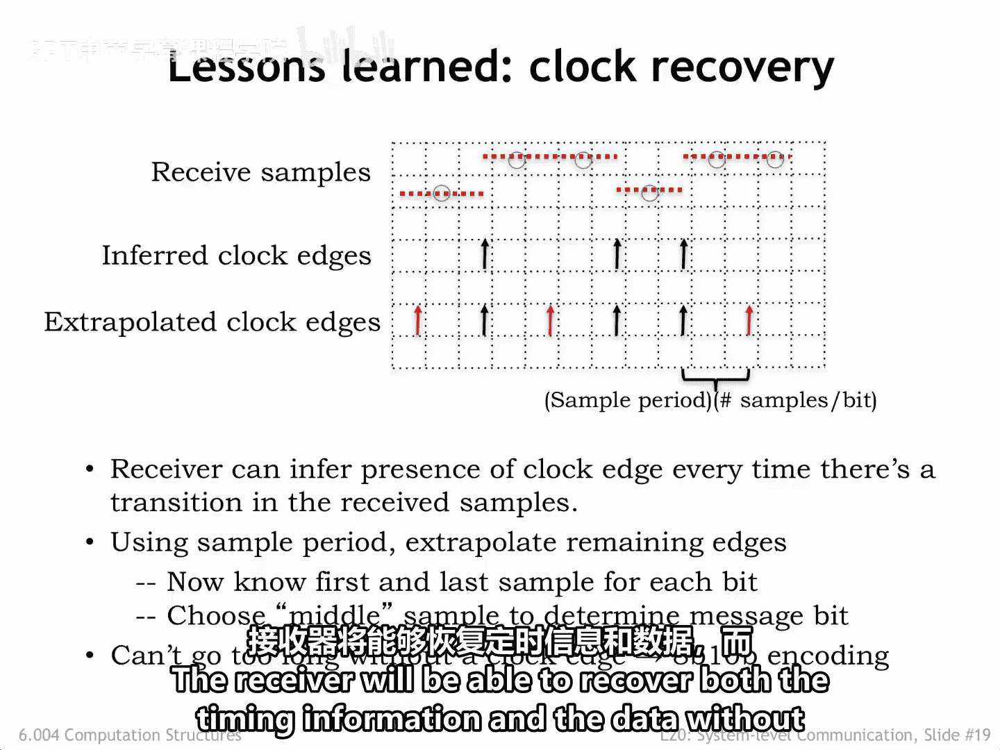

Using these lessons， networks have evolved from using shared communication channels to using point to point links。

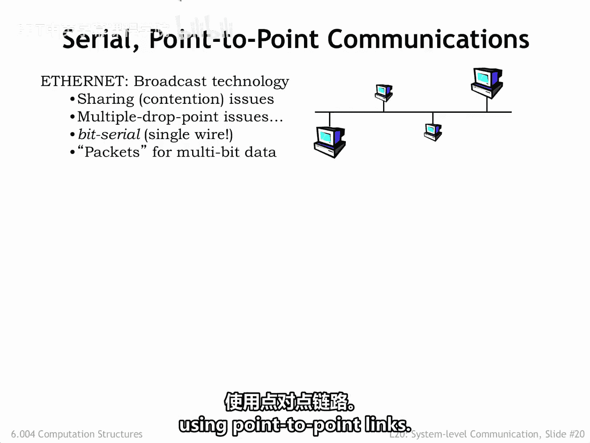

Today， local area networks use 10， 100 or 1，000 based T wiring。

 which includes separate differential pairs for sending and receiving。 In other words。

 each sending or receiving channel is unidirectional with a single driver and single receiver。

The network uses separate switches and routers to receive packets from a sender and then forward the packets over a point to point link to the next switch and so on across multiple point to point links until the packet arrives at its destination。

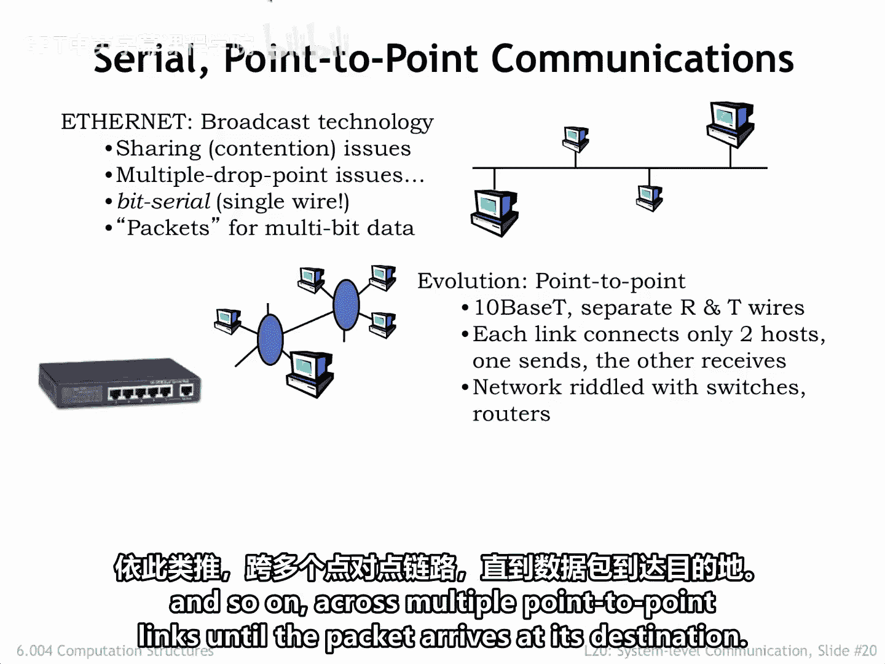

System level connections have evolved to use the same communication strategy。

 point to point links with switches for routing packets to their intended destination。

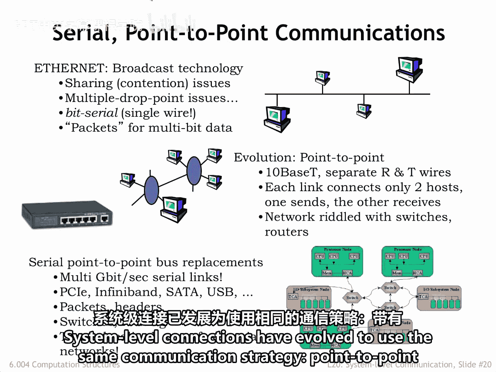

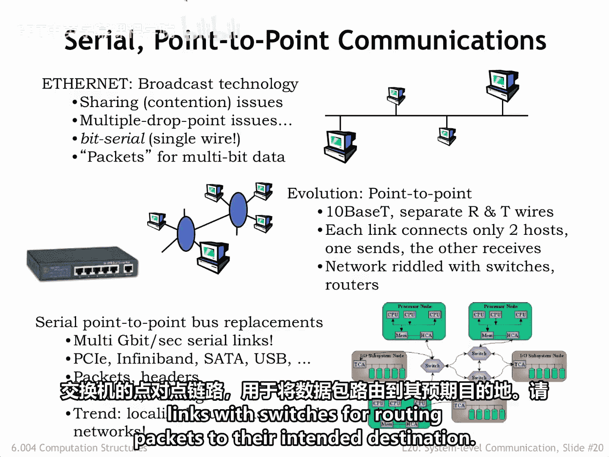

Note that communication along each link is independent。

 so a network with many links can actually support a lot of communication bandwidth。

With a small amount of packet buffering in the switches to deal with momentary contention for a particular link。

 this is a very effective strategy for moving massive amounts of information from one component to the next。

In the next section， we'll look at some of the more interesting details。

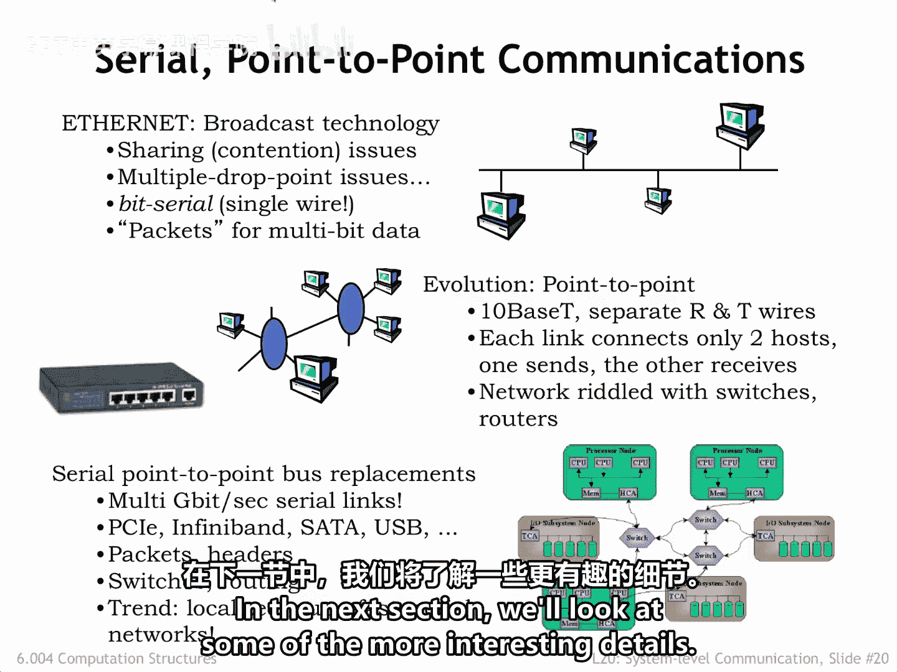