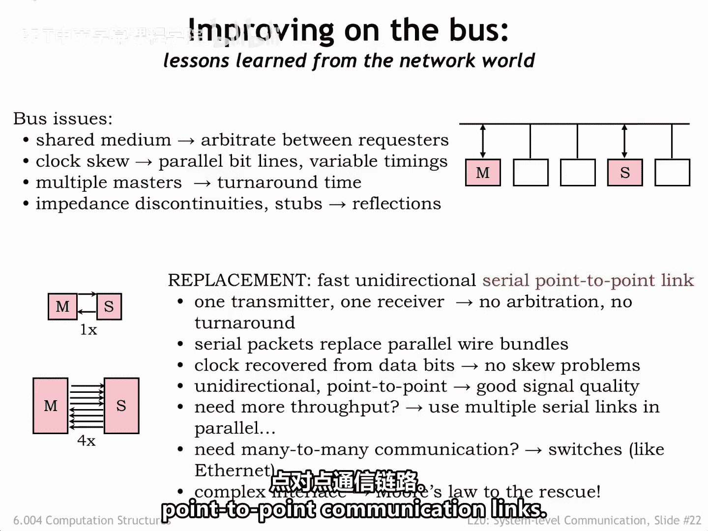
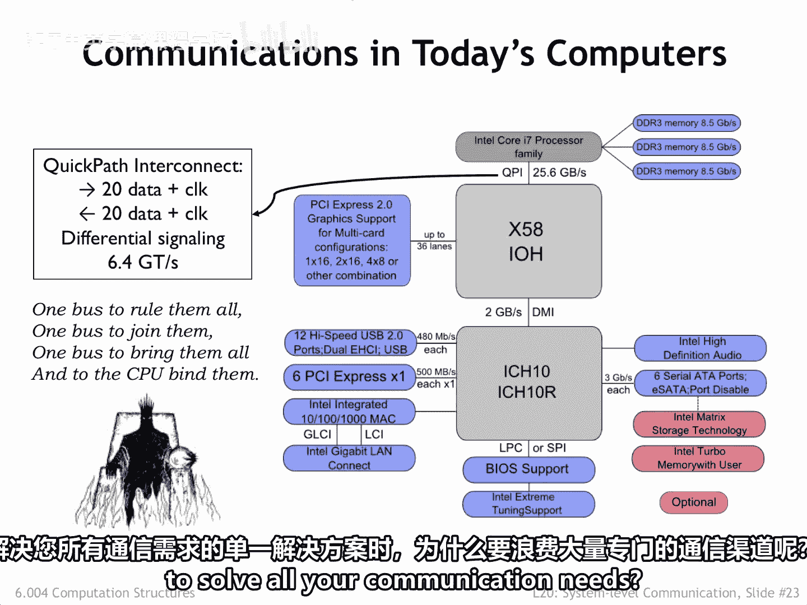
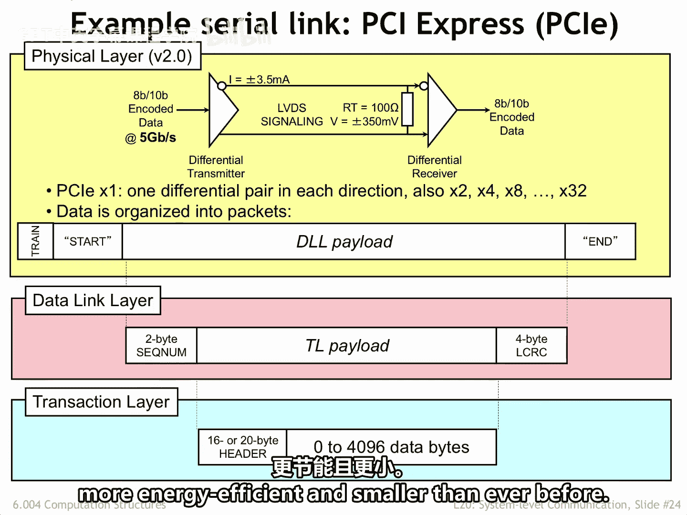

# 数字系统与计算机架构：P2：系统级互连技术

在本节课中，我们将要学习现代计算机系统中，组件之间如何进行高速、可靠的通信。我们将重点了解串行点对点链路如何取代传统的并行总线，并探讨其工作原理与优势。

## 串行点对点链路：并行总线的现代替代方案

上一节我们介绍了传统并行总线面临的挑战。本节中我们来看看它的现代替代方案：串行点对点链路。

串行点对点链路是现代计算机系统中，用于替代存在诸多电气和时序问题的并行通信总线的技术。

每条链路都是单向的，并且只有一个驱动器。

接收器从数据流中恢复时钟信号。

因此，不存在信道共享、时钟偏移和电气问题带来的复杂性。

这种高度受控的电气环境使得信号传输速率可以达到非常高的水平，利用当今技术，速率可达千兆赫兹范围。

如果需要更高的吞吐量，可以并行使用多条串行链路。需要额外的逻辑来从通过多条链路并行发送的多个数据包中重新组装原始数据。

但在当前技术下，所需逻辑门的成本非常低廉。

需要注意的是，现代系统的扩展策略仍然使用插入主板的扩展卡概念。

但扩展卡不是连接到并行总线，而是连接到一个或多个点对点通信链路。

## 现代系统通信架构示例：基于Intel Core i7的系统

以下是基于英特尔酷睿i7 CPU芯片的近期系统的系统级通信示意图。

CPU直接连接到内存，以实现最高的内存带宽。

但通过快速通道互连（QPI）与所有其他组件通信。

QPI在每个方向上有20条差分信号路径，每秒每个方向支持高达64亿次20位传输。

所有其他通信通道，如USB、PCI Express、网络、串行ATA、音频等，也都是串行链路，根据应用需求提供不同的通信带宽。

## PCI Express：主板组件间的通信链路

PCI Express常被用作系统主板上组件之间的通信链路。

单个PCIe 2.0通道使用低电压差分信号，在特性阻抗为100欧姆的线路上，以每秒5千兆比特的速率传输数据。

PCIe通道受控于与之前描述的网络协议栈类似的协议栈。

以下是PCIe协议栈各层的主要功能：

*   **物理层**：通过线路传输数据包。每个数据包以一个训练序列开始，用于同步接收器的时钟恢复电路，随后是一个唯一的起始序列，然后是数据包的有效载荷，最后以一个唯一的结束序列结尾。
*   **数据链路层**：物理层有效载荷被组织为序列号、事务层有效载荷和用于验证数据的循环冗余校验序列。利用序列号，数据链路层可以判断数据包是否丢失，并请求发送方从丢失的数据包开始重新传输。它还处理流量控制问题。
*   **事务层**：从所有通道的事务层有效载荷中重新组装消息，并使用消息头来识别接收端的预期接收者。

总的来说，在多个PCIe通道上发送和接收消息需要大量的逻辑电路。

但在使用当今集成电路技术时，其成本是完全可以接受的。

使用八条通道时，最大传输速率可达每秒4千兆字节，能够满足高性能外设（如图形卡）的需求。

## 总结与展望

本节课中我们一起学习了网络领域的知识如何重塑了主板上组件间的通信方式，推动了从并行总线到少数串行点对点链路的转变。

因此，当今的系统比以往更快、更可靠、更节能、体积也更小。