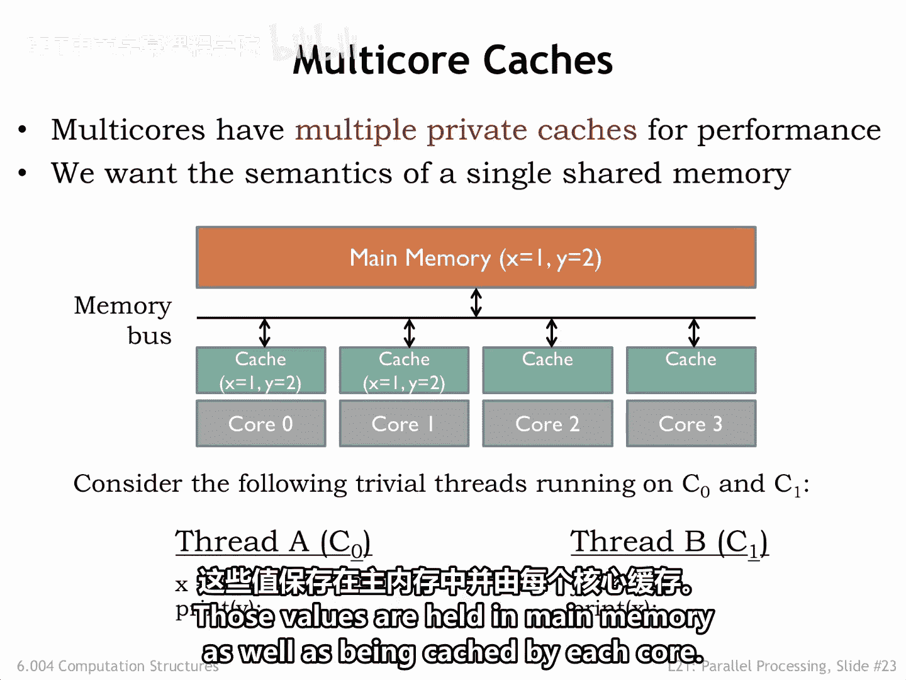
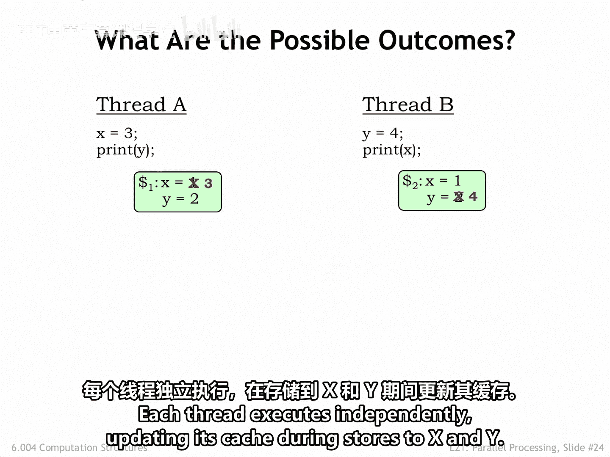
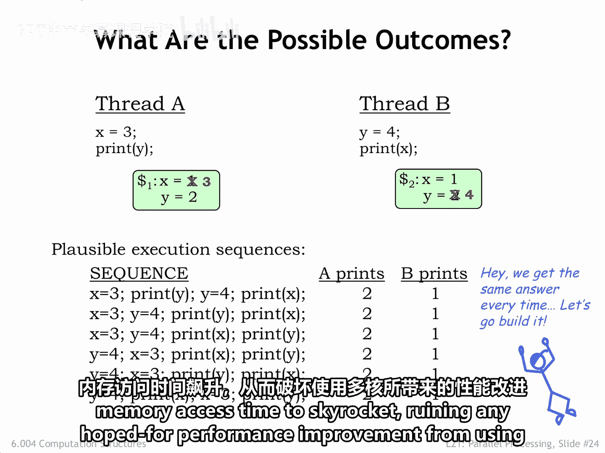
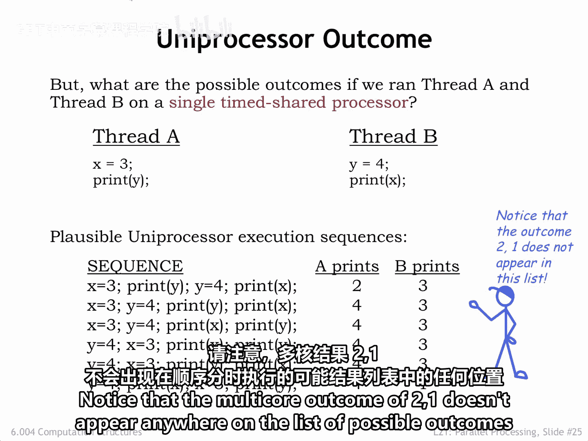
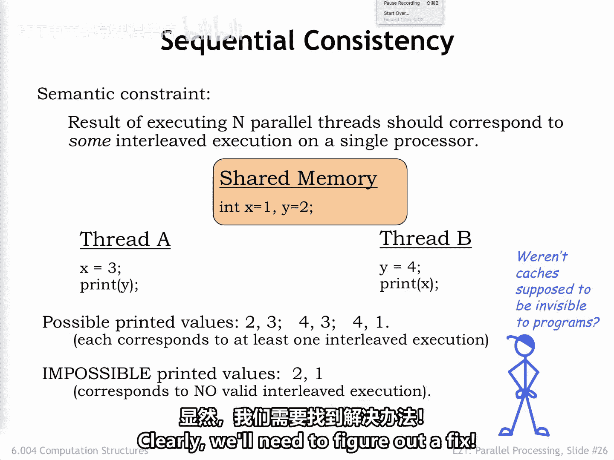
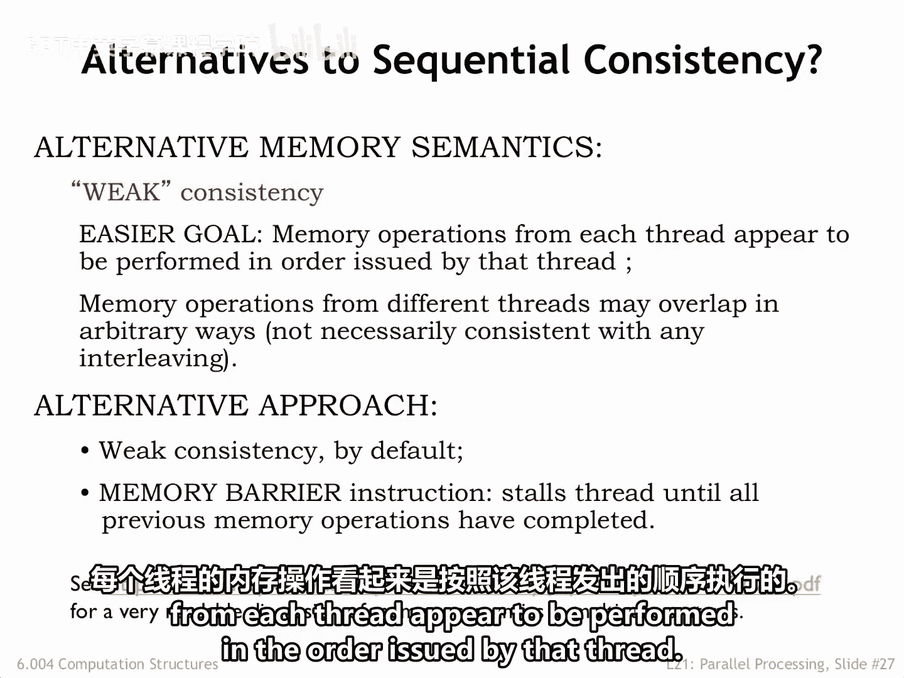
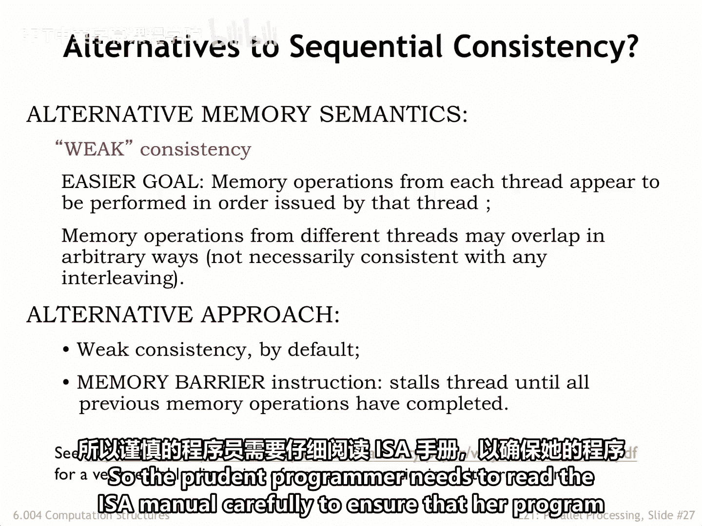
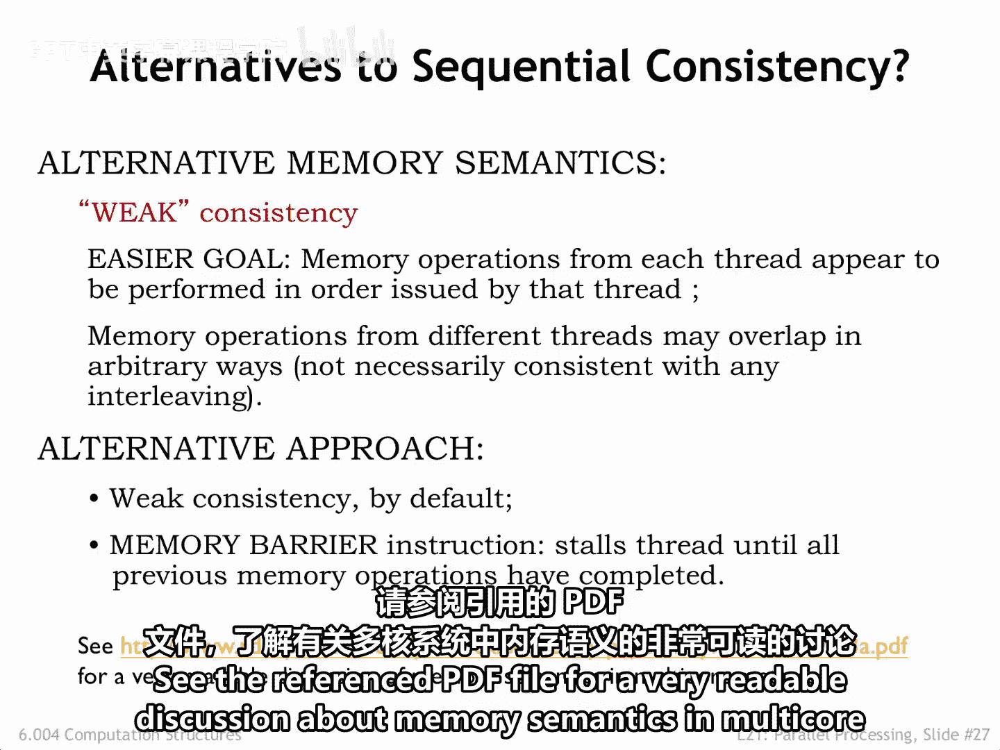

# 数字系统与计算机架构：P2：共享内存与缓存 🧠

在本节课中，我们将学习多核处理器中共享内存与缓存的基本概念。我们将探讨缓存如何提升性能，以及它们如何导致内存一致性问题。最后，我们将介绍顺序一致性和弱一致性这两种内存语义模型，并讨论它们对程序员的意义。

## 多核处理器概念示意图

下图展示了一个多核处理器的概念示意图。

为了减少平均内存访问时间，四个核心中的每一个都拥有自己的缓存。大多数内存请求将由这些缓存来满足。如果发生缓存未命中，请求会被发送到共享主存。在核心数量适中且缓存命中率良好的情况下，正常操作期间必须访问主存的内存请求数量应该非常少。

为了将内存请求数量降至最低，缓存采用了写回策略。在这种策略中，存储指令会更新缓存，但主存只有在脏缓存行被替换时才会被更新。

我们的目标是每个核心都应该共享主存的内容。换句话说，任何一个核心所做的更改都应该对所有其他核心可见。

## 一个共享内存的例子

在下面这个例子中，核心0运行线程A，核心1运行线程B。两个线程都引用了两个共享内存位置，分别存放变量X和Y的值。X和Y的当前值分别是1和2。这些值既保存在主存中，也被每个核心缓存。

当线程被执行时会发生什么？每个线程独立执行，在存储X和Y时更新自己的缓存。

对于任何可能的执行顺序，无论是并发还是顺序执行，结果都是相同的：线程A打印2，线程B打印1。硬件工程师可能会指出这种一致的结果并宣布成功。

但是，仔细检查最终的系统状态会发现一些问题。执行完成后，两个核心对X和Y的值存在分歧。在核心0上运行的线程会看到 `X=3` 和 `Y=2`，而在核心1上运行的线程会看到 `X=1` 和 `Y=4`。

由于缓存的存在，系统的行为并不像存在一个单一的共享内存。另一方面，我们不能消除缓存，因为那将导致平均内存访问时间急剧上升，从而抵消使用多核带来的预期性能提升。

## 我们期望什么结果？

一个合理的正确性标准是线程在单个分时共享核心上运行时的结果。其论点是，多核实现应该产生相同的结果，但通过并行执行取代分时共享来更快地完成。

下表显示了分时共享实验的可能结果，其结果取决于语句的执行顺序。程序员会理解存在多种可能的结果，并且知道如果他们想要一个特定的结果，就必须对执行顺序施加额外的约束，例如使用信号量。

请注意，多核执行的结果 `(2, 1)` 并没有出现在顺序分时共享执行的可能结果列表中。

## 顺序一致性

并行执行N个线程应该对应于这些线程在单个核心上的某种交错执行，这一概念被称为**顺序一致性**。如果多核系统实现了顺序一致性，那么程序员就可以将系统视为提供了硬件加速的分时共享。

因此，我们简单的多核系统在两个方面失败了。首先，它没有正确实现共享内存，因为正如我们所看到的，两个核心可能对一个共享变量的当前值存在分歧。其次，作为第一个问题的结果，该系统没有实现顺序一致性。显然，我们需要找到一个解决方案。

## 一个可能的解决方案：弱一致性

一个可能的解决方案是放弃顺序一致性。另一种内存语义是**弱一致性**，它只要求每个线程的内存操作看起来是按照该线程发出的顺序执行的。

换句话说，在一个弱一致性系统中，如果一个特定的线程先写X然后写Y，那么任何线程读取X和Y的可能结果将是：`(X未变, Y未变)`，或`(X已变, Y未变)`，或`(X已变, Y已变)`。但不会有线程看到Y已变而X未变的情况。

在弱一致性系统中，来自其他线程的内存操作可能以任意方式重叠，不一定与任何顺序交错一致。

请注意，我们的多核缓存本身甚至不能保证弱一致性。一个执行 `写X`、`写Y` 的线程会更新其本地缓存，但随后的缓存替换可能导致更新后的Y值在更新后的X值之前被写入主存。

为了实现弱一致性，线程应该被修改为：写X，将更改通知所有其他处理器，然后写Y。在下一节中，我们将讨论如何修改缓存以自动执行所需的通信。

乱序执行核心带来了额外的复杂性，因为无法保证连续的存储指令会按照它们在程序中出现的顺序完成。这些架构提供了一种屏障指令，可以保证屏障之前的内存操作在屏障之后的内存操作执行之前完成。

## 内存一致性的多样性

存在许多类型的内存一致性。每个市售的多核系统都有其特定的关于何时发生何种情况的保证。因此，谨慎的程序员需要仔细阅读架构手册，以确保她的程序会按照她的意图执行。

关于内存语义和多核系统的非常易读的讨论，请参阅参考PDF文件。

## 总结

本节课中，我们一起学习了多核处理器中共享内存与缓存的基础知识。我们了解到，虽然缓存对于提升性能至关重要，但它们也引入了内存一致性问题。我们探讨了**顺序一致性**的理想模型，以及现实中更常见的**弱一致性**模型。理解这些内存语义对于在多核系统上编写正确的并发程序至关重要。