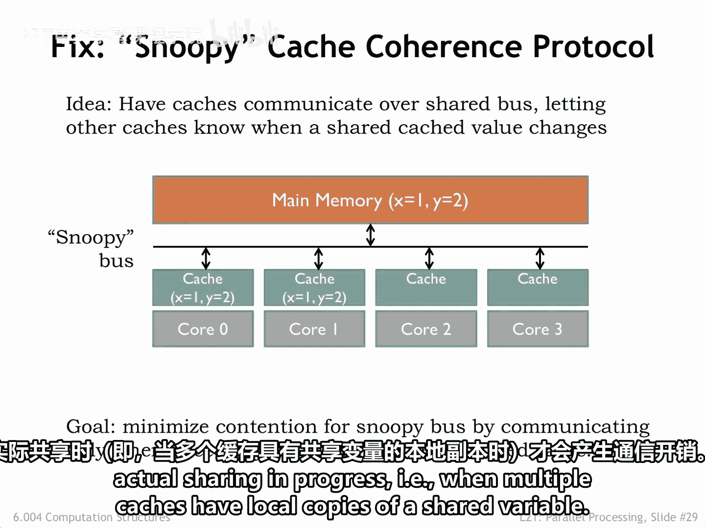
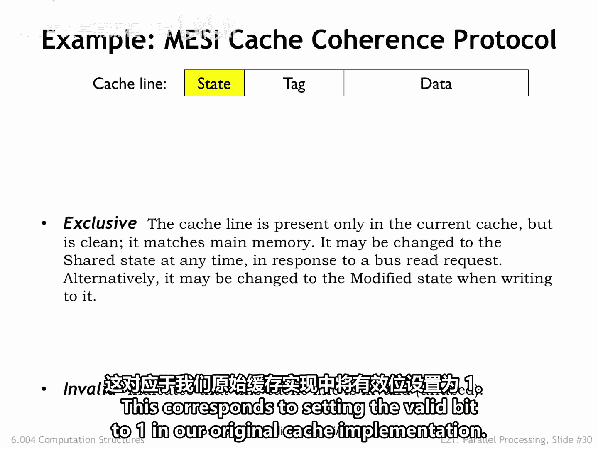
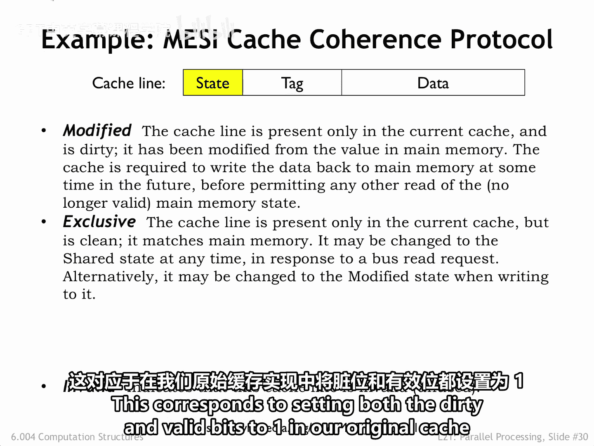
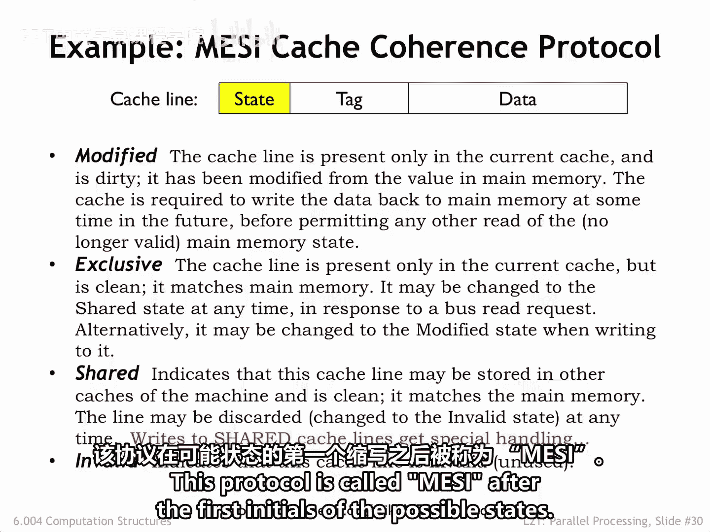
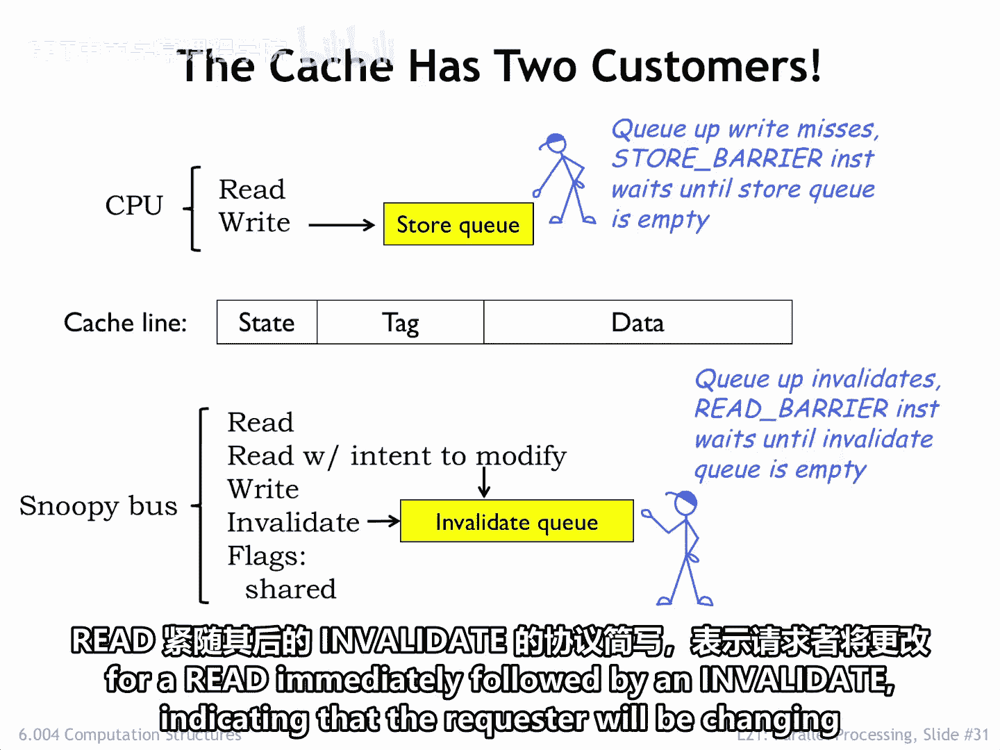
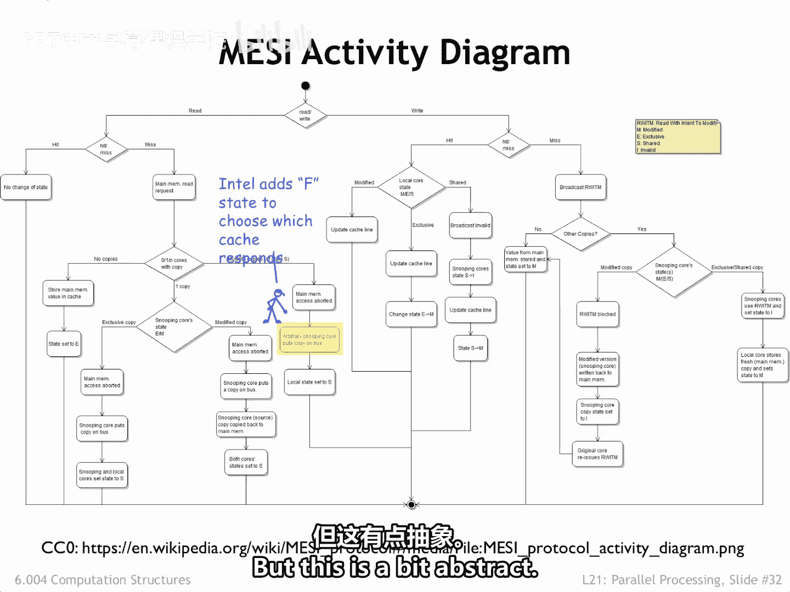
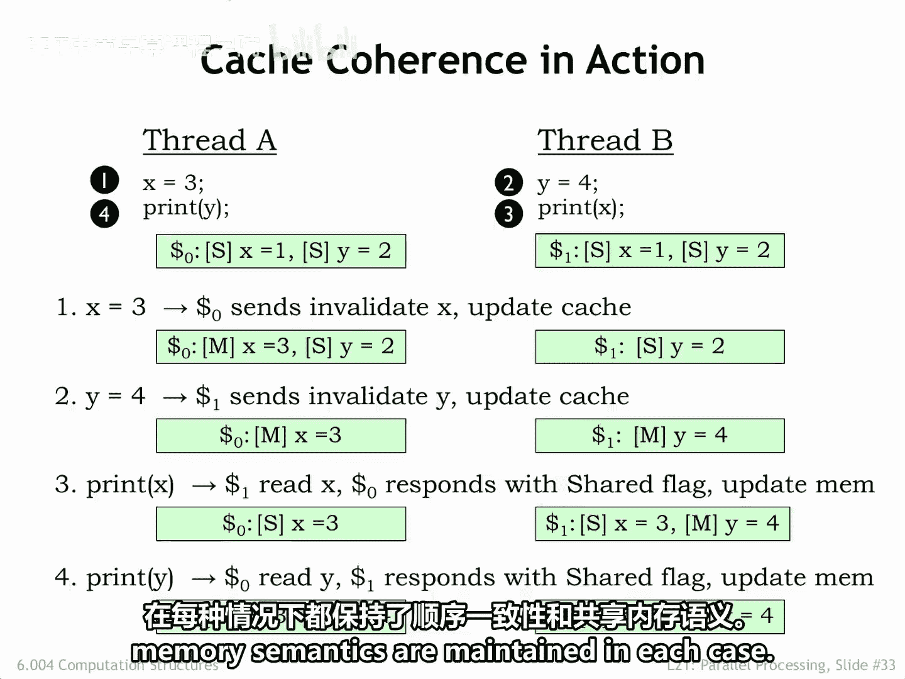
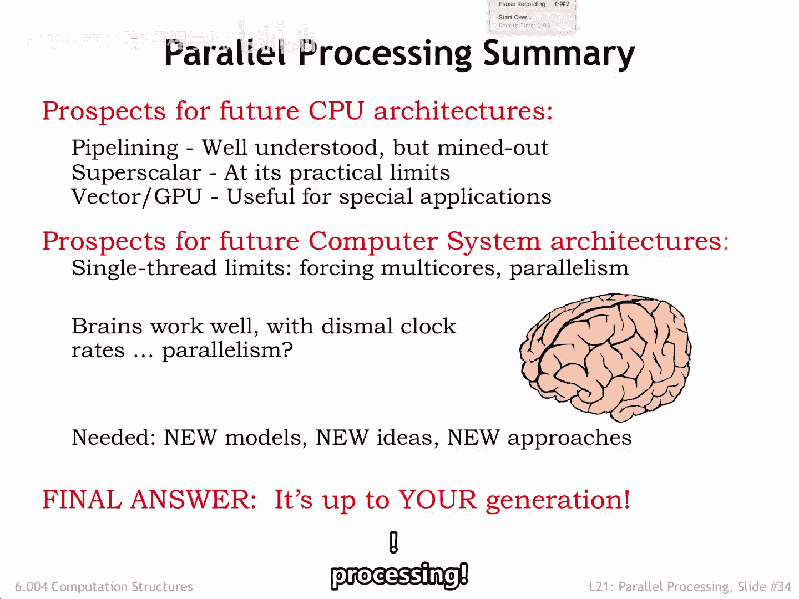

# 数字系统与计算机架构：P2：缓存一致性 🧠

在本节课中，我们将要学习多核系统中的缓存一致性问题。我们将探讨当多个处理器共享数据时，如何确保它们看到的数据是最新的，并介绍一种名为MESI的缓存一致性协议来解决此问题。

## 概述

我们的简单多核系统存在一个问题：当一个共享变量的值被更改时，系统内部没有通信机制来通知其他处理器。

解决方案是通过一个所有缓存都能监听的共享总线来提供必要的通信。这样，一个缓存可以“窥探”其他缓存中发生的变化，并更新其本地状态以保持一致。这种必需的通信协议被称为**缓存一致性协议**。

在设计协议时，我们希望只在真正发生共享和进展时产生通信开销。换句话说，只有当多个缓存拥有共享变量的本地副本时，才需要进行通信。

## 缓存行的状态

为了实现缓存一致性协议，我们需要改变为每个缓存行维护的状态。

所有缓存行的初始状态都是**无效**，这表示标签和数据字段不包含最新的信息。这对应于我们原始缓存实现中将有效位设置为零。

当缓存行数据处于**独占**状态时，表示该缓存拥有这些内存位置的唯一副本，并且本地数据与主内存中的数据相同。这对应于我们原始缓存实现中将有效位设置为一。

如果缓存行状态是**已修改**，则意味着该缓存行数据是数据的唯一有效副本。这对应于我们原始缓存实现中将脏位和有效位都设置为一。

为了处理共享问题，还有第四个状态，称为**共享**。它表示其他缓存也可能拥有相同且未修改的内存数据的副本。

## 读取操作与状态转换

当从主内存填充缓存时，其他缓存可以窥探其读取请求并参与完成该请求。

如果没有其他缓存拥有请求的数据，则从主内存获取数据，并且请求缓存将该缓存行的状态设置为**独占**。

如果其他某个缓存拥有处于**独占**或**共享**状态的请求缓存行，它会提供数据，并在窥探总线上断言共享信号，以指示现在有多个缓存拥有该数据的副本。所有缓存都会将该缓存行的状态标记为**共享**。

如果另一个缓存拥有该缓存行的**已修改**副本，它会提供更改后的数据，为请求缓存提供正确的值，同时更新主内存中的值。同样，共享信号被断言，读取和响应的缓存都会将该缓存行的状态设置为**共享**。

因此，在读取请求结束时，如果存在该缓存行的多个副本，它们都将处于**共享**状态。如果只有一个副本，它将处于**独占**状态。

## 写入操作与状态转换

写入缓存行时，才会发生共享匹配。

如果发生缓存未命中，缓存首先执行如上所述的缓存行读取操作。

如果缓存行现在处于**共享**状态，写入操作将导致缓存向窥探总线发送一个**无效化**消息，告诉所有其他缓存使它们的缓存行副本无效，从而保证本地缓存现在拥有对该缓存行的独占访问权。

如果写入发生时缓存行处于**独占**状态，则无需通信。现在，缓存数据可以在缓存行中被更改，并将状态设置为**已修改**，完成写入。

这个协议根据其可能状态的首字母缩写，被称为 **MESI** 协议。

## 硬件支持与请求流

请注意，我们原始缓存实现中的有效位和脏位状态已被重新用于编码四种MESI状态之一。成功的关键在于，每个缓存现在都知道一个缓存行何时可能被另一个缓存共享，从而在共享位置的值被更改时触发必要的通信。

协议不会尝试更新共享值，而是简单地将其无效化。如果其他缓存在未来某个时间需要共享变量的值，它们将发出新的请求。

为了支持缓存一致性，缓存硬件必须被修改以支持两个请求流：一个来自CPU，一个来自窥探总线。

CPU端包括一个存储请求队列，用于存储因缓存未命中而延迟的请求。这允许CPU继续执行，而无需等待缓存重新填充操作完成。请注意，CPU读取请求在检查缓存之前需要检查存储队列，以确保向CPU提供最新的值。通常有一个存储屏障指令，它会暂停CPU，直到存储队列为空，从而保证在执行恢复之前，所有处理器都已看到写入操作的效果。

在窥探端，缓存必须窥探来自其他缓存的事务，根据需要使缓存行数据无效或提供数据，然后更新本地缓存行状态。如果缓存正忙于（例如，重新填充操作），无效化请求可能会排队，直到可以被处理。通常有一个读取屏障指令，它会暂停CPU，直到无效化队列为空，从而保证在执行恢复之前，来自其他处理器的更新已应用到本地缓存数据。

请注意，这里显示的“带修改意图的读取”事务只是协议简写，表示一个读取操作后立即跟一个无效化操作，表明请求者将更改缓存行的内容。

## 协议应用示例

让我们将MESI缓存一致性协议应用到我们之前的例子中。

以下是我们的两个线程，以及它们的本地缓存状态，表明位置X和Y的值由两个缓存共享。让我们看看当操作按此处所示的顺序1到4发生时的情况。

1.  线程A将x更改为3。由于此位置在本地缓存中标记为**共享**，核心0的缓存向其他缓存发出针对位置X的无效化事务，从而获得对位置X的独占访问权，并将其值更改为3。在此步骤结束时，核心1的缓存不再拥有位置X值的副本。
2.  线程B将y更改为4。由于此位置在本地缓存中标记为**共享**，缓存1向其他缓存发出针对位置Y的无效化事务，从而获得对位置Y的独占访问权，并将其值更改为4。
3.  执行在TB中继续，它需要位置X的值。这是一个缓存未命中，因此它在窥探总线上发出读取请求，缓存0用其更新后的值响应，并且两个缓存都将位置X标记为**共享**。也在监听窥探总线的主内存也更新其X值的副本。
4.  最后，在步骤4中，线程A需要y的值，这导致在窥探总线上发生类似的事务。

请注意，结果与在分时核心上执行相同序列所产生的结果完全一致，因为一致性协议保证了没有缓存拥有过时的共享内存位置副本。并且两个缓存对共享变量X和Y的最终值达成一致。

## 总结

本节课中我们一起学习了缓存一致性协议MESI。该协议通过引入四种状态（无效、独占、共享、已修改）和基于共享总线的窥探机制，解决了多核系统中共享数据的一致性问题。它只在必要时进行通信，确保了所有处理器看到的内存视图是一致的，从而维护了顺序一致性。

目前，单核架构似乎已达到一个稳定点。至少在当前的指令集架构下，流水线深度不太可能增加，而乱序超标量指令执行已达到性能回报递减点。因此，由于CPU核心内部架构变化而带来的性能大幅提升似乎不太可能。

GPU架构在不断演变以适应特定应用领域的新用途，但它们不太可能影响通用计算。在系统层面，趋势是增加核心数量，并找出如何用新算法最好地利用并行性。

展望未来，请注意大脑能够使用相当慢的机制完成非凡的成果。将信息传递到大脑需要百分之一秒，而突触每秒只激发0.3到1.8次。是海量的并行性赋予了大脑计算能力，还是大脑使用了不同的计算模型（例如，神经网络）来根据新输入决定新动作？至少在涉及认知的应用中，有新的架构和技术前沿需要探索。你们面前有一些有趣的挑战。