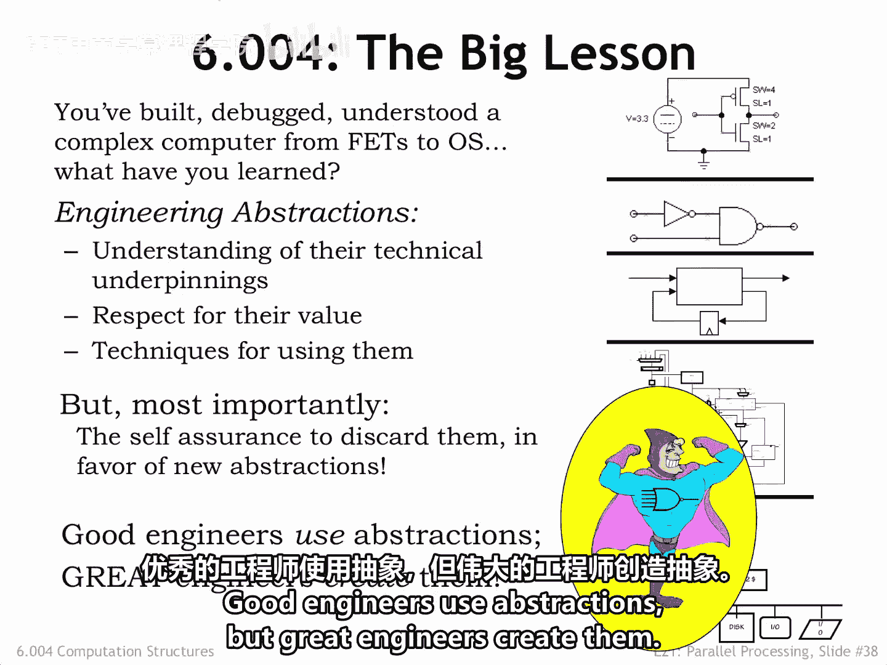
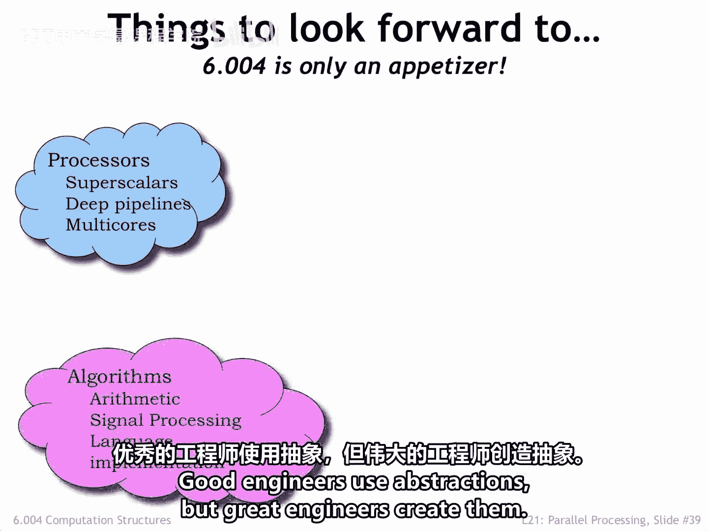
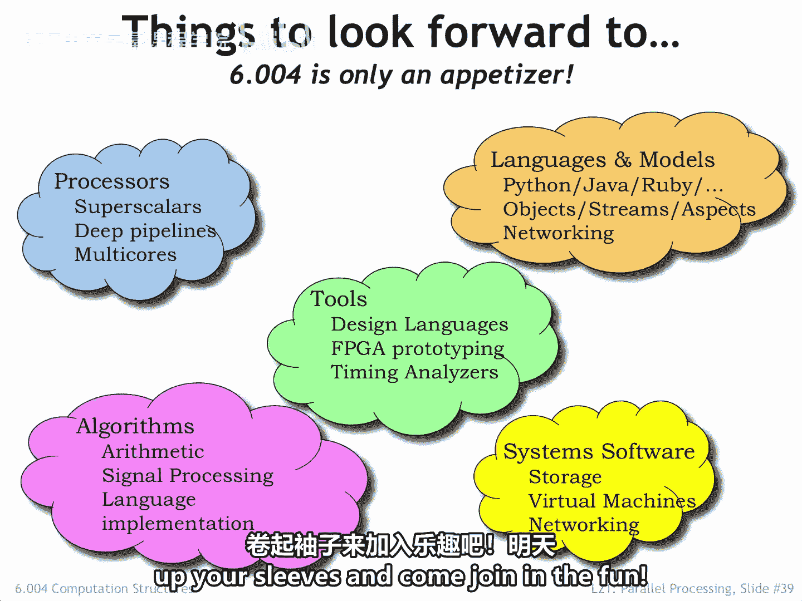
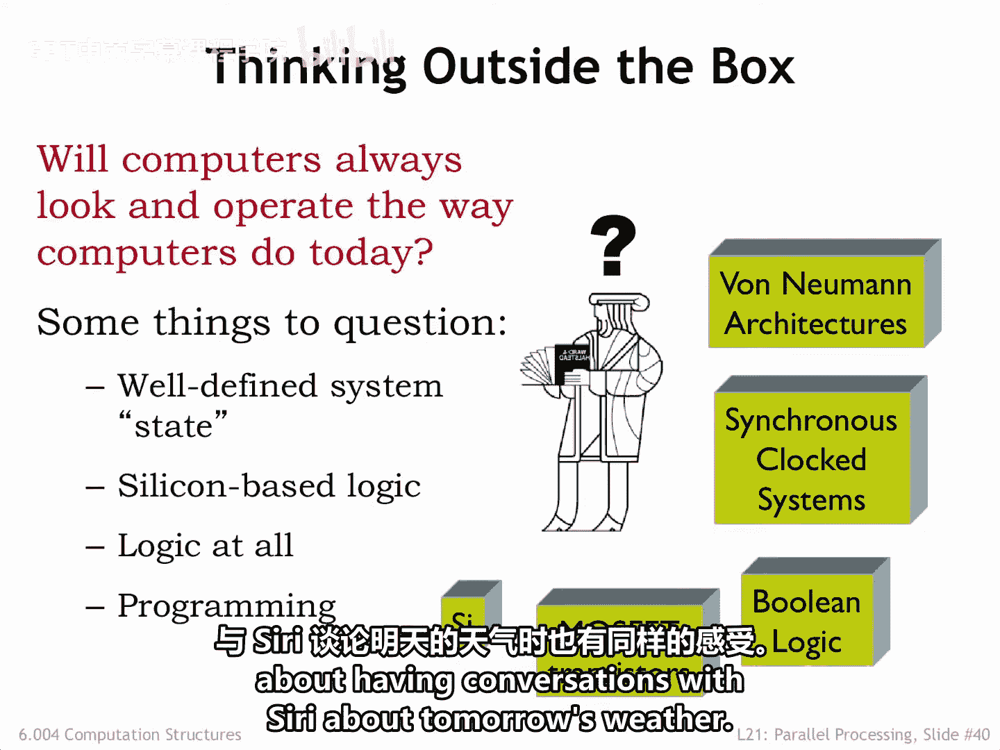

# 数字系统与计算机架构：P2：课程总结与展望 🎓

在本节课中，我们将回顾6.004课程的核心内容，总结我们所学到的工程抽象与设计原则，并展望计算技术未来的可能发展方向。

## 课程回顾：从器件到系统 🏗️

现在我们已经到达了6.004课程的终点。回顾过去，我们可以从两个角度来思考我们讨论过的材料、练习过的技能以及完成的设计。

从器件出发，我们沿着设计层次结构向上推进，每一层都作为下一层的构建模块。在此过程中，我们思考了设计权衡，选择了那些能使我们的系统**可靠、高效、易于理解**，从而易于维护的方案。

## 工程抽象的力量：黑盒与规范 📦

从另一个角度看6.004，我们创建并随后使用了一套工程抽象的层次结构。这些抽象合理地独立于它们所封装的技术。尽管技术日新月异，但这些抽象及其体现的原则是永恒的。

例如，乔治·布尔在1847年描述的符号逻辑，至今仍被用来推理你我今天设计的数字电路的操作。

工程抽象的力量在于，它允许我们基于组件的行为来推理系统的行为，而无需理解每个组件的实现细节。将组件视为实现某些特定功能的**黑盒**的优势在于，只要满足相同的规范，实现方式可以改变。

在我的一生中，一个两输入与非门的尺寸缩小了10个数量级，然而一个50年前的逻辑设计如果用今天的技术实现，仍然可以按预期工作。想象一下，如果你必须推理掺杂硅和导电金属的电学特性，来构建一个将两个二进制数相加的电路，那将是多么困难。

使用抽象让我们能够限制每一层的设计复杂度，缩短设计时间，并更容易验证规范是否得到满足。一旦我们创建了一套有用的构建模块库，我们就可以反复使用它们来组装许多不同的系统。

## 课程目标与期望 🎯

我们在6.004中的目标是揭开计算机工作原理的神秘面纱，从MOSFET开始，一直上升到操作系统。我们希望你已经理解了我们所介绍的工程抽象，并有机会在完成实验中的设计问题时练习使用它们。

我们也希望你能理解它们的局限性，并有信心在面对新的工程挑战时创造新的抽象。**好的工程师使用抽象，而伟大的工程师创造抽象。**

6.004是一门入门课程，仅触及设计层次结构每一层所使用的基本原理。如果某个特定主题让你觉得特别有趣，我们希望你能寻找更高级的课程，让你更深入地钻研那个工程学科。

成千上万的工程师共同努力，创造了作为当今信息社会引擎的数字系统。正如你可以想象的，有无穷无尽的有趣工程等待探索和掌握，所以卷起袖子，加入这场乐趣吧。

## 未来的计算挑战：超越经典 🚀

明天的工程挑战会是什么？以下是关于计算的未来可能与现在截然不同的几点思考。

我们今天构建的系统具有明确定义的状态概念，即存储在内存中、由其逻辑组件产生并沿着互连传输的精确数字值。但基于量子力学原理的计算可能让我们能够解决目前棘手的问题，使用的状态不是描述为一和零的集合，而是描述为许多状态叠加的相互关联的概率。

我们使用电压编码信息，并使用电压控制开关，通过基于硅的电子器件进行计算。但生命的化学过程已经进行了数千年的详细制造操作，使用编码为氨基酸序列的信息。我们DNA中编码的一些信息已经存在了数百万年，这是一个真正长寿的信息系统。今天，生物学家正开始用生物材料构建计算组件。也许50年后，你不再需要插上笔记本电脑的电源，而是需要“喂养”它。

除了使用真值表和逻辑函数，一些计算最好由神经网络来执行，它们对模拟输入进行适当加权的组合，其中的权重是系统在使用应产生已知输出的示例输入进行训练时学习到的。人工神经网络被认为模拟了我们大脑中突触和神经元的运作。随着我们对大脑运作方式的了解更多，我们可能会获得许多关于如何实现擅长识别和推理的系统的新见解。

再次以生物体为有用模型，编程可能会被学习所取代，其中刺激和反馈被用来演化系统行为。换句话说，系统将使用适应机制来演化出所需的功能，而不是通过显式编程来实现。

这一切似乎都是科幻小说的内容，但我怀疑我们的父母对于能和Siri谈论明天的天气，也会有同样的感觉。

## 结束语与致谢 🙏

感谢你加入6.004课程。我们很享受呈现这些材料，并用设计任务来挑战你，以锻炼你的新技能和理解。数字系统的世界前方充满了有趣的时光，我们当然需要你的帮助来发明未来。

我们欢迎你对课程提出任何反馈，所以请随时在论坛中留言。

暂时告别，并祝你在未来的学习中好运。

---

**本节课总结**：我们一起回顾了6.004课程的核心，理解了**工程抽象**（如将组件视为**黑盒**）在构建复杂数字系统中的关键作用。我们学习了从底层器件到高层系统的设计层次结构，并展望了量子计算、生物计算和神经网络等未来计算技术的可能性。课程鼓励我们不仅要学会使用现有抽象，更要勇于创造新的抽象来解决未来的工程挑战。