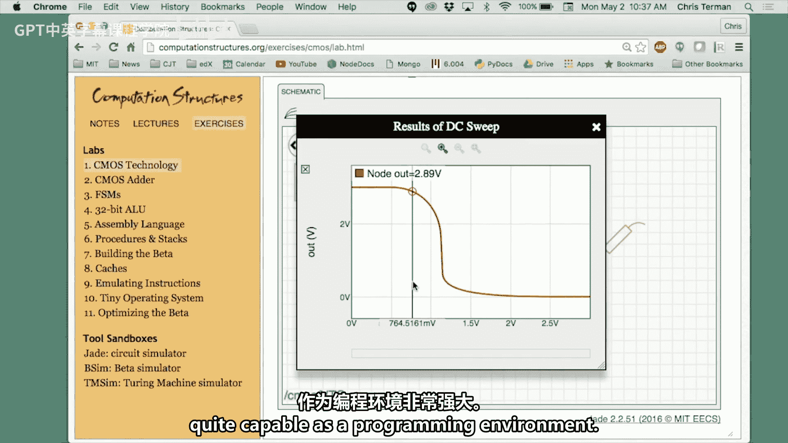

# 【数字系统与计算机架构P2 6.004 2017】麻省理工学院—中英字幕 p80 An Interview with Christopher Terman on Teaching Computation Structures -BV19m41127Kj_p80-

So how did you become interested in computation structures Well。

 in the early 70s I was a college student trying to earn my way through college and so I was the computer operator on the third shift for the campus computer I was in the era in which you could only afford one and since watching the blinking lights was boring。

 I pulled out the schematics for the computer I was running for the university and I started trying to figure out how the computer worked and ever since then it's been sort of a lifelong interest and figuring out how do they actually put together these components to make a machine that can do computation。

And that interest is coupled with your interest in teaching and learning and especially online education。

 could you talk a little bit about where that interest comes from？Well， you know。

I was always fascinated and very motivated by the great teachers I was could listen to。 And so。

 you know， everybody picks a model when they're a teenager or young adult They say。

 I want to be like so and so。 Well， the so and sos I like to pick were the excellent teachers I had。

 So I said， I'm going to try to be the best teacher I can。 There's something very satisfying about。😊。

Teaching students and having them nod and suddenly get it。 So， so it's been a sort of a。

A very fulfilling experience to teach。 and so that's sort of a virtuous cycle， right。

 you get good vibes from teaching and then you do it better next year and you get better vibes。

 And so it it's for 40 years。 that's been a great It's been great。

What kind of background experiences do the students bring related to computational It's all over the map。

 It's all over the map。 So some of them will come having， you know。

 programmed computers for a long time and maybe even know a little bit about how the computers are structured on the insides。

 Other people have not done beans。 You know， they're just。I wanted to take a course。

 I've used computers， you know sort of browsers， laptops， email sort of thing。

 but they have no idea about the OS or the actual hardware inside。

 and so they come with interest but no background at all。

So how do you structure a course to meet the needs of people with diverse backgrounds like that。

 right？It's。To handle really diverse backgrounds， you have to have a huge range of materials。

 So you need something that somebody who does I need to start at the beginning。

 you need a beginning for them to start at。 And for somebody who's sort of know past the first half of your material。

 you need a second half which will engage their interests。

 So I create a huge I think of it as Z buffet。 There's lots of dishes and you can start at the beginning of the buffet and sort of pick it up from scratch or you can say I'm going skip the first couple courses。

 and I'm ready to dive in sort of in the middle of the conversation somewhere。

 So I think the real key is having a huge selection of materials to draw from。

 And that's I think one of the hallmarks of 604 has been that。

You know we have every possible way of learning the materials so not only for different backgrounds but for different learning styles。

 so some students want to talk or listen some students want to read。

 some students just want to work on PSets and do just in time learning where they。You know。

 sort of say here's what I need to know now I'll go look at the material。

 just find the worked example and if I don't understand the work example， I'll go you know。

 actually read the text so they actually only get to the beginning know the if you will。

 the the introductory or the explanatory material only and as a last resort if they somehow didn't pick it up from before。

 so many different learning styles。Many different backgrounds How has the MITx residential platform。

嗯。Enabled you to provide this buffet。 Well one is it's a one stop shop for all the different sorts of materials。

 And the other is you know there's sort of an emerging best practice about how how to explain material to people for the first time So you know you want to do a short bites。

 sound bites， video bites know those short segments of learning where you introduce a single skill or a single concept and then you take a moment to actually you know give them some some check yourself questions。

 So the idea is well in theory， you just listen to this or watched it。

 I'm going to ask you some simple questions， not puzzlers there' if you understood what B just told you on the video then you can answer them and so that gives us students a chance to start the process of retrieval learning where you keep coming back again and again and I'll ask you a similar sort of question you know two segments later and you know pretty soon you're pulling it out of your short term and then medium term。

Long term memories。So the MITx platform works really well at letting you construct those sort of learning sequences and I think the students appreciate it。

 everything's more more bitesized you know we both know you can imagine pushing play on a 50 minute video and long about minute well I'm gonna to say 37。

 but long about minute6， you're going be maybe I should check my email while I'm listening to this so you know keeping things short and sweet。

 so you have a huge now you have a bunch of short bites now the MITX platforms let you organize those with questions that let you sort of continue to test your learning so it's actually worked out to be a very nice way of making a fairly organized tour through the material that the students can start and stop and come back to plus as asynchronous in other words they get to choose their time and place and。

You know， us teachers always have a fantasy。 Well， they didn't come to lecture。

 So I'm sure at three in the morning when they're wide awake， they're actually watching it。

 Of course if you actually look at the statistics for the viewing。

 it's there's a lot of viewing that happens and quiz weeks so a lot of people may be using it as sort of okay I want to I want the intense immersive introduction to the material。

 So this must be just such an exciting time for you as someone who's really interested in the scholarship of teaching and learning and then the emergence of these digital tools to enable those that learning through best practices。

 I can can feel your enthusiasm for kind of the era that we're in Yeah， well， you know。

 so much of how。people those of us who teach at the university level， you know。

 we get handed a piece of chalk and be told to teach you know。

The teachers for your kids in elementary school who've actually gone through a program teaches them how to teach we're just said to here teach and so it's all anecdotal it's all trying to remember how people taught you finally we have you know the online courses are providing a real educational laboratory we're able to try out different techniques we're able to you know make fairly accurate assessments of how well did that just work whether it was an exercise or a video segment or a design problem and so we can actually you do aB tests in the same cadre so you know it's pretty neat having a lab I mean as a scientist and engineer you can say look I know about you know build a hypothesis test it you know through a bunch of experiments。

We can really do the experiments with the MITX platform and so that's been great yeah it's really exciting it is。

Let's talk about learning in the classroom and teaching large lecture classes。

What strategies do you have for keeping students engaged？Well， that's interesting because we have。

So many different materials really the only students who come to lecture are the ones who you know for whom lecture is how they learn and I was such a student so I just so the people who were there are not you know a draft army they're a volunteer selected and so they're prepared to be somewhat engaged by a vocal presentation so I have a well developeded set of materials that I present in class that have sort of been debugged for having not too much or too little a progression that most people can follow and then I'm。

You happily when you teach for a while you start to get more relaxed and so it is a very relaxed sort of experience。

 you know I tell jokes I tell stories from my career and it's interesting to me how you know when the piece students are making comments at the end of the semester and the evaluations。

 many of them say well I really like the stories so you know you know after boring you with technical details it's fun to say and then when I tried to use that you know this following thing happened。

And all of a sudden they're sort of pickingricking up saying oh right you know and I think it helps them remember the related it does It does not you think about what you remember from lectures is almost never a technical nugget。

 It's a joke they told or an accident that happened or a mistake that was made and so it's if there's this concept called fluency which is basically how smoothly things are going and everybody's nodding but know your mind is starting to drift because it's all so it's actually good to try to put a little disfluency into your lecture to actually have know you stop and you tell a joke or you make a mistake or you drop the chalk and say darn and you look at the floor or and here's what I like to do is you walk out from behind the lecture table or lectern and you approach the audience and you can see them sort of going Wait he's escaped and so just anything that sort of switches up。

You know the sort of I'm just going along with a flow here so you know making you know little flows that have things that change make a lot of difference in keeping people sort of engaged that's a great tip。

Let's talk for a second about the teaching team。 I understand there's there are a fair number of people involved in developing and teaching this course。

 Can you talk about that Well， we have a little cadre of people who are instructors I've been sort of part of that cadre every semester for a very long time。

 but we have other you know people who come in from the outside in recent years。

 the department has added a lecture lecturer resources。

 so there's another lecturer associated with it and then faculty come in So it's okay and you know they provide a little depth to the Jane pool Sure but then we have graduate Ts who teach recitations and we have student。

Undergraduate Ts and then lab assistants So they're sort of we have this whole hierarchy they've all taken the course almost they've all loved it so I mean this is sort of a material that you know people say well this is really pretty neat you know I can't wait to tell the next person about how this works and so as they sit there and work with the students you know sort of like me there's an enthusiasm theres sort of bubbles out so that yeah and the students actually you know I sort of listed things sort of。

Well， I was going to say top down I'm not sure lectures are at the top instructors are at the top but the students actually prefer the other thing which is they actually you know asking an LA is very。

 you know it's not very intimidating the students maybe they just took it last semester and so they have freshened their minds what it is they needed to do in order to get whatever it is they're trying to get so and then you sort of work on chain up work up the hierarchy to。

To know get an answer of people below。 And that way you're only asking questions of the more intimidating people when you're pretty sure that no one else has the answer。

 So it's really you know by the time the questions sort of get to me mostly no one is no one is worried that they're a dumb question I don't really believe in dumb questions。

 I mean think all questions are sort of interesting。 but I think the students are look。

 I asked 10 people， none of us news and now we can ask you and I'm pretty confident that that its not wasn't an obvious thing that if I'd only read the assignment I would have known so So that sort of range of sort of experience level and age。

 you know at the high end of the experience level， you can get an answer to any question at the beginning end of the experience level you're talking to somebody who you just that just you months ago did what you're doing and so we can you know I can ask you and we won't be embarrassed right right。

What's the role of the online fora in the course for helping students feel comfortable asking questions and how do you monitor it。

 How do you run it productively， This is something that educators sometimes。Struggle with Well。

 I mean to me its it's a wonderful asset for the first time I'm able to make a thoughtful answer to a question and have 180 people look at the answer instead of one and then the next person has the same question and you say。

 well， have to spend 10 minutes you know I can you know with a large class。

 you can't spend 10 minutes for each of them you know 300 people so so it's a great place to ask questions。

 I try to always give a thoughtful and respectful answer to each question so even if the question is sort of like。

 whoa if you had done the reading you would have known I say， well。

 if you know look back at the material you see it it explains the following or you know try to make it not。

A little hint that may be a little bit more preparation， but many of the questions are look。

 I read the material and I'm still not getting it， I need an example。And so the students。

 I try to make students feel very comfortable asking this never there's nothing no cost they can ask anonymously so that remove some of the barrier and then I think this see in the fall 2017 we had about 2500 contributions to the forum the average response time is about 20 minutes and so we say wait。

 but students are asking questions at 3 a how does that work and you know it turns out that we have you know TAs we particularly have some really good yes exactly 3 a they're just hitting in their stride a lot of us who are involved in the course sort of have we put the notification of postings on real time and so we get an email right away and so often。

We can just we' type in an answer and it's okay and I'm really I think the fast response time really reduces the frustration level of the students there's nothing like being stuck on something and say I wish I could ask somebody well for the first time you know it's 312 in the morning and you can say wait I can ask and I can get an answer and the students really really appreciate that so the forum has really I think changed students。

Level of frustration when they get stuck they you know being stuck is just a 10 minute process not a two day process my god the next office hours are after the weekend what am I do so。

And of course， a lot of students are doing work。Outside of you know sort of nine to five hours so so it's a way for the staff to be a 247 staff instead of just a nine to five five days a week staff the staff like I mean the students work like that too I mean I mean most of the people who were helping on the forum。

keeping the same schedule as the users at the forum， so it's a good match。

Let's talk for a minute about the lab experiences in the course。

 So students get handson experience doing digital design。

 Yes could you talk about a few of those experiences and also does that take place here where we are right now Well you can do it anywhere it's browser based So there's no software to download it's just on the web you go and so one of the things I enjoy doing is to build browserbased computer rate design tools it turns out that they actually work really well。

 the modern browser environments are quite capable as a programming environment learn a few tricks。

 but once you do it works well so there reasonably high performing tools they can sit down and do much of the design work we do is sort of a designdven learning where we're actually trying to get them to build something that we've described and we may have even told them in quite some detail how it fits together but there's something about the old muscle memory bit。

know if you actually build it yourself， you drag the components on and wire them up。

 you'll remember it much better or you you'll ask yourself wait。

 does this go here or here and then you say then you look back and you're starting to say。

 I'm really looking at this di the instructions for the first time with enough care to appreciate that oh。

 I have to put it this way in order for it to work and so。We're sort of you know。Hand and I。

 you know are engaged if not just a listening experience。 we are able to， if you assemble something。

 we build tests to see if it functions correctly， And so you can tell right away whether you' screwed it up iss not like why turn it in and a week later long past when I've ceased to care I get back red X and I say。

 okay well， dang so here they have to get it right in order to complete it。

 but we tell them right away that it' not right， and they keep working on it or they post on piazza。

 my circuit doesn't work， we can the staff can pull it up remotely from the server and say。

 oh here's where here's your mistake。 So the idea is that the students are actually being engineers。

 This may be one of the first actual you know build it experiences they have these are sophomores right so。

So it's a little bit of fun to say， wow， this is sort of neat。I， you know。

 I've actually put together the circuit and debugged it。 I mean， so I had to say， well。

 what was wrong， I got the wrong thing， What did I do wrong， and then fix it。

 So that's a very valuable experience。 So it's one thing。

It's like the late night TV salesman right when you watch them use it it's so easy but you get the widget home and it doesn't work and so they've seen it in lecture。

 they've seen it on the videos， they've seen it in the worked examples and it's all extremely obvious that this is straightforward until you do it yourself and then you fill in all the pieces that you we're just being oh。

How hard could that be oh now I know so they work hard at trying to fix that but I think the whole idea of these virtual lab benches is great。

As I said， the execution environment and the graphics environment on the browser is first rate。

 It's very easy to build sophisticated tools that use you know reasonably complex calculations in the background and have a really great user interface and the browser is portable。

 So know20 years ago， I gave you software to download on your computer to do this stuff you know landminine that was everybody's environment was a little different。

 Oh， you don't have the latest version of that library。 Well you can't run this。

 but if you update your library， you can't run that。 and it was really a nightmare。

 So packaging means packaging up。These lab experiences in a way that they can be used by people around the world。

So here I was， I was riding on the Hong Kong subway。And some young adult comes up to me and says。

 I took your MI T X course。 and I really love doing the circuit stuff。

 And I didn't have to download anything。 And I'm sort of going， wow， I mean， this is， you know， is。

 it's interesting to be stopped by people and， you know。

 they start talking about how this was more than just a listening experience。

 So these virtual labs are actually go from。beinging something that I mean。

 it takes courses from being a listening experience with maybe some pencil PSsets to you know your hands are active。

 so you know hands on brain on right and when people brain turn on is amazing what they remember right。

So what kind of challenges do students encounter when they're trying their hand at being engineers for the first time？

Is there anything that tends to pop up again and again？嗯。So I think， you know。

A lot of this is sort of confidence。So you know， people， sometimes the students。Come to me and say。

 I want to make this work。 and I say， okay， let me look at your design。

 Let's fix it and I go through and we you know I。to keep my hands in my pockets and let them do the fixing。

 but I say have you thought about this if this works and that doesn't。

 what does that tell you and so a lot of students aren't very good at at taking the information they do know and using it to reduce the next thing to try or the next thing to test and sort of narrow down where the problem is so there's a a learning something you have to learn how to do is to be organized about how taking something that isn't working and are complicated things so parts of it are working but something isn't and trying to work back from both ends somewhere in the middle it doesn't work and so that's a skill that you have to practice for a while and so we try to help with that skill I have a lot of confidence that will work most students are pretty convinced that you know either the simulator is broken or is hopeless and so they're somewhat surprised to realize that there's a systematic way to make something that works and once they。

Was they convinced that that's actually true？They start're getting more confident that it doesn't work now。

 but I'll just work on it for 10 minutes and I'm sure it will as opposed to saying oh the only thing I can do is to raise my hand and say。

 could you help me because it isn't working so we try to get the students out of you know look your job is to actually make it work not to merely ask us to come over and watch us make it work and so students make that transition so it seems the course the course of the course right so it seems like a learning goal in the course is not only learning the architecture of digital systems but also developing professional competencies in the sense of attitudes that engineers embrace in the there's a bunch of processes that you have to go through and the same thing is you know true of all learning learning how to learn is something that sophomores are still doing and so this is probably the first time that they've been sort of throw and into the deep end we try to have lots of lifeguards standing by。

U but we're prepared to do more than just you know check off on our clipboard sink or swim I mean we' we're you know ready to dive in and say okay。

 try this try that it actually pretty helpful to to you know have an experience like this after your freshman year which has a lot of training wheels but before your upper level classes where you know training。

 you know the help is a little thin right？One of the great things about double O forests that half the people on your hall have taken this course。

 And so even though we have a course staff， you can go down your hall。 And as I say。

 every other person will say， oh， I took the course。 Yeah， I did。 So there's actually an enormous。

 you know， body of knowledge about the material and things like that。 So it's， you know。

Not many courses have that opportunity but we take great advantage of it so there's a lot of sort of you know hallway learning。

 peer learning that happens outside of the sort of structured learning that we do in the class that's fascinating it kind of speaks to the importance of having common learning experiences at the undergraduate level just to facilitate that sort of like you said hallway learning it's really interesting well plus you know students often you know during the day it's hectic they're distracted。

 they come to lecture they have lots of things in their minds so you know mostly it's being the quiet of their room that they probably intellectually really grapple with the material so first of all giving them things to grapple with is good but then making sure they're supported either through peers or through the piazza forum when they're outside of the sort of structured help you provide。

It's really， I think changed how the students consume the course and so it's you know。

The lecture attendance is modest。But a lot of people do very well on the learning the material on the assessments so right I mean I think that speaks to what you talked about earlier and that you offer a buffet of ways to learn and so people who come to the lectures or the people who learn best through that format so right and some people I never see except occasionally they'll come out and when I have lab hours they'll come by because they just want to chit chat right we have。

One of the activities you do after you do the design， we have a checkoff。

 so you have to come and sort of explain your design。

Partly that's just to make sure that maybe you actually did the design instead of your friend down the hall and so at the very least。

 we want them to understand the design that they claim they have done but for people who have worked hard on it they love to come by and show it off and so you know they're proud of their baby right I mean particularly towards the end of the course when we have a fairly complex design project which is actually very hard to get very high marks on I mean you have to be really good and so an amazing number of people who tackle that and they they come in and say okay I'm stuck here give me some ideas what to try next and if you dare。

Try to say， well， you know， just do this。 know I don't want the answer。

 I want you to I'm having fun here。 So I don't take away the fun part。 I want to puzzle out myself。

 I just need some hints as to where my puzzler should should be focusing。

 So the fun is in the puzzle。 it is， It is。 And the doing of it。 So it。

And I think that's great because。When students first come， they tend to be focusing on the answers。

 you know here you gave me a bunch of a worksheet full of questions。

 so I looked at the answers I think I'm good to go I say， no the worksheets aren't。

Because we want you to know the answers to those questions。

 the worksheets or help you diagnose whether you understand things。

So the best thing that can happen to the worksheet is I don't know how to do this problem。

And so I should go figure out how to do it so it's you know if you're doing this selfpd mastery learning stickick。

 which is sort of how we try to help students you know become master of material at their at their own pace whatever they want to so we have to provide a lot of self-assess。

 they have to use them as assessments so they don't use them as assessments if they're just saying oh the answer three to this question and I hope they ask this one on the quiz。

 they're not getting it so you know getting students to stop focusing on the answers and really focus on how do I tackle this sort of problem know of all the things I know how to do I first have to select the appropriate concept or skill and then I have to know how to apply it。

It''s sort of neat to watch them make the transition from coming in as sort of answer focused to leaving sort of like。

 okay， you can ask me anything because I actually know how to do things， I mean， from scratch。

 not not because I you know just could pick something。

I can not only recognize the right answer when I see it。

 I can actually make right answers that's a very that people feel empowered when they can do that。

Let's talk a bit about the future。It seems like the course is finely tuned already。

 but do you have ideas for how you might tweak it in the future？ Well。

 so I'm retiring in not you so it's being turned over to a new team。

 some of the people who were part of the teaching cadre earlier or taking it over they。

 of course have their own strong opinions about better ways of doing things。

 So I think that you know the basic structure the course will be the same。

 The basic list of topics that will be taught。 but they have a different sort of design experience in mind。

 So they'll find their own way it's interesting to me because。

I think until you've taught a 300 person course， you may not appreciate how things which work really well with。

 you know two students in your office or 10 students in a know recitation doesn't really work for 300 students。

 You know you suddenly say， well， they'll ask a question if they have one so I don't need to be too specific。

It's sort of interesting to say， whoa， you know， 300 questions。

 that's a lot of questions and three of them from every student。

 So I have 1 thousand0 questions this week， And so you start learning how you know。

 carefully the materials have to be prepared。Or。In one of the questions you sent me。

 you talked about， you know， engineering。The materials and a big class has a real issue with engineering materials that you know。

 will。Help you know get students do the things you want them to do。

 but you can't leave them adrift because you only have so much capacity to pull them all back to shore and so you really have to you know put most of what they need into the materials right。

Can you say more about engineering the materials to keep everyone afloat？Well。

 so it's an iterative process，People say， wow， double04 runs like clockwork。

 this is the best organized course I've ever had and I say， well， you know。

 20 years ago you wouldn't have said that。You know。

 you know we've had our share of unfortunate assignments or undoable assignments or assignments that were you know just too hard for some students are too easy for everybody and so you know yes。

 we do that we try to get student feedback the forum is actually great for that you get instant feedback on this suck and you're going oh okay and so if you're good you make notes you know I think I've taught this course。

Well。I don't know 30 semesters and so that gives you a lot of opportunity to think you know reflect at the end of each semester about what went right。

 what went wrong with a good staff they're right usually on top of it you know oh we got to change this or you know I spent too much time helping students with this so putting them and even in real time we'll add a paragraph to the assignment saying oh then you know a little bit more explanation or a hint so so a willingness to you know sort of and think of building the materials is a continuous process and after a while most of the potholes are filled in and the drive is pretty smooth and。

And sometimes the， you know， the unexpected problem is actually， you know， a doorway。

 actually into a whole new， whole new thing。 we had some students said， you know。

 I thought about this， and I tried doing it this way， and I'm going whoa。

 what a great insight that is。 And so we want all the students to have that opportunity。

 So now we're going to figure out how to build that into the into the into the design problem so that everybody says。

 you know， has an opportunity to go aha And it was really neat that this you know students were able to come up with that themselves。

 but you know that gives you。A viewpoint。It gives you an opportunity to understand how students are seeing what you're asking。

 They misunderstood， so they answered a different question。

 and it turns out that different question was。At least it interesting or maybe even better than the one you asked and so then you start you know this one of these virtualrtuous cycles right that slowly you build up stuff where you know you end up with questions that are really。

know they don't look like there's much to them， but there's been a lot of evolution behind asking it just this way with just you know and just this order。

 so it's been fun to go through that experience and often surprising and say， oh。

 I thought it was so clear。