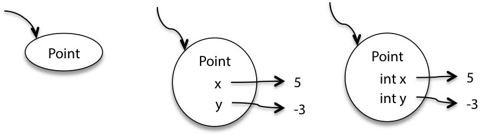
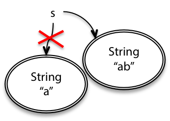
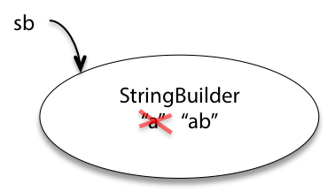
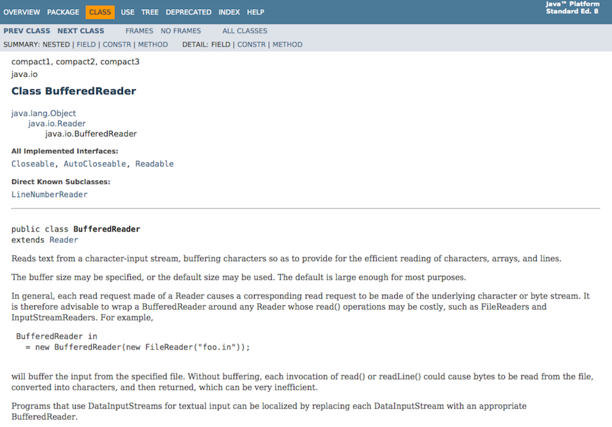
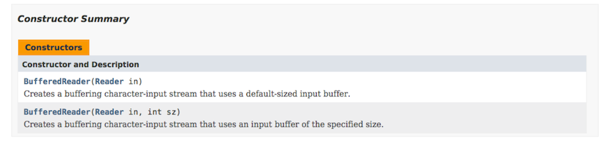
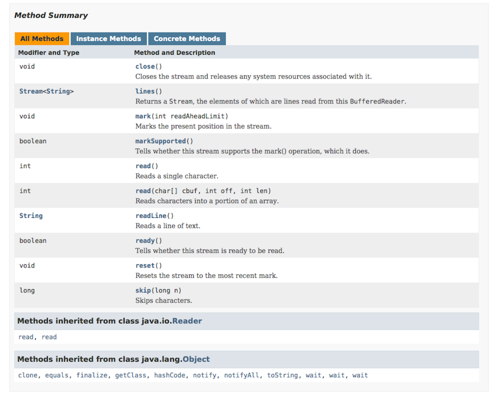

# 阅读 2：基本 Java

**上课前晚完成：**你必须在 9 月 8 日星期四晚上 10:00 之前完成本次阅读中的阅读练习。 阅读练习仅根据完成情况评分，永远不会根据正确性评分，详情请参阅课程概况。

**获取阅读练习学分：**右侧有一个大大的红色***登录***按钮。只有在做练习时登录才能获得阅读练习的学分。

**上课前完成：**你必须在 9 月 9 日星期五下午 1:00 之前完成问题集 0 部分 I。

**周日前完成：**你必须在 9 月 11 日星期日晚上 10:00 之前完成 Java 导师中的*基本 Java*练习。

**可选，截止到周一：**完成 Java 导师练习的前三个级别来赚取问题集 0 的一个免费 slack 日。

#### 目标

+   学习基本的 Java 语法和语义

+   从编写 Python 转向编写 Java

#### 在 6.005 中的软件

| 免受错误干扰 | 易于理解 | 准备好应对变化 |
| --- | --- | --- |
| 今天正确，未来也正确。 | 与未来的程序员清晰沟通，包括未来的你。 | 设计以适应未来的变化而不需要重写。 |

## 开始使用 Java 教程

接下来的几节将链接到**[Java 教程](http://docs.oracle.com/javase/tutorial/index.html)**网站，以帮助您快速掌握基础知识，并提供阅读练习以检查您的理解。

阅读教程页面并尝试这些阅读练习后，使用 6.005 的**Java 导师**在 Eclipse 中练习您所学的内容。

本阅读和其他资源将经常引导您查阅[Java API 文档](http://docs.oracle.com/javase/8/docs/api/)，该文档描述了 Java 内置的所有类。

### 语言基础

阅读**[语言基础](http://docs.oracle.com/javase/tutorial/java/nutsandbolts/index.html)**。

你应该能够回答关于四个语言基础主题的*问题与练习*页面上的问题。

+   [问题：变量](http://docs.oracle.com/javase/tutorial/java/nutsandbolts/QandE/questions_variables.html)

+   [问题：运算符](http://docs.oracle.com/javase/tutorial/java/nutsandbolts/QandE/questions_operators.html)

+   [问题：表达式、语句、代码块](http://docs.oracle.com/javase/tutorial/java/nutsandbolts/QandE/questions_expressions.html)

+   [问题：控制流程](http://docs.oracle.com/javase/tutorial/java/nutsandbolts/QandE/questions_flow.html)

请注意，每个*问题与练习*页面底部都有指向解决方案的链接。

还通过回答一些关于 Java 基础与 Python 基础相比较的问题来检查您的理解：

#### 阅读练习

语言基础

假设我们正在编辑 Java 中一个函数的主体，声明和使用局部变量。

```
int a = 5;     // (1)
if (a > 10) {  // (2)
    int b = 2; // (3)
} else {       // (4)
    int b = 4; // (5)
}              // (6)
b *= 3;        // (7)
```

<select class="form-control"><option>1</option>,<option>2</option>,<option>3</option>,<option>4</option>,<option>5</option>,<option>6</option>,<option>7</option></select>(缺少答案)

(缺少解释)

修复错误(缺少答案)(缺少答案)(缺少答案)(缺少答案)(缺少答案)

(缺少解释)

你是谁？(缺少答案)(缺少答案)(缺少答案)(缺少答案)(缺少答案)(缺少答案)

(缺少解释)

### 数字和字符串

阅读**[数字和字符串](http://docs.oracle.com/javase/tutorial/java/data/index.html)**。

如果你觉得`Number`包装类令人困惑，不要担心。它们确实如此。

你应该能够回答*问题和练习*页面上的所有问题。

+   [问题：数字](http://docs.oracle.com/javase/tutorial/java/data/QandE/numbers-questions.html)

+   [问题：字符，字符串](http://docs.oracle.com/javase/tutorial/java/data/QandE/characters-questions.html)

#### 阅读练习

数字和字符串

```
fahrenheit = 212.0
celsius = (fahrenheit - 32) * 5/9
```

(缺少答案)(缺少答案)(缺少答案)

(缺少解释)

双重射击(缺少答案)(缺少答案)(缺少答案)(缺少答案)(缺少答案)(缺少答案)(缺少答案)(缺少答案)(缺少答案)

(缺少解释)

适合打印(缺少答案)(缺少答案)(缺少答案)(缺少答案)

(缺少解释)

### 类和对象

阅读**[类和对象](http://docs.oracle.com/javase/tutorial/java/javaOO/index.html)**。

你应该能够回答前两个*问题和练习*页面上的问题。

+   [问题：类](http://docs.oracle.com/javase/tutorial/java/javaOO/QandE/creating-questions.html)

+   [问题：对象](http://docs.oracle.com/javase/tutorial/java/javaOO/QandE/objects-questions.html)

如果你现在不理解*嵌套类*和*枚举类型*中的一切，不要担心。当我们在课堂上看到它们时，你可以在本学期后期回顾这些构造。

#### 阅读练习

类和对象

```
class Tortoise:
    def __init__(self):
        self.position = 0

    def forward(self):
        self.position += 1

pokey = Tortoise()
pokey.forward()
print pokey.position
```

<select class="form-control"><option>public Tortoise()</option>,<option>new Tortoise()</option>,<option>Tortoise t = new Tortoise()</option>,<option>public class Tortoise</option>,<option>public class MyTortoise implements Tortoise</option></select>(缺少答案)

(缺少解释)

正在建设中

在 Python 中，我们声明一个`__init__`函数来初始化新对象。

<select class="form-control"><option>public Tortoise()</option>,<option>new Tortoise()</option>,<option>Tortoise t = new Tortoise()</option>,<option>public class Tortoise</option>,<option>public class MyTortoise implements Tortoise</option></select>(缺少答案)

(缺少解释)

<select class="form-control"><option>public Tortoise()</option>,<option>new Tortoise()</option>,<option>Tortoise t = new Tortoise()</option>,<option>public class Tortoise</option>,<option>public class MyTortoise implements Tortoise</option></select>(缺少答案)

(缺失解释)

方法论

在 Java 上声明`Tortoise`对象上的`forward`方法：

```
public void forward() {
    // self.position += 1 (Python)
}
```

(缺失答案)(缺失答案)(缺失答案)(缺失答案)

(缺失解释)

准备好

在 Python 中，我们使用`self.position = 0`给`Tortoise`对象一个从零开始的`position`。

在 Java 中，我们可以一行完成这个操作：

```
public class Tortoise {

    private int position = 0;      // (1)
    static int position = 0;       // (2)

    public Tortoise() {
        int position = 0;          // (3)
        int self.position = 0;     // (4)
        int this.position = 0;     // (5)
        int Tortoise.position = 0; // (6)
    }
    // ...
}
```

(缺失答案)(缺失答案)(缺失答案)(缺失答案)(缺失答案)(缺失答案) … 或者结合几行：

```
public class Tortoise {

    private int position;          // (1)
    static int position;           // (2)

    public Tortoise() {
        self.position = 0;         // (3)
        this.position = 0;         // (4)
        Tortoise.position = 0;     // (5)
    }
    // ...
}
```

(缺失答案)(缺失答案)(缺失答案)(缺失答案)(缺失答案) (缺失解释)

### 你好，世界！

阅读**[Hello World！](http://docs.oracle.com/javase/tutorial/getStarted/application/index.html)**

你应该能够创建一个新的`HelloWorldApp.java`文件，输入来自该教程页面的代码，然后编译和运行程序，在控制台上看到`Hello World!`。

* * *

## 快照图

许多阅读包括来自 6.005 版本的 MITx 的可选视频。

有关视频的更多信息

注意：此视频使用**不同版本**的文本。

[**▶ 播放 MITx 视频**](https://courses.csail.mit.edu/6.005/video/reading_2_basic_java,snapshot_diagrams/nLk1sWJthcg)

对我们有用的是，在运行时绘制发生的情况的图片，以便理解微妙的问题。**快照图**表示程序在运行时的内部状态 - 其堆栈（正在进行的方法及其局部变量）和其堆（当前存在的对象）。

以下是我们在 6.005 中使用快照图的原因：

+   通过图片互相交流（在课堂上和团队会议中）

+   用于说明概念，如原始类型 vs. 对象类型，不可变值 vs. 不可变引用，指针别名，堆栈 vs. 堆，抽象 vs. 具体表示。

+   帮助解释你的团队项目的设计（与团队和 TA 互相之间）。

+   为后续课程中更丰富的设计符号铺平道路。例如，快照图在 6.170 中概括成对象模型。

尽管本课程中的图表使用 Java 的示例，但这种符号可以应用于任何现代编程语言，例如 Python、Javascript、C++、Ruby。

### 原始值


原始值由裸露的常量表示。传入的箭头是来自变量或对象字段的值的引用。

### 对象值



对象值是一个以其类型标记的圆圈。当我们想要显示更多细节时，我们将字段名称写在里面，并用箭头指向它们的值。为了更多细节，字段可以包括它们声明的类型。有些人更喜欢写`x:int`而不是`int x`，但两者都可以。

### 变异值 vs. 重新分配变量

快照图为我们提供了一种可视化的方式来区分改变变量和改变值之间的区别：

+   当你将一个变量或字段分配给一个值时，你正在改变变量的箭头指向的位置。你可以将它指向一个不同的值。

+   当你分配给可变值的内容时（比如数组或列表），你正在改变该值内部的引用。

#### 重新分配和不可变值



例如，如果我们有一个[`String`](http://docs.oracle.com/javase/8/docs/api/?java/lang/String.html)变量`s`，我们可以将其从值`"a"`重新分配为`"ab"`。

```
String s = "a";
s = s + "b";
```

`String`是*不可变*类型的示例，一旦创建后其值就永远不会改变。不可变性（免疫于变化）是本课程的一个重要设计原则，在未来的阅读中我们将更多地讨论它。

不可变对象（由其设计者设计为始终表示相同值）在快照图中用双边框表示，就像我们图中的`String`对象一样。

#### 可变值



相比之下，[`StringBuilder`](http://docs.oracle.com/javase/8/docs/api/?java/lang/StringBuilder.html)（另一个内置 Java 类）是一个*可变*对象，表示一串字符，并且它有改变对象值的方法：

```
StringBuilder sb = new StringBuilder("a");
sb.append("b");
```

这两个快照图看起来非常不同，这很好：可变性和不可变性之间的差异将在使我们的代码*免受错误*方面发挥重要作用。

#### 不可变引用

Java 还为我们提供了不可变引用：只分配一次并且不再重新分配的变量。要使引用不可变，使用关键字`final`声明它：

```
final int n = 5;
```


如果 Java 编译器不确信你的`final`变量在运行时只会被分配一次，那么它将产生编译错误。所以`final`为不可变引用提供了静态检查。

在快照图中，不可变引用（`final`）用双箭头表示。这里有一个对象，它的`id`永远不会改变（它不能被重新分配到一个不同的数字），但`age`可以改变。

请注意，我们可以有一个对*可变值*的*不可变引用*（例如：`final StringBuilder sb`），尽管我们指向同一个对象，其值也可以改变。

我们也可以有一个对*不可变值*的*可变引用*（比如`String s`），其中变量的值可以改变，因为它可以被重新指向一个不同的对象。

* * *

## Java 集合

第一个语言基础教程讨论了[**数组**](http://docs.oracle.com/javase/tutorial/java/nutsandbolts/arrays.html)，它们是一个包含一系列对象或基本值的*固定长度*容器。Java 提供了一些更强大和灵活的工具来管理对象的*集合*：**Java 集合框架**。

### 列表、集合和映射

**[Java `List`](http://docs.oracle.com/javase/8/docs/api/?java/util/List.html) 类似于 [Python 列表](https://docs.python.org/3/library/stdtypes.html#sequence-types-list-tuple-range)。** 一个 `List` 包含一个有序的零个或多个对象的集合，其中同一个对象可能多次出现。 我们可以向 `List` 添加和删除项目，它将根据其内容增长和缩小。

示例 `List` 操作：

| Java | 描述 | Python |
| --- | --- | --- |
| `int count = lst.size();` | 计算元素数量 | `count = len(lst)` |
| `lst.add(e);` | 将元素追加到末尾 | `lst.append(e)` |
| `if (lst.isEmpty()) ...` | 测试列表是否为空 | `if not lst: ...` |

在快照图中，我们将 `List` 表示为具有索引绘制为字段的对象：

这个 `cities` 列表可能代表从波士顿到波哥大再到巴塞罗那的旅程。

**[`Set`](http://docs.oracle.com/javase/8/docs/api/?java/util/Set.html) 是一个无序的零个或多个唯一对象的集合。** 像数学 *集合* 或 [Python set](https://docs.python.org/3/library/stdtypes.html#set-types-set-frozenset) —— 与 `List` 不同 —— 对象不能多次出现在集合中。 它要么在里面，要么在外面。

示例 `Set` 操作：

| Java | 描述 | Python |
| --- | --- | --- |
| `s1.contains(e)` | 测试集合是否包含元素 | `e in s1` |
| `s1.containsAll(s2)` | 测试 *s1 ⊇ s2* | `s1.issuperset(s2)` `s1 >= s2` |
| `s1.removeAll(s2)` | 从 *s1* 中删除 *s2* | `s1.difference_update(s2)` `s1 -= s2` |

在快照图中，我们将 `Set` 表示为没有名称字段的对象：

这里我们有一组整数，顺序不限：42、1024 和 -7。

**[`Map`](http://docs.oracle.com/javase/8/docs/api/?java/util/Map.html) 类似于 [Python 字典](https://docs.python.org/3/library/stdtypes.html#mapping-types-dict)。** 在 Python 中，地图的 **键** 必须是 [可散列的](https://docs.python.org/3/glossary.html#term-hashable)。 Java 有类似的要求，我们将在面对 Java 对象之间的相等性时讨论。

示例 `Map` 操作：

| Java | 描述 | Python |
| --- | --- | --- |
| `map.put(key, val)` | 添加映射 *key → val* | `map[key] = val` |
| `map.get(key)` | 获取键的值 | `map[key]` |
| `map.containsKey(key)` | 测试地图是否有键 | `key in map` |
| `map.remove(key)` | 删除映射 | `del map[key]` |

在快照图中，我们将 `Map` 表示为包含键/值对的对象：

这个 `turtles` 地图包含分配给 `String` 键的 `Turtle` 对象：Bob，Buckminster 和 Buster。

### 字面值

Python 提供了方便的语法来创建列表：

```
lst = [ "a", "b", "c" ]
```

和地图：

```
map = { "apple": 5, "banana": 7 }
```

**Java 不提供。** 它确实提供了一个数组的文字语法：

```
String[] arr = { "a", "b", "c" };
```

但这会创建一个 *数组*，而不是 `List`。 我们可以使用 [实用函数 `Arrays.asList`](http://docs.oracle.com/javase/8/docs/api/?java/util/Arrays.html) 从数组创建 `List`：

```
Arrays.asList(new String[] { "a", "b", "c" })
```

… 或直接从参数中：

```
Arrays.asList("a", "b", "c")
```

使用 `Arrays.asList` 创建的 `List` 来自带一个限制：它的长度是固定的。

### 泛型：声明 List、Set 和 Map 变量

与 Python 集合类型不同，使用 Java 集合，我们可以限制集合中包含的对象的类型。当我们添加一个项目时，编译器可以执行*静态检查*以确保我们只添加适当类型的项目。然后，当我们取出一个项目时，我们可以确保它的类型是我们期望的。

这是声明一些变量以容纳集合的语法：

```
List<String> cities;        // a List of Strings
Set<Integer> numbers;       // a Set of Integers
Map<String,Turtle> turtles; // a Map with String keys and Turtle values
```

由于泛型的工作方式，我们无法创建原始类型的集合。例如，`Set<int>` 是*不*起作用的。然而，正如我们之前看到的，`int` 有一个我们可以使用的`Integer`包装器（例如 `Set<Integer> numbers`）。

为了更容易使用这些包装类型的集合，Java 进行了一些自动转换。如果我们声明了 `List<Integer> sequence`，这段代码可以工作：

```
sequence.add(5);              // add 5 to the sequence
int second = sequence.get(1); // get the second element
```

### ArrayLists 和 LinkedLists：创建 List

正如我们很快就会看到的那样，Java 帮助我们区分类型的*规范*——它是做什么的？——和*实现*——代码是什么？

`List`、`Set` 和 `Map` 都是*接口*：它们定义了这些相应类型的工作方式，但它们不提供实现代码。有几个优点，但一个潜在的优点是我们，这些类型的用户，可以在不同的情况下选择不同的实现。

这是如何创建一些实际的 `List`：

```
List<String> firstNames = new ArrayList<String>();
List<String> lastNames = new LinkedList<String>();
```

如果左右的泛型类型参数相同，Java 可以推断出正在发生的情况，并为我们节省一些输入：

```
List<String> firstNames = new ArrayList<>();
List<String> lastNames = new LinkedList<>();
```

[`ArrayList`](http://docs.oracle.com/javase/8/docs/api/?java/util/ArrayList.html) 和 [`LinkedList`](http://docs.oracle.com/javase/8/docs/api/?java/util/LinkedList.html) 是 `List` 的两种实现。两者都提供了 `List` 的所有操作，并且这些操作必须按照 `List` 的文档中描述的方式工作。在这个例子中，`firstNames` 和 `lastNames` 将表现相同；如果我们交换了哪一个使用了 `ArrayList` vs. `LinkedList`，我们的代码不会出错。

不幸的是，这种选择的能力也是一种负担：我们不关心 Python 列表的工作方式，为什么我们要关心我们的 Java 列表是 `ArrayLists` 还是 `LinkedLists`？由于唯一的区别是性能，对于 6.005 *我们不*关心。

如果不确定，使用 `ArrayList`。

### HashSet 和 HashMaps：创建 Set 和 Map

[`HashSet`](http://docs.oracle.com/javase/8/docs/api/?java/util/HashSet.html) 是我们默认选择的 `Set`：

```
Set<Integer> numbers = new HashSet<>();
```

Java 还提供了[有序集合](http://docs.oracle.com/javase/8/docs/api/?java/util/SortedSet.html)与 [`TreeSet`](http://docs.oracle.com/javase/8/docs/api/?java/util/TreeSet.html) 实现。

对于 `Map`，默认选择是[`HashMap`](http://docs.oracle.com/javase/8/docs/api/?java/util/HashMap.html)：

```
Map<String,Turtle> turtles = new HashMap<>();
```

### 迭代

所以也许我们有：

```
List<String> cities        = new ArrayList<>();
Set<Integer> numbers       = new HashSet<>();
Map<String,Turtle> turtles = new HashMap<>();
```

遍历我们的城市/数字/乌龟等是一项非常常见的任务。

在 Python 中：

```
for city in cities:
    print city

for num in numbers:
    print num

for key in turtles:
    print "%s: %s" % (key, turtles[key])
```

Java 为遍历`List`和`Set`中的项目提供了类似的语法。

这是 Java 的代码：

```
for (String city : cities) {
    System.out.println(city);
}

for (int num : numbers) {
    System.out.println(num);
}
```

我们无法用这种方式遍历`Map`本身，但我们可以像在 Python 中那样遍历键：

```
for (String key : turtles.keySet()) {
    System.out.println(key + ": " + turtles.get(key));
}
```

这种`for`循环底层使用[`Iterator`](http://docs.oracle.com/javase/8/docs/api/?java/util/Iterator.html)，这是我们在课程中稍后会看到的一种设计模式。

#### 使用索引进行迭代

如果你愿意，Java 提供了不同的`for`循环，我们可以用来使用其索引迭代列表：

```
for (int ii = 0; ii < cities.size(); ii++) {
    System.out.println(cities.get(ii));
}
```

除非我们实际上需要索引值`ii`，否则这段代码冗长且有更多隐藏 bug 的地方。避免。

#### 阅读练习

集合

用`List`重写这些变量声明，而不是使用数组。我们只声明变量，而不给它们赋任何值。

（缺失答案）

（缺失解释）

（缺失答案）

（缺失解释）

（缺失答案）

（缺失解释）

X 标记着地点

Java 的`Map`工作原理类似于 Python 的字典。

当我们运行此代码后：

```
Map<String, Double> treasures = new HashMap<>();
String x = "palm";
treasures.put("beach", 25.);
treasures.put("palm", 50.);
treasures.put("cove", 75.);
treasures.put("x", 100.);
treasures.put("palm", treasures.get("palm") + treasures.size());
treasures.remove("beach");
double found = 0;
for (double treasure : treasures.values()) {
    found += treasure;
}
```

…的值是多少…

（缺失答案）（缺失答案）（缺失答案）

## Java API 文档

前面的部分有许多链接指向[Java 平台 API](http://docs.oracle.com/javase/8/docs/api/)中的类的文档。

API 代表*应用程序编程接口*。如果你想编写一个与 Facebook 交互的应用程序，Facebook 发布了一个 API（实际上不止一个，对于不同的语言和框架有不同的 API），你可以针对其进行编程。Java API 是一个大型的通用工具集，几乎可以用于编程的任何事情。

+   [**`java.lang.String`**](http://docs.oracle.com/javase/8/docs/api/?java/lang/String.html)是`String`的全名。我们可以通过使用“双引号”来创建`String`类型的对象。

+   [**`java.lang.Integer`**](http://docs.oracle.com/javase/8/docs/api/?java/lang/Integer.html)和其他原始包装类。Java 在大多数情况下自动在原始类型和包装（或“装箱”）类型之间转换。

+   [**`java.util.List`**](http://docs.oracle.com/javase/8/docs/api/?java/util/List.html)就像 Python 中的列表，但在 Python 中，列表是语言的一部分。在 Java 中，`List`是用 Java 实现的！

+   [**`java.util.Map`**](http://docs.oracle.com/javase/8/docs/api/?java/util/Map.html)就像一个 Python 字典。

+   [**`java.io.File`**](http://docs.oracle.com/javase/8/docs/api/?java/io/File.html)表示磁盘上的文件。看看`File`提供的方法：我们可以测试文件是否可读，删除文件，查看上次修改时间…

+   [**`java.io.FileReader`**](http://docs.oracle.com/javase/8/docs/api/?java/io/FileReader.html)让我们可以读取文本文件。

+   [**`java.io.BufferedReader`**](http://docs.oracle.com/javase/8/docs/api/?java/io/BufferedReader.html)让我们可以高效地读取文本，并且还提供了一个非常有用的功能：一次读取一整行。

让我们更仔细地查看[`BufferedReader`](http://docs.oracle.com/javase/8/docs/api/?java/io/BufferedReader.html)的文档。这里有很多与我们尚未讨论的 Java 特性相关的东西！保持头脑清醒，专注于下面**加粗的内容**。



页面顶部是`BufferedReader`的*类层次结构*和*已实现接口*的列表。`BufferedReader`对象具有所有这些类型的方法（加上自己的方法），可供使用。

接下来我们看到*直接子类*，对于一个接口来说，是*实现类*。这可以帮助我们找到，例如，[`HashMap`](http://docs.oracle.com/javase/8/docs/api/?java/util/HashMap.html)是[`Map`](http://docs.oracle.com/javase/8/docs/api/?java/util/Map.html)的实现。

接下来是：**类的描述**。有时这些描述有点晦涩，但**这是你应该去了解一个类的第一个地方**。



如果你想要创建一个新的`BufferedReader`，**构造方法概要**是第一个需要查看的地方。构造方法并不是在 Java 中获取新对象的唯一方式，但它们是最常见的。



接下来：**方法概要列出了我们可以调用的所有方法**在`BufferedReader`对象上。

摘要下面是每个方法和构造函数的详细描述。**点击构造函数或方法以查看详细描述。**这是了解方法功能的第一个地方。

每个详细描述包括：

+   **方法签名**：我们看到返回类型、方法名和参数。我们还看到*异常*。目前，这些通常意味着方法可能遇到的错误。

+   完整的**描述**。

+   **参数**：方法参数的描述。

+   以及方法的返回**描述**。

### 规格

这些详细描述是**规格**。它们使我们能够使用像`String`、`Map`或`BufferedReader`这样的工具，而不必阅读或理解实现它们的代码。

阅读、编写、理解和分析规格将是我们在 6.005 中的首要任务之一，从几节课开始。

#### 阅读练习

阅读 Javadocs

使用 Java API 文档来回答……

假设我们有一个类`TreasureChest`。在我们运行此代码后：

```
Map<String, TreasureChest> treasures = new HashMap<>();
treasures.put("beach", new TreasureChest(25));
TreasureChest result = treasures.putIfAbsent("beach", new TreasureChest(75));
```

（缺失答案）（缺失答案）（缺失答案）（缺失答案）

（缺失解释）

阿斯特！

在我们运行此代码后，其中`???`是适当的类型：

```
Map<String, String> translations = new HashMap<>();
translations.put("green", "verde");
??? result = translations.replace("green", "verde", "ahdar");
```

（缺失答案）（缺失答案）（缺失答案）（缺失答案）（缺失答案）（缺失答案）（缺失答案）（缺失答案）

（缺失解释）

* * *

## 阅读练习

到目前为止，你应该已经完成了以上所有的阅读练习。

要检查你的阅读练习状态，请参阅[Omnivore 上的 classes/02-basic-java](https://omni.csail.mit.edu/6.005/fa16/user/classes/02-basic-java)。

完成阅读练习可以为每次课程开始时的*纳米测验*做准备，并且提交练习是每晚 10 点之前的必须要求。
