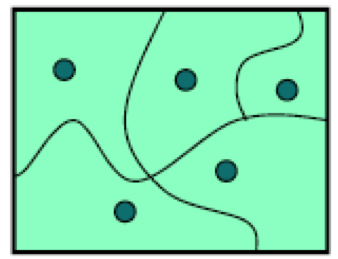
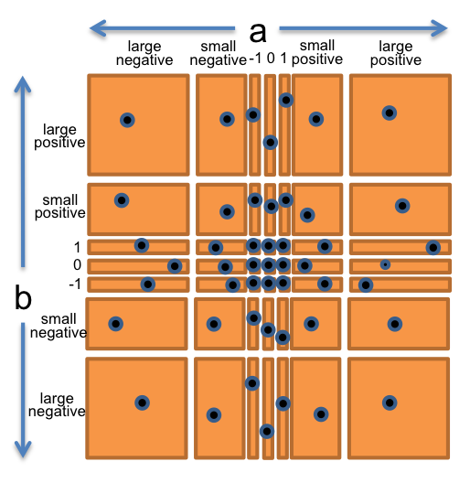
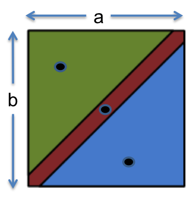

# 第三章阅读：测试

**阅读练习需在课前一晚完成。**您必须在 9 月 11 日星期日晚上 10:00 前完成本阅读的阅读练习。

***基础 Java* 在线教程**的练习也需在 9 月 11 日星期日晚上 10:00 前完成。

**可选地**，在 9 月 12 日星期一晚上 10:00 前完成 Java 在线教程的前三个级别的练习，以赢得问题集 0 的一个免费的 Slack 天。

#### 在 6.005 中的软件

| 免于错误 | 易于理解 | 可变更 |
| --- | --- | --- |
| 今天正确且在未知的未来也正确。 | 与未来的程序员（包括未来的你）清晰沟通。 | 设计以适应变化而无需重写。 |

#### 今天课程的目标

在今天的课程之后，您应该：

+   理解测试的价值，并知道测试优先编程的过程；

+   能够通过划分输入和输出空间并选择良好的测试用例为方法设计测试套件；

+   能够通过测量其代码覆盖率来判断测试套件；和

+   理解并知道何时使用黑盒测试与白盒测试，单元测试与集成测试，以及自动化回归测试。

## 验证

许多阅读包括来自 MITx 版本 6.005 的可选视频。

有关视频的更多信息

[**▶ 播放 MITx 视频**](https://courses.csail.mit.edu/6.005/video/reading_3_testing,validation/1tgKOH6jYIY)

测试是称为*验证*的更一般的过程的一个例子。验证的目的是发现程序中的问题，从而增加对程序正确性的信心。验证包括：

+   **对程序进行形式推理**，通常称为*验证*。验证构建一个正式的证明，证明程序是正确的。手工进行验证是很繁琐的，验证的自动化工具支持仍然是一个活跃的研究领域。尽管如此，程序的小而关键的部分可能会被正式验证，例如操作系统中的调度程序，虚拟机中的字节码解释器，或[操作系统中的文件系统](http://www.csail.mit.edu/crash_tolerant_data_storage)。

+   **代码审查**。让其他人仔细阅读您的代码，并对其进行非正式推理，可以发现错误的好方法。这很像让别人校对你写的文章。我们将在下一次阅读中更多地讨论代码审查。

+   **测试**。在精心选择的输入上运行程序并检查结果。

即使进行了最佳的验证，要在软件中达到完美的质量也是非常困难的。以下是一些典型的*剩余缺陷率*（软件发货后剩余的错误）每 kloc（一千行源代码）：

+   1 - 10 缺陷/千行代码：典型的行业软件。

+   0.1 - 1 缺陷/千行代码：高质量的验证。Java 库可能达到这个正确性水平。

+   0.01 - 0.1 每千行代码的缺陷：最佳的、安全关键的验证。NASA 和像 Praxis 这样的公司可以达到这个水平。

对于大型系统而言，这可能是令人泄气的。例如，如果你已经交付了 100 万行典型行业源代码（每千行代码 1 个缺陷），这意味着你错过了 1000 个错误！

### 软件测试为何如此困难

以下是一些在软件世界中不起作用的方法。

**穷举测试** 是不可行的。可能的测试用例空间通常太大而无法穷尽。想象一下穷举测试 32 位浮点乘法操作`a*b`。有 2⁶⁴ 个测试用例！

**随意测试**（“只是试一试，看看是否有效”）不太可能发现错误，除非程序非常有错误，随意选择的输入更有可能失败而不是成功。它也不会增加我们对程序正确性的信心。

**随机或统计测试** 在软件领域效果不佳。其他工程学科可以测试小的随机样本（例如制造的硬盘的 1%），并推断整个生产批次的缺陷率。物理系统可以使用许多技巧来加快时间，例如在 24 小时内打开冰箱 1000 次，而不是 10 年。这些技巧给出了已知的故障率（例如硬盘的平均寿命），但它们假设缺陷空间上的连续性或均匀性。这对物理制品是成立的。

但对于软件来说并非如此。软件行为在可能的输入空间中以不连续和离散的方式变化。系统可能在广泛的输入范围内看起来正常工作，然后在单个边界点突然失败。[著名的奔腾除法错误](http://www.willamette.edu/~mjaneba/pentprob.html) 影响了大约 90 亿次除法中的 1 次。栈溢出、内存不足错误和数值溢出错误往往会突然发生，并且总是以相同的方式发生，而不是以概率变化的方式。这与物理系统不同，物理系统中通常有可见的证据表明系统正在接近故障点（桥梁上的裂缝），或者故障在接近故障点附近概率分布（因此统计测试将观察到一些故障甚至在到达点之前）。 

相反，测试用例必须被仔细而系统地选择，这就是我们接下来要看的内容。

#### 阅读练习

测试基础知识

在 1990 年代，为欧洲空间局设计和建造的阿里安 5 号运载火箭，在首次发射后的 37 秒内自我销毁。

原因是一个控制软件的 bug 未被检测到。阿丽亚娜 5 号的导航软件是从速度较慢的阿丽亚娜 4 号重用的。当速度计算从 64 位浮点数（Java 术语中的 `double`，尽管此软件并非用 Java 编写）转换为 16 位有符号整数（`short`）时，它溢出了小整数并导致异常被抛出。异常处理程序已被禁用以提高效率，因此导航软件崩溃了。没有导航，火箭也崩溃了。这次失败的成本是 10 亿美元。

这个故事表明了哪些想法？

（缺失答案）（缺失答案）（缺失答案）（缺失答案）

（缺失解释）

### 戴上你的测试帽

[**▶ 播放 MITx 视频**](https://courses.csail.mit.edu/6.005/video/reading_3_testing,validation,putting_on_your_testing_hat/Eyl2cUMAneQ)

测试需要正确的态度。当你编码时，你的目标是使程序工作，但作为一个测试人员，你想要**让它失败**。

这是一个微妙但重要的区别。很容易把刚写的代码当作一个珍贵的东西，一个脆弱的蛋壳，并且轻微地测试它以确保它可以工作。

相反，你必须毫不留情。一个好的测试人员持有一把大锤，无处不击中程序可能脆弱的地方，以便消除这些脆弱性。

## 测试驱动编程

早期并且经常进行测试。不要等到最后才进行测试，那时你会有一大堆未经验证的代码。将测试留到最后只会使调试变得更长，更痛苦，因为 bug 可能存在于代码的任何位置。在开发代码时进行测试会更加愉快。

在测试驱动编程中，你甚至在编写任何代码之前就编写测试。单个函数的开发按照以下顺序进行：

1.  为函数编写规范。

1.  编写测试以测试规范。

1.  编写实际代码。一旦你的代码通过了你编写的测试，你就完成了。

**规范**描述了函数的输入和输出行为。它给出了参数的类型以及对它们的任何附加约束（例如，`sqrt` 的参数必须是非负的）。它还给出了返回值的类型以及返回值与输入之间的关系。在这门课程的问题集中，你已经看到并使用了规范。在代码中，规范由方法签名和它上面的注释组成，描述了它的作用。几节课后，我们将对规范有更多的话要说。

首先编写测试是理解规范的好方法。规范也可能存在 bug —— 不正确、不完整、含糊不清、缺少边界情况。尝试编写测试可以在你浪费时间编写有问题的规范的实现之前及早发现这些问题。

## 通过划分选择测试用例

创建一个好的测试套件是一个具有挑战性和有趣的设计问题。我们希望选择一组测试用例，它足够小以便快速运行，但又足够大以验证程序。



为了做到这一点，我们将输入空间划分为 **子域**，每个子域由一组输入组成。这些子域一起完全覆盖了输入空间，以便每个输入至少位于一个子域中。然后我们从每个子域中选择一个测试用例，这就是我们的测试套件。

子域背后的思想是将输入空间划分为具有相似行为的类似输入的集合。然后我们使用每个集合的一个代表。通过选择不同的测试用例，这种方法可以最大程度地利用有限的测试资源，并迫使测试探索随机测试可能无法达到的输入空间的部分。

如果需要确保我们的测试将探索输出空间的不同部分，我们还可以将输出空间划分为子域（程序在其中具有相似行为的相似输出）。大多数情况下，划分输入空间就足够了。

#### 例子：`BigInteger.multiply()`

让我们来看一个例子。[`BigInteger`](http://docs.oracle.com/javase/8/docs/api/?java/math/BigInteger.html) 是 Java 库中内置的一个类，可以表示任意大小的整数，不像原始类型 `int` 和 `long` 只有有限的范围。BigInteger 有一个 `multiply` 方法，用于将两个 BigInteger 值相乘：

```
/**
 * @param val another BigIntger
 * @return a BigInteger whose value is (this * val).
 */
public BigInteger multiply(BigInteger val)
```

例如，下面是它可能被使用的方式：

```
BigInteger a = ...;
BigInteger b = ...;
BigInteger ab = a.multiply(b);
```

这个例子显示了即使在方法的声明中只显式显示一个参数，`multiply` 实际上是一个 *两个* 参数的函数：你调用方法的对象（上面的例子中的 `a`），以及你在括号中传递的参数（在这个例子中是 `b`）。在 Python 中，接收方法调用的对象将在方法声明中明确命名为一个名为 `self` 的参数。在 Java 中，你不在参数中提及接收对象，而是称之为 `this` 而不是 `self`。

所以我们应该将 `multiply` 视为一个接受两个输入的函数，每个输入类型为 `BigInteger`，并生成一个类型为 `BigInteger` 的输出：

**`multiply : BigInteger × BigInteger → BigInteger`**

所以我们有一个二维输入空间，由所有整数对 (a,b) 组成。现在让我们将其分割。考虑乘法的工作原理，我们可能从这些分区开始：

+   a 和 b 都是正数

+   a 和 b 都是负数

+   a 是正数，b 是负数

+   a 是负数，b 是正数

还有一些乘法的特殊情况需要检查：0、1 和 -1。

+   a 或 b 是 0、1 或 -1

最后，作为一个怀疑的测试人员试图找到错误，我们可能怀疑 BigInteger 的实现者可能会尝试通过在可能的情况下内部使用`int`或`long`来加快速度，并且只有在值太大时才会退回到昂贵的一般表示（比如数字列表）。因此，我们还应该尝试非常大的整数，比最大的`long`还要大。

+   a 或 b 很小

+   a 或 b 的绝对值大于`Long.MAX_VALUE`，即 Java 中最大可能的原始整数，大约为 2⁶³。

让我们将所有这些观察结果整合到整个`(a,b)`空间的简单划分中。我们将独立选择`a`和`b`，从以下选取：



+   0

+   1

+   -1

+   小正整数

+   小负整数

+   极大正整数

+   极大负整数

因此，这将产生 7 × 7 = 49 个完全覆盖整数对空间的划分。

为了生成测试套件，我们将从网格的每个方格中选择任意一对(a,b)，例如：

+   (a,b) = (-3, 25) 以覆盖 (小负数, 小正数)

+   (a,b) = (0, 30) 以覆盖 (0, 小正数)

+   (a,b) = (2¹⁰⁰, 1) 以覆盖 (大正数, 1)

+   等等。

右侧的图表显示了如何通过这种划分将二维的(a,b)空间划分开来，而点是我们可能选择的测试用例，以完全覆盖划分。

#### 例如：`max()`

让我们看看 Java 库中的另一个例子：整数`max()`函数，位于[`Math`](http://docs.oracle.com/javase/8/docs/api/java/lang/Math.html)类中。

```
/**
 * @param a  an argument
 * @param b  another argument
 * @return the larger of a and b.
 */
public static int max(int a, int b)
```

从数学上讲，这种方法是以下类型的函数：

**`max : int × int → int`**



根据规范，将此函数划分为以下部分是有意义的：

+   a < b

+   a = b

+   a > b

我们的测试套件可能是：

+   (a, b) = (1, 2) 以覆盖 a < b

+   (a, b) = (9, 9) 以覆盖 a = b

+   (a, b) = (-5, -6) 以覆盖 a > b

### 在划分中包含边界

错误经常发生在子域之间的*边界*。一些例子：

+   0 是正数和负数之间的边界

+   数值类型的最大值和最小值，比如`int`和`double`

+   对于集合类型的空值（空字符串，空列表，空数组）

+   集合的第一个和最后一个元素

为什么错误经常发生在边界？一个原因是程序员经常犯**差一错误**（比如写`<=`而不是`<`，或者将计数器初始化为 0 而不是 1）。另一个原因是一些边界可能需要在代码中作为特殊情况处理。另一个原因是边界可能是代码行为不连续的地方。例如，当一个`int`变量增长超过其最大正值时，它会突然变成一个负数。

在划分中包含边界作为子域是很重要的，这样你就选择了一个边界输入。

让我们重新做一下**`max : int × int → int`**。

划分为：

+   *a 和 b 之间的关系*

    +   a < b

    +   a = b

    +   a > b

+   *a 的值*

    +   a = 0

    +   a < 0

    +   a > 0

    +   a = 最小整数

    +   a = 最大整数

+   *b 的值*

    +   b = 0

    +   b < 0

    +   b > 0

    +   b = 最小整数

    +   b = 最大整数

现在让我们选择覆盖所有这些类的测试值：

+   （1，2）覆盖了 a < b，a > 0，b > 0

+   （-1，-3）覆盖了 a > b，a < 0，b < 0

+   （0，0）覆盖了 a = b，a = 0，b = 0

+   （Integer.MIN_VALUE，Integer.MAX_VALUE）覆盖了 a < b，a = minint，b = maxint

+   （Integer.MAX_VALUE，Integer.MIN_VALUE）覆盖了 a > b，a = maxint，b = minint

### 覆盖分区的两个极端

在划分输入空间之后，我们可以选择测试套件的详尽程度：

+   **完整笛卡尔积**。

    每个分区维度的每个合法组合都由一个测试用例覆盖。这就是我们为`multiply`示例所做的，它给我们提供了 7 × 7 = 49 个测试用例。对于包含边界的`max`示例，它有三个维度，分别为 3 部分，5 部分和 5 部分，这意味着最多有 3 × 5 × 5 = 75 个测试用例。然而，在实践中，并非所有这些组合都是可能的。例如，无法覆盖 a < b，a = 0，b = 0 的组合，因为`a`不能同时小于零且等于零。

+   **覆盖每个部分。**

    每个维度的每个部分都至少由一个测试用例覆盖，但不一定是每个组合。采用这种方法，如果精心选择，`max`的测试套件可能只有 5 个测试用例。这就是我们上面采取的方法，它让我们选择了 5 个测试用例。

通常我们在这两个极端之间做出一些妥协，基于人类的判断和谨慎，并受到白盒测试和代码覆盖工具的影响，接下来我们将看到。

#### 阅读练习

分区

考虑以下规范：

```
/**
 * Reverses the end of a string.
 *
 *                          012345                     012345
 * For example: reverseEnd("Hello, world", 5) returns "Hellodlrow ,"
 *                               <----->                    <----->
 *
 * With start == 0, reverses the entire text.
 * With start == text.length(), reverses nothing.
 *
 * @param text    non-null String that will have its end reversed
 * @param start   the index at which the remainder of the input is reversed,
 *                requires 0 <= start <= text.length()
 * @return input text with the substring from start to the end of the string reversed
 */
public static String reverseEnd(String text, int start)
```

以下哪些是`start`参数的合理分区？

（缺少答案）（缺少答案）（缺少答案）（缺少答案）

（缺少解释）

对字符串进行分区

以下哪些是`text`参数的合理分区？

（缺少答案）（缺少答案）（缺少答案）（缺少答案）

（缺少解释）

## 黑盒测试和白盒测试

[**▶ 播放 MITx 视频**](https://courses.csail.mit.edu/6.005/video/reading_3_testing,blackbox_and_whitebox_testing/bMiw7XGsAyY)

从上面回顾，*规范*是函数行为的描述 - 参数类型，返回值类型以及它们之间的约束和关系。

**黑盒测试**意味着仅从规范中选择测试用例，而不是从函数的实现中选择。这是我们迄今为止在示例中所做的。我们对`multiply`和`max`进行了分区并寻找了边界，而没有查看这些函数的实际代码。

**白盒测试**（也称为玻璃盒测试）意味着选择测试用例时要了解函数的实际实现方式。例如，如果实现根据输入选择不同的算法，则应根据这些领域进行划分。如果实现保留内部缓存以记住先前输入的答案，则应测试重复输入。

在进行白盒测试时，必须注意你的测试用例不应*要求*特定的实现行为，而这些行为在规范中并没有明确要求。例如，如果规范说“如果输入格式不良，则抛出异常”，那么你的测试不应该*特别*检查`NullPointerException`，只是因为当前实现是这样做的。在这种情况下，规范允许抛出*任何*异常，因此你的测试用例也应该是通用的，以保留实现者的自由。我们在规范课上会有更多讨论。

#### 阅读练习

黑盒和白盒测试

考虑以下函数：

```
/**
 * Sort a list of integers in nondecreasing order.  Modifies the list so that 
 * values.get(i) <= values.get(i+1) for all 0<=i<values.length()-1
 */
public static void sort(List<Integer> values) {
    // choose a good algorithm for the size of the list
    if (values.length() < 10) {
        radixSort(values);
    } else if (values.length() < 1000*1000*1000) {
        quickSort(values);
    } else {
        mergeSort(values);
    }
}
```

以下哪些测试用例可能是白盒测试产生的边界值？

（缺失答案）（缺失答案）（缺失答案）（缺失答案）

（缺失解释）

## 记录您的测试策略

[**▶ 播放 MITx 视频**](https://courses.csail.mit.edu/6.005/video/reading_3_testing,documenting_your_testing_strategy/7osZ0SPaEU8)

对于左侧的示例函数，在右侧是我们如何记录我们在上面的划分练习中工作的测试策略。该策略还解决了我们之前没有考虑的一些边界值。

|

```
/**
 * Reverses the end of a string.
 *
 * For example:
 *   reverseEnd("Hello, world", 5)
 *   returns "Hellodlrow ,"
 *
 * With start == 0, reverses the entire text.
 * With start == text.length(), reverses nothing.
 *
 * @param text    non-null String that will have
 *                its end reversed
 * @param start   the index at which the
 *                remainder of the input is
 *                reversed, requires 0 <=
 *                start <= text.length()
 * @return input text with the substring from
 *               start to the end of the string
 *               reversed
 */
static String reverseEnd(String text, int start)
```

| 在测试类的顶部记录策略：

```
/*
 * Testing strategy
 *
 * Partition the inputs as follows:
 * text.length(): 0, 1, > 1
 * start:         0, 1, 1 < start < text.length(),
 *                text.length() - 1, text.length()
 * text.length()-start: 0, 1, even > 1, odd > 1
 *
 * Include even- and odd-length reversals because
 * only odd has a middle element that doesn't move.
 *
 * Exhaustive Cartesian coverage of partitions.
 */
```

记录每个测试用例是如何选择的，包括白盒测试：

```
// covers test.length() = 0,
//        start = 0 = text.length(),
//        text.length()-start = 0
@Test public void testEmpty() {
    assertEquals("", reverseEnd("", 0));
}

// ... other test cases ...
```

|

## 覆盖

[**▶ 播放 MITx 视频**](https://courses.csail.mit.edu/6.005/video/reading_3_testing,coverage/kSPlAyLLnFs)

评估测试套件的一种方法是询问它对程序进行了多么彻底的测试。这个概念称为*覆盖*。这里有三种常见的覆盖类型：

+   **语句覆盖**：每个语句是否都被某个测试用例执行？

+   **分支覆盖**：程序中每个`if`或`while`语句是否都被某个测试用例执行了真和假两个方向？

+   **路径覆盖**：程序中每个分支的每个可能组合——程序中的每个路径是否都被某个测试用例执行？

分支覆盖比语句覆盖更强（需要更多的测试来实现），路径覆盖比分支覆盖更强。在工业界，100%语句覆盖是一个常见目标，但由于无法到达的防御性代码（如“不应该到达这里”的断言），即使很少实现。100%分支覆盖是非常理想的，安全关键行业代码甚至有更艰巨的标准（例如，“MCDC”，修改的决策/条件覆盖）。不幸的是，100%路径覆盖是不可行的，需要指数大小的测试套件才能实现。

测试的标准方法是添加测试，直到测试套件达到足够的语句覆盖率：即程序中的每个可达语句都至少被一个测试用例执行。在实践中，语句覆盖率通常由代码覆盖率工具测量，该工具计算测试套件运行每个语句的次数。使用这样的工具，白盒测试很容易；您只需测量黑盒测试的覆盖率，并添加更多测试用例，直到所有重要语句都被记录为已执行。


Eclipse 的一个很好的代码覆盖率工具是[EclEmma](http://www.eclemma.org/)，如右侧所示。

测试套件执行的行将显示为绿色，尚未覆盖的行将显示为红色。如果您从覆盖率工具中看到这个结果，您的下一步将是想出一个测试用例，使 while 循环体执行，并将其添加到测试套件中，以便红色行变为绿色。

#### 阅读练习

使用覆盖率工具

[在 Eclipse 上安装 EclEmma](http://www.eclemma.org/installation.html)。请使用您的笔记本电脑，因为您将需要它来测试课堂练习。

然后创建一个名为`Hailstone.java`的新的 Java 类（你可以为它创建一个新项目，或者只是将其放在第 2 课练习的项目中），包含以下代码：

```
public class Hailstone {
  public static void main(String[] args) {
    int n = 3;
    while (n != 1) {
        if (n % 2 == 0) {
            n = n / 2;
        } else {
            n = 3 * n + 1;
        }
    }
  }
}
```

通过选择 Run → Coverage As → Java Application 来运行此类，并打开 EclEmma 代码覆盖高亮显示。

通过更改`n`的初始值，您可以观察 EclEmma 如何以不同的方式突出显示不同的代码行。

<select class="form-control"><option>绿色</option>，<option>黄色</option>，<option>红色</option>，<option>白色</option></select>(缺少答案)

(缺少解释)

<select class="form-control"><option>绿色</option>，<option>黄色</option>，<option>红色</option>，<option>白色</option></select>(缺少答案)

(缺少解释)

(缺少答案)

(缺少解释)

## 单元测试和存根

[**▶ 播放 MITx 视频**](https://courses.csail.mit.edu/6.005/video/reading_3_testing,unit_testing_and_stubs/wBLK4DFKCFM)

一个经过良好测试的程序将对其包含的每个单独模块（其中模块是一个方法或一个类）进行测试。测试一个单独模块，如果可能的话是独立的，被称为**单元测试**。独立测试模块会导致更容易的调试。当一个模块的单元测试失败时，您可以更有信心地认为错误在于该模块，而不是程序中的任何地方。

单元测试的反义词是**集成测试**，它测试模块的组合，甚至是整个程序。如果你只有集成测试，那么当测试失败时，你就必须搜索错误。错误可能出现在程序的任何地方。集成测试仍然很重要，因为程序可能在模块之间的连接处失败。例如，一个模块可能期望从另一个模块接收到与实际接收到的输入不同的输入。但如果你有一套详尽的单元测试，可以让你相信各个模块的正确性，那么你将会减少寻找错误的时间。

假设你正在构建一个网络搜索引擎。你的两个模块可能是`getWebPage()`，用于下载网页，以及`extractWords()`，用于将页面拆分为组成单词：

```
/** @return the contents of the web page downloaded from url 
 */
public static String getWebPage(URL url) {...}

/** @return the words in string s, in the order they appear, 
 *          where a word is a contiguous sequence of 
 *          non-whitespace and non-punctuation characters 
 */
public static List<String> extractWords(String s) { ... }
```

这些方法可能会被另一个模块`makeIndex()`使用，作为构建搜索引擎索引的网络爬虫的一部分：

```
/** @return an index mapping a word to the set of URLs 
 *          containing that word, for all webpages in the input set 
 */
public static Map<String, Set<URL>> makeIndex(Set<URL> urls) { 
    ...
    for (URL url : urls) {
        String page = getWebPage(url);
        List<String> words = extractWords(page);
        ...
    }
    ...
} 
```

在我们的测试套件中，我们希望：

+   仅针对`getWebPage()`的单元测试，以在不同的 URL 上测试它

+   仅针对`extractWords()`的单元测试，以在不同的字符串上测试它

+   针对`makeIndex()`的单元测试，以在不同的 URL 集合上测试它

程序员有时会犯的一个错误是以一种依赖于`getWebPage()`正确性的方式编写`extractWords()`的测试用例。更好的方法是独立思考和测试`extractWords()`，并对其进行分区。使用涉及网页内容的测试分区可能是合理的，因为这就是`extractWords()`在程序中实际使用的方式。但不要在测试用例中实际调用`getWebPage()`，因为`getWebPage()`可能有错误！而是将网页内容存储为字面字符串，并直接传递给`extractWords()`。这样你就编写了一个独立的单元测试，如果它失败了，你就可以更有信心地认为错误出现在实际测试的模块`extractWords()`中。

注意，无法轻松地隔离`makeIndex()`的单元测试。当测试用例调用`makeIndex()`时，它不仅测试了`makeIndex()`内部代码的正确性，还测试了`makeIndex()`调用的所有方法的正确性。如果测试失败，错误可能在任何一个方法中。这就是为什么我们希望为`getWebPage()`和`extractWords()`编写单独的测试，以增加我们对这些模块的信心，并将问题定位到将它们连接在一起的`makeIndex()`代码。

如果我们编写了`makeIndex()`调用的模块的**存根**版本，就可以隔离像`makeIndex()`这样的高级模块。例如，`getWebPage()`的一个存根根本不会访问互联网，而是无论传递什么 URL 都会返回模拟的网页内容。类的存根通常称为[**模拟对象**](http://en.wikipedia.org/wiki/Mock_object)。在构建大型系统时，存根是一种重要的技术，但我们通常不会在 6.005 中使用它们。

## 自动化测试和回归测试

[**▶ 播放 MITx 视频**](https://courses.csail.mit.edu/6.005/video/reading_3_testing,automated_testing_and_regression_testing/D-EwMsS4_JA)

没有什么比完全自动化更容易运行测试，也更可能运行测试了。**自动化测试**意味着自动运行测试并检查其结果。测试驱动程序不应该是一个需要提示输入并打印结果供您手动检查的交互式程序。相反，测试驱动程序应该在固定的测试用例上调用模块本身，并自动检查结果是否正确。测试驱动程序的结果应该是“所有测试 OK”或“这些测试失败:…”一个良好的测试框架，比如 JUnit，可以帮助您构建自动化测试套件。

请注意，像 JUnit 这样的自动化测试框架使得运行测试变得容易，但您仍然必须自己设计好测试用例。*自动化测试生成*是一个困难的问题，仍然是活跃的计算机科学研究领域。

一旦您进行了测试自动化，当您修改代码时重新运行测试非常重要。这可以防止您的程序*退化*——在修复新 bug 或添加新功能时引入其他 bug。在每次更改后运行所有测试称为**回归测试**。

每当您找到并修复一个 bug 时，请取得引发 bug 的输入，并将其添加到您的自动化测试套件中作为一个测试用例。这种类型的测试用例称为*回归测试*。这有助于填充您的测试套件，并保存良好的测试用例。请记住，如果一个测试引发了一个 bug，那么每个回归测试在您代码的一个版本中都曾这样做！保存回归测试也可以防止重新引入 bug 的倒退。由于已经发生过一次，因此 bug 可能是一个容易犯的错误。

这个想法也导致了*先测试后调试*。当出现 bug 时，立即为它编写一个引发它的测试用例，并立即将其添加到您的测试套件中。一旦找到并修复了 bug，所有的测试用例都将通过，您就完成了调试工作，并且获得了针对该 bug 的回归测试。

在实践中，自动化测试和回归测试这两个概念几乎总是结合使用。

只有在测试可以经常自动运行时，回归测试才是切实可行的。相反，如果您的项目已经有了自动化测试，那么您可能会用它来防止回归。因此，**自动化回归测试**是现代软件工程的最佳实践。

#### 阅读练习

回归测试

以下哪个最好地定义了回归测试？

（缺少答案）（缺少答案）（缺少答案）（缺少答案）运行自动化测试

哪些情况下重新运行所有 JUnit 测试是好的时机？

（缺少答案）（缺少答案）（缺少答案）（缺少答案）

（缺少解释）

测试技术

在测试优先编程中，在编写任何代码之前，哪些技术对于选择测试用例是有用的？

-   （缺失的答案）（缺失的答案）（缺失的答案）（缺失的答案）（缺失的答案）（缺失的答案）（缺失的答案）

-   （缺失的解释）

## -   摘要

-   在本阅读中，我们看到了这些想法：

+   -   先测试编程。在编写代码之前先编写测试。

+   -   分区和边界以系统地选择测试用例。

+   -   白盒测试和语句覆盖用于填充测试套件。

+   -   尽可能孤立地对每个模块进行单元测试。

+   -   自动化回归测试以防止错误再次出现。

-   今天阅读的主题与我们的三个关键优秀软件特性相关如下：

+   -   **免受错误影响**。测试的目的是发现代码中的错误，而先测试编程则是尽早地发现它们，就在你引入它们后立即发现。

+   -   **易于理解**。测试并不能像代码审查那样帮助到这一点。

+   -   **为变更做好准备**。通过编写仅依赖于规范中行为的测试来考虑变更准备性。我们还谈到了自动化回归测试，它有助于在对代码进行更改时防止错误再次出现。

-   * * *

## -   一个给读者的练习

-   到目前为止，你应该完成了上面的所有阅读练习。

-   完成阅读练习可以为每节课开始时的*微型测验*做好准备，提交练习要求在课前晚上 10 点之前完成。
