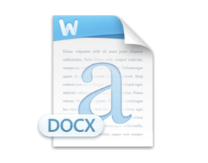
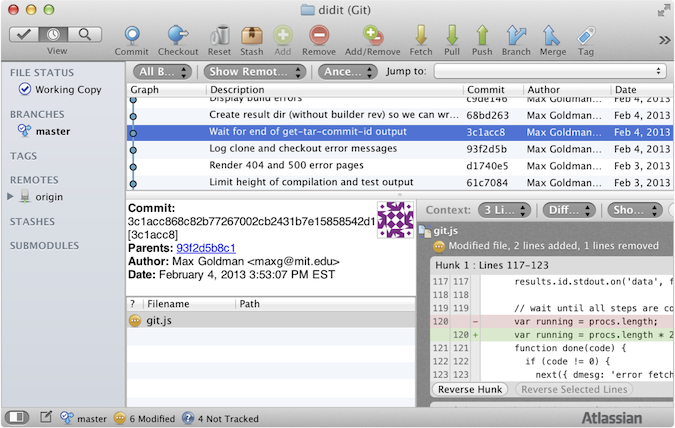
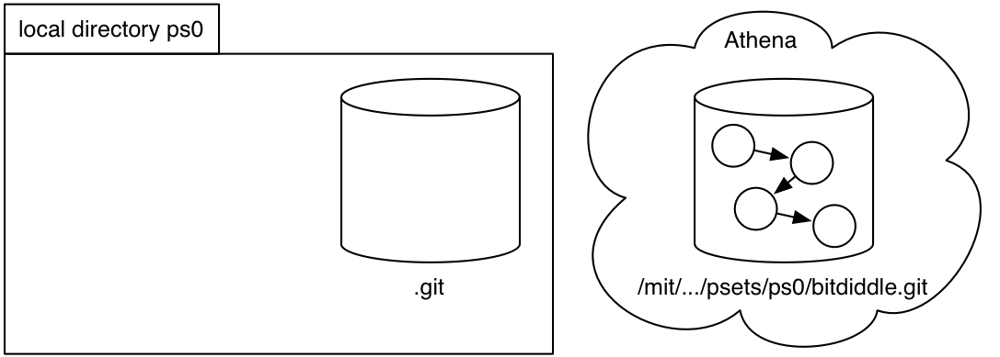
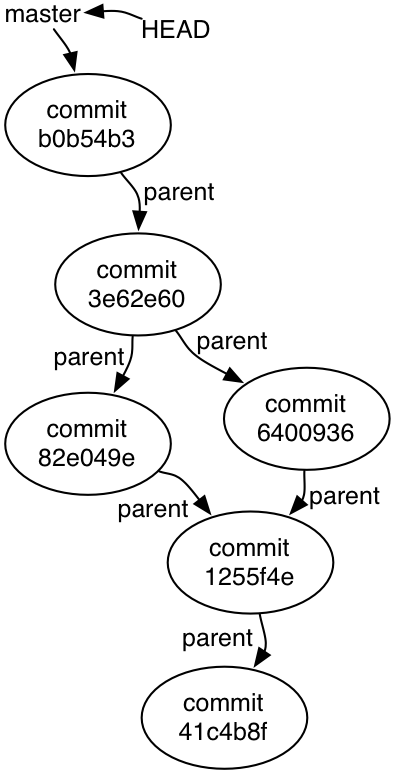
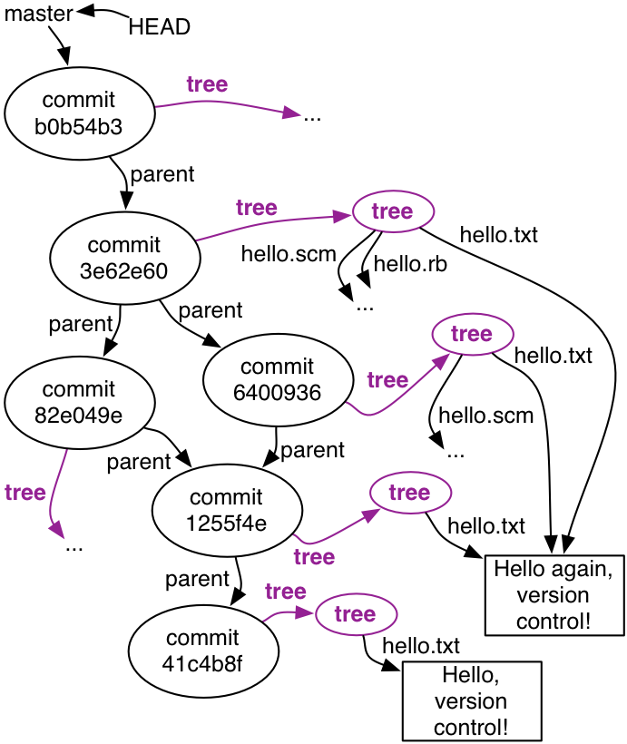
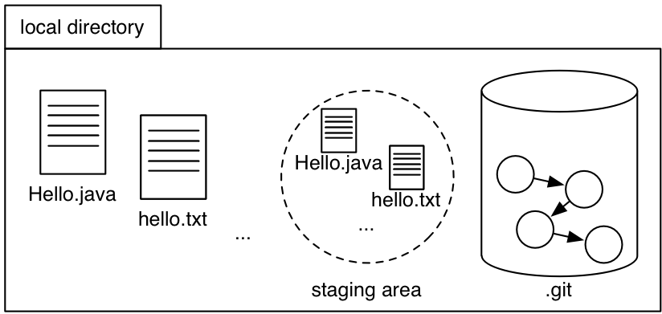
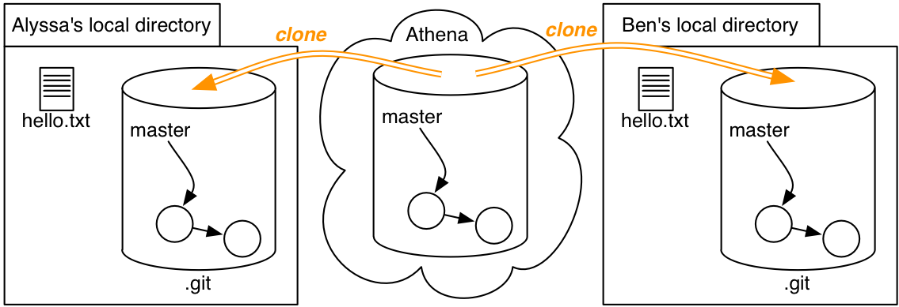

# 阅读 5：版本控制

#### 6.005 中的软件

| 免受错误影响 | 易于理解 | 为变化做好准备 |
| --- | --- | --- |
| 今天正确且未来未知时也正确。 | 与未来的程序员清晰沟通，包括未来的自己。 | 设计以适应变化而无需重写。 |

#### 目标

+   了解版本控制是什么以及为什么我们使用它

+   了解 Git 如何将版本历史存储为图形

+   练习阅读、创建和使用版本历史

## 介绍

[版本控制系统](http://en.wikipedia.org/wiki/Revision_control) 是软件工程世界中必不可少的工具。几乎每个项目 — 无论是严肃的还是业余的，开源的还是专有的 — 都使用版本控制。没有版本控制，协调一组程序员同时编辑同一项目代码将达到让人抓狂的程度。

### 你已经使用过的版本控制系统

+   Dropbox

+   [撤销/重做缓冲区](http://en.wikipedia.org/wiki/Undo)

+   保留带有版本号的多个文件副本

|  |  |  |  |  |  |
| --- | --- | --- | --- | --- | --- |
| 项目报告 | 项目报告 v2 | 项目报告 v3 | 项目报告 最终版 | 项目报告 最终版-v2 | 项目报告 最终版-v2-修复部分 5 |

## 发明版本控制

假设 [爱丽丝](http://en.wikipedia.org/wiki/Alice_and_Bob) 正在独自解决一个问题。

|   爱丽丝 | 版本 1  你好.java |
| --- | --- |

她从她的作业中的一个文件 `你好.java` 开始，她在上面工作了几天。

在她需要交作业给老师评分的最后一刻，她意识到自己做出的更改导致一切都错了。要是她能回到过去并检索以前的版本就好了！

简单的保存备份文件的纪律就能完成任务。

|   爱丽丝 | 版本 1  你好.1.java | 版本 2  你好.2.java | 版本 3  你好.java |  主分支 |
| --- | --- | --- | --- | --- |

爱丽丝根据自己的判断力决定何时达到了值得保存代码的里程碑。她将 `你好.java` 的版本保存为 `你好.1.java`，`你好.2.java` 和 `你好.java`。她遵循最近版本就是 `你好.java` 的约定，以避免混淆 Eclipse。我们将最近版本称为 *主分支*。

现在当爱丽丝意识到版本 3 有致命缺陷时，她只需将版本 2 复制回当前代码的位置。灾难避免了！但如果版本 3 包含一些好的和一些坏的更改怎么办？爱丽丝可以手动比较文件以找到更改，并将其分类为好的和坏的更改。然后她可以将好的更改复制到版本 2 中。

这是很多工作，而且人眼很容易忽略变化。幸运的是，有标准的软件工具用于比较文本；在 UNIX 世界中，其中一个工具是[`diff`](http://en.wikipedia.org/wiki/Diff)。一个更好的版本控制系统将使生成差异变得容易。

|   云 | 版本 1  Hello.1.java | 版本 2  Hello.2.java | 版本 3  Hello.java |
| --- | --- | --- | --- |
|  |
|   艾丽丝 | 版本 1  Hello.1.java | 版本 2  Hello.2.java | 版本 3  Hello.java |

艾丽丝还想要做好准备，以防她的笔记本电脑被公交车碾过，所以她在云端保存了她的工作备份，在她对其内容满意时上传她的工作目录的内容。

如果她的笔记本电脑被丢进了查尔斯河，艾丽丝可以检索备份，并在一台新机器上恢复作业，保留随时返回旧版本的能力。

此外，她可以在多台机器上开发她的作业，使用云服务提供商作为公共交换点。艾丽丝在她的笔记本电脑上做了一些更改，并将它们上传到云端。然后她在家里的台式机上下载，做了更多的工作，并将改进的代码（包括旧文件版本）上传回云端。

|  |  云 |
| --- | --- |
|  |    |  |
| 版本 5L  Hello.java |  艾丽丝在笔记本电脑上 |  |  艾丽丝在台式机上 | 版本 5D  Hello.java |

然而，如果艾丽丝不小心，她可能会遇到麻烦。想象一下，她开始在她的笔记本电脑上编辑`Hello.java`以创建“版本 5”。然后她分心了，忘记了她的改变。后来，她开始在她的台式机上工作一个新的“版本 5”，包括*不同的*改进。我们将这些版本称为“5L”和“5D”，分别代表“笔记本电脑”和“台式机”。

当到了上传变更到云端的时候，就有可能出现问题！艾丽丝可能会将她所有的本地文件复制到云端，导致其中只包含版本 5D。后来，艾丽丝从云端同步到她的笔记本电脑，潜在地覆盖版本 5L，丢失了有价值的更改。艾丽丝真正想要的是一个*合并*，以基于两个版本 5 创建一个新版本。

到目前为止，仅考虑一个程序员独自工作的情况，我们已经有了一个应该由版本控制方案支持的操作列表：

+   *恢复*到以前的版本

+   *比较*两个不同版本

+   *推送*完整版本历史到另一个位置

+   *从那个位置*拉取历史

+   *合并*来自同一早期版本的分支的版本

### 多个开发者

现在让我们把鲍勃也加入到图片中，另一个开发者。这个情况与我们刚刚考虑的情况并没有太大不同。

|  |  云 |
| --- | --- |
|  |    |
| 版本 5A  Hello.java | 版本 5A  Greet.java |   艾丽丝 |  |   鲍勃 | 版本 5B  Hello.java | 版本 5B  Greet.java |

这里的 Alice 和 Bob 就像在不同计算机上工作的两个 Alices。他们不再共享一个大脑，这使得在向共享云服务器推送和拉取时遵循严格的纪律变得更加重要。这两位程序员必须协调一个用于生成版本号的方案。理想情况下，该方案允许我们为*整套文件*分配清晰的名称，而不仅仅是单个文件。 （文件依赖于其他文件，因此孤立地考虑它们可能会导致不一致。）

仅仅上传新的源文件并不是向他人传达一组变更的高层想法的好方法。因此，让我们添加一个记录每个版本*谁*编写的，*何时*完成的，以及*哪些*变更的日志，以简短的人工编写消息的形式。

|  |  云 |
| --- | --- |
|  |    |

| 日志: 1: Alice, 晚上 7 点, ...

...

4: Bob, 晚上 8 点, ...

5A: Alice, 晚上 9 点, ... | Ver. 5A  Hello.java | Ver. 5A  Greet.java |   Alice |  |   Bob | Ver. 5B  Hello.java | Ver. 5B  Greet.java | 日志: 1: Alice, 晚上 7 点, ...

...

4: Bob, 晚上 8 点, ...

5B: Bob, 晚上 9 点, ... |

现在推送另一个版本变得有点复杂，因为我们需要合并日志。这比 Java 文件更容易做，因为日志具有更简单的结构 - 但是没有工具支持，Alice 和 Bob 将需要手动完成！我们还希望在日志和实际可用文件集之间强制保持一致性：对于每个日志条目，应该很容易提取在该条目制作时当前的完整文件集。

但是有了日志，就可以实现各种有用的操作。我们可以查看特定文件的日志：限制为涉及修改某些文件的更改的日志视图。我们还可以使用日志来确定每行代码的贡献者，甚至更好的是，确定每行代码的贡献者，这样当代码不起作用时我们就知道要向谁抱怨。这种操作手动执行将会很繁琐；版本控制系统中的自动操作称为*annotate*（或者不幸地称为*blame*）。

### 多个分支

对于开发人员的子集来说，有时候他们会分支出去工作，即一个并行的代码宇宙，用于尝试新功能。其他开发人员不希望在新功能完成之前拉取新功能，即使在此期间创建了几个协调的版本。即使是单个开发人员也可能会发现创建分支很有用，原因与最初使用云服务器的 Alice 相同。

一般来说，有许多共享位置用于交换项目状态将是有用的。可能会有多个分支位置同时存在，每个位置由几位程序员共享。通过正确的设置，任何程序员都可以从任何位置拉取或推送，从而在合作模式中创造出严肃的灵活性。

### 令人震惊的结论

当然，事实证明我们在这里并没有发明任何东西：[Git](http://git-scm.com)为您完成所有这些工作，许多其他版本控制系统也是如此。

### 分布式与集中式

| 丹 |  | 卡罗尔 |
| --- | --- | --- |
|   |
| 云 |
|   |
| 爱丽丝 |  | 鲍勃 |

像 CVS 和[Subversion](http://subversion.apache.org/)这样的传统*集中式*版本控制系统只做了我们上面想象的一部分。它们支持协作图谱 - 谁与谁共享了什么变化 - 有一个主服务器和只与主服务器通信的副本。

在集中式系统中，每个人都必须与主仓库进行工作共享。如果更改存储在*版本控制*中，那么它们就是*在主仓库*中安全存储的，因为那是唯一的仓库。

| 丹 |    | 卡罗尔 |
| --- | --- | --- |
|     |
| 云 |
|   |
| 爱丽丝 |    | 鲍勃 |

相比之下，像[Git](http://git-scm.com)和[Mercurial](https://mercurial.selenic.com)这样的*分布式*版本控制系统允许各种不同的协作图谱，团队和团队的子集可以轻松尝试代码和历史的替代版本，并在确定是个好主意时将版本合并在一起。

在分布式系统中，所有仓库都是平等创建的，用户可以为它们分配不同的角色。不同的用户可能与不同的仓库共享工作，并且团队必须决定什么样的更改才算是*在版本控制中*。如果更改仅存储在单个程序员的仓库中，他们是否仍然需要与指定的合作者或特定服务器共享它，以便团队的其他成员将其视为官方更改？

#### 阅读练习

更加平等(缺少答案)(缺少答案)(缺少答案)(缺少答案)

(缺少解释)

### 版本控制术语

+   **仓库**：我们项目中版本的本地或远程存储

+   **工作副本**：我们可以在其上进行工作的本地可编辑副本项目

+   **文件**：我们项目中的单个文件

+   **版本**或**修订**：项目内容在某个时间点的记录

+   **变更**或**差异**：两个版本之间的差异

+   **头**：当前版本

### 版本控制系统的特点

+   **可靠性**：在我们需要的时间内保留版本；允许备份

+   **多个文件**：跟踪项目的版本，而不是单个文件

+   **有意义的版本**：有何更改，为何进行更改？

+   **恢复**：恢复旧版本，全部或部分

+   **比较版本**

+   **查看历史记录**：针对整个项目或个别文件

+   **不仅仅用于代码**：散文，图片，...

它应该**允许多人一起工作**：

+   **合并**：合并自共同之前版本分叉出的版本

+   **跟踪责任**：谁做出了那个更改，谁碰了那行代码？

+   **并行工作**：允许一个程序员一段时间内独立工作（不放弃版本控制）

+   **工作进行中**：允许多个程序员共享未完成的工作（不会干扰其他人，也不会放弃版本控制）

## Git



我们在 6.005 中将使用的版本控制系统是[Git](http://git-scm.com)。它很强大，值得学习。但 Git 的用户界面可能会让人非常沮丧。Git 的用户界面是什么？

+   **在 6.005 中，我们将在命令行上使用 Git。**命令行是生活中的一个事实，因为它非常强大。

+   命令行可能会使您很难看到存储库中发生的情况。你可能会发现[SourceTree](http://www.sourcetreeapp.com)（右侧显示）对 Mac 和 Windows 很有用。在任何平台上，[gitk](http://git-scm.com/docs/gitk)可以为您提供基本的 Git GUI。询问 Google 获取其他建议。

关于 Git 工具的重要说明：

+   Eclipse 内置支持 Git。如果你按照问题集说明操作，Eclipse 将知道你的项目在 Git 中，并会显示有用的图标��我们不建议使用 Eclipse Git UI 进行更改、提交等操作，课程工作人员可能无法帮助您解决问题。

+   [GitHub](http://github.com/)为 Mac 和 Windows 制作了桌面应用程序。由于 GitHub 应用程序改变了一些 Git 操作的工作方式，如果你使用 GitHub 应用程序，课程工作人员将无法帮助你。

### 开始使用 Git

在[Git](http://git-scm.com)网站上，你可以找到两个特别有用的资源：

+   [*Pro Git*](http://git-scm.com/book)记录了关于 Git 的所有你可能需要了解的内容。

+   [Git 命令参考](http://git-scm.com/docs)可以帮助理解 Git 命令的语法。

你已经完成了**PS0**和**入门 Git 介绍**。

### Git 对象图

阅读：[*Pro Git* 1.3: Git Basics](http://git-scm.com/book/en/v2/Getting-Started-Git-Basics)

该阅读介绍了 Git 存储库的三个部分：`.git`目录、工作目录和暂存区。

我们使用 Git 进行的所有操作——克隆、添加、提交、推送、日志、合并等——都是对存储项目中所有文件版本和描述这些更改的所有日志条目的图形数据结构的操作。**Git 对象图**存储在本地存储库的`.git`目录中。例如，PS0 的图形的另一个副本存储在 Athena 中：

`/mit/6.005/git/fa16/psets/ps0/[your username].git`

## 使用`git clone`复制对象图

如何将 Athena 上的对象图复制到本地计算机以开始解决问题集？**`git clone`**复制图形。

假设你的用户名是`bitdiddle`：

`git clone ssh://.../psets/ps0/bitdiddle.git ps0`

悬停或点击每个步骤以更新下面的图表：

1.  创建一个空的本地目录`ps0`和`ps0/.git`。

1.  将对象图从`ssh://.../psets/ps0/bitdiddle.git`复制到`ps0/.git`。

1.  **查看**当前版本的**`master`分支**。

突出显示步骤的图表：



我们仍然没有解释对象图中有什么。但在我们这样做之前，让我们了解一下`git clone`的第三步：检出`master`分支的当前版本。

对象图以方便且高效的结构存储在磁盘上，用于执行 Git 操作，但不是我们可以轻松使用的格式。在爱丽丝发明的版本控制方案中，`Hello.java`的当前版本只是称为`Hello.java`，因为她需要能够正常编辑它。在 Git 中，我们通过*检出*它们从对象图中获取我们文件的正常副本。这些是我们在 Eclipse 中看到和编辑的文件。

我们还决定可能支持版本历史中的多个*分支*可能很有用。对于长期项目的大团队来说，多个分支是必不可少的。为了在 6.005 中保持简单，我们不会使用分支，也不建议你创建任何分支。每个 Git 仓库都带有一个名为`master`的默认分支，我们所有的工作都将在`master`分支上进行。

`git clone` 的第二步给我们一个对象图，第三步给我们一个充满文件的**工作目录**，我们可以从项目的当前版本开始进行编辑。

让我们最终深入研究一下对象图！

克隆一个示例仓库：**`https://github.com/mit6005/fa16-ex05-hello-git.git`**

使用入门指南中的命令或[*Pro Git* 2.3：查看提交历史](http://git-scm.com/book/en/v2/Git-Basics-Viewing-the-Commit-History)中的命令，或使用像 SourceTree 这样的工具，向自己解释一下这个小项目的历史。

这是这个示例仓库的 `git lol` 的输出：

```
* b0b54b3 (HEAD, origin/master, origin/HEAD, master) Greeting in Java
*   3e62e60 Merge
|\  
| * 6400936 Greeting in Scheme
* | 82e049e Greeting in Ruby
|/  
* 1255f4e Change the greeting
* 41c4b8f Initial commit

```

一个 Git 项目的历史是一个[**有向无环图**](http://en.wikipedia.org/wiki/Directed_acyclic_graph)（DAG）。历史图是存储在`.git`中的完整对象图的骨架，所以让我们专注一分钟。



历史图中的每个节点都是项目的**提交**，也称为**版本**，也称为**修订版**：项目在那个时间点的所有文件的完整快照。你可能还记得我们之前的阅读中提到，每个提交都由一个唯一的标识符标识，显示为十六进制数。

除了初始提交之外，每个提交都有一个指向其**父提交**的指针。例如，提交`1255f4e`的父提交是`41c4b8f`：这意味着`41c4b8f`先发生，然后是`1255f4e`。

一些提交具有相同的父提交：它们是从共同的先前版本分叉出来的版本。而一些提交具有两个父提交：它们是将分歧的历史重新连接在一起的版本。

一个分支 —— 记住现在只有`master`分支 —— 只是一个指向提交的名称。

最后，HEAD 指向我们当前的提交 — 几乎。我们还需要记住我们正在工作的分支。因此 HEAD 指向当前分支，当前分支指向当前提交。

检查你的理解…

#### 阅读练习

HEAD 计数（缺失答案）

（缺失解释）

（缺失答案）

（缺失解释）

（缺失答案）（缺失答案）（缺失答案）

（缺失解释）

第一印象（缺失答案）

（缺失解释）

图形

选择所有正确的答案。

（缺失答案）（缺失答案）（缺失答案）（缺失答案）（缺失答案）（缺失答案）

（缺失解释）

循环往复（缺失答案）（缺失答案）（缺失答案）（缺失答案）（缺失答案）（缺失答案）

（缺失解释）

## 还有什么在对象图中？

历史图是完整对象图的主干。还有什么在里面？



每个提交都是我们整个项目的快照，Git 用一个 **树** 节点表示。对于任何合理大小的项目，大多数文件 *不会* 在任何给定的修订中更改。存储文件的冗余副本将是浪费的，因此 Git 不会这样做。

相反，Git 对象图仅一次存储每个文件的每个版本，并允许多个提交 *共享* 该一份副本。左侧是我们示例的 Git 对象图的更完整的渲染。

记住这个画面，因为它是*不可变数据类型*所启用的共享的精彩例子，我们将在几个类之后讨论。

每个提交还有日志数据 —— 谁、何时、简短的日志消息等 —— 在图表中未显示。

## 用 `git commit` 添加到对象图中

我们如何将新的提交添加到历史图中？**`git commit`** 创建一个新的提交。

在某个替代宇宙中，`git commit` 可能会根据你的工作目录中当前内容创建一个新的提交。所以如果你编辑了 `Hello.java` 然后执行 `git commit`，那么快照将包括你的更改。

我们不在那个宇宙中；在我们的宇宙中，Git 使用存储库的第三个和最后一个部分：**暂存区**（又称为**索引**，这只是一个有用的名称，因为有时它会出现在文档中）。

暂存区就像是一个原型提交，一个正在进行中的提交。这是我们如何使用暂存区和 **`git add`** 来构建一个新的快照，然后使用 **`git commit`** 来确定它的方式：

修改 `hello.txt`，`git add hello.txt`，`git commit`

将鼠标悬停或轻触每个步骤以更新图表，并查看每个步骤中 `git status` 的输出：

1.  如果我们还没有做出任何更改，那么工作目录、暂存区和 HEAD 提交都是相同的。

1.  修改文件。例如，让我们编辑 `hello.txt`。

    其他更改可能包括创建一个新文件，或删除一个文件。

1.  **阶段** 这些更改使用 `git add`。

1.  使用 `git commit` 创建一个包含所有已暂存更改的新提交。



```
$ git status
On branch master
Your branch is up-to-date with 'origin/master'.

nothing to commit, working directory clean

```

```
$ git status
On branch master
Your branch is up-to-date with 'origin/master'.

Changes not staged for commit:
  (use "git add ..." to update what will be committed)
  (use "git checkout -- <file>..." to discard changes in working directory)

 modified:   hello.txt

no changes added to commit (use "git add" and/or "git commit -a")</file> 
```

```
$ git add hello.txt 
$ git status
On branch master
Your branch is up-to-date with 'origin/master'.

Changes to be committed:
  (use "git reset HEAD ..." to unstage)

 modified:   hello.txt 
```

```
$ git commit
[master 8a8858a] Update the greeting again
 1 file changed, 1 insertion(+), 1 deletion(-)
$ git status
On branch master
Your branch is ahead of 'origin/master' by 1 commit.
  (use "git push" to publish your local commits)

nothing to commit, working directory clean

```

经常使用**`git status`**来跟踪你是否没有更改、未暂存的更改或已暂存的更改；以及你的本地仓库中是否有尚未推送的新提交。

#### 阅读练习

优雅

Java 编译器将`.java`文件编译成`.class`文件。

（缺少答案）（缺少答案）

（缺少解释）

登台（缺少答案）（缺少答案）

（缺少解释）

上台

假设我们有一个仓库，并且有*准备提交的更改*。

我们运行`git commit`（没有花哨的参数）。

（缺少答案）（缺少答案）

（缺少解释）

（缺少答案）（缺少答案）

（缺少解释）

轻描淡写

假设我们从项目的版本 A 开始。

在版本 B 中，我们做了一些更改。

然后在版本 C 中，我们做了与版本 B 中相反的更改。

（缺少答案）（缺少答案）（缺少答案）（缺少答案）（缺少答案）（缺少答案）（缺少答案）

（缺少解释）

### 序列、树和图形

当你独立工作时，在单台机器上，你的版本历史的 DAG 通常看起来像一个序列：提交 1 是提交 2 的父提交，提交 2 是提交 3 的父提交…

我们示例仓库的历史中涉及三位程序员。其中两位 – Alyssa 和 Ben – “同时”做出了更改。在这种情况下，“同时”并不是指完全同时。相反，它意味着他们基于相同的*之前*版本制作了两个不同的*新*版本，就像 Alice 在她的笔记本电脑和台式机上制作了版本 5L 和 5D 一样。

当多个提交共享相同的父提交时，我们的历史 DAG 从序列变为树：它分支开来。请注意，项目历史中的一个分支并不需要任何人创建新的 Git 分支，只是我们从相同的提交开始，并在仓库的不同副本上并行工作：

```
⋮
*   commit 82e049e248c63289b8a935ce71b130a74dc04152
|   Author: Ben Bitdiddle <ben.bitdiddle@example.com>
|   Greeting in Ruby
|     
| * commit 64009369c5ab93492931ad07962ee81bda921ded
|/  Author: Alyssa P. Hacker <alyssa.p.hacker@example.com>
|   Greeting in Scheme
|  
* commit 1255f4e4a5836501c022deb337fda3f8800b02e4
| Author: Max Goldman <maxg@mit.edu>
| Change the greeting
⋮

```

最后，当分支更改合并在一起时，历史 DAG 从树形变为图形：

```
⋮
*   commit 3e62e60a7b4a0c262cd8eb4308ac3e5a1e94d839
|\  Author: Max Goldman <maxg@mit.edu>
| | Merge
| |   
* | commit 82e049e248c63289b8a935ce71b130a74dc04152
| | Author: Ben Bitdiddle <ben.bitdiddle@example.com>
| | Greeting in Ruby
| |   
| * commit 64009369c5ab93492931ad07962ee81bda921ded
|/  Author: Alyssa P. Hacker <alyssa.p.hacker@example.com>
|   Greeting in Scheme
|  
* commit 1255f4e4a5836501c022deb337fda3f8800b02e4
| Author: Max Goldman <maxg@mit.edu>
| Change the greeting
⋮

```

更改是如何合并在一起的？首先，我们需要了解如何在不同用户和仓库之间共享历史。

## 使用`git push`和`git pull`发送和接收对象图形

我们可以使用**`git push`**将新提交发送到远程仓库：

`git push origin master`

悬停或点击每个步骤以更新图表：

1.  当我们克隆一个仓库时，我们获得了历史图的副本。

    Git 记住了我们克隆的位置作为名为**`origin`**的**远程仓库**。

1.  使用`git commit`，我们将新提交添加到`master`分支的本地历史中。

1.  要将这些更改发送回`origin`远程仓库，请使用`git push origin master`。


我们使用**`git pull`**接收新提交。请注意，`git pull`除了获取对象图的新部分外，还通过检出最新版本来更新工作副本（就像`git clone`一开��检出工作副本一样）。

## 合并

现在，让我们来看看当更改并行发生时会发生什么：

并行创建和提交 `hello.scm` 和 `hello.rb`

悬停或点击每个步骤以更新图表：

1.  Alyssa 和 Ben 都**克隆**了包含两个提交（`41c4b8f` 和 `1255f4e`）的仓库。

1.  Alyssa 创建了 `hello.scm` 并将她的更改提交为 `6400936`。

1.  与此同时，Ben 创建了 `hello.rb` 并将他的更改提交为 `82e049e`。

    此时，他们两人的更改仅存在于各自的本地仓库中。在每个仓库中，`master` 现在指向一个不同的提交。

1.  假设 Alyssa 是第一个把她的更改**推送**到 Athena 的人。

1.  如果 Ben 现在尝试推送会发生什么？推送将被拒绝：如果服务器将 `master` 更新为 Ben 的提交，则 Alyssa 的提交将从项目历史中消失！

1.  Ben 必须与 Alyssa 合并他的更改。

    为了执行合并，他从 Athena **拉取**她的提交，这样做了两件事：

    （a）下载新提交到 Ben 的仓库对象图中

1.  （b）将 Ben 的历史与 Alyssa 的合并，创建一个新的提交（`3e62e60`），将不同的历史连接在一起。这个提交像任何其他提交一样是一个快照：一个应用了他们两人更改的仓库的快照。

1.  现在 Ben 可以 `git push`，因为当他这样做时不会丢失任何历史记录。

1.  Alyssa 可以使用 `git pull` 获取 Ben 的工作。



在这个例子中，Git 能够自动合并 Alyssa 和 Ben 的更改，因为他们分别修改了不同的文件。如果他们两个都编辑了*相同文件的相同部分*，Git 将报告**合并冲突**。在提交合并之前，Ben 必须手动将他们的更改编织在一起。所有这些都在入门部分的合并、合并和合并冲突中讨论过。

#### 阅读练习

合并

Alice 和 Bob 都从相同的 Java 文件开始：

```
public class Hello {
    public static void greet(String name) {
        System.out.println(greeting() + ", " + name);
    }
    public static String greeting() {
        return "Hello";
    }
}
```

| Alice 更改 `greet(..)`：

```
public static void greet(String name) {
    System.out.println(greeting() +
                       ", " + name + "!");
}
```

| Bob 更改 `greeting()`：

```
public static String greeting() {
    return "Ciao";
}
```

|

（缺失答案）（缺失答案）（缺失答案）（缺失答案）（缺失答案）（缺失答案）（缺失答案）（缺失答案）

（缺失解释）

危险的合并前景

相同的起始程序：

```
public class Hello {
    public static void greet(String name) {
        System.out.println(greeting() + ", " + name);
    }
    public static String greeting() {
        return "Hello";
    }
}
```

| Alice 更改 `greeting()`：

```
public static String greeting() {
    return "Ciao";
}
```

| Bob 更改逗号的位置：

```
public static void greet(String name) {
    System.out.println(greeting() + name);
}
public static String greeting() {
    return "Hello, ";
}
```

|

（缺失答案）（缺失答案）（缺失答案）（缺失答案）（缺失答案）（缺失答案）（缺失答案）（缺失答案）

（缺失解释）

继续合并

相同的起始程序：

```
public class Hello {
    public static void greet(String name) {
        System.out.println(greeting() + ", " + name);
    }
    public static String greeting() {
        return "Hello";
    }
}
```

Alice 将 `greet(..)` 改为返回而不是打印：

```
 public static String greet(String name) {
        return greeting() + ", " + name;
    }
```

Bob 创建了一个新文件，`Main.java`：

```
public class Main {
    public static void main(String[] args) {
        // print a greeting to Eve
        Hello.greet("Eve");
    }
}
```

（缺失答案）（缺失答案）（缺失答案）（缺失答案）（缺失答案）（缺失答案）（缺失答案）（缺失答案）

（缺失解释）

## 为什么提交看起来像差异？

我们把一个提交定义为我们整个项目的快照，但如果你问 Git，它似乎并不这样看待事情：

```
$ git show 1255f4e
commit 1255f4e4a5836501c022deb337fda3f8800b02e4
Author: Max Goldman <maxg@mit.edu>
Date:   Mon Sep 14 14:58:40 2015 -0400

    Change the greeting

diff --git a/hello.txt b/hello.txt
index c1106ab..3462165 100644
--- a/hello.txt
+++ b/hello.txt
@@ -1 +1 @@
-Hello, version control!
+Hello again, version control!

```

Git 假设我们项目的大部分在任何给定的提交中都不会改变，因此只显示差异将更有用。几乎所有时候，这是正确的。

但我们可以要求 Git 显示给我们特定提交时存储库中的内容：

```
$ git show 3e62e60:
tree 3e62e60:

hello.rb
hello.scm
hello.txt

```

是的，添加一个 `:` 完全改变了该命令的含义。

我们还可以查看该提交中特定文件的内容：

```
$ git show 3e62e60:hello.scm
(display "Hello, version control!")

```

这是你可以使用 Git 从灾难中恢复的最简单的方法之一：要求它 `git show` 你在文件出现问题之前的某个早期版本时文件是正常的时候的内容。

我们将在课堂上练习一些灾难恢复命令。

## 版本控制与三大重要思想

版本控制与 6.005 的三个重要思想有何关系？

免受错误的影响

找到什么时候以及在哪里出了问题

寻找其他类似的错误

获得代码没有意外更改的信心

易于理解

为什么做出了改变？

在同一时间还改变了什么？

我可以问谁有关于这段代码的问题？

为变化做好准备

管理和组织变更的全部内容

接受并集成其他开发人员的变更

分支上的 speculative 工作隔离开来
