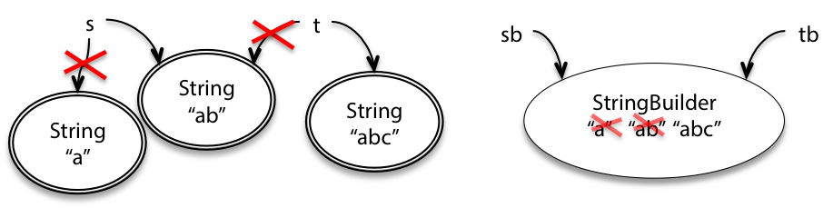
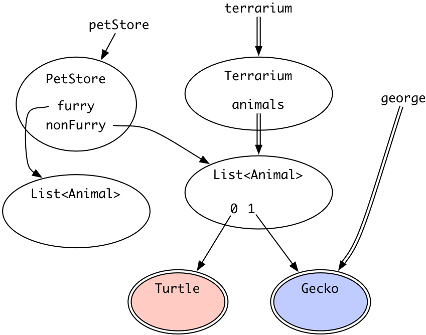
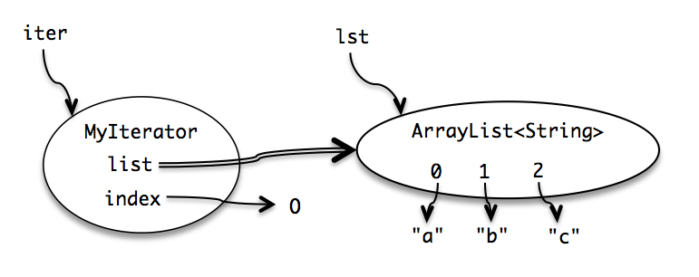

# 阅读 9：可变性与不可变性

#### 6.005 中的软件

| -   无 bug | 易于理解 | 可以应对变化 |
| --- | --- | --- |
| -   改正今天，也适用于未知的未来。 | 与未来的程序员清晰沟通，包括未来的你。 | 设计用于在不重写的情况下容纳变化。 |

#### 目标

+   理解可变性和可变对象

+   确定别名和理解可变性的危险

+   利用不可变性来提高正确性、清晰度和可变性

## 可变性

[**▶ 播放 MITx 视频**](https://courses.csail.mit.edu/6.005/video/reading_9_mutability_immutability,mutability/Knxg2PP7BRU)

从*Basic Java* 中我们讨论快照图表时，可以回想起，某些对象是*不可变*的：一旦创建，它们始终代表相同的值。其他对象是*可变*的：它们具有可以改变对象值的方法。

[`String`](http://docs.oracle.com/javase/8/docs/api/?java/lang/String.html) 是不可变类型的一个例子。`String` 对象始终表示相同的字符串。[`StringBuilder`](http://docs.oracle.com/javase/8/docs/api/?java/lang/StringBuilder.html) 是可变类型的一个例子。它具有删除字符串的部分、插入或替换字符等方法。


由于 `String` 是不可变的，一旦创建，`String` 对象始终具有相同的值。要在字符串末尾添加内容，必须创建一个新的 String 对象：

```
String s = "a";
s = s.concat("b"); // s+="b" and s=s+"b" also mean the same thing
```


相反，`StringBuilder` 对象是可变的。这个类有改变对象值的方法，而不仅仅是返回新值：

```
StringBuilder sb = new StringBuilder("a");
sb.append("b");
```

`StringBuilder` 还有其他方法，用于删除字符串的部分、在中间插入或更改单个字符。

那么呢？在两种情况下，最终你都会得到 `s` 和 `sb` 引用字符串 `"ab"`。当只有一个引用指向对象时，可变性和不可变性之间的差异并不重要。但是当对象存在*其他*引用时，它们的行为就有很大的区别。例如，当另一个变量 `t` 指向与 `s` 相同的 String 对象，另一个变量 `tb` 指向与 `sb` 相同的 StringBuilder 对象时，不可变对象和可变对象之间的差异变得更加明显：



```
String t = s;
t = t + "c";

StringBuilder tb = sb;
tb.append("c");
```

这表明改变`t`对`s`没有影响，但改变`tb`也会影响`sb` —— 这可能让程序员感到意外。这就是我们将在本次阅读中探讨的问题的实质。

既然我们已经有了不可变的 `String` 类，为什么我们在编程中还需要可变的 `StringBuilder`？它的一个常见用途是将大量的字符串连接在一起。考虑以下代码：

```
String s = "";
for (int i = 0; i < n; ++i) {
    s = s + n;
}
```

使用不可变字符串，这会产生很多临时副本 —— 字符串的第一个数字（`"0"`）实际上在构建最终字符串的过程中被复制了 *n* 次，第二个数字被复制了 *n-1* 次，依此类推。即使我们只是连接了 *n* 个元素，做所有这些复制实际上需要 *O(n²)* 的时间。

`StringBuilder` 被设计为最小化这种复制。它使用一种简单但巧妙的内部数据结构，在你调用 `toString()` 方法请求最终的 `String` 时完全避免了任何复制：

```
StringBuilder sb = new StringBuilder();
for (int i = 0; i < n; ++i) {
  sb.append(String.valueOf(i));
}
String s = sb.toString();
```

获得良好性能是我们使用可变对象的另一个原因。另一个原因是方便共享：程序的两个部分可以通过共享一个共同的可变数据结构更方便地进行通信。

#### 阅读练习

跟我来



（答案缺失）（答案缺失）（答案缺失）（答案缺失）

（解释缺失）

（答案缺失）（答案缺失）（答案缺失）（答案缺失）

（解释缺失）

选择最佳答案。

（答案缺失）（答案缺失）（答案缺失）（答案缺失）（答案缺失）（答案缺失）

（解释缺失）

## 变异风险

[**▶ 播放 MITx 视频**](https://courses.csail.mit.edu/6.005/video/reading_9_mutability_immutability,risks_of_mutation/UWpF9C77e3U)

可变类型似乎比不可变类型更强大。如果你在 Datatype 超市购物，并且必须在一个无聊的不可变 `String` 和一个超级强大的可变 `StringBuilder` 中选择，为什么你会选择不可变的？`StringBuilder` 应该能够做任何 `String` 能做的事情，而且还可以 `set()` 和 `append()` 等等。

答案是**不可变类型更安全，更容易理解，并且更容易应对变化**。可变性使得理解程序在做什么变得更加困难，并且更加难以强制执行合同。以下是两个说明原因的示例。

### 风险示例 #1：传递可变值

让我们从一个简单的方法开始，它对列表中的整数求和：

```
/** @return the sum of the numbers in the list */
public static int sum(List<Integer> list) {
    int sum = 0;
    for (int x : list)
        sum += x;
    return sum;
}
```

假设我们还需要一个求绝对值之和的方法。遵循良好的 DRY 实践（[不要重复自己](http://en.wikipedia.org/wiki/Don't_repeat_yourself)），实施者编写了一个使用 `sum()` 的方法：

```
/** @return the sum of the absolute values of the numbers in the list */
public static int sumAbsolute(List<Integer> list) {
    // let's reuse sum(), because DRY, so first we take absolute values
    for (int i = 0; i < list.size(); ++i)
        list.set(i, Math.abs(list.get(i)));
    return sum(list);
}
```

注意，这个方法通过**直接改变列表**来完成其工作。对于实施者来说，这似乎是合理的，因为重用现有列表更高效。如果列表有数百万个项目，那么你就节省了生成新的百万项目的绝对值列表的时间和内存。因此，实施者对这种设计有两个非常好的理由：DRY 和性能。

但是结果行为对于任何使用它的人都会非常令人惊讶！例如：

```
// meanwhile, somewhere else in the code...
public static void main(String[] args) {
    // ...
    List<Integer> myData = Arrays.asList(-5, -3, -2);
    System.out.println(sumAbsolute(myData));
    System.out.println(sum(myData));
}
```

这段代码会打印什么？是`10`后面跟着`-10`吗？还是其他什么？

#### 阅读练习

风险 #1（答案缺失）（答案缺失）

（解释缺失）

让我们思考一下这里的要点：

+   **免于错误？** 在这个例子中，很容易责怪`sum­Absolute()`的实现者超出了其规范允许的范围。但实际上，**传递可变对象是一个潜在的错误**。它只是在等待一些程序员无意中改变那个列表，通常出于重用或性能的很好意图，但导致一个可能非常难以追踪的错误。

+   **易于理解？** 当阅读`main()`时，你会认为`sum()`和`sum­Absolute()`会对`myData`做出什么样的改变？读者清楚地看到`myData`被它们中的一个*改变*了吗？

### 风险示例 #2：返回可变值

[**▶ 播放 MITx 视频**](https://courses.csail.mit.edu/6.005/video/reading_9_mutability_immutability,risks_of_mutation,risky_example_2_returning_mutable_values/DBshg8se4Jc)

我们刚刚看到一个例子，其中将一个可变对象传递给函数导致了问题。那么返回一个可变对象会发生什么呢？

让我们考虑一下[`Date`](http://docs.oracle.com/javase/8/docs/api/?java/util/Date.html)，其中之一内置的 Java 类。 `Date`碰巧是一个可变类型。假设我们编写一个确定春天第一天的方法：

```
/** @return the first day of spring this year */
public static Date startOfSpring() {
    return askGroundhog();
}
```

在这里，我们使用了计算春天开始时间的著名土拨鼠算法（哈罗德·拉米斯，比尔·默里等人，《土拨鼠之日》，1993 年）。

客户开始使用这个方法，例如计划他们的大型聚会：

```
// somewhere else in the code...
public static void partyPlanning() {
    Date partyDate = startOfSpring();
    // ...
}
```

所有的代码都能够正常运行，人们也都很满意。现在，独立地发生了两件事情。首先，`startOfSpring()`的实现者意识到，地鼠因为被不断询问春天何时开始而开始感到恼火。于是代码被重写，最多只询问一次地鼠，然后将地鼠的答案缓存起来供将来使用：

```
/** @return the first day of spring this year */
public static Date startOfSpring() {
    if (groundhogAnswer == null) groundhogAnswer = askGroundhog();
    return groundhogAnswer;
}
private static Date groundhogAnswer = null;
```

(另外：请注意为缓存答案使用了一个私有静态变量。你会认为这是一个全局变量吗？还是不是？)

其次，`startOfSpring()`的一个客户决定实际的春天第一天太冷了，所以聚会将会推迟一个月：

```
// somewhere else in the code...
public static void partyPlanning() {
    // let's have a party one month after spring starts!
    Date partyDate = startOfSpring();
    partyDate.setMonth(partyDate.getMonth() + 1);
    // ... uh-oh. what just happened?
}
```

(另外：这段代码在增加一个月的方式上也存在潜在的错误。为什么？它隐含地假设了春天开始的时间？)

当这两个决定相互作用时会发生什么？更糟糕的是，想象一下谁会首先发现这个错误——是`startOfSpring()`吗？是`partyPlanning()`吗？还是一些完全无辜的第三方代码，也会调用`startOfSpring()`吗？

#### 阅读练习

风险 #2

我们不知道`Date`是如何存储月份的，所以我们将用`Date`的想象中的`month`字段中的抽象值`...march...`和`...april...`来表示。

(缺少答案)(缺少答案)(缺少答案)(缺少答案)(缺少答案)

(缺少解释)

理解风险示例 #2

`partyPlanning`无意中改变了春天的开始，因为`partyDate`和`groundhogAnswer`碰巧指向同一个可变的`Date`对象。

更糟糕的是，这个错误可能不会立即在`partyPlanning()`或`startOfSpring()`中被发现。相反，它将是一些无辜的代码片段，随后调用`startOfSpring()`，得到错误的日期返回，并继续计算自己的错误答案。

（缺少答案）（缺少答案）（缺少答案）

（缺少解释）

第二个错误

代码在如何增加月份方面还存在另一个潜在的错误。

看一看 Java API 文档中的`Date.setMonth`。

`<select class="form-control"><option>0</option>,<option>1</option>,<option>2</option>,<option>3</option>,<option>4</option>,<option>5</option>,<option>6</option>,<option>7</option>,<option>8</option>,<option>9</option>,<option>10</option>,<option>11</option>,<option>12</option></select>(缺少答案)

（缺少解释）

`NoSuchMonthException`

`Date.setMonth`的文档说`month: 介于 0-11 之间的月份值`。

根据那个陈述和你到目前为止所读到的内容…

（缺少答案）（缺少答案）（缺少答案）（缺少答案）（缺少答案）（缺少答案）（缺少答案）（缺少答案）

（缺少解释）

`SuchTerribleSpecificationsException`

在`Date`文档的其他地方，它说：“给方法传递的参数可以不在指定的范围内；例如，一个日期可以被指定为 1 月 32 日，解释为 2 月 1 日”。

看起来像是前提条件的… 不是！

（缺少答案）（缺少答案）（缺少答案）（缺少答案）（缺少答案）

（缺少解释）

关键点：

+   **免受错误困扰？**再次出现了一个潜在的错误。

+   **准备好变化？**显然，日期对象的变异是一种变化，但这不是我们谈论“准备好变化”时所指的那种变化。相反，问题是程序的代码是否可以在不大量重写或引入错误的情况下轻松更改。在这里，我们有两个显然独立的更改，由不同的程序员完成，它们相互作用产生了一个严重的错误。

在这两个例子中——`List<Integer>`和`Date`——如果列表和日期是不可变类型，问题就完全可以避免。这些错误本来是设计上不可能出现的。

实际上，你不应该使用`Date`！使用`java.time`包中的类之一：[`LocalDateTime`](http://docs.oracle.com/javase/8/docs/api/?java/time/LocalDateTime.html)，[`Instant`](http://docs.oracle.com/javase/8/docs/api/?java/time/Instant.html)等。它们在规范中保证它们是*不可变*的。

这个例子也说明了为什么使用可变对象实际上对性能可能是有害的。避免更改任何规范或方法签名的最简单解决方案是，`startOfSpring()`始终返回土拨鼠的答案的*副本*：

```
 return new Date(groundhogAnswer.getTime());
```

这种模式是**防御性拷贝**，当我们谈论抽象数据类型时，我们会看到更多这种情况。防御性拷贝意味着`partyPlanning()`可以自由地修改返回的日期，而不会影响`startOfSpring()`缓存的日期。但是防御性拷贝会迫使`startOfSpring()`做额外的工作，并使用额外的空间来*为每个客户端*做拷贝 — 即使 99%的客户端从不改变它返回的日期。我们可能会在内存中有很多复制的春天第一天。如果我们使用不可变类型，那么程序的不同部分可以安全地共享内存中的相同值，因此需要更少的拷贝和更少的内存空间。不可变性可能比可变性更有效，因为不可变类型永远不需要进行防御性拷贝。

## 别名是使可变类型风险的原因

[**▶ 播放 MITx 视频**](https://courses.csail.mit.edu/6.005/video/reading_9_mutability_immutability,aliasing_is_what_makes_mutable_types_risky/vjn4owb1HPI)

实际上，如果你在一个方法中完全本地使用可变对象，并且只有一个对对象的引用，那么使用可变对象是完全可以的。刚刚我们看到的两个例子中��现问题的原因是有多个引用，也称为**别名**，指向同一个可变对象。

通过快照图示例来解释这一点，但这里是概述：

+   在`List`的例子中，同一个列表被`list`（在`sum`和`sumAbsolute`中）和`myData`（在`main`中）指向。一个程序员（`sumAbsolute`的）认为修改列表是可以的；另一个程序员（`main`的）希望列表保持不变。由于别名的存在，`main`的程序员失败了。

+   在`Date`的例子中，有两个变量名指向`Date`对象，`groundhogAnswer`和`partyDate`。这些别名位于代码的完全不同部分，由不同的程序员控制，他们可能不知道对方在做什么。

首先在纸上绘制快照图示，但你真正的目标应该是在脑海中开发快照图示，这样你就可以可视化代码中发生的情况。

## 变异方法的规范

在这一点上，应该清楚，当一个方法执行变异时，将该变异包含在方法的规范中是至关重要的，使用我们在上一篇阅读中讨论的结构。

(现在我们已经看到，即使一个特定的方法*不*改变一个对象，该对象的可变性仍然可能是错误的来源。)

这里有一个改变方法的例子：

```
static void sort(List<String> lst)
  *requires*: nothing
  *effects*:  puts lst in sorted order, i.e. lst[i] <= lst[j]
              for all 0 <= i < j < lst.size()
```

一个不改变其参数的方法的例子：

```
static List<String> toLowerCase(List<String> lst)
  *requires*: nothing
  *effects*:  returns a new list t where t[i] = lst[i].toLowerCase()
```

如果*效果*没有明确说明输入可以被改变，那么在 6.005 中，我们假设输入的变异是被隐式禁止的。几乎所有程序员都会假设相同的事情。意外的变异会导致可怕的错误。

## 遍历数组和列表

[**▶ 播放 MITx 视频**](https://courses.csail.mit.edu/6.005/video/reading_9_mutability_immutability,iterating_over_arrays_and_lists/zTjUFSIZFhc)

我们将要看的下一个可变对象是一个**迭代器** —— 一个逐步遍历元素集合并逐个返回元素的对象。在 Java 中，当你使用 `for (... : ...)` 循环 遍历 `List` 或数组时，底层实际上使用了迭代器。这段代码：

```
List<String> lst = ...;
**for (String str : lst) {**
    System.out.println(str);
**}** 
```

被编译器重写为类似于这样的内容：

```
List<String> lst = ...;
**Iterator iter = lst.iterator();**
**while (iter.hasNext()) {**
    **String str = iter.next();**
    System.out.println(str);
**}** 
```

一个迭代器有两个方法：

+   `next()` 返回集合中的下一个元素。

+   `hasNext()` 用于测试迭代器是否已经到达集合的末尾。

请注意，`next()` 方法是一个**变异方法**，不仅返回一个元素，还推进迭代器，以便随后调用 `next()` 将返回不同的元素。

你还可以查看 [Java API 中 `Iterator` 的定义](http://docs.oracle.com/javase/8/docs/api/?java/util/Iterator.html)。

在我们进一步讨论之前：

你应该已经阅读了：**[类和对象](http://docs.oracle.com/javase/tutorial/java/javaOO/index.html)** 在 Java 教程中。

阅读：在 CodeGuru 上的 **[final 关键字](http://www.codeguru.com/java/tij/tij0071.shtml)**。

### `MyIterator`

为了更好地理解迭代器的工作原理，这里有一个简单的 `ArrayList<String>` 迭代器的实现：

```
/**
 * A MyIterator is a mutable object that iterates over
 * the elements of an ArrayList<String>, from first to last.
 * This is just an example to show how an iterator works.
 * In practice, you should use the ArrayList's own iterator
 * object, returned by its iterator() method.
 */
public class MyIterator {

    private final ArrayList<String> list;
    private int index;
    // list[index] is the next element that will be returned
    //   by next()
    // index == list.size() means no more elements to return

    /**
     * Make an iterator.
     * @param list list to iterate over
     */
    public MyIterator(ArrayList<String> list) {
        this.list = list;
        this.index = 0;
    }

    /**
     * Test whether the iterator has more elements to return.
     * @return true if next() will return another element,
     *         false if all elements have been returned
     */
    public boolean hasNext() {
        return index < list.size();
    }

    /**
     * Get the next element of the list.
     * Requires: hasNext() returns true.
     * Modifies: this iterator to advance it to the element 
     *           following the returned element.
     * @return next element of the list
     */
    public String next() {
        final String element = list.get(index);
        ++index;
        return element;
    }
}
```

`MyIterator` 使用了一些与我们迄今为止编写的类不同的 Java 语言特性。确保你已经阅读了链接的 Java 教程部分，以便你理解它们：

[**实例变量**](http://docs.oracle.com/javase/tutorial/java/javaOO/variables.html)，在 Java 中也称为字段。实例变量与方法参数和局部变量不同；实例变量存储在对象实例中，并且在方法调用之后持续存在。`My­Iterator` 的实例变量是什么？

一个[**构造函数**](http://docs.oracle.com/javase/tutorial/java/javaOO/constructors.html)，用于创建一个新的对象实例并初始化其实例变量。`My­Iterator` 的构造函数在哪里？

`My­Iterator` 的方法缺少了 `static` 关键字，这意味着它们是[**实例方法**](http://docs.oracle.com/javase/tutorial/java/javaOO/methods.html)，必须在对象实例上调用，例如 `iter.next()`。

在一个地方使用了[**`this` 关键字**](http://docs.oracle.com/javase/tutorial/java/javaOO/thiskey.html) 来引用**实例对象**，特别是用来引用实例变量（`this.list`）。这是为了消除两个不同命名的变量 `list`（一个是实例变量，一个是构造函数参数）之间的歧义。`My­Iterator` 的大部分代码都引用了没有显式 `this` 的实例变量，但这只是 Java 支持的一种方便的简写 —— 例如，`index` 实际上是 `this.index`。

**`private`** 用于对象的内部状态和内部辅助方法，而 `public` 表示供类的客户端使用的方法和构造函数 ([访问控制](http://docs.oracle.com/javase/tutorial/java/javaOO/accesscontrol.html))。

**`final`** 用于指示对象的哪些内部变量可以重新分配，哪些不能。`index` 允许更改（`next()` 在遍历列表时更新它），但 `list` 不能（迭代器必须始终指向相同的列表 —— 如果要遍历另一个列表，应该创建另一个迭代器对象）。



这是一个显示 `MyIterator` 对象在操作中的典型状态的快照图：

注意，我们用双线从 `list` 画箭头，表示它是 *final* 的。这意味着一旦画出箭头，它就不能改变。但是它所指向的 `ArrayList` 对象是可变的 —— 元素可以在其中改变 —— 并且将 `list` 声明为 final 对此没有影响。

迭代器为什么存在？有许多种类型的集合数据结构（链表、映射、哈希表）具有不同种类的内部表示。迭代器概念允许以单一统一的方式访问它们，因此客户端代码更简单，集合实现可以更改而不必更改遍历它的客户端代码。大多数现代语言（包括 Python、C＃和 Ruby）使用迭代器的概念。这是一个有效的 **设计模式**（对常见设计问题的经过测试的解决方案）。随着我们课程的进行，我们会看到许多其他设计模式。

#### 阅读练习

`MyIterator.next` 签名

这个例子是我们见过的第一个使用 *实例方法* 的例子。实例方法在类的实例上操作，带有一个隐式的 `this` 参数（类似于 Python 中的显式 `self` 参数），并且可以访问 *实例字段*。

让我们检查 `MyIterator` 的 `next` 方法：

```
public class MyIterator {

    private final ArrayList<String> list;
    private int index;

    ...

    /**
     * Get the next element of the list.
     * Requires: hasNext() returns true.
     * Modifies: this iterator to advance it to the element 
     *           following the returned element.
     * @return next element of the list
     */
    public String next() {
        final String element = list.get(index);
        ++index;
        return element;
    }
}
```

将 `next` 视为 *Static Checking: Types* 中定义的 **操作**…

(缺失答案)

(缺失解释)

(缺失答案)

(缺失解释)

`MyIterator.next` 前提条件

`next` 具有前提条件 `requires: hasNext() 返回 true。`

(缺失答案)

(缺失解释)

当前提条件不满足时，实现可以执行任何操作。

(缺失答案)

(缺失解释)

`MyIterator.next` 后置条件

`next` 的后置条件的一部分是：`@return 列表的下一个元素`。

(缺失答案)

(缺失解释)

`next`的后置条件的另一部分是`modifies: this iterator to advance it to the element following the returned element.`。

(缺失答案)(缺失答案)(缺失答案)(缺失答案)

(缺失解释)

## 突变损害迭代器

[**▶ 播放 MITx 视频**](https://courses.csail.mit.edu/6.005/video/reading_9_mutability_immutability,mutation_undermines_an_iterator/84x14NBeDm4)

让我们尝试使用我们的迭代器来做一个简单的任务。假设我们有一个表示 MIT 课程的字符串列表，如 `["6.005", "8.03", "9.00"]`。我们希望有一个名为`dropCourse6`的方法，它将从列表中删除课程 6，留下其他课程。遵循良好的实践，我们首先编写规范：

```
/**
 * Drop all subjects that are from Course 6\. 
 * Modifies subjects list by removing subjects that start with "6."
 * 
 * @param subjects list of MIT subject numbers
 */
public static void dropCourse6(ArrayList<String> subjects)
```

注意，`dropCourse6`在其合同中有一个框架条件（*modifies*条款），警告客户端其列表参数将被改变。

接下来，遵循测试驱动的编程方式，我们设计一个测试策略，将输入空间划分为分区，并选择测试用例来覆盖该分区：

```
// Testing strategy:
//   subjects.size: 0, 1, n
//   contents: no 6.xx, one 6.xx, all 6.xx
//   position: 6.xx at start, 6.xx in middle, 6.xx at end

// Test cases:
//   [] => []
//   ["8.03"] => ["8.03"]
//   ["14.03", "9.00", "21L.005"] => ["14.03", "9.00", "21L.005"]
//   ["2.001", "6.01", "18.03"] => ["2.001", "18.03"]
//   ["6.045", "6.005", "6.813"] => [] 
```

最后，我们来实现它：

```
public static void dropCourse6(ArrayList<String> subjects) {
    MyIterator iter = new MyIterator(subjects);
    while (iter.hasNext()) {
        String subject = iter.next();
        if (subject.startsWith("6.")) {
            subjects.remove(subject);
        }
    }
}
```

现在我们运行我们的测试用例，它们可以工作了！...几乎。最后一个测试用例失败了：

```
// dropCourse6(["6.045", "6.005", "6.813"])
//   expected [], actual ["6.005"] 
```

我们得到了错误的答案：`dropCourse6`在列表中留下了一门课程！为什么？追踪发生了什么。在你分析代码时使用快照图，展示`MyIterator`对象和`ArrayList`对象，并在工作过程中更新它。

#### 阅读练习

绘制一个快照图

绘制一个快照图来说明这个错误。

*(随意使用这个空间和一个魔法笔)*

(缺失答案)

(缺失解释)

请注意，这不仅仅是我们的`MyIterator`中的一个错误。`ArrayList`中的内置迭代器也遇到了同样的问题，`for`循环是它的语法糖。问题只是有不同的症状。如果您使用了这段代码：

```
for (String subject : subjects) {
    if (subject.startsWith("6.")) {
        subjects.remove(subject);
    }
}
```

然后你会得到一个[`Concurrent­Modification­Exception`](http://docs.oracle.com/javase/8/docs/api/?java/util/ConcurrentModificationException.html)。内置迭代器检测到您在其脚下更改列表，并大声疾呼。（你认为它是怎么做到的？）

你怎么解决这个问题？一种方法是使用`Iterator`的`remove()`方法，这样迭代器就会适当地调整其索引：

```
Iterator iter = subjects.iterator();
while (iter.hasNext()) {
    String subject = iter.next();
    if (subject.startsWith("6.")) {
        **iter.remove();**
    }
} 
```

实际上，这也更有效率，因为`iter.remove()`已经知道应该删除的元素在哪里，而`subjects.remove()`需要重新搜索。

但是这并不能解决整个问题。如果当前有其他`Iterator`在相同的列表上活动呢？它们都不会被通知！

#### 阅读练习

选择一个快照图(缺失答案)(缺失答案)(缺失答案)(缺失答案)(缺失答案)

(缺失解释)

## 突变和契约

[**▶ 播放 MITx 视频**](https://courses.csail.mit.edu/6.005/video/reading_9_mutability_immutability,mutation_and_contracts/uiw04Cl6DxM)

### 可变对象可能使简单的合同变得非常复杂

这是可变数据结构的一个基本问题。对同一可变对象的多个引用（也称为对象的**别名**）可能意味着程序中的多个地方——可能相距很远——都依赖于该对象保持一致。

以规范的术语来说，契约不能再仅仅在一个地方强制执行了，例如在类的客户端和类的实现者之间。涉及可变对象的契约现在取决于每个持有对可变对象引用的人的良好行为。

作为这种非本地契约现象的一种症状，考虑一下 Java 集合类，这些类通常在类的客户端和实现者之间具有非常明确的契约。试图找到它在哪里记录了我们刚刚发现的关键要求——在迭代集合时不能修改集合。谁负责？[`Iterator`](http://docs.oracle.com/javase/8/docs/api/?java/util/Iterator.html)？[`List`](http://docs.oracle.com/javase/8/docs/api/?java/util/List.html)？[`Collection`](http://docs.oracle.com/javase/8/docs/api/?java/util/Collection.html)？你能找到吗？

需要推理全局属性像这样使得理解和对可变数据结构的程序的正确性更加困难和自信。我们仍然必须这样做——为了性能和方便——但我们为此付出了巨大的 bug 安全成本。

### 可变对象减少了可变性

可变对象使客户端和实现者之间的契约变得更加复杂，并减少了客户端和实现者的自由变动。换句话说，使用允许更改的*对象*使*代码*更难更改。下面是一个例子来说明这一点。

我们示例的关键将是该方法的规范，该方法查找 MIT 数据库中的用户名并返回用户的 9 位标识符：

```
/**
 * @param username username of person to look up
 * @return the 9-digit MIT identifier for username.
 * @throws NoSuchUserException if nobody with username is in MIT's database
 */
public static char[] getMitId(String username) throws NoSuchUserException {        
    // ... look up username in MIT's database and return the 9-digit ID
}
```

一个合理的规范。现在假设我们有一个客户端使用此方法来打印用户的标识符：

```
char[] id = getMitId("bitdiddle");
System.out.println(id);
```

**现在客户端和实现者分别决定进行更改。** 客户端担心用户的隐私，决定遮蔽 id 的前 5 位：

```
char[] id = getMitId("bitdiddle");
for (int i = 0; i < 5; ++i) {
    id[i] = '*';
}
System.out.println(id);
```

实现者担心数据库的速度和负载，所以引入了一个记住已查找过的用户名的缓存：

```
private static Map<String, char[]> cache = new HashMap<String, char[]>();

public static char[] getMitId(String username) throws NoSuchUserException {        
    // see if it's in the cache already
    if (cache.containsKey(username)) {
        return cache.get(username);
    }

    // ... look up username in MIT's database ...

    // store it in the cache for future lookups
    cache.put(username, id);
    return id;
}
```

这两个变化引入了一个微妙的错误。当客户端查找`"bitdiddle"`并返回一个字符数组时，现在客户端和实现者的缓存都指向*相同的*字符数组。该数组是别名。这意味着客户端的遮蔽代码实际上正在覆盖缓存中的标识符，因此对`getMidId("bitdiddle")`的未来调用将不会返回完整的 9 位数，例如“928432033”，而是遮蔽版本“*****2033”。

**共享可变对象会使合同复杂化**。如果这个合同的失败上升到软件工程法庭，将会引发争议。谁在这里应该负责？客户是否有义务不修改返回的对象？实现者是否有义务不保留返回的对象？

以下是我们可以澄清规范的一种方式：

```
public static char[] getMitId(String username) throws NoSuchUserException 
  *requires*: nothing
  *effects*: returns an array containing the 9-digit MIT identifier of username,
             or throws NoSuchUserException if nobody with username is in MIT’s
             database. **Caller may never modify the returned array.**
```

**这是一个不好的做法**。这种方法的问题在于，这意味着合同必须在整个程序的剩余生命周期内有效。这是一个终身合同！我们编写的其他合同范围更窄；你可以在调用之前仔细考虑前置条件，调用之后仔细考虑后置条件，而不必考虑将来的一切会发生什么。

以下是一个类似问题的规范：

```
public static char[] getMitId(String username) throws NoSuchUserException 
  *requires*: nothing
  *effects*: returns **a new array** containing the 9-digit MIT identifier of username,
             or throws NoSuchUserException if nobody with username is in MIT’s
             database.
```

**这也并不能完全解决问题**。这个规范至少说数组必须是新的。但这能阻止实现者保留对该新数组的别名吗？它能阻止实现者改变该数组或将其来用于将来的其他用途吗？

以下是一个更好的规范：

```
public static **String** getMitId(String username) throws NoSuchUserException 
  *requires*: nothing
  *effects*: returns the 9-digit MIT identifier of username, or throws
             NoSuchUserException if nobody with username is in MIT’s database.
```

不可变的 String 返回值提供了一个*保证*，即客户和实现者不会像使用 char 数组那样相互干扰。它不依赖于程序员仔细阅读规范注释。String 是*不可变的*。不仅如此，这种方法（与之前的方法不同）还赋予了实现者引入缓存的自由——一种性能改进。

## 有用的不可变类型

由于不可变类型避免了许多陷阱，让我们列举一些在 Java API 中常用的不可变类型：

+   原始类型和原始包装类型都是不可变的。如果需要处理大数，[`BigInteger`](http://docs.oracle.com/javase/8/docs/api/?java/math/BigInteger.html) 和 [`BigDecimal`](http://docs.oracle.com/javase/8/docs/api/?java/math/BigDecimal.html) 是不可变的。

+   不要使用可变的 `Date`，而是根据您需要的时间粒度使用 [`java.time`](http://docs.oracle.com/javase/8/docs/api/index.html?java/time/package-summary.html) 中的适当不可变类型。

+   Java 集合类型的通常实现——`List`、`Set`、`Map`——都是可变的：`ArrayList`、`HashMap` 等。[`Collections`](http://docs.oracle.com/javase/8/docs/api/?java/util/Collections.html) 实用类有用于获取这些可变集合的*不可修改视图*的方法：

    +   [`Collections.unmodifiableList`](https://docs.oracle.com/javase/8/docs/api/java/util/Collections.html#unmodifiableList-java.util.List-)

    +   [`Collections.unmodifiableSet`](https://docs.oracle.com/javase/8/docs/api/java/util/Collections.html#unmodifiableSet-java.util.Set-)

    +   [`Collections.unmodifiableMap`](https://docs.oracle.com/javase/8/docs/api/java/util/Collections.html#unmodifiableMap-java.util.Map-)

    您可以将不可修改的视图视为封装在底层列表/集合/映射周围的包装器。拥有对该包装器的引用并尝试执行突变操作 —— `add`、`remove`、`put`等 —— 将触发一个[`Unsupported­Operation­Exception`](http://docs.oracle.com/javase/8/docs/api/?java/lang/UnsupportedOperationException.html)。

    在将可变集合传递给程序的另一部分之前，我们可以将其包装在不可修改的包装器中。在那一点上，我们应该小心地忘记对可变集合的引用，以免意外突变它。（一个方法是让它超出作用域。）就像一个`final`引用后面的可变对象一样可以被突变一样，不可修改包装器中的可变集合仍然可以被拥有对其的引用的人修改，从而破坏包装器。

+   `Collections`还提供了获取不可变空集合的方法：[`Collections.emptyList`](https://docs.oracle.com/javase/8/docs/api/java/util/Collections.html#emptyList--)，等等。最糟糕的是发现您*绝对是空的*列表突然变得*绝对不是空的*！

#### 阅读练习

不可变性(missing answer)(missing answer)(missing answer)(missing answer)(missing answer)

(missing explanation)

## 总结

在本阅读中，我们看到可变性对性能和方便是有用的，但它也通过要求使用对象的代码在全局层面上表现良好而产生了 bug 的风险，这极大地复杂化了我们需要进行的推理和测试，以确保其正确性。

确保你理解不可变*对象*（如`String`）和不可变*引用*（如`final`变量）之间的区别。快照图可以帮助理解这一点。对象是值，用快照图中的圆圈表示，不可变对象具有双重边框，表示它永远不会改变其值。引用是指向对象的指针，用快照图中的箭头表示，不可变引用是一条带有双线的箭头，表示该箭头不能移动指向不同的对象。

这里的关键设计原则是**不可变性**：尽可能使用不可变对象和不可变引用。让我们回顾一下不可变性如何帮助达到本课程的主要目标：

+   **免于 bug**。不可变对象不容易受到别名的影响而产生 bug。不可变引用始终指向相同的对象。

+   **易于理解**。因为不可变对象或引用始终意味着相同的事物，所以对于代码的读者来说更容易推理 —— 他们不必追踪所有代码以找到对象或引用可能被更改的所有位置，因为它无法更改。

+   **为变化做好准备**。如果一个对象或引用在运行时不能被更改，那么依赖于该对象或引用的代码在程序更改时就不必进行修订。
