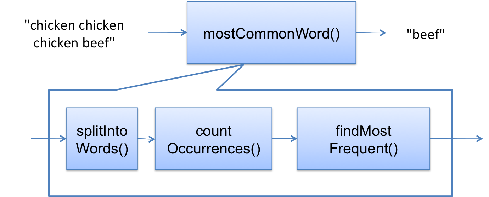

# 阅读 10：调试

#### 软件在 6.005

| 免受 bug 的影响 | 易于理解 | 为变化做好准备 |
| --- | --- | --- |
| 今天正确，未来也正确。 | 与未来的程序员清晰沟通，包括未来的你。 | 设计以适应变化而无需重写。 |

#### 目标

今天课堂的主题是系统化调试。

有时你别无选择，只能进行调试 - 特别是当 bug 只在将整个系统连接在一起时才发现，或者在系统部署后由用户报告时，这种情况下很难将其定位到特定模块。对于这些情况，我们可以建议一种更有效的调试系统策略。

## 重现 Bug

[**▶ 播放 MITx 视频**](https://courses.csail.mit.edu/6.005/video/reading_10_debugging,reproduce_the_bug/yQIl6IjMUt0)

首先找到一个小的、可重复的测试用例，产生故障。如果 bug 是通过回归测试发现的，那么你很幸运；你的测试套件中已经有一个失败的测试用例。如果 bug 是由用户报告的，可能需要一些努力来重现 bug。对于图形用户界面和多线程程序，如果 bug 取决于事件的时间或线程执行，可能很难一致地重现 bug。

然而，无论你付出多少努力使测试用例变小且可重复，都会得到回报，因为在搜索 bug 并开发修复方案时，你将不得不一遍又一遍地运行它。此外，在成功修复 bug 后，你会希望将测试用例添加到回归测试套件中，以便 bug 不再出现。一旦你有了 bug 的测试用例，使这个测试用例工作成为你的目标。

这里有一个例子。假设你写了这个函数：

```
/**
 * Find the most common word in a string.
 * @param text string containing zero or more words, where a word
 *     is a string of alphanumeric characters bounded by nonalphanumerics.
 * @return a word that occurs maximally often in text, ignoring alphabetic case.
 */
public static String mostCommonWord(String text) {
    ...
}
```

一个用户将整个莎士比亚剧本的文本传递给你的方法，类似于 `mostCommonWord(allShakespearesPlaysConcatenated)`，发现该方法返回的不是可预测的常见英文单词，如 `"the"` 或 `"a"`，而是一些意外的东西，也许是 `"e"`。

莎士比亚的剧本有 10 万行，包含超过 80 万字，因此通过常规方法进行调试，如打印调试和断点调试，将会非常痛苦。如果你首先努力减少有 bug 的输入的大小，使其变得可管理，同时仍然展示相同（或非常相似）的 bug，调试将会更容易：

+   第一半莎士比亚的作品是否显示相同的 bug？（二分查找！这总是一个很好的技巧。更多关于这个下面。）

+   一个剧本是否有相同的 bug？

+   一个演讲是否有相同的 bug？

一旦找到一个小的测试用例，使用该较小的测试用例找到并修复 bug，然后回到原始有 bug 的输入，并确认你修复了相同的 bug。

#### 阅读练习

将 bug 缩小到一个测试用例

假设一个用户报告说 `mostCommonWord("chicken chicken chicken beef")` 返回 `"beef"` 而不是 `"chicken"`。

（缺少答案）

（缺少解释）

（缺少答案）

（缺少解释）

（缺少答案）

（缺少解释）

（缺少答案）

（缺少解释）

（缺少答案）

（缺少解释）

给出所有有意义的答案，而不仅仅是最简单的一个（因为最简单的有时候不再表现出错误！）

回归测试

假设你将`"chicken chicken chicken beef"`输入缩减为`"c c b"`，这也存在问题。你找到一个错误，修复它，并观察到现在`"c c b"`和`"chicken chicken chicken beef"`都返回了正确的答案。

（缺少答案）（缺少答案）（缺少答案）（缺少答案）

（缺少解释）

## 理解错误的位置和原因

[**▶ 播放 MITx 视频**](https://courses.csail.mit.edu/6.005/video/reading_10_debugging,understand_the_location_and_cause_of_the_bug/guQ0TiPSo-c)

要定位错误及其原因，可以使用科学方法：

1.  **研究数据。** 查看导致错误的测试输入，以及由此产生的不正确结果、失败的断言和堆栈跟踪。

1.  **假设。** 提出一个假设，与所有数据一致，关于错误可能在哪里，或者它*不可能*在哪里。最好一开始将这个假设概括。

1.  **实验。** 设计一个测试你假设的实验。最好一开始将实验作为*观察* - 一种收集信息但尽可能少干扰系统的探针。

1.  **重复。** 将你从实验中收集到的数据添加到之前所知的内容中，并提出一个新的假设。希望你已经排除了一些可能性，并缩小了可能的错误位置和原因集。

让我们在`mostCommonWord()`示例的背景下看看这些步骤，再加上三个辅助方法进行详细说明：

```
/**
 * Find the most common word in a string.
 * @param text string containing zero or more words, 
 *     where a word is a string of alphanumeric 
 *     characters bounded by nonalphanumerics.
 * @return a word that occurs maximally often in text, 
 *         ignoring alphabetic case.
 */
public static String mostCommonWord(String text) {
    ... words = splitIntoWords(text); ...
    ... frequencies = countOccurrences(words); ...
    ... winner = findMostCommon(frequencies); ...
    ... return winner;
}

/** Split a string into words ... */
private static List<String> splitIntoWords(String text) {
    ...
}

/** Count how many times each word appears ... */
private static Map<String,Integer> countOccurrences(List<String> words) {
    ...
}

/** Find the word with the highest frequency count ... */
private static String findMostCommon(Map<String,Integer> frequencies) {
    ...
}
```

### 1\. 研究数据

一种重要的数据形式是异常的堆栈跟踪。练习阅读你得到的堆栈跟踪，因为它们将为你提供关于错误可能在哪里以及是什么的大量信息。

隔离一个小测试案例的过程也可能给你之前没有的数据。你甚至可能有两个相关的测试案例，*夹击*了错误，即一个成功一个失败。例如，也许`mostCommonWords("c c, b")`有问题，但`mostCommonWords("c c b")`没问题。

### 2\. 假设



将程序视为模块或算法中的步骤有助于思考，并尝试一次性排除程序的整个部分。

`mostCommonWord()`中的数据流如右图所示。如果错误的症状是在`countOccurrences()`中出现异常，那么你可以排除所有下游内容，特别是`findMostFrequent()`。

然后你会选择一个试图进一步定位 bug 的假设。你可能会假设 bug 在`splitIntoWords()`中，损坏了其结果，然后导致`countOccurrences()`中的异常。然后你会使用一个实验来测试这个假设。如果假设成立，那么你就排除了`countOccurrences()`作为问题的来源。如果它是错误的，那么你就排除了`splitIntoWords()`。

### 3\. 实验

一个好的实验是对系统进行轻微观察而不会过多干扰它。可能是：

+   运行一个**不同的测试用例**。上面讨论的测试用例缩减过程使用测试用例作为实验。

+   在运行的程序中插入一个**打印语句**或**断言**，以检查其内部状态的某些内容。

+   使用调试器设置一个**断点**，然后逐步执行代码并查看变量和对象的值。

试图插入*修复*以猜测的 bug，而不是仅仅是探针，这很诱人，但几乎总是错误的。首先，这会导致一种临时猜测和测试编程，产生糟糕、复杂、难以理解的代码。其次，你的修复可能只是掩盖了真正的 bug，而没有真正解决它。

例如，如果你得到一个`ArrayOutOfBoundsException`，先尝试了解发生了什么。不要只是添加避免或捕获异常的代码，而不解决真正的问题。

### 其他提示

**二分法进行 bug 定位**。调试是一个搜索过程，有时你可以使用二分法来加速这个过程。例如，在`mostCommonWords`中，数据通过三个辅助方法流动。要进行二分搜索，你会把这个工作流程分成两半，也许猜测 bug 在第一个辅助方法调用和第二个之间，然后在那里插入探针（比如断点、打印语句或断言）来检查结果。从那个实验的答案中，你会进一步分成两半。

**优先考虑你的假设**。在提出假设时，你可能想记住系统的不同部分有不同的故障可能性。例如，经过老旧测试的代码可能比最近添加的代码更可靠。Java 库代码可能比你的更可靠。Java 编译器和运行时、操作系统平台和硬件越来越可靠，因为它们经过了更多的尝试和测试。在找到充分理由之前，你应该信任这些较低的级别。

**交换组件**。如果你有另一个满足相同接口的模块实现，并且你怀疑这个模块，那么你可以尝试一下替换另一个实现。例如，如果你怀疑你的 binarySearch()实现，那么尝试用一个更简单的 linearSearch()代替。如果你怀疑 java.util.ArrayList，你可以用 java.util.LinkedList 代替。如果你怀疑 Java 运行时，尝试用不同版本的 Java。如果你怀疑操作系统，尝试在不同的操作系统上运行程序。如果你怀疑硬件，尝试在不同的机器上运行。然而，除非你有充分的理由怀疑一个组件，否则不要浪费时间替换无故失败的组件。

**确保你的源代码和目标代码是最新的。**从存储库中拉取最新版本，并删除所有的二进制文件然后重新编译所有东西（在 Eclipse 中，通过 Project → Clean 完成）。

**寻求帮助**。向别人解释你的问题通常会有所帮助，即使你对方不知道你在说什么。实验室助理和其他 6.005 学生通常知道你在说什么，所以他们更好。

**先睡一觉。**如果你太累了，你就不会成为一个有效的调试者。把延迟换成效率。

## 修复 Bug

一旦你找到了错误并理解了它的原因，第三步就是为其设计一个修复方案。避免急于贴上补丁然后继续。问问自己，这个 bug 是编码错误，比如拼写错误的变量或者交换的方法参数，还是设计错误，比如未详细说明或不足的接口。设计错误可能意味着你需要退后一步重新审视你的设计，或者至少考虑一下失败接口的其他所有客户端是否也受到了这个 bug 的影响。

还要考虑一下这个 bug 是否有任何类似的。如果我刚刚在这里发现了一个除以零的错误，我还在代码中其他地方这样做了吗？尝试使代码免受未来类似 bug 的影响。还要考虑你的修复会产生什么影响。它会破坏任何其他代码吗？

最后，在应用了修复方案之后，将 bug 的测试用例添加到回归测试套件中，并运行所有测试以确保（a）bug 已修复，（b）未引入新的 bug。

#### 阅读练习

调试策略

假设你正在调试`quadraticRoots`函数，它似乎有时会产生错误的答案。

```
/**
 * Solves quadratic equation ax² + bx + c = 0.
 * 
 * @param a quadratic coefficient, requires a != 0
 * @param b linear coefficient
 * @param c constant term
 * @return a list of the real roots of the equation
 */
public static List<Double> quadraticRoots(int a, int b, int c) { ... }
```

将以下项目按照你应该尝试它们的顺序放入: 1, 2, 3, ... 对于无意义的陈述，说“wat”。

<select class="form-control"><option>1</option>，<option>2</option>，<option>3</option>，<option>4</option>，<option>5</option>，<option>wat</option></select>（缺少答案）<select class="form-control"><option>1</option>，<option>2</option>，<option>3</option>，<option>4</option>，<option>5</option>，<option>wat</option></select>（缺少答案）<select class="form-control"><option>1</option>，<option>2</option>，<option>3</option>，<option>4</option>，<option>5</option>，<option>wat</option></select>（缺少答案）<select class="form-control"><option>1</option>，<option>2</option>，<option>3</option>，<option>4</option>，<option>5</option>，<option>wat</option></select>（缺少答案）<select class="form-control"><option>1</option>，<option>2</option>，<option>3</option>，<option>4</option>，<option>5</option>，<option>wat</option></select>（缺少答案）

（缺少解释）

### 总结

在这篇阅读中，我们看了如何系统地调试：

+   将 bug 重现为测试用例，并将其放入回归测试套件中

+   使用科学方法找到 bug

+   深思熟虑地修复 bug，而不是匆忙行事

思考我们的三个主要代码质量指标：

+   **免受 bug 之害。** 我们正试图阻止它们并摆脱它们。

+   **易于理解。** 静态类型、最终声明和断言等技术是你的代码中假设的额外文档。变量范围的最小化使读者更容易理解变量的使用方式，因为需要查看的代码更少。

+   **为变化做好准备。** 断言和静态类型将假设以一种可自动检查的方式记录下来，因此当未来的程序员更改代码时，可以检测到对这些假设的意外违反。
