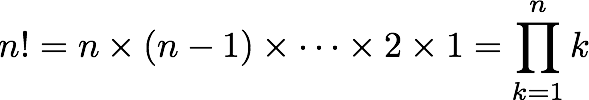
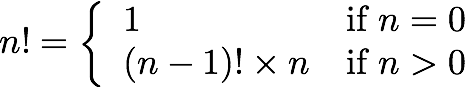

# 阅读 14：递归

#### 在 6.005 中的软件

| 免受错误影响 | 易于理解 | 准备好改变 |
| --- | --- | --- |
| 今天和未来未知时期的正确性。 | 与未来的程序员清晰沟通，包括未来的你。 | 设计以适应更改而不需要重写。 |

#### 目标

今天的课结束后，你应该：

+   能够将递归问题分解为递归步骤和基本情况

+   知道何时以及如何在递归中使用辅助方法

+   理解递归与迭代的优缺点

## 递归

在今天的课上，我们将讨论如何在已有规范的情况下实现方法。我们将重点放在一种特定的技术上，即*递归*。递归并不适用于每个问题，但它是你软件开发工具箱中的重要工具，很多人会对此感到困惑。我们希望你对递归感到舒适并且能够胜任，因为你将会反复遇到它。（这是个笑话，但也是真的。）

既然你已经学过 6.01，递归对你来说并不完全陌生，你之前已经见过并编写过递归函数，比如阶乘和斐波那契数列。今天的课程将比你之前接触的递归更深入地探讨。对递归实现的熟悉将是接下来课程的必要条件。

递归函数是根据*基本情况*和*递归步骤*定义的。

+   在基本情况下，我们立即计算给定函数调用的结果。

+   在递归步骤中，我们通过一次或多次对这个相同函数的*递归调用*来计算结果，但输入的大小或复杂性会减小，接近基本情况。

考虑编写一个计算阶乘的函数。我们可以用两种不同的方式定义阶乘：

| 乘积 | 递推关系 |
| --- | --- |

|   (其中空积等于

乘法恒等式 *1*) |  |

这导致两种不同的实现：

| 迭代 | 递归 |
| --- | --- |

|

```
public static long factorial(int n) {
  long fact = 1;
  for (int i = 1; i <= n; i++) {
    fact = fact * i;
  }
  return fact;
}
```

|

```
public static long factorial(int n) {
  if (n == 0) {
    return 1;
  } else {
    return n * factorial(n-1);
  }
}
```

|

在右侧的递归实现中，基本情况是 *n = 0*，其中我们立即计算并返回结果：*0!* 被定义为 *1*。递归步骤是 *n > 0*，其中我们通过递归调用来获得 *(n-1)!* 的结果，然后通过乘以 *n* 完成计算。

要可视化递归函数的执行，将当前执行函数的 *调用堆栈* 作为计算进行时的图表是有帮助的。

让我们在一个主方法中运行 `factorial` 的递归实现：

```
public static void main(String[] args) {
    long x = factorial(3);
}
```

在每一步中，时间从左到右移动：

| 在 `main` 中开始 | 调用 `factorial(3)` | 调用 `factorial(2)` | 调用 `factorial(1)` | 调用 `factorial(0)` | 返回到 `factorial(1)` | 返回到 `factorial(2)` | 返回到 `factorial(3)` | 返回到 `main` |
| --- | --- | --- | --- | --- | --- | --- | --- | --- |

| main | factorialn = 3  mainx | factorialn = 2  factorialn = 3

mainx | factorialn = 1  factorialn = 2

factorialn = 3

mainx | factorialn = 0 返回 1factorialn = 1

factorialn = 2

factorialn = 3

mainx | factorialn = 1 返回 1factorialn = 2

factorialn = 3

mainx | factorialn = 2 返回 2factorialn = 3

mainx | factorialn = 3 返回 6mainx | mainx = 6 |

在图表中，我们可以看到堆栈如何增长，当`main`调用`factorial`，`factorial`然后调用*自身*，直到`factorial(0)`不再进行递归调用。然后调用堆栈展开，每次调用`factorial`将其答案返回给调用者，直到`factorial(3)`返回给`main`。

这是一个[**交互式可视化的`factorial`**](http://www.pythontutor.com/visualize.html#code=public+class+Factorial+%7B%0A++++public+static+void+main(String%5B%5D+args)+%7B%0A++++++++long+x+%3D+factorial(3)%3B%0A++++%7D%0A++++public+static+long+factorial(int+n)+%7B%0A++++++++if+(n+%3D%3D+0)+%7B%0A++++++++++++return+1%3B%0A++++++++%7D+else+%7B%0A++++++++++++return+n+*+factorial(n-1)%3B%0A++++++++%7D%0A++++%7D%0A%7D&mode=display&origin=opt-frontend.js&cumulative=false&heapPrimitives=false&textReferences=false&py=java&rawInputLstJSON=%5B%5D&curInstr=0)。你可以逐步执行计算，观察递归的过程。在这个可视化中，新的堆栈帧向下增长而不是向上增长。

你可能以前见过阶乘，因为它是递归函数的常见示例。另一个常见示例是斐波那契数列：

```
/**
 * @param n >= 0
 * @return the nth Fibonacci number 
 */
public static int fibonacci(int n) {
    if (n == 0 || n == 1) {
        return 1; // base cases
    } else {
        return fibonacci(n-1) + fibonacci(n-2); // recursive step
    }
}
```

斐波那契很有趣，因为它有多个基本情况：n=0 和 n=1。你可以看看一个[**交互式斐波那契可视化**](http://www.pythontutor.com/visualize.html#code=public+class+Fibonacci+%7B%0A++++public+static+void+main(String%5B%5D+args)+%7B%0A++++++++int+x+%3D+fibonacci(3)%3B%0A++++%7D%0A++++public+static+int+fibonacci(int+n)+%7B%0A++++++++if+(n+%3D%3D+0+%7C%7C+n+%3D%3D+1)+%7B%0A++++++++++++return+1%3B%0A++++++++%7D+else+%7B%0A++++++++++++return+fibonacci(n-1)+%2B+fibonacci(n-2)%3B%0A++++++++%7D%0A++++%7D%0A%7D&mode=display&origin=opt-frontend.js&cumulative=false&heapPrimitives=false&textReferences=false&py=java&rawInputLstJSON=%5B%5D&curInstr=0)。注意，阶乘的堆栈逐渐增长到最大深度，然后缩小到答案，而斐波那契的堆栈在计算过程中重复增长和缩小。

#### 阅读练习

递归阶乘

考虑这个递归实现的阶乘函数。

```
public static int factorial(int n) {
    if (n == 0) {
        return 1; // this is called the base case
    } else {
        return n * factorial(n-1); // this is the recursive step
    }
}
```

对于`factorial(3)`，基本情况`return 1`将执行多少次？

（缺失答案）（缺失答案）（缺失答案）（缺失答案）（缺失答案）

（缺失解释）

递归斐波那契

考虑这个递归实现的斐波那契序列。

```
public static int fibonacci(int n) {
    if (n == 0 || n == 1) {
        return 1; // base cases
    } else {
        return fibonacci(n-1) + fibonacci(n-2); // recursive step
    }
}
```

对于`fibonacci(3)`，基本情况`return 1`将执行多少次？

（缺失答案）（缺失答案）（缺失答案）（缺失答案）（缺失答案）

（缺失解释）

## 选择正确的问题分解方式

找到正确的方法来分解问题，例如方法的实现，是很重要的。良好的分解方法简单、简短、易于理解、安全免受错误影响，并且可以轻松应对变化。

递归对于某些问题来说是一种优雅而简单的分解方法。假设我们想要实现这个规范：

```
/**
 * @param word consisting only of letters A-Z or a-z
 * @return all subsequences of word, separated by commas,
 * where a subsequence is a string of letters found in word 
 * in the same order that they appear in word.
 */
public static String subsequences(String word)
```

例如，`subsequences("abc")`可能返回`"abc,ab,bc,ac,a,b,c,"`。注意空子序列之前的尾随逗号，这也是一个有效的子序列。

这个问题很适合进行优雅的递归分解。取词的第一个字母。我们可以形成一个包含该字母的子序列集合，以及一个不包含该字母的子序列集合，这两个集合完全覆盖了可能的子序列集合。

```
 1 public static String subsequences(String word) {
 2     if (word.isEmpty()) {
 3         return ""; // base case
 4     } else {
 5         char firstLetter = word.charAt(0);
 6         String restOfWord = word.substring(1);
 7         
 8         String subsequencesOfRest = subsequences(restOfWord);
 9         
10         String result = "";
11         for (String subsequence : subsequencesOfRest.split(",", -1)) {
12             result += "," + subsequence;
13             result += "," + firstLetter + subsequence;
14         }
15         result = result.substring(1); // remove extra leading comma
16         return result;
17     }
18 }
```

#### 阅读练习

subsequences("c")(缺失答案)(缺失答案)(缺失答案)(缺失答案)

(缺失解释)

subsequences("gc")(缺失答案)(缺失答案)(缺失答案)(缺失答案)

(缺失解释)

## 递归实现的结构

递归实现总是有两个部分：

+   **基本情形**，即问题的最简单、最小的实例，不能进一步分解。基本情形通常对应于空集 – 空字符串、空列表、空集合、空树、零等。

+   **递归步骤**，它将问题的较大实例分解为一个或多个更简单或较小的实例，可以通过递归调用解决，然后将这些子问题的结果重新组合以产生原始问题的解决方案。

递归步骤将问题实例转换为更小的东西非常重要，否则递归可能永远不会结束。如果每个递归步骤都将问题缩小，并且基本情形位于底部，则递归保证是有限的。

递归实现可能有多个基本情形，或多个递归步骤。例如，斐波那契函数有两个基本情形，n=0 和 n=1。

#### 阅读练习

递归结构

递归方法有一个基本情形和一个递归步骤。计算机科学中还有哪些概念具有（等价的）基本情形和递归步骤？

(缺失答案)(缺失答案)(缺失答案)(缺失答案)

(缺失解释)

## 辅助方法

我们刚刚看到的`subsequences()`的递归实现是问题的一种可能的递归分解。我们拿到了一个子问题的解决方案 – 去掉第一个字符后字符串的子序列 – 并用它来构造原始问题的解决方案，方法是取每个子序列并添加第一个字符或省略它。从某种意义上说，这是一种*直接*的递归实现，我们在其中使用现有的递归方法规范来解决子问题。

在某些情况下，要求递归步骤的规范更强（或不同），以使递归分解更简单或更优雅。在这种情况下，如果我们用单词的初始字母构建部分子序列，然后使用递归调用*完成*该部分子序列的剩余字母会怎么样？例如，假设原始单词是“orange”。我们将选择“o”作为部分子序列，并用“range”的所有子序列递归扩展它；我们将跳过“o”，将“”作为部分子序列，并再次用“range”的所有子序列递归扩展它。

使用这种方法，我们的代码现在看起来简单得多：

```
/**
 * Return all subsequences of word (as defined above) separated by commas,
 * with partialSubsequence prepended to each one.
 */
private static String subsequencesAfter(String partialSubsequence, String word) {
    if (word.isEmpty()) {
        // base case
        return partialSubsequence;
    } else {
        // recursive step
        return subsequencesAfter(partialSubsequence, word.substring(1))
             + ","
             + subsequencesAfter(partialSubsequence + word.charAt(0), word.substring(1));
    }
}
```

这个`subsequencesAfter`方法被称为**辅助方法**。它满足与原始的`subsequences`不同的规范，因为它有一个新的参数`partialSubsequence`。这个参数填充了在迭代实现中本地变量的类似角色。它在计算演变过程中保持临时状态。递归调用逐步扩展这个部分子序列，选择或忽略单词中的每个字母，直到最终达到单词的末尾（基本情况），此时部分子序列作为唯一的结果返回。然后递归回溯并填充其他可能的子序列。

要完成实现，我们需要实现原始的`subsequences`规范，通过用一个部分子序列参数的初始值调用辅助方法来启动该过程：

```
public static String subsequences(String word) {
    return subsequencesAfter("", word);
}
```

**不要向客户暴露辅助方法。** 你选择这种递归分解方式而不是其他方式完全是特定于实现的。特别是，如果你发现在递归中需要像`partialSubsequence`这样的临时变量，不要更改方法的原始规范，并且不要强迫客户正确初始化这些参数。这会向客户暴露你的实现，并降低你将来更改它的能力。对于递归，使用一个私有的辅助函数，并让你的公共方法以正确的初始化调用它，如上所示。

#### 阅读练习

无用 1

路易斯·理性人不想使用辅助方法，因此他尝试通过将`partialSubsequence`存储为静态变量而不是参数来实现`subsequences()`。这是他的实现：

```
private static String partialSubsequence = "";
public static String subsequencesLouis(String word) {
    if (word.isEmpty()) {
        // base case
        return partialSubsequence;
    } else {
        // recursive step
        String withoutFirstLetter = subsequencesLouis(word.substring(1));
        partialSubsequence += word.charAt(0);
        String withFirstLetter = subsequencesLouis(word.substring(1));
        return withoutFirstLetter + "," + withFirstLetter;
    }
}
```

假设我们调用`subsequencesLouis("c")`，然后是`subsequencesLouis("a")`。

（缺少答案）（缺少答案）（缺少答案）（缺少答案）（缺少答案）（缺少答案）（缺少答案）（缺少答案）（缺少答案）

（缺少解释）

无用 2

路易斯通过将 partialSubsequence 公开来解决了这个问题：

```
/**
 * Requires: caller must set partialSubsequence to "" before calling subsequencesLouis().
 */
public static String partialSubsequence;
```

当 Alyssa P. Hacker 看到路易斯做的事情时，她举起了手。关于他的代码，以下哪些陈述是正确的？

（缺少答案）（缺少答案）（缺少答案）

（缺少解释）

无用 3

Louis 屈服于 Alyssa 的激烈争论，再次隐藏他的静态变量，并在开始递归之前正确初始化它：

```
public static String subsequences(String word) {
    partialSubsequence = "";
    return subsequencesLouis(word);
}

private static String partialSubsequence = "";

public static String subsequencesLouis(String word) {
    if (word.isEmpty()) {
        // base case
        return partialSubsequence;
    } else {
        // recursive step
        String withoutFirstLetter = subsequencesLouis(word.substring(1));
        partialSubsequence += word.charAt(0);
        String withFirstLetter = subsequencesLouis(word.substring(1));
        return withoutFirstLetter + "," + withFirstLetter;
    }
}
```

不幸的是，在递归中使用静态变量是一个坏主意。Louis 的解决方案仍然存在问题。为了说明问题，让我们跟踪调用`subsequences("xy")`。您可以通过[**此版本的交互式可视化**](http://www.pythontutor.com/java.html#code=public+class+Subsequences+%7B%0A++++%0A++++public+static+String+subsequences%28String+word%29+%7B%0A++++++++partialSubsequence+%3D+%22%22%3B%0A++++++++return+subsequencesLouis%28word%29%3B%0A++++%7D%0A++++%0A++++private+static+String+partialSubsequence+%3D+%22%22%3B%0A++++%0A++++public+static+String+subsequencesLouis%28String+word%29+%7B%0A++++++++if+%28word.isEmpty%28%29%29+%7B%0A++++++++++++//+base+case%0A++++++++++++return+partialSubsequence%3B%0A++++++++%7D+else+%7B%0A++++++++++++//+recursive+step%0A++++++++++++String+withoutFirstLetter+%3D+subsequencesLouis%28word.substring%281%29%29%3B%0A++++++++++++partialSubsequence+%2B%3D+word.charAt%280%29%3B%0A++++++++++++String+withFirstLetter+%3D+subsequencesLouis%28word.substring%281%29%29%3B%0A++++++++++++return+withoutFirstLetter+%2B+%22,%22+%2B+withFirstLetter%3B%0A++++++++%7D%0A++++%7D%0A++++%0A++++public+static+void+main%28String%5B%5D+args%29+%7B%0A++++++++String+result+%3D+subsequences%28%22xy%22%29%3B%0A++++%7D%0A%7D&mode=display&origin=opt-frontend.js&cumulative=false&heapPrimitives=false&textReferences=false&py=java&rawInputLstJSON=%5B%5D&curInstr=4)来查看发生了什么。它将产生这些对`subsequencesLouis()`的递归调用：

```
1. subsequencesLouis("xy")
2.     subsequencesLouis("y")
3.         subsequencesLouis("")
4.         subsequencesLouis("")
5.     subsequencesLouis("y")
6.         subsequencesLouis("")
7.         subsequencesLouis("")
```

当这些调用**开始**时，静态变量 partialSubsequence 的值是多少？

1.  `subsequencesLouis("xy")`

    <select class="form-control"><option>空字符串</option>,<option>x</option>,<option>y</option>,<option>xy</option>,<option>yx</option></select>(缺失答案)

1.  `subsequencesLouis("y")`

    <select class="form-control"><option>空字符串</option>,<option>x</option>,<option>y</option>,<option>xy</option>,<option>yx</option></select>(缺失答案)

1.  `subsequencesLouis("")`

    <select class="form-control"><option>空字符串</option>,<option>x</option>,<option>y</option>,<option>xy</option>,<option>yx</option></select>(缺失答案)

1.  `subsequencesLouis("")`

    <select class="form-control"><option>空字符串</option>,<option>x</option>,<option>y</option>,<option>xy</option>,<option>yx</option></select>(缺失答案)

1.  `subsequencesLouis("y")`

    <select class="form-control"><option>空字符串</option>,<option>x</option>,<option>y</option>,<option>xy</option>,<option>yx</option></select>(缺失答案)

1.  `subsequencesLouis("")`

    <select class="form-control"><option>空字符串</option>,<option>x</option>,<option>y</option>,<option>xy</option>,<option>yx</option></select>(缺失答案)

1.  `subsequencesLouis("")`

    <select class="form-control"><option>空字符串</option>,<option>x</option>,<option>y</option>,<option>xy</option>,<option>xyy</option>,<option>yx</option>,<option>yxy</option></select>（缺少答案）

（缺少解释）

## 选择正确的递归子问题

让我们看另一个例子。假设我们想要将整数转换为给定基数的字符串表示，遵循这个规范：

```
/**
 * @param n integer to convert to string
 * @param base base for the representation. Requires 2<=base<=10.
 * @return n represented as a string of digits in the specified base, with 
 *           a minus sign if n<0.
 */
public static String stringValue(int n, int base)
```

例如，`stringValue(16, 10)` 应该返回 `"16"`，而 `stringValue(16, 2)` 应该返回 `"10000"`。

让我们开发这种方法的递归实现。这里一个递归步骤很简单：我们可以通过简单地递归调用相应正整数的表示来处理负整数：

```
if (n < 0) return "-" + stringValue(-n, base);
```

这表明递归子问题可以通过比数值参数的值或字符串或列表参数的大小更微妙的方式变得更小或更简单。我们仍然通过将问题简化为正整数有效地减小了问题。

下一个问题是，假设我们有一个正整数 n，比如 n=829，以十进制表示，我们应该如何将其分解为一个递归子问题？考虑到我们将数字写在纸上的方式，我们可以从 8 开始（最左边或最高位数），或者从 9 开始（最右边，较低位数）。从左边开始似乎很自然，因为这是我们写的方向，但在这种情况下会更困难，因为我们需要首先找出数字中的位数，以确定如何提取最左边的数字。相反，将 n 分解的更好方法是取余数模基数（给出*最右边*的数字）并且除以基数（给出子问题，剩余的更高位数）：

```
return stringValue(n/base, base) + "0123456789".charAt(n%base);
```

**考虑几种分解问题的方式，并尝试编写递归步骤。** 你希望找到产生最简单、最自然的递归步骤。

还需要弄清楚基本情况是什么，并包含一个 if 语句，用于区分基本情况和这个递归步骤。

#### 阅读练习

实现 stringValue

这是 `stringValue()` 的递归实现，递归步骤已汇集在一起，但基本情况仍然缺失：

```
/**
 * @param n integer to convert to string
 * @param base base for the representation. Requires 2<=base<=10.
 * @return n represented as a string of digits in the specified base, with 
 *           a minus sign if n<0\.  No unnecessary leading zeros are included. 
 */
public static String stringValue(int n, int base) {
    if (n < 0) {
        return "-" + stringValue(-n, base);
    } else if (BASE CONDITION) {
        BASE CASE
    } else {
        return stringValue(n/base, base) + "0123456789".charAt(n%base);
    }
}
```

哪个可以替换 `BASE CONDITION` 和 `BASE CASE` 以使代码正确？

（缺少答案）（缺少答案）（缺少答案）（缺少答案）

（缺少解释）

调用 stringValue

假设代码已经完成，并且在前一个问题中已确定了一个基本情况，那么 `stringValue(170, 16)` 做什么？

（缺少答案）（缺少答案）（缺少答案）（缺少答案）（缺少答案）（缺少答案）（缺少答案）

（缺少解释）

## 递归问题 vs. 递归数据

到目前为止我们见过的例子都是问题结构自然地支持递归定义的情况。阶乘很容易根据更小的子问题来定义。像这样有一个*递归问题*是你应该从你的工具箱中拿出递归解决方案的一个提示。

另一个提示是当你操作的数据在结构上本质上是递归的时候。在几节课后我们会看到许多递归数据的例子，但现在让我们看一看每台笔记本电脑中都有的递归数据：它的文件系统。文件系统由命名的*文件*组成。一些文件是*文件夹*，它们可以包含其他文件。因此文件系统是递归的：文件夹包含其他文件夹，这些文件夹又包含其他文件夹，直到递归的最底层是普通（非文件夹）文件。

Java 库使用 [`java.io.File`](http://docs.oracle.com/javase/8/docs/api/index.html?java/io/File.html) 表示文件系统。这是一个递归数据类型，因为 `f.getParentFile()` 返回文件 `f` 的父文件夹，它也是一个 `File` 对象，`f.listFiles()` 返回 `f` 包含的文件，这是其他 `File` 对象的数组。

对于递归数据，写递归实现是很自然的：

```
/**
 * @param f a file in the filesystem
 * @return the full pathname of f from the root of the filesystem
 */
public static String fullPathname(File f) {
    if (f.getParentFile() == null) {
        // base case: f is at the root of the filesystem
        return f.getName();  
    } else {
        // recursive step
        return fullPathname(f.getParentFile()) + "/" + f.getName();
    }
}
```

Java 的最新版本增加了一个新的 API，[`java.nio.Files`](http://docs.oracle.com/javase/8/docs/api/index.html?java/nio/file/Files.html) 和 [`java.nio.Path`](http://docs.oracle.com/javase/8/docs/api/index.html?java/nio/file/Path.html)，提供了文件系统和用于命名其中文件的路径之间的更清晰的分离。但数据结构仍然基本上是递归的。

## 可重入代码

递归——一个方法调用自身——是编程中一个称为**重入性**的一般现象的特殊情况。可重入代码可以安全地重新进入，这意味着它可以在调用正在进行时再次被调用。可重入代码完全通过参数和局部变量保持其状态，并且不使用静态变量或全局变量，并且不与程序的其他部分或其他对自身的调用共享可变对象的别名。

直接递归是重入性发生的一种方式。在本文中我们已经看到了许多这样的例子。`factorial()` 方法被设计成 `factorial(n-1)` 可以被调用，即使 `factorial(n)` 还没有完成工作。

两个或多个函数之间的相互递归是另一种可能发生的情况——A 调用 B，B 再次调用 A。直接的相互递归几乎总是有意的，并由程序员设计。但意外的相互递归可能导致错误。

当我们在课程的后面讨论并发时，重入性会再次出现，因为在并发程序中，一个方法可能同时被程序的不同部分调用。

尽可能设计您的代码为可重入是很好的。可重入代码免于错误，并且可以在更多情况下使用，如并发、回调或相互递归。

## 何时使用递归而不是迭代。

我们已经看到使用递归的两个常见原因：

+   问题自然是递归的（例如 Fibonacci）。

+   数据自然是递归的（例如文件系统）。

使用递归的另一个原因是更多地利用不可变性。在理想的递归实现中，所有变量都是最终的，所有数据都是不可变的，并且递归方法都是纯函数，意味着它们不会改变任何东西。方法的行为可以简单地理解为其参数与其返回值之间的关系，不会对程序的任何其他部分产生副作用。这种范式称为*函数式编程*，比使用循环和变量的*命令式编程*要容易得多。

在迭代实现中，相反地，您不可避免地会有在迭代过程中修改的非最终变量或可变对象。因此，对程序的推理需要考虑在不同时间点的程序状态的快照，而不是考虑纯输入/输出行为。

递归的一个缺点是它可能比迭代解决方案占用更多空间。建立递归调用堆栈的堆栈会暂时消耗内存，并且堆栈大小是有限的，这可能成为您的递归实现能够解决的问题大小的限制。

## 递归实现中的常见错误。

以下是递归实现可能出错的两种常见方式： 

+   基本情况完全缺失，或者问题需要多个基本情况，但并非所有基本情况都被覆盖。

+   递归步骤不会缩减为更小的子问题，因此递归不会收敛。

当您进行调试时，请查找这些问题。

从好的一面来看，迭代实现中会成为无限循环的东西通常会在递归实现中成为`StackOverflowError`。有错误的递归程序失败得更快。

#### 阅读练习。

`subsequences("123456")`。

回想一下从本阅读开始的`subsequences()`的实现：

```
public static String subsequences(String word) {
    if (word.isEmpty()) {
        return ""; // base case
    } else {
        char firstLetter = word.charAt(0);
        String restOfWord = word.substring(1);

        String subsequencesOfRest = subsequences(restOfWord);

        String result = "";
        for (String subsequence : subsequencesOfRest.split(",", -1)) {
            result += "," + subsequence;
            result += "," + firstLetter + subsequence;
        }
        if (result.startsWith(",")) result = result.substring(1);
        return result;
    }
}
```

对于`subsequences("123456")`，其递归调用堆栈有多深？同时可以有多少个递归调用`subsequences()`处于活动状态？

（缺失答案）

（缺失解释）

## 摘要

我们看到了这些概念：

+   递归问题和递归数据。

+   比较递归问题的替代分解。

+   使用辅助方法来加强递归步骤。

+   递归与迭代

今天阅读的主题与我们关于良好软件的三个关键属性连接如下：

+   **免于错误**。递归代码更简单，通常使用不可变变量和不可变对象。

+   **易于理解。** 对于自然递归问题和递归数据，递归实现通常比迭代解决方案更短、更易于理解。

+   **准备好变革。** 递归代码也自然是可重入的，这使得它更安全免受错误影响，并且可以在更多情况下使用。
