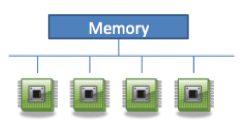
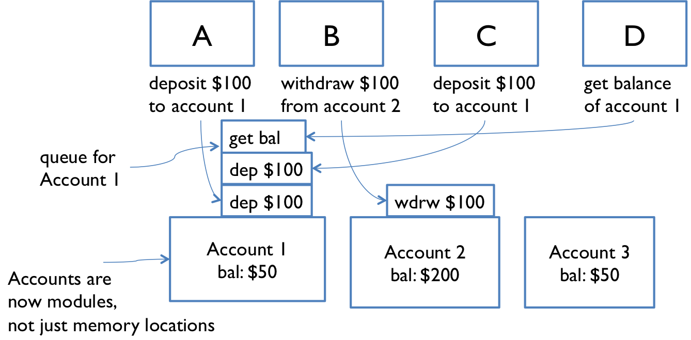

# 第 22 篇阅读：队列和消息传递

#### 6.005 的软件

| 免受错误的影响 | 易于理解 | 随时准备更改 |
| --- | --- | --- |
| 今天正确，未来也正确。 | 与未来的程序员清晰地沟通，包括未来的您。 | 设计以适应未来的变化而无需重写。 |

#### 目标

阅读完这节课的笔记并查看代码后，您应该能够使用消息传递（带同步队列）而不是共享内存来进行线程间通信。

## 并发的两种模型

在我们的并发简介中，我们看到并发编程的两种模型：*共享内存*和*消息传递*。

+   

    在**共享内存**模型中，并发模块通过在内存中读取和写入共享的可变对象来交互。在单个 Java 进程中创建多个线程是我们共享内存并发的主要示例。

+   在**消息传递**模型中，并发模块通过在通信通道上相互发送不可变消息来交互。到目前为止，我们只有一个消息传递的例子：客户端/服务器模式，其中客户端和服务器是并发进程，通常在不同的计算机上，通信通道是一个网络套接字。

    

消息传递模型相对于共享内存模型有几个优点，这些优点归结为对错误的更大安全性。在消息传递中，通过通过通信通道传递消息，而不是通过共享数据的突变来进行*显式*交互。共享内存的隐式交互太容易导致*无意的*交互，在程序的某些部分共享和操作数据，而这些部分并不知道它们是并发的，并且在线程安全策略中没有适当地合作。消息传递还仅在模块之间共享不可变对象（消息），而共享内存*需要*共享可变对象，我们已经看到这可能是错误的来源。

在这篇阅读中，我们将讨论如何在单个进程内实现消息传递，而不是在网络上的进程之间。我们将使用**阻塞队列**（一种现有的线程安全类型）来在进程内的线程之间实现消息传递。

## 带线程的消息传递

我们之前已经讨论过进程之间的消息传递：客户端和服务器通过网络套接字进行通信。我们也可以在同一个进程内的线程之间使用消息传递，这种设计通常比使用锁的共享内存设计更可取，关于锁我们将在下一篇阅读中讨论。

使用同步队列进行线程之间的消息传递。队列的功能与客户端/服务器消息传递中的缓冲网络通信通道相同。Java 为具有阻塞操作的队列提供了[`BlockingQueue`](http://docs.oracle.com/javase/8/docs/api/?java/util/concurrent/BlockingQueue.html)接口：

在普通的[`Queue`](http://docs.oracle.com/javase/8/docs/api/?java/util/Queue.html)中：

+   `add(e)`将元素`e`添加到队列的末尾。

+   `remove()`移除并返回队列头部的元素，如果队列为空则抛出异常。

[`BlockingQueue`](http://docs.oracle.com/javase/8/docs/api/?java/util/concurrent/BlockingQueue.html)扩展了此接口：

> 此外，它支持在检索元素时等待队列变为非空，并在存储元素时等待队列中有可用空间。

+   **`put(e)`** *阻塞*，直到可以将元素`e`添加到队列的末尾（如果队列没有大小限制，`put`不会阻塞）。

+   **`take()`** *阻塞*，直到可以移除并返回队列头部的元素，等待直到队列非空。

当您在线程之间进行消息传递时使用`BlockingQueue`，请确保使用`put()`和`take()`操作，而不是 ~~`add()`和`remove()`~~。


与网络消息传递中的客户端/服务器模式类似的是，线程之间的消息传递的**生产者-消费者设计模式**。生产者线程和消费者线程共享一个同步队列。生产者将数据或请求放入队列，而消费者则移除并处理它们。一个或多个生产者和一个或多个消费者可能都在向同一个队列添加和移除项目。这个队列必须对并发操作是安全的。

Java 提供了`BlockingQueue`的两种实现：

+   [`ArrayBlockingQueue`](http://docs.oracle.com/javase/8/docs/api/?java/util/concurrent/ArrayBlockingQueue.html)是使用数组表示的固定大小队列。如果队列已满，则`put`新项目到队列将会阻塞。

+   [`LinkedBlockingQueue`](http://docs.oracle.com/javase/8/docs/api/?java/util/concurrent/LinkedBlockingQueue.html)是使用链表表示的可增长队列。如果没有指定最大容量，则队列永远不会填满，因此`put`永远不会阻塞。

与通过套接字发送和接收的字节流不同，这些同步队列（与 Java 中的普通集合类一样）可以保存任意类型的对象。我们必须选择或设计队列中的消息类型，而不是设计一个线路协议。**它必须是不可变类型。**就像我们在线程安全的 ADT 或线路协议中的消息上所做的操作一样，我们必须在这里设计我们的消息，以防止竞态条件并使客户能够执行它们需要的原子操作。

### 银行账户示例



我们的第一个消息传递示例是银行账户示例。

每个取款机和每个账户都是独立的模块，模块之间通过发送消息来进行交互。传入的消息会到达队列。

我们为`get-balance`和`withdraw`设计了消息，并说每个取款机在取款之前都会检查账户余额，以防止透支：

```
get-balance
if balance >= 1 then withdraw 1
```

但是仍然有可能交错两个取款机的消息，使它们都被欺骗以为可以安全地从只有 1 美元的账户中提取最后 1 美元。

我们需要选择一个更好的原子操作：`withdraw-if-sufficient-funds`比仅仅`withdraw`更好。

## 使用队列实现消息传递

你可以在 GitHub 上查看此示例的所有代码：[**平方器示例**](https://github.com/mit6005/fa16-ex22-square)。以下是所有相关部分的摘录。

这是一个用于平方整数的消息传递模块：

[`SquareQueue.java` 第 6 行](https://github.com/mit6005/fa16-ex22-square/blob/master/src/square/SquareQueue.java#L6-L46)

```
/** Squares integers. */
public class Squarer {

    private final BlockingQueue<Integer> in;
    private final BlockingQueue<SquareResult> out;
    // Rep invariant: in, out != null

    /** Make a new squarer.
     *  @param requests queue to receive requests from
     *  @param replies queue to send replies to */
    public Squarer(BlockingQueue<Integer> requests,
                   BlockingQueue<SquareResult> replies) {
        this.in = requests;
        this.out = replies;
    }

    /** Start handling squaring requests. */
    public void start() {
        new Thread(new Runnable() {
            public void run() {
                while (true) {
                    // TODO: we may want a way to stop the thread
                    try {
                        // block until a request arrives
                        int x = in.take();
                        // compute the answer and send it back
                        int y = x * x;
                        out.put(new SquareResult(x, y));
                    } catch (InterruptedException ie) {
                        ie.printStackTrace();
                    }
                }
            }
        }).start();
    }
}
```

传入`Squarer`的消息是整数；平方器知道其任务是对这些数字进行平方，因此不需要进一步的细节。

传出的消息是`SquareResult`的实例：

[`SquareQueue.java` 第 48 行](https://github.com/mit6005/fa16-ex22-square/blob/master/src/square/SquareQueue.java#L48-L70)

```
/** An immutable squaring result message. */
public class SquareResult {
    private final int input;
    private final int output;

    /** Make a new result message.
     *  @param input input number
     *  @param output square of input */
    public SquareResult(int input, int output) {
        this.input = input;
        this.output = output;
    }

    @Override public String toString() {
        return input + "² = " + output;
    }
}
```

我们可能会为`SquareResult`添加额外的观察者，以便客户端可以检索输入数字和输出结果。

最后，这是一个使用平方器的主方法：

[`SquareQueue.java` 第 77 行](https://github.com/mit6005/fa16-ex22-square/blob/master/src/square/SquareQueue.java#L77-L96)

```
public static void main(String[] args) {

    BlockingQueue<Integer> requests = new LinkedBlockingQueue<>();
    BlockingQueue<SquareResult> replies = new LinkedBlockingQueue<>();

    Squarer squarer = new Squarer(requests, replies);
    squarer.start();

    try {
        // make a request
        requests.put(42);
        // ... maybe do something concurrently ...
        // read the reply
        System.out.println(replies.take());
    } catch (InterruptedException ie) {
        ie.printStackTrace();
    }
}
```

这段代码和使用套接字实现消息传递的代码非常相似，这并不奇怪。

#### 阅读练习

表示不变式

写出`SquareResult`的表示不变式，作为可以在下面的`checkRep()`中使用的表达式。在你的答案中使用最少数量的字符，不包含任何方法调用。

```
private void checkRep() {
  assert REP_INVARIANT;
}
```

(缺失答案)代码审查

上述代码经过代码审查并产生以下评论。评估评论。

(缺失答案)(缺失答案)

(缺失解释)

(缺失答案)(缺失答案)

(缺失解释)

(缺失答案)(缺失答案)

(缺失解释)

## 停止

如果我们想要关闭`Squarer`，使其不再等待新的输入，我们该怎么办？在客户端/服务器模型中，如果我们想要客户端或服务器停止监听我们的消息，我们关闭套接字。如果我们想要客户端或服务器停止运行，我们可以退出该进程。但在这里，`Squarer`只是同一进程中的另一个线程，我们无法“关闭”一个队列。

一种策略是*毒丸*：队列中的特殊消息，表示该消息的消费者应该结束其工作。要关闭方阵器，由于其输入消息仅是整数，我们必须选择一个魔法毒丸整数（每个人都知道 0 的平方是 0 对吗？没有人会需要问 0 的平方…）或使用 null（不要使用 null）。相反，我们可能会将请求队列上的元素类型更改为 ADT：

```
SquareRequest = IntegerRequest + StopRequest 
```

带有操作：

```
input : SquareRequest → int
shouldStop : SquareRequest → boolean
```

当我们想要停止方阵器时，我们在队列中排队一个`StopRequest`，其中`shouldStop`返回`true`。

例如，在`Squarer.start()`中：

```
public void run() {
    while (true) {
        try {
            // block until a request arrives
            SquareRequest req = in.take();
            // see if we should stop
            if (req.shouldStop()) { break; }
            // compute the answer and send it back
            int x = req.input();
            int y = x * x;
            out.put(new SquareResult(x, y));
        } catch (InterruptedException ie) {
            ie.printStackTrace();
        }
    }
}
```

也可以通过调用其`interrupt()`方法*中断*线程。如果线程被阻塞等待，那么它被阻塞的方法将抛出`InterruptedException`（这就是为什么我们几乎在调用阻塞方法时都必须尝试捕获该异常）。如果线程未被阻塞，则将设置一个*中断*标志。线程必须检查此标志以确定是否应停止工作。例如：

```
public void run() {
    // handle requests until we are interrupted
    while ( ! Thread.interrupted()) {
        try {
            // block until a request arrives
            int x = in.take();
            // compute the answer and send it back
            int y = x * x;
            out.put(new SquareResult(x, y));
        } catch (InterruptedException ie) {
            // stop
            break;
        }
    }
}
```

#### 阅读练习

实现毒丸

使用上述数据类型定义：

```
SquareRequest = IntegerRequest + StopRequest
```

对于下面的每个选项：代码片段是否是以最大程度利用静态检查的正确概要来实现这个 Java 的？

```
interface SquareRequest { ... }
class IntegerRequest implements SquareRequest { ... }
class StopRequest implements SquareRequest { ... }
```

（缺失答案）（缺失答案）

（缺失解释）

```
class SquareRequest { ... }
class IntegerRequest { ... }
class StopRequest { ... }
```

（缺失答案）（缺失答案）

（缺失解释）

```
class SquareRequest {
  private final String requestType;
  public static final String INTEGER_REQUEST = "integer";
  public static final String STOP_REQUEST    = "stop";
  ...
}
```

（缺失答案）（缺失答案）

（缺失解释）

## 使用消息传递的线程安全性论证

带有消息传递的线程安全性论证可能依赖于：

+   **现有的线程安全数据类型**用于同步队列。该队列肯定是共享的，肯定是可变的，所以我们必须确保它对并发是安全的。

+   可能同时由多个线程访问的消息或数据的**不可变性**。

+   数据的**限制**到各个生产者/消费者线程。由一个生产者或消费者使用的局部变量对其他线程不可见，这些线程只能使用队列中的消息进行通信。

+   可变消息或数据的**限制**，这些消息或数据通过队列发送，但一次只能由一个线程访问。这个论点必须仔细阐明和实现。但如果一个模块一旦将可变数据放入队列以便传递给另一个线程，就像热土豆一样立即放弃所有对这些数据的引用，那么一次只有一个线程会访问这些数据，从而排除了并发访问。

与同步相比，消息传递可以使并发系统中的每个模块更容易地维护其自己的线程安全性不变式。如果数据而不是通过线程安全的通信通道在模块之间传输，我们不必考虑多个线程访问共享数据。

#### 阅读练习

消息传递

Leif Noad 刚刚开始在一家股票交易公司工作：

```
public interface Trade {
    public int numShares();
    public String stockName();
}

public class TradeWorker implements Runnable {
    private final Queue<Trade> tradesQueue;

    public TradeWorker(Queue<Trade> tradesQueue) {
        this.tradesQueue = tradesQueue;
    }

    public void run() {
        while (true) {
            Trade trade = tradesQueue.poll();
            TradeProcessor.handleTrade(trade.numShares(), trade.stockName());
        }
    }
}

public class TradeProcessor {
    public static void handleTrade(int numShares, String stockName) {
        /* ... process the trade ... takes a while ... */
    }
}
```

什么是`TradeWorker`？

（缺失答案）（缺失答案）（缺失答案）（缺失答案）

（缺失解释）

错误发生了

数据:text/html,

假设我们有几个`TradeWorker`处理来自同一个共享队列的交易。

请注意，我们*没有使用`BlockingQueue`！*工作线程调用`poll`来从队列中检索项目。

[`Queue.poll()`的 Javadoc](http://docs.oracle.com/javase/8/docs/api/java/util/Queue.html#poll--)

以下哪种情况可能发生？

（缺少答案）（缺少答案）（缺少答案）

（缺少解释）

## 摘要

+   而不是使用锁进行同步，消息传递系统在共享通信通道上进行同步，例如流或队列。

+   在单个进程内，线程之间使用阻塞队列进行通信是一种有用的模式。
